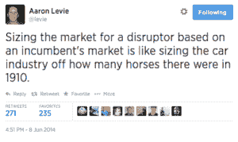
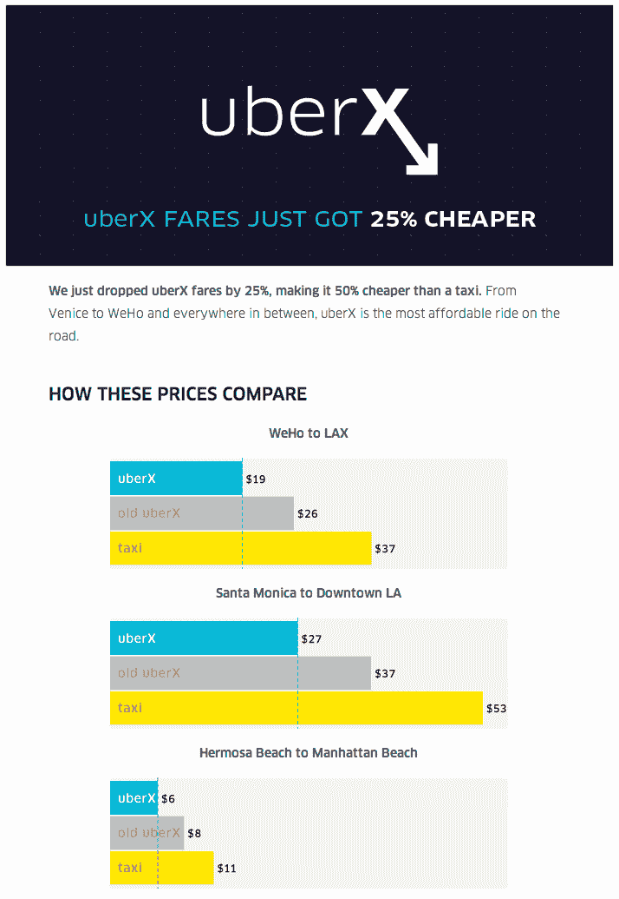
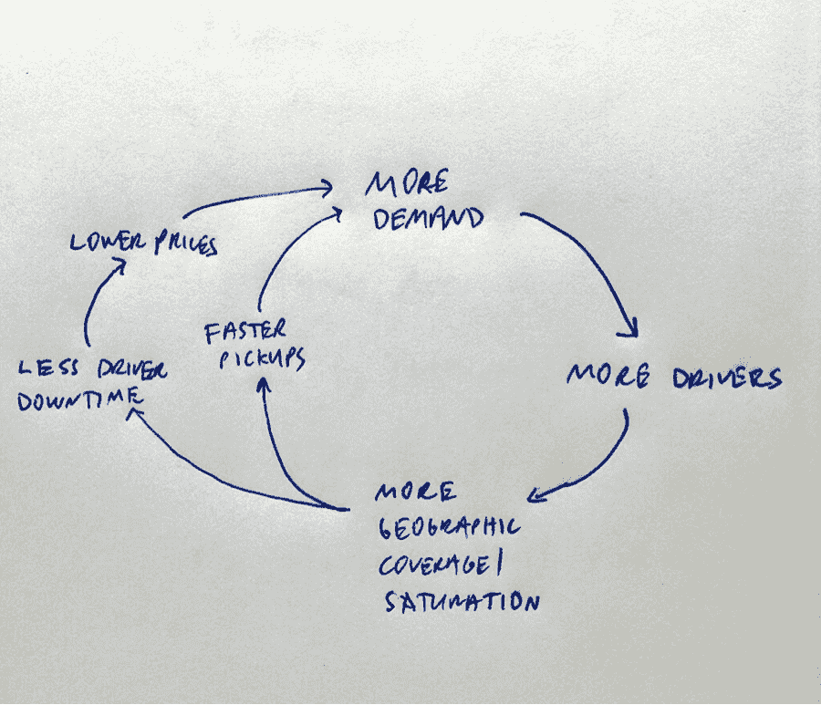
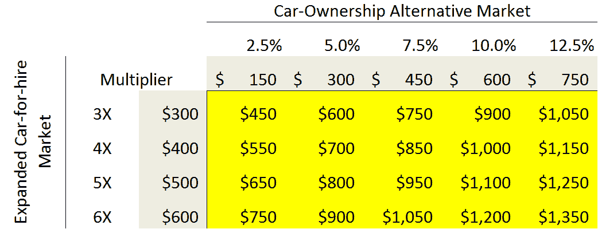
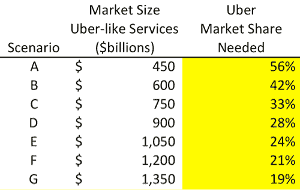

# 如何错过一英里:从另一个角度看优步的潜在市场规模

> 原文：<http://abovethecrowd.com/2014/07/11/how-to-miss-by-a-mile-an-alternative-look-at-ubers-potential-market-size/?utm_source=wanqu.co&utm_campaign=Wanqu+Daily&utm_medium=website>

July 11, 2014:

6 月 18 日，NYU 斯特恩商学院的金融学教授 Aswath Damodaran 发表了一篇题为“[优步不值 170 亿美元”的文章。](http://fivethirtyeight.com/features/uber-isnt-worth-17-billion/)“这篇文章是他为自己的博客写的一篇更详细的文章的精简版，标题是“[一次颠覆性的打车致富:优步的回报](http://aswathdamodaran.blogspot.com/2014/06/a-disruptive-cab-ride-to-riches-uber.html)”通过结合市场数据、数学和金融分析，达摩达兰教授得出结论，他对优步价值的最佳估计是 59 亿美元，远远低于市场最近确定的价值。这一价值估计依赖于关于 TAM(总可用市场)以及优步在该 TAM 中的市场份额的某些“假设”。正如你所料，他的答案很大程度上取决于这两个假设。

作为优步公司的首轮投资者和董事会成员，当我听说有一篇专门针对该公司的文章时，我很感兴趣。我一直很喜欢[比尔·西蒙斯](https://twitter.com/BillSimmons)和[格兰特兰德](http://grantland.com/)给体育带来的深度、结构化的分析，当[内特·西尔弗](https://twitter.com/NateSilver538)也加入 ESPN 时，我期待着同样的深思熟虑的分析应用于更广泛的主题。深度研究和量化框架在今天注意力跨度短的新闻方法中非常缺乏。我迫不及待地潜入水中，看着他们靠近。

“硬数字”的有趣之处在于，它们会给人一种虚假的安全感。年轻的数学学生被警告精确度和准确度之间的关键差异。金融模型，尤其是估值模型之所以有趣，是因为它们可能特别精确。贴现现金流模型可能会导致每股价格小数点后两位数。但是这些金融模型中的大多数的真实准确性是什么呢？虽然这似乎是一个很难回答的问题，但我认为大多数估值分析从业者会说“不是很高”。它根本就不是一门精确的科学(物理学就是这样)，看似无害的假设会对结果产生重大影响。因此，大多数模型被用作一个粗略的指南，看看你是否“在球场上”，或者看看某只股票是否被严重低估或高估。

这就是这篇文章的目的。我的目的不是要明确地说服任何人，优步值得任何特定的估值。达摩达兰教授的想法，或者任何不是股票买卖者的人的想法，都是无关紧要的。我也不想证明他是错的。我更感兴趣的是批判性推理和预测，以及某些假设如何导致截然不同的结果。因此，我的目标是提供一个看似合理的论点，即 Damodaran 分析中使用的核心假设可能相差 25 倍，甚至更多。我希望我的分析是基于我的论点是否合理和可行。

Damodaran 使用两个主要的假设来驱动他的分析的核心。第一个是 TAM，第二个是优步在该市场中的市场份额。对于市场规模，他表示，“对于我的基本情况估值，我将假设优步的主要目标市场是全球出租车和汽车服务市场。”然后，他继续计算历史出租车和豪华轿车市场的全球估值。他在 TAM 评估中使用的数字是 1000 亿美元。然后，他猜测优步的市场份额极限——基本上是该公司可能达到的最大市场份额。为此他定了 10%。他的模型的其余部分相当简单和典型。在我看来，这两个核心假设都存在严重错误。

#### 总可用市场分析

让我们首先深入 TAM 假设。在选择使用出租车和豪华轿车市场的历史规模时，达摩达兰做出了一个隐含的假设，即未来将与过去非常相似。换句话说，像优步这样的产品或服务的出现将对出租汽车运输市场的整体市场规模产生零影响。这是一个有缺陷的假设，原因有很多。当您实质性地改进产品，创造新的特性、功能、体验、价位，甚至启用新的使用案例时，您可以在这个过程中实质性地扩大市场。如果未来的产品与过去有本质上的不同，那么过去对于未来可能是一个糟糕的向导。考虑以下 34 年前的例子，其中包括完全相同类型的预测误差:

“1980 年，美国电话电报公司(其贝尔实验室发明了蜂窝电话)委托麦肯锡公司预测 2000 年美国的手机普及率。顾问的预测是 90 万用户，不到实际数字 1 . 09 亿的 1%。基于这个传说中的错误，AT & T 认为这些玩具没有多少前途。十年后，为了重新加入手机市场，美国电话电报公司不得不以 126 亿美元收购麦考手机公司。到 2011 年，全球用户数量已经超过 50 亿，蜂窝通信已经成为一场前所未有的技术革命。” ( [篇](http://www.dtic.upf.edu/~alozano/innovation/)经 [@trengriffin](https://twitter.com/trengriffin) )

[

<noscript></noscript>](https://twitter.com/levie/status/475787246885277696) Aaron Levie 在此发布的推文强调了我们要强调的关键点——优步的潜在市场与之前的租车市场有很大不同，这正是因为相对于传统模式的众多改进导致了总可用市场的极大增强。我们现在将浏览这些关键差异，深入探讨价格问题，然后考虑优步的一系列扩展使用案例，包括一个完全改变游戏的案例。

#### 完全不同的经历

1.  **接送次数** 。在优步流动性高的城市，平均提货时间不到五分钟。对于大多数美国人来说，在优步之前，不可能预测出租车出现的时间。你也看不到它的当前位置；所以对出租车的到达时间有信心几乎是不可能的。随着优步在市场中的地位越来越稳固，提货时间不断缩短，产品也在不断改进。
2.  覆盖密度。随着优步在城市中的发展，他们所服务的地理区域不断扩大。优步最初主要在三藩市范围内运作良好。它现在从南圣何塞到纳帕都有很高的流动性。这种扩大的覆盖区域不仅增加了潜在客户的数量，还增加了潜在的使用案例。优步已经在消费者很少订购出租车的地理区域实现了流动性，这显然是市场扩张。
3.  **付款** 。有了优步，你永远不需要现金来影响交易。这项服务完全依赖于通过智能手机应用程序实现的支付。这使得它更容易在瞬间使用。它还从先前的过程中去除了耗时且不必要的步骤。
4.  。优步的双重评级系统(客户评级司机和司机评级客户)带来了更加文明的骑手/司机体验。这是有据可查和众所周知的。对于出租车，用户担心被占便宜，许多司机整天与乘客一起指责他们。这可能会给双方都带来不愉快的经历。
5.  信任与安全。大多数优步乘客认为，他们在优步里比在传统出租车里更安全。这种情绪很容易理解。因为每一次乘坐、每一个乘客和每一个司机都有记录，所以你最终会有一个比以前的出租车市场更负责任的系统([它还使找回丢失的物品变得超级容易](https://support.uber.com/hc/en-us/articles/202289848-How-can-I-retrieve-lost-items-))。评级系统还确保从系统中清除不良驾驶员。我认识的许多女性都明确表示，她们觉得坐优步比坐出租车安全得多。

#### 不同的经济学

我感到惊讶的是，像达摩达兰这样的金融学教授没有考虑价格对需求的影响。随着优步变得越来越流动，它的司机享受着越来越高的利用率。利用率是衡量司机工作时间与等待时间的百分比。把每小时乘坐次数想成一个类似的衡量标准。随着利用率的提高，优步可以降低价格，而司机们仍然赚同样多的钱。事实上，优步确实选择这样做，而且已经多次这样做了。就在上周，以下邮件发给了洛杉矶的所有用户(见下图)。如果你看看图的底部，你会发现优步现在的价格明显低于出租车。价格和需求之间的关系是众所周知的，虽然 Damodaran 可能没有计算优步具体价格弹性所需的数据，但我可以向你保证，价格弹性很高。这很有意义——降低租车运输的价格会增加使用量。

[

<noscript></noscript>](https://i0.wp.com/abovethecrowd.com/wp-content/uploads/2014/07/Screen-Shot-2014-07-07-at-6.41.45-PM.png?ssl=1) 

美国大多数城市的大多数出租车服务通过某种类型的 medallion 系统有固定的供应。今天纽约市有 13，605 辆有执照的出租车。1937 年，当现代制度建立时，有 11，787 人。此外，价格只会上升，不会下降。人们怎么可能知道这是否是合适的出租车供应和最佳价格点？难道大奖章的高价值(在一些市场超过 100 万美元)不暗示着市场供应不足，价格高于真正的市场清算价格吗？如果有人能以低得多的价格和高得多的可用性运行更方便、更安全的服务，那会怎样？你最终会有更多的游乐设施——这正是正在发生的事情。

#### 新的使用案例

1.  **在城市较少的地区使用** 。由于神奇的订购系统和有效组织分布式司机的能力，优步可以在出租车供应过于密集的市场中有效运营。如果你住在郊区，走出家门拦出租车的可能性很小。如果你打其中一个电话，这是一个非常不稳定的提议。如今，优步已经在旧金山以外的许多郊区取得了显著的成效，提货时间不到 10 分钟。这创造了新的用例，而不是历史模型。
2.  **租车替代** 。当我去洛杉矶和西雅图出差时，我会租辆车。今天我只有优步。物质上更好。我不必排队等候，也避免了旅途中不必要的乘公交车。我不需要绘制路线。我不用找停车位。我不用付停车费。美国的租车市场价值 270 亿美元，全球市场显然会更大。你也在蚕食这里的停车市场。
3.  **情侣夜出** 。圣何塞半岛的流动性如此之高，以至于住在门洛帕克的一对夫妇会优步到帕洛阿尔托(大约 3 英里外)吃饭，以避免喝了一杯酒后开车的风险。这不是出租车历史上存在的用例。在城里玩了一夜后，从旧金山回到郊区的家也很棒。这是一个历史悠久的黑车市场，但它的轻松和便利大大增加了现在交易的次数，增加了数倍。
4.  **运送小孩** 。《纽约时报》上一篇题为“[妈妈的货车被称为优步](http://www.nytimes.com/2013/09/26/fashion/moms-van-is-called-uber.html?pagewanted=all&_r=0)”的文章暗示，父母们正利用优步送他们的孩子去参加不同的活动。我不认为很多人会让小孩上出租车(出于信任)，但他们在优步里这样做很舒服。同样常见的是，有十几岁孩子的父母鼓励他们外出时带上优步，以降低他们最终与可能饮酒的人同车的风险。
5.  **运送大龄父母** 。我认识许多照顾年长父母的人，他们坚持让父母把优步放在他们的手机上，这样他们就可以在晚上或堵车时开车。说服他们使用优步比建议他们叫出租车要容易得多，因为这既方便，又容易使用，还能被社会接受。
6.  **补充为** 。如果你是一个主要使用公共交通的人，你可能会在例外情况下考虑 UberX(低价服务),比如当你错过了一趟火车，或者当你可能会迟到。比出租车更低的价格和更高的可靠性使这成为可能。旧金山市的一项研究认为，更多的出租车将导致更多的公共交通使用，因为它使人们更容易不需要汽车。

#### 游戏规则改变者:优步作为汽车拥有者的替代选择

达摩达兰可能从未考虑过这种可能性:优步能在价格和便利性方面达到一个点，成为拥有一辆汽车的更好选择吗？法尔哈德·曼朱为《纽约时报》写了一篇引人注目的文章(《T2 与优步》，少了一个拥有汽车的理由(《T3》)，提出了这个观点。VentureBeat [的](http://venturebeat.com/2014/06/19/uber-slashes-prices-in-l-a-ditching-a-car-now-worthwhile-in-worst-commute-city-for-some/) [Gregory Ferenstein](https://twitter.com/ferenstein) 在这种工作方式的数学方面更深入一点。根据费伦斯坦的说法，“美国汽车协会估计，每年拥有汽车的平均成本约为 9000 美元。”如果你用这个数字除以优步的平均票价，你就可以计算出你一年能负担的乘车次数，并与你需要的次数进行比较。对许多人来说，数学已经在起作用了。我知道许多人已经放弃了他们的汽车，而且有些人还向优步发送了他们出售汽车时收到的支票的照片。

一些有趣的人口趋势也在发展，这有利于优步在这个市场的机会。首先，美国的城市化趋势仍在继续。但更重要的是，美国的年轻人已经不再喜欢拥有一辆汽车的想法。孩子们不再急于在 16 岁那天拿到驾照，根据埃德蒙兹的数据，近年来 18-34 岁人群的汽车拥有率下降了整整 30%。以下是过去两年中发表的许多关于这一主题的文章中的几篇:

关于优步作为汽车拥有者的另一种选择，还有两点值得考虑。首先，消费者最有可能首先更换他们的“额外”汽车。你可能会看到一个城市家庭从两辆车变成一辆。或者，一个郊区家庭可能会将车队从四辆减少到三辆，或者从三辆减少到两辆。这种边际汽车的固定成本非常高(DMV 注册、保险、折旧)，然而这种汽车的使用率却低得多。第二点毫无价值的是，对于某些人来说，不开车的好处如此之大，以至于他们会在经济情况特别有利之前转向优步，选择为便利支付额外费用。这将包括下班后饮酒且不想冒险驾驶的人，通勤时频繁使用智能手机的人(现在被认为比酒后驾车的风险更大)，以及不愿意花时间停车的人。

#### 汽车所有权替代市场有多大？

1.  根据 NADA 报告的数据[，经销商总销售额(包括服务)约为每年 7300 亿美元。然而，这真的不是汽车置换的全部。汽车置换包括拥有一辆汽车的所有费用——不仅仅是购车，还包括保险、车管所登记、停车费、汽油费、修理费、换油费等。](http://www.nada.org/NR/rdonlyres/DF6547D8-C037-4D2E-BD77-A730EBC830EB/0/NADA_Data_2014_05282014.pdf)
2.  世界上流通的汽车数量刚刚超过 10 亿辆，其中 25%在美国。美国汽车协会估计[拥有一辆汽车的年均成本为 9000 美元](http://www.autoblog.com/2012/05/04/average-cost-of-car-ownership-rises-to-8-946-per-year/)。虽然这个数字可能看起来很高，但如果你读了这份报告，你会发现关键的驱动因素:仅汽油、原材料和保险成本的上涨就平均达到每年 1000 美元。很难想象这些成本会下降(大多数都在上升)，而且这些成本中的许多现在在全球范围内是一致的。但我们会保守地将这一数字削减 33%，至 6000 美元。
3.  10 亿辆全球汽车乘以每年 6000 美元的拥有成本，得出每年汽车拥有成本为 6 万亿美元的市场。优步能占据多大的市场份额是一个值得思考的有趣问题(我们将会这样做)，但事实上，25%的市场在美国，这对该公司来说是一个巨大的优势。

充分说明这一点——优步的潜在市场与之前的租赁市场有很大不同，这正是因为对传统模式的诸多改进导致了 TAM 的大幅提升。

#### 为什么只有 10%？

现在让我们把注意力转向达摩达兰为他的分析选择的 10%的最大市场份额数字。他认为，监管限制和竞争将限制优步的市场份额。他还指出，城市与城市之间没有优势，这一点我们稍后会讨论。

18 年前，Brian Arthur 在《哈佛商业评论》上发表了一篇开创性的经济论文，题目是“[收益递增和商业的两个世界”。](http://www.iwp.jku.at/Born/mpwfst/02/BArthur/Arthur_B.pdf)“如果你还没有读过，我强烈建议你读一读。他的关键点是，某些技术企业，而不是像历史上的工业企业那样面临边际收益递减，实际上受到一种被称为“收益递增”的现象的影响。获得市场份额使他们处于更有利的位置来获得更多的市场份额。当存在网络效应时，收益递增尤其有效。[根据维基百科](http://en.wikipedia.org/wiki/Network_effect)，当“……产品或服务的价值取决于使用它的其他人的数量”时，网络效应就出现了换句话说，使用产品或服务的人越多，它对每个用户来说就越有价值。

因此，正确的问题是，*“优步是否暴露于某种形式的网络效应，即边际用户看到更高的效用，正是因为以前选择使用它的客户数量，* *这是否会导致市场份额远远超过达摩达兰假设的 10%？”*

在优步模式中，网络效应有三个驱动因素:

1.  **接送次数** 。随着优步在市场中的扩张，以及需求和供应的增长，提货时间会缩短。旧金山的居民多年来已经目睹了这一幕。更短的提货时间意味着更高的可靠性和更多的潜在用例。使用优步的人越多，每个地区的提货时间就越短。
2.  覆盖密度。随着优步在一个城市的发展，供应商流动性的外部地理范围不断扩大。优步又一次从旧金山开始。今天，从南圣何塞一直到纳帕都有报道。使用优步的人越多，覆盖面就越大。
3.  **利用率** 。随着优步在任何一个城市的发展，利用率都会增加。基本上，司机每小时付费乘车的时间在不断上升。这只是一个数学问题——更多的需求和更多的供给使得经济旅行推销员类型的问题更容易解决。然后，优步利用提高的利用率来降低费率，从而降低价格，这又会带来更多的使用案例。使用优步的人越多，消费者的整体价格就越低。

Yammer 和 Paypal 的大卫·萨克斯最近在推特上发布了一张餐巾纸素描，标题是“优步的良性循环”。地理密度是新的网络效应”，简洁地强调了刚才提到的几点。

[

<noscript></noscript>](https://twitter.com/DavidSacks/status/475073311383105536) 

优步还享有跨越城市边界的规模经济。许多旅行的人在另一个城市第一次体验了优步。当该公司进入一个新的城市时，他们为在该地区打开应用程序的用户存储数据，以查看覆盖范围是否可用。这些“开放”代表了未满足的热切顾客。他们也有一份已经在另一个城市使用过该应用程序的居民名单，并且在文件上有一张注册的信用卡。这使得在每一个新增城市的发布和营销变得越来越容易。

成为市场领导者还会带来其他规模经济。当你考虑到优步正在与智能手机供应商、信用卡公司、汽车制造公司、租赁公司和保险公司合作时，你可以想象规模更大是一个明显的优势。例如，5 月 28 日，优步宣布与 T4 电话电报公司合作，将优步嵌入其所有安卓手机。然后在 6 月 9 日，[他们宣布了一项合作，美国运通](http://about.americanexpress.com/news/pr/2014/amex-uber-mobile-loyalty-program.aspx)的用户在优步乘坐所有航班将获得 2 倍的忠诚度积分。此外，会员奖励用户可以使用这些积分直接在应用程序中支付乘车费用。也很容易想象优步司机在租赁、汽油和汽车维修等方面享受折扣的未来。规模显然对这类机会至关重要。

#### 未发现的线索

如果你知道去哪里找，就会找到线索。[在这段录制于 2012 年 10 月](https://www.youtube.com/watch?v=rQ6GoY2_Ujw)(大约 20 个月前)的视频中，优步的首席执行官特拉维斯·卡兰尼克指出，当优步在 2010 年推出其服务时，旧金山总共有大约 600 辆黑色汽车。在这段视频的时候，Travis 注意到优步上活跃着 600 多辆黑色汽车，该公司仍在以每月 20%的速度增长(当时，UberX 刚刚推出，所以优步的车队都是黑色汽车)。因此，20 个月前在三藩市，优步已经是达摩达兰历史市场的 100%,而且增长还在向右上方倾斜。唯一可能的方法是市场快速扩张，超过历史极限。

最近，在 2014 年 6 月 6 日接受《华尔街日报》采访时，Travis 指出:“当我们(在 2009 年)创办这家公司时，我们进行了种子期投资，我们从这份报告中提取了一系列研究，这些研究显示旧金山在出租车和豪华轿车上的总支出大约为 1.2 亿美元。但我们现在是一个非常健康的倍数，仅次于旧金山的优步。因此，这不是现有市场的问题，而是我们正在创造的市场。”他接着指出，旧金山的汽车拥有市场接近 220 亿美元。因此，在视频发布不到两年后的今天，他强调，优步在旧金山的收入是一个“健康的倍数”，高于豪华轿车和出租车的历史市场。优步在这个市场上仍然发展得很好。另外，市场上还有其他竞争对手。所以达摩达兰的数学根本站不住脚。这不可能是昨天的市场。

还有另一种非常简单的方法，可能有助于 Damodaran 教授避免不必要的错误。他本可以简单地向他的中度至重度优步用户朋友提出以下问题:“与两年前你在出租车和豪华轿车上的支出相比，你目前在优步的年化支出如何？”对我认识的大多数人来说，这个问题的答案是三倍以上。光是这些数据就意味着这是一个全新的市场。

#### 我们建议的评估(25 倍)

现在让我们来考虑这样一种情况，即优步的潜在市场可能比达马多兰最初的估计高出 25 倍。他最初的估计是基于优步在 1000 亿美元的市场中占据 10%的份额。基于上述原因，我们认为优步新的租车服务的特点和功能极大地拓展了核心市场。单从旧金山来看，这个市场可能已经是原来的 3 倍。出于两个原因，我认为这个 3 倍的市场乘数属于低端。首先，优步仍在旧金山积极发展，因此这个新市场远未饱和。此外，当你考虑到这些服务在出租车以前不流行的地区取得成功时，这也意味着更高的乘数。在我们下面的模型中，我们假设扩大的汽车租赁市场比历史市场大 3-6 倍。

现在，我们考虑将类似优步的服务作为购车的一种选择。这一趋势才刚刚开始，但由于本文强调的几点，我们认为这是一个真正的机会。在我们的模型中，我们假设类似优步的服务将会侵占这个市场的 2.5%-12.5%。这代表着 1500-7500 亿美元的潜在机会，这取决于人们认为这些服务作为汽车替代品能够取得多大成功。

[

<noscript></noscript>](https://i0.wp.com/abovethecrowd.com/wp-content/uploads/2014/07/multiplier.png?ssl=1) 

结合这两个机会，您最终会得到一个潜在的新 TAM 估计范围，从 4500 亿美元一直到 1.3 万亿美元。现在，我们根据这些新的 TAM 估计来计算优步需要的市场份额，以达到 Damadoran 的 100 亿美元的 25 倍。下表显示了这些估计数。在最悲观的情况下(场景 A ),扩大的市场机会上限为 3 倍，这些新服务对汽车拥有量的影响很小，优步需要 56%的市场份额。可以说，它今天已经拥有了这一份额，在网络效应的世界里，这个数字并不是不合理的。在我认为更有可能的情况下(场景 G)，扩大的市场乘数是 6 倍，你会看到对全球汽车拥有量的 10%的影响，优步的市场份额只需要在 20%的范围内。美国占汽车拥有量市场的 25%，这一事实再次增加了优步抓住这一机会的可能性。

[

<noscript></noscript>](https://i0.wp.com/abovethecrowd.com/wp-content/uploads/2014/07/implied_share.png?ssl=1) 

正如前面所讨论的，这种做法的主要目标是提出一个合理的和可信的论点，即优步的市场机会可能是 25 倍以上。有趣的是，这个案例没有考虑优步是否会影响物流市场或扩展到任何增值服务。我们只是有条理地看了看传统的人类汽车运输如何因今天的技术而改变。

在进行评估时，有许多偏见会发挥作用。例如，作为一名投资者以及优步和 eToro 比特币观点公司的董事会成员，有人可能会认为我倾向于从更积极的角度看待事情。这才说得通。在他的原始帖子的结论中，达马多兰提出了类似的观点，“值得记住的是，即使是聪明的投资者也会集体犯下大错，尤其是在他们失去洞察力的情况下。”在编辑 Damadoran 网站上的原始帖子和 5388 年发布的版本的过程中，这个小细节被遗漏了:

“当我试图给优步赋予一个价值时，我不得不承认我刚刚下载了这个应用程序，还没有使用它。我大部分时间要么呆在郊区，在那里我可以连续几天看不到出租车，要么呆在纽约，在那里我发现地铁比出租车更省时、更便宜，而且通常也更安全。”

### *相关*