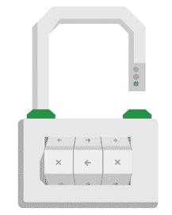

# 谷歌在线安全博客:HTTPS 作为一个排名信号

> 原文：<https://googleonlinesecurity.blogspot.com/2014/08/https-as-ranking-signal_6.html?utm_source=wanqu.co&utm_campaign=Wanqu+Daily&utm_medium=website>

<noscript> 
安全性是谷歌的重中之重。我们投入大量资金来确保我们的服务使用行业领先的安全性，例如
<a href="http://googleonlinesecurity.blogspot.com/2011/11/protecting-data-for-long-term-with.html?utm_source=wmx_blog&amp;utm_medium=referral&amp;utm_campaign=tls_en_post">strong HTTPS encryption by default</a>
.这意味着，例如，使用搜索、Gmail 和 Drive 的人会自动与谷歌建立安全连接。
  
 
  
除了我们自己的东西，我们也在努力让互联网更加安全。其中很大一部分是确保人们从谷歌访问的网站是安全的。例如，我们已经创建了帮助网站管理员的资源
<a href="https://www.google.com/webmasters/hacked/?utm_source=wmx_blog&amp;utm_medium=referral&amp;utm_campaign=tls_en_post">prevent and fix security breaches</a>
在他们的网站上。
 
 
 
 
 
 
 
我们也看到越来越多的网站管理员采用
<a href="https://en.wikipedia.org/wiki/HTTP_Secure">HTTPS</a>
(也称为 HTTP over
<a href="https://en.wikipedia.org/wiki/Transport_Layer_Security">TLS</a>
，或传输层安全)，这是令人鼓舞的。
 
 
 
出于这些原因，在过去的几个月里，我们一直在进行测试，考虑网站是否在我们的搜索排名算法中使用安全、加密的连接作为信号。我们已经看到了积极的结果，所以我们开始使用 HTTPS 作为排名信号。目前，它只是一个非常轻量级的信号——影响不到 1%的全局查询，比其他信号(如
<a href="https://support.google.com/webmasters/answer/6001093?utm_source=wmx_blog&amp;utm_medium=referral&amp;utm_campaign=tls_en_post">high-quality content</a>
—同时我们给网站管理员时间切换到 HTTPS。但随着时间的推移，我们可能会决定加强它，因为我们想鼓励所有网站所有者从 HTTP 转换到 HTTPS，以确保每个人在网上的安全。
 
 
 
在接下来的几周里，我们将发布详细的最佳实践(我们将从这里添加一个链接)，以使 TLS 的采用更容易，并避免常见错误。以下是一些基本的入门技巧:
  <ul> <li>决定您需要的证书类型:单个、多域或通配符证书</li> <li>使用 2048 位密钥证书</li> <li>对位于同一安全域的资源使用相对 URL</li> <li>对所有其他域使用协议相对 URL</li> <li>查看我们的<a href="https://support.google.com/webmasters/answer/6033049?utm_source=wmx_blog&amp;utm_medium=referral&amp;utm_campaign=tls_en_post"> Site move 文章</a>,了解更多关于如何更改网站地址的指南</li> <li>不要阻止你的 HTTPS 网站使用 robots.txt 抓取</li> <li>在可能的情况下，允许搜索引擎对您的页面进行索引。避免 noindex 机器人元标签</li> </ul> 
 

如果您的网站已经在 HTTPS 上运行，您可以使用
<a href="https://www.ssllabs.com/ssltest/">Qualys Lab tool</a>
.如果你关心 TLS 和你的站点的性能，看看
<a href="https://istlsfastyet.com/?utm_source=wmx_blog&amp;utm_medium=referral&amp;utm_campaign=tls_en_post">Is TLS fast yet?</a>
.当然，如果您有任何问题或顾虑，请随时在我们的
<a href="https://support.google.com/webmasters/go/community?utm_source=wmx_blog&amp;utm_medium=referral&amp;utm_campaign=tls_en_post">Webmaster Help Forums</a>
.
 
 
 
我们希望将来能看到更多使用 HTTPS 的网站。让我们一起让网络更安全！
   Posted by <a href="https://plus.google.com/+ZinebAitBahajji">Zineb Ait Bahajji</a> and <a href="https://plus.google.com/+GaryIllyes">Gary Illyes</a>, Webmaster Trends Analysts  <meta content="https://plus.google.com/116899029375914044550" itemprop="url"/> </noscript>