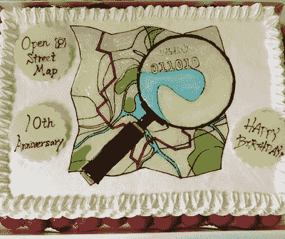

# 我们今天 10 岁了！| OpenStreetMap 博客

> 原文：<https://blog.openstreetmap.org/2014/08/09/10th-birthday/?utm_source=wanqu.co&utm_campaign=Wanqu+Daily&utm_medium=website>

在我们十岁生日之际，我们可以回顾这一年，我们的自由开放世界地图越来越强大，被苹果、Mapquest 和 Foursquare 等大公司以及无国界医生组织和美国红十字会等救援组织所部署。

但是现在我们可以回顾十年。2004 年，一名男子带着自行车和 GPS 记录仪出发了。在当时，从零开始创建世界地图对许多人来说似乎是疯狂的，但即使如此，人们还是加入了这一努力。起初只有几个人，但 10 年后，OpenStreetMap 已经发展成为一个拥有超过 170 万注册会员的全球社区，每天约有 3000 名会员编辑地图。这张由志愿者绘制的地图现在被用于严肃的工作:例如，无国界医生组织与 OpenStreetMap 合作，帮助西非的医生跟踪当前的埃博拉疫情。

我们在世界各地的城市庆祝:多伦多、蒙特利尔、DC、丹佛、西雅图、雅典、纽约、洛杉矶、凤凰城、列克星敦、纳舒厄、克利夫兰、圣彼得堡(美国)、圣彼得堡(俄罗斯)、莫斯科、伦敦、阿默斯福特、伯明翰、巴塞罗那、都柏林、布达佩斯、帕绍、巴黎、萨格勒布、苏黎世、孟加拉国、台北、福岛、东京、木科、淡路、市宫、滨松、科恰班巴和圣地亚哥。

日本社区可能有最好的蛋糕:

[T2】](http://wiki.openstreetmap.org/wiki/File:BukFlxpCMAAsEA4.jpg)

…但是夜还很早。

因此，为了纪念 OpenStreetMap 十周年，请和我们一起举杯(如果你不能去这些聚会地点，就用虚拟酒杯吧)

生日快乐 OpenStreetMap！

此贴也有: [日文](https://blog.openstreetmap.org/2014/08/09/10%e5%91%a8%e5%b9%b4%ef%bc%81/?lang=ja)