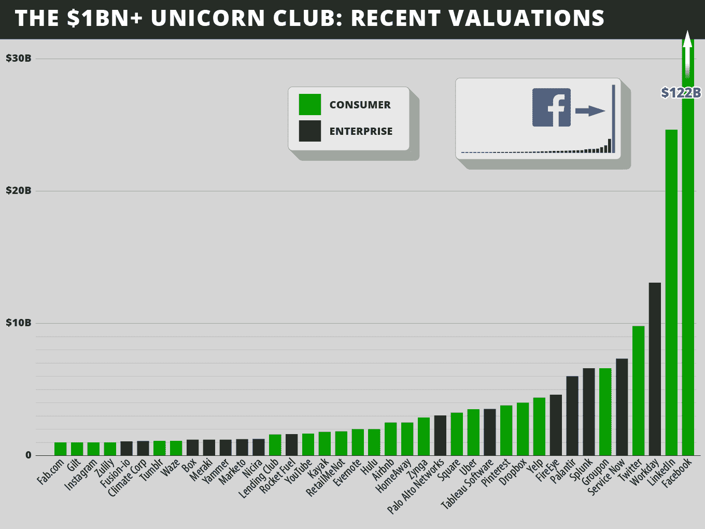
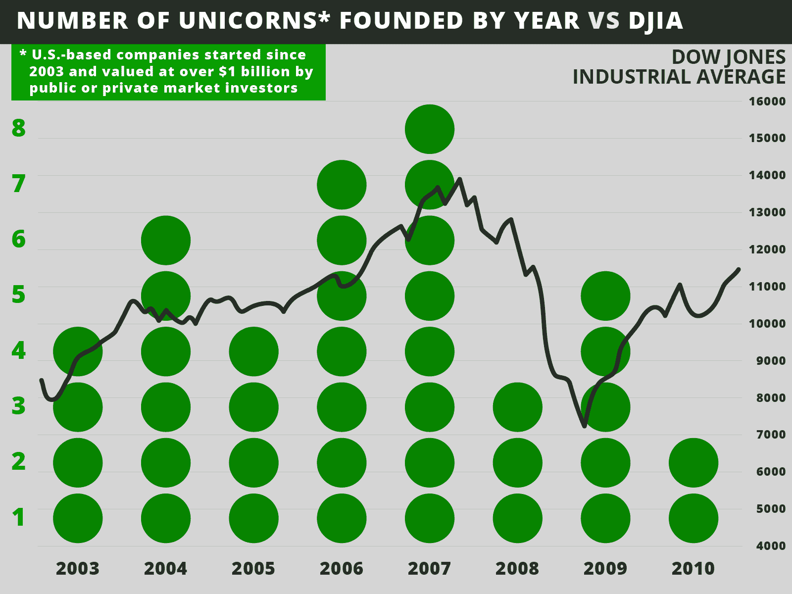
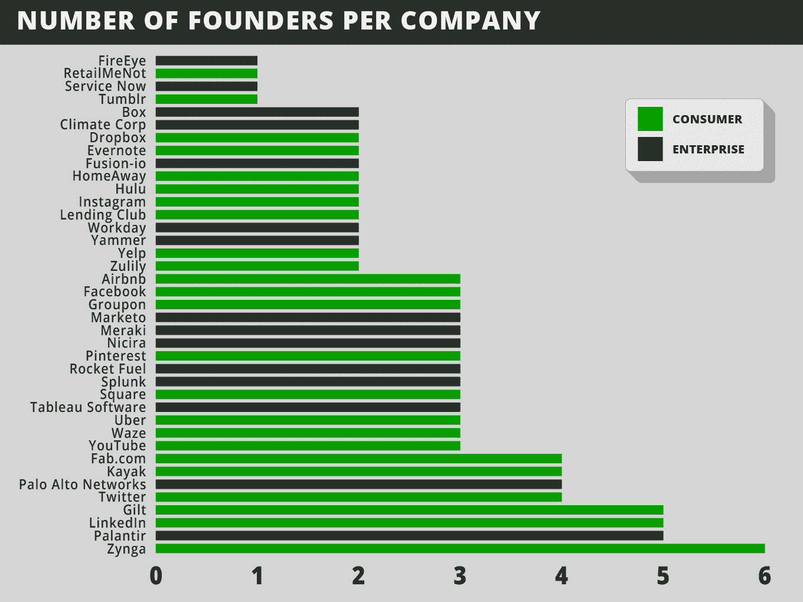

# 欢迎来到独角兽俱乐部:向十亿美元的初创公司学习 TechCrunch

> 原文：<http://techcrunch.com/2013/11/02/welcome-to-the-unicorn-club/?utm_source=wanqu.co&utm_campaign=Wanqu+Daily&utm_medium=website>

**编者按:** *艾琳·李是 [Cowboy Ventures](http://cowboy.vc/) 的创始人，这是一家种子期基金，支持企业家通过软件重塑工作和个人生活。此前，她于 1999 年加入凯鹏华盈，同时也是 KPCB 支持的数字媒体公司 RMG 网络的创始 CEO。在推特上关注她 [@aileenlee](https://twitter.com/aileenlee) 。*  

许多企业家和支持他们的风险投资者寻求建立价值数十亿美元的公司。

为什么投资者似乎很在意“十亿美元退出”？从历史上看，顶级风险投资基金仅从其持有的许多公司的特定基金中的少数公司中获得回报。此外，传统风险基金的规模已经扩大，需要更大的“出口”来提供可接受的回报。举例来说——仅仅返还 4 亿美元风险基金的初始资本，这可能意味着需要拥有两家不同的 10 亿美元公司的 20 %,或者在公司被收购或上市时拥有一家 20 亿美元公司的 20%。

因此，我们想知道，在我们的新基金成立一年后(它不需要支持十亿美元的公司才能成功，但嘿，我们喜欢学习):一家初创公司实现十亿美元估值的可能性有多大？我们能从过去十年的大热门中学习到什么吗，比如脸书、T2、领英、工作日和 T5？

为了回答这些问题， [Cowboy Ventures](http://cowboy.vc/) 团队建立了一个美国科技公司的数据集，这些公司成立于 2003 年 1 月，最近的私人或公开市场估值为 10 亿美元。我们称之为“学习项目”，它正在进行中。

需要特别说明的是，1)我们的数据基于公开来源，如 CrunchBase、LinkedIn 和维基百科，2)它基于时间快照，具有一定的局限性，以下是我们所了解到的情况的总结，下面是更多解释*:

**迄今为止对“独角兽俱乐部”的了解:**

1.  我们发现 **39 家公司属于我们所谓的“独角兽俱乐部”**(根据我们的定义，总部位于美国的软件公司成立于 2003 年，由公共或私人市场投资者估值超过 10 亿美元)。这是**大约 0.07%的风险投资支持的消费者和企业软件创业公司。**

2.  在过去的十年里，平均每年有四只独角兽诞生，分别是 T2、脸书、T4、超级独角兽 T5(价值 1000 亿美元)。最近每十年都有 1-3 只超级独角兽诞生。

3.  面向消费者的独角兽更加丰富，创造了更多的总体价值，甚至不包括脸书。

4.  但是**面向企业的独角兽已经变得平均价值更高**，筹集的私人资本少得多，为私人投资带来更高的**回报**。

5.  公司在某种程度上可以分为四种主要的商业模式:消费者电子商务、消费者受众、软件即服务和企业软件。

6.  对于公司来说，在“流动性事件”发生之前，平均需要**七年多的时间，这还不包括我们榜单上第三位的**，它仍然是私有的**。这是一个超越行权期的漫长旅程。**

7.  20 多岁的创业者缺乏经验，是个异类。拥有受过良好教育、三十多岁、有共同经历的联合创始人的公司最成功

8.  从不同的初始产品**开始后的**【大支点】**是一个离群值**。

9.  旧金山(不是硅谷)**现在统治着**成为独角兽的**之家。**

10.  独角兽俱乐部的创始人几乎没有多样性。

一些更深入的解释和其他发现:

### 1)欢迎来到由 39 名成员组成的独享独角兽俱乐部:最顶尖的 0.07%

*   计算独角兽概率的分母很难。NVCA 表示，自 2003 年以来，超过 16000 家与互联网相关的公司得到了资助； [Mattermark](http://mattermark.com/) 说过去 2 年 12291；T4 CVR 称每年有 10-15，000 家软件公司被播种。所以我们假设在过去的十年里有 6 万家软件和互联网公司得到了资助。那就意味着。07%的人变成了独角兽。或者说，每 1538 个中有 1 个。

*   要点:建立或投资一家十亿美元的公司真的很难，也不太可能。科技新闻可能会让人们觉得每分钟都有一个赢家诞生——但事实是，在 MLB 比赛中接住界外球和一生中被闪电击中的几率差不多。或者说，比考上斯坦福 T3 难 100 多倍。

*   也就是说，这 39 家公司已经证明了这是可能的——他们确实提供了很多可以借鉴的东西。

[T2】](https://beta.techcrunch.com/wp-content/uploads/2013/11/unicorn-graph1c.png)

### 2)脸书是这十年的超级独角兽(按照我们的定义，价值超过 1000 亿美元)。每一次重大技术浪潮都催生了一只或多只超级独角兽

*   脸书是我们所说的超级独角兽:它几乎占据了我们名单上所有公司 2600 亿美元总价值的一半。(因此，我们将它们排除在与估值或融资相关的分析之外)

*   前几十年也诞生了科技超级独角兽。上世纪 90 年代诞生了谷歌，目前市值接近 3 倍的脸书；还有亚马逊，价值~ 1600 亿美元。20 世纪 80 年代:思科。20 世纪 70 年代:苹果(目前世界上最有价值的公司)、甲骨文和微软；英特尔成立于 20 世纪 60 年代。

*   超级独角兽有什么共同点？20 世纪 60 年代标志着半导体的时代；20 世纪 70 年代，个人电脑的诞生；20 世纪 80 年代，一个新的网络世界；90 年代，现代互联网的曙光；在 2000 年代，新的社交网络建立起来了。

*   每一次重大的技术创新浪潮都催生了一个或多个超级独角兽——如果你不够幸运/有足够的天赋成为联合创始人，这些公司可能会改变你的工作或投资生活。这就引出了更多的问题。未来十年的根本性技术变革是什么(移动？);会因此诞生一两只新的超级独角兽吗？

平均每年只有四只独角兽诞生。但是并不是所有的年份都如此富饶

*   在我们的名单上，脸书以外的 38 家公司平均价值约为 36 亿美元。在阅读了关于超级独角兽的文章后，这可能会让人感到失望，但请记住，创业通常始于大多数人认为疯狂、愚蠢或不那么重要的想法(还记得人们嘲笑 Twitter 是分享你正在吃火腿三明治的地方吗？).只有经过多年和非凡的好运，少数成长为独角兽，这是极其罕见的和相当可怕的。

*   **过去十年独角兽创始不是前端装**。最好的一年是 2007 年(36 个中的 8 个)；最少的出生于 2003 年、2005 年和 2008 年(据我们今天所知；2011 年至今还没有成立)。从这张快照来看，还不清楚每年独角兽的数量是否会随着时间的推移而变化。

*   绘制独角兽随时间推移的轨迹——哪些变得更有价值，哪些从名单上消失——以及了解潜在独角兽名单(目前估值不到 10 亿美元)将是一件有趣的事情。希望在未来的岗位上。

[T2】](https://beta.techcrunch.com/wp-content/uploads/2013/11/unicorn-graph2c.png)

### 3)在过去十年中，以消费者为导向的公司创造了大部分价值

过去一年，对早期消费科技公司的风险投资明显降温。但是值得意识到的是:

*   三家消费品公司——脸书、谷歌和亚马逊——是过去二十年的超级独角兽。

*   与企业独角兽相比，消费者导向型企业更多，在我们的榜单上，脸书以外的企业创造了超过 60%的总价值。

*   我们的榜单可能严重低估了消费科技的价值。在我们名单上的 14 家仍然私有的公司中，85%是面向消费者的(例如 [Twitter](http://www.crunchbase.com/company/twitter) 、 [Pinterest](http://www.crunchbase.com/company/pinterest) 、 [Zulily](http://www.crunchbase.com/company/zulily) )。如果/当流动性事件发生时，他们应该会看到价值的显著上升，增加消费独角兽的总价值。

### 4)以企业为导向的独角兽已经为每一美元的私人投资带来了更多的价值

*   企业风险投资现在如此有吸引力的一个原因是:我们名单上面向企业的独角兽平均在私募市场上筹集了 1.38 亿美元——它们目前的价值是迄今筹集的私人资本的 26 倍。

*   大幅提高这一指标的公司是[尼西拉](http://www.crunchbase.com/company/nicira)、 [Splunk](http://www.crunchbase.com/search?query=Splunk) 和 [Tableau](http://www.crunchbase.com/company/tableau-software) ，它们都在私募市场筹集了<5000 万美元，如今平均价值 38 亿美元。

*   加上 Workday、 [ServiceNow](http://www.crunchbase.com/company/service-now-com) 和 [FireEye](http://www.crunchbase.com/company/fireeye) ，他们目前的身价是>募集的私人资本的 60 倍。哇哦。

*   与传统风险投资关于企业公司需要更多早期资本的观点相反，我们**没有看到企业独角兽与消费独角兽在首轮融资中的差异。**

**消费类公司每投资一美元带来的价值减少了**

*   **消费独角兽平均融资 3.48 亿美元**，比企业独角兽多 2.5 倍的私人资本；它们的价值大约是募集的私人资本的 11 倍。

*   相对于最近的估值，筹集了大量私人资金的公司有 [Fab](http://www.crunchbase.com/company/fab-com) 、 [Gilt Groupe](http://www.crunchbase.com/company/gilt-groupe) 、 [Groupon](http://www.crunchbase.com/company/groupon) 、 [HomeAway](http://www.crunchbase.com/company/homeaway) 和 [Zynga](http://www.crunchbase.com/company/zynga) 。

*   在一个“快速做大”的世界里，建立一家超级成功的消费科技公司可能需要更多的资本；而且/或者，创始人和投资者在过去十年里以过高的估值过度资本化了消费互联网公司，导致消费科技投资者的回报下降。

### 5)推动价值和网络效应帮助的四种主要商业模式

*   我们将公司分为**四种商业模式**，这四种商业模式在总体驱动价值上相当平等:1)****商业**:消费者为商品或服务付费(11 家公司)；2) **受众:**对消费者免费，通过广告或线索货币化(11 家公司)；3) **SaaS:** 用户为基于云的软件付费(通常通过“免费增值”模式)(7 家公司)；和 4) **企业**:公司支付更大规模的软件(10 家公司)。**

***   在我们的名单中，没有一家电子商务公司将实物库存作为其商业模式的关键部分。尽管如此，电子商务公司平均筹集了最多的私人资金——提供了最低的估值和筹集的资本，并可能导致最近电子商务投资的降温。

    *   38 家公司中只有 4 家是移动优先。不奇怪，iPhone 是 2007 年才推出的，2008 年才推出第一款 Android 设备。

    *   我们名单上几乎一半的公司都有另一个特点:**网络效应**。社交时代的网络效应可以帮助公司大幅扩大用户规模，大幅降低资本要求(YouTube 和 Instagram)和/或快速提高估值(脸书)。** 

 **### 6)这是一场马拉松，而不是短跑:需要 7 年以上的时间才能达到“流动性事件”

*   我们名单上的 24 家公司上市或被收购平均花费了**七年时间**，不包括 YouTube 和 Instagram 这两家极端的异常公司，这两家公司都是在成立后的大约两年内以超过 10 亿美元的价格被收购的。

*   我们名单上的 14 家公司仍然是私有的，这将增加平均流动时间到八年多。

*   不足为奇的是，企业公司往往比消费类公司多花一年左右的时间才能看到流动性事件

*   在被收购的 9 家公司中，平均估值为 13 亿美元；对于收购者来说，这可能是一个估值的最佳时机，让他们在价格变得更低之前退出市场

### 7)20 多岁、没有经验的创始人是个异数，而不是常态

*   我们名单上的公司通常不是由没有经验的初次创业者创建的。在我们的创始人**名单上，创始人的平均年龄**是 34 。是的，脸书的创始人在成立时平均只有 20 岁；但是我们榜单上第二有价值的公司 LinkedIn 的创始人平均只有 36 岁；排名第三的 Workday 的创始人平均年龄为 52 岁。

*   脸书、Twitter 和 Tumblr 等受众驱动型公司的创始人最年轻，平均年龄为 30 岁(似乎即将到来的独角兽 Snapchat 将降低这一平均年龄)。SaaS 和电子商务创始人的平均年龄分别为 35 岁和 36 岁；企业软件创始人的平均年龄是 38 岁。

**拥有多年历史的联合创始人取得了最多的成功**

*   我们名单上的绝大多数(35 只)独角兽选择了与不止一位创始人一起开拓创新——平均有三位联合创始人。联合创始人的角色各不相同，从联合首席执行官(Workday)到居住在不同国家的技术联合创始人(Fab.com)。从流动性的角度来看联合创始人的股权，可能是另一种看待创始人地位的有趣方式，但我们还没有这样做过。

*   **90%的联合创始人团队**由有多年共同经历的人组成，他们要么来自**学校，要么来自**；60%的人有一起工作的联合创始人；46%的人一起上学。

*   与一起上学的团队相比，一起工作的团队为公司创造了更多的价值。

*   只有四个联合创始人团队没有共同的工作或学校经历，但都有一个共同的思路。两个是投资者在创立/融资时认识和介绍的；一个团队是当地科技界的朋友；一个团队在研究类似的想法时相遇。

*   也就是说，四家只有一个创始人的独角兽公司(ServiceNow、FireEye、 [RetailMeNot](http://www.crunchbase.com/company/whale-shark-media) 、Tumblr——一半是企业，一半是消费者)都发生过流动性事件，平均价值高于有联合创始人的公司。

[T2】](https://beta.techcrunch.com/wp-content/uploads/2013/11/unicorn-graph3c.png)

大多数创始首席执行官都会从长远角度来衡量他们的公司。但是并不是所有的创始人都会全程留下来

*   令人印象深刻的是，76%的创始 CEO 带领他们的公司参加了流动性活动，69%的人仍然是他们公司的 CEO，其中许多人是上市公司的 CEO。这充分说明了这些创始人的长期愿景、承诺以及从几乎没有资金、产品和人员发展到目前独角兽公司地位的能力。

*   也就是说，31%的公司确实在此过程中更换了 CEO 这些公司的平均价值更高。一个原因是:大约 40%的企业公司更换了首席执行官(相比之下，消费类公司只有 25%)。流动性事件之前的所有首席执行官变更都发生在企业公司，这些企业公司在被收购或上市之前为其掌舵人增加了经验丰富的“名牌”领导人。

*   我们名单上只有一半的公司显示所有最初的创始人仍在公司工作。平均来说，三分之二的联合创始人会留下来。

**这不是他们的第一次亮相:创始人有丰富的创业和技术经验**

*   近 80%的独角兽公司至少有一个联合创始人，他之前曾创立过某种类型的公司。一些创始人早在初中就展示了他们的**创业 DNA** 。之前共同创立的创业公司名单跨越了失败和成功；从家教和百吉饼外卖公司，到 PayPal 和 Twitter。

*   除了两家公司，其他公司的创始人都有科技/软件行业的工作经验；38 家公司中只有 3 家没有技术型联合创始人(HomeAway 和 RetailMeNot，作为行业初创公司成立；还有 Box，大学时创立)。

*   大多数创始 CEO 和 90%的企业 CEO 都有大学技术学位。

**一个教育杠铃:许多“十佳毕业生”和辍学者**

*   绝大多数联合创始人都去了名牌大学(如康奈尔大学、西北大学、伊利诺伊大学)。超过三分之二的榜单上至少有一位联合创始人毕业于“前十名学校”。

*   斯坦福大学名列榜首，令人印象深刻的是，有三分之一的公司至少有一名斯坦福毕业生作为联合创始人。前哈佛学生是 38 家独角兽企业中 8 家的联合创始人；伯克利在五；以及 38 家公司中 4 家的麻省理工毕业生。

*   相反，八家公司的联合创始人都是大学肄业生。我们名单上五家最有价值的公司(脸书、Twitter 和 ServiceNow)中有三家曾经或现在是由大学辍学生领导的(T2 )( T3 ),尽管除了脸书，这些辍学生都有科技公司的工作经验。

### 8)“大支点”也是一个异常值，尤其是对企业公司而言

*   很少有公司是成功转型的结果。将近 90%的公司都在致力于他们最初的产品愿景。

*   不同的初始产品之后的四个“支点”都在消费公司(Groupon、Instagram、Pinterest 和 Fab)。

### 9)湾区，尤其是旧金山，是绝大多数独角兽的家园

*   或许这并不令人惊讶，但我们名单上的 39 家公司中有 27 家位于湾区。可能令人惊讶的是，重心从山谷转移到旧金山的程度有多大:15 家独角兽的总部设在旧金山；11 个在半岛上；一个在东湾。

*   纽约市已经成为独角兽数量第二多的城市，有三只独角兽。西雅图(2)和奥斯汀(2)是下一个独角兽最集中的城市。

### 10)将多样性引入创始人俱乐部有很多机会

*   只有两家公司有女性联合创始人:Gilt Groupe 和 Fab，这两家公司都是消费电子商务。而且**没有独角兽有女性创始 CEO**。

*   虽然创始团队中存在一些种族多样性，但独角兽俱乐部创始人的多样性远远不及拥有相关技术学位的大学毕业生的多样性。感觉像是要打破一些重要的记录。

**那么，这一切意味着什么呢？**

对于那些渴望创建、工作或投资未来独角兽的人来说，这仍然意味着一切皆有可能。所有这些公司都是技术上的异常值:它们是最高的 0.07%。因此，我们不认为这提供了一个寻找独角兽的投资者清单，即拥有斯坦福学位的 34 岁男性前 PayPal-ers，一个在初中创办了一家软件创业公司的人，我们应该在哪里签名？

也就是说，我们很惊讶独角兽俱乐部有如此多的共同点。在某些情况下，90%的共同点，如企业创始人/首席执行官拥有技术学位；有两个以上共同创始人的公司，他们一起工作或上学；创始人有科技创业经验的公司；创始人都在 30 岁以上。

值得提醒的是，大多数成功的初创公司都需要大量的时间和承诺来实现突破。虽然授权期通常为四年，但最有价值的初创公司至少需要八年才能出现“流动性事件”，大多数创始人和首席执行官将在此类事件后继续留在公司。随着时间的推移，独角兽也往往会筹集到大量资金——远远超过首轮融资。因此，这些创始团队有能力在多年和多轮融资中分享令人信服的公司愿景，并扩大自身规模和招募团队，尽管经济起伏不定。

我们向这 39 家公司致敬，它们在拥挤的创业环境中，在短短 10 年内，用出色的产品取悦了数百万客户，创造了如此多的价值。他们是独角兽俱乐部中幸运/天才的少数——我们期待着了解(并会见)下一批将进入这个精英团体的人。

————-

非常感谢牛仔们的帮助，包括[诺亚·利希滕斯坦](http://www.linkedin.com/profile/view?id=3656722&authType=NAME_SEARCH&authToken=qjJf&locale=en_US&srchid=270235741383381075961&srchindex=1&srchtotal=3&trk=vsrp_people_res_name&trkInfo=VSRPsearchId%3A270235741383381075961%2CVSRPtargetId%3A3656722%2CVSRPcmpt%3Aprimary)，[梅格·何](http://www.linkedin.com/in/mengyi)，[劳伦·科洛德妮](http://www.linkedin.com/pub/lauren-kolodny/7/628/309)，[金·斯特罗姆贝里](http://www.linkedin.com/pub/kimberly-stromberg/10/a6b/93)和[詹妮弗·吉](http://www.linkedin.com/in/jennifergee)。

***我们的数据基于新闻文章、公司网站、CrunchBase、LinkedIn、维基百科和公开市场数据中的信息。它还基于一个时间快照(截至 2013 年 10 月 31 日)和当前相当“热门”的市场条件*

****是的，我们知道“独角兽”这个词并不完美——显然独角兽并不存在，而这些公司却存在——但我们喜欢这个词，因为对我们来说，它意味着极其罕见和神奇的东西*

*****按我们粗略的定义，消费类公司=电商+受众商业模式；企业公司=软件即服务+企业商业模式*

根据美国新闻&世界报道，我们对“前十名学校”的定义。

<small>插图:[布莱斯·德宾](http://brycedurbin.com)T3】</small>**