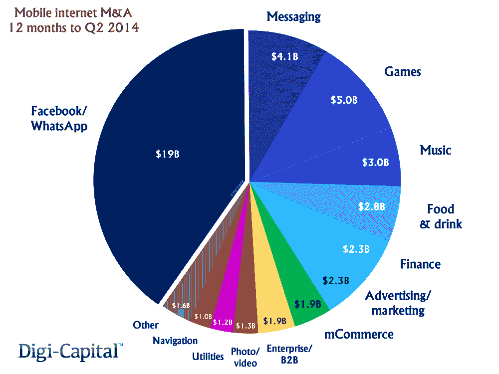
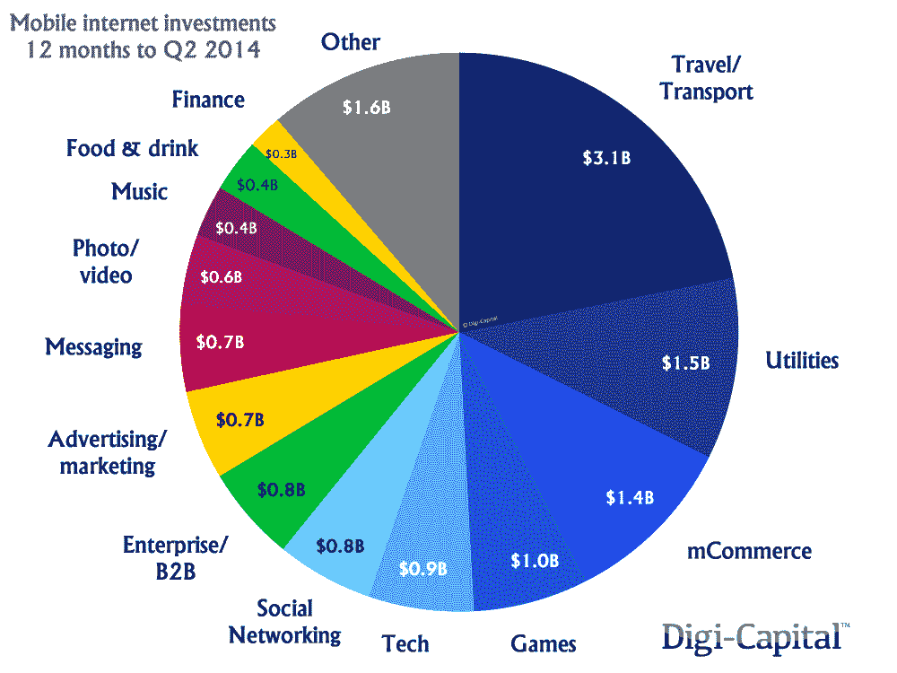
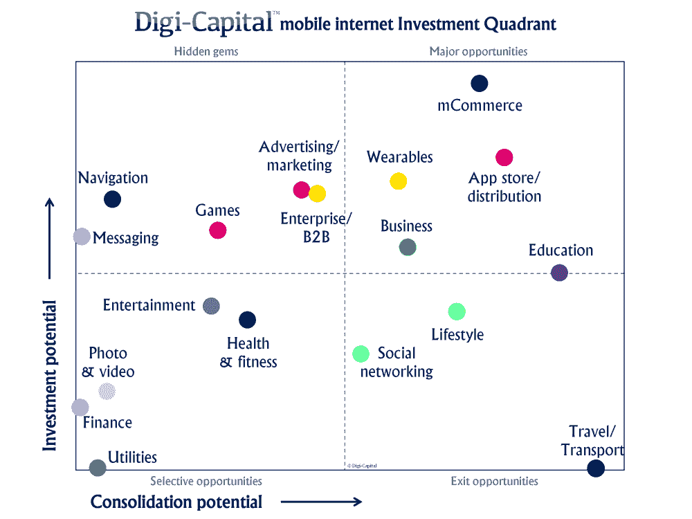

# 移动互联网投资爆炸:M&A 470 亿美元，外加 140 亿美元投资

> 原文：<http://venturebeat.com/2014/08/11/mobile-internet-investment-explosion-47b-in-ma-plus-14b-in-investments/?utm_source=wanqu.co&utm_campaign=Wanqu+Daily&utm_medium=website>

你错过了明年 2022 年 GamesBeat 峰会的一个环节吗？所有会议现在都可以在我们的点播库中观看。[点击这里开始观看](https://attendees.bizzabo.com/412979/agenda?date=1666742400000)。

* * *

在过去的 12 个月里，我们目睹了移动领域金融交易前所未有的爆炸式增长。这包括惊人的 470 亿美元的并购，外加 140 亿美元的投资。

<noscript></noscript>

And, no, it wasn’t all WhatsApp and Facebook.

Digi-Capital 的蒂姆·梅勒尔(Tim Merel)说:“将脸书-WhatsApp 的重磅交易从 M&A 记录中删除，揭示了一个跨领域的卖方市场，”他是该公司最近发布的移动互联网投资评论的作者。“在剩余的 280 亿美元中，138 亿美元来自 2014 年 Q2 青奥会，延续了 2013 年 Q2 青奥会 18 亿美元的长期增长势头。”

根据这份报告，以移动为重点的并购交易比上一年上升了 5X，上一年的交易额仅为 89 亿美元；投资比去年同期的 54 亿美元增长了 2.5 倍。

[

<noscript></noscript>](https://venturebeat.com/wp-content/uploads/2014/08/ma-deals-e1407763683603.png?resize=1000%2C750&strip=all?strip=all) 

当然，190 亿美元的 WhatsApp 交易是个例外。但即使没有这笔交易，公司也花了 41 亿美元收购其他通讯应用，50 亿美元收购手机游戏。导航超过 10 亿美元，照片/视频也是如此，而金融和广告均为 23 亿美元。

梅雷尔说，但这并不都是并购。还有正在进行的大规模投资。

* * *

Digi-Capital 498 页的完整报告和 43 页的免费摘要
都可以在 VB Insight 上获得

* * *

“在过去的 12 个月里，移动互联网已经吸引了超过 140 亿美元的投资，”他通过电子邮件告诉 VentureBeat。“旅游/运输、公用事业和移动商务等热门行业引领了这一潮流，但即使是较小的行业也有数亿美元的收入。”

上个季度的投资总额超过 55 亿美元，几乎是 2013 年同期的五倍，去年同期的投资仅为 14 亿美元。

[

<noscript></noscript>](https://venturebeat.com/wp-content/uploads/2014/08/investment-deals-e1407764081163.png?resize=1000%2C750&strip=all?strip=all) 

过去 12 个月的 140 亿美元投资中，31 亿美元主要投资于旅游和运输类，其次是公用事业和移动商务，各有近 15 亿美元。在过去的 12 个月中，游戏获得了价值 10 亿美元的投资，而热门的移动广告领域获得了额外的 7 亿美元投资。

通过分析所有的投资和支出，Digi-Capital 能够在“移动互联网投资象限”中对 18 个不同的移动互联网行业进行分类，Merel 说，这显示了哪里有投资潜力，哪里有整合潜力。

换句话说:你获得资金的最佳机会，或者你被收购的最佳机会。

[

<noscript></noscript>](https://venturebeat.com/wp-content/uploads/2014/08/investment-quadrant-e1407764457170.png?resize=1000%2C750&strip=all?strip=all) 

梅雷尔说，投资和退出机会相对较多的主要机会包括移动商务、商业应用、教育和可穿戴设备。隐藏的宝石包括广告/营销部门，在过去几年里，初创公司的数量大幅增长，还有游戏、导航和通讯。

他说，生活方式、医疗、新闻和社交网络应用仍然有很大的退出机会。

担心你的公司的类别没有出现，或出现在你希望的部门？

梅雷尔承认，有些人可能会认为这是有争议的，特别是如果他们公司的部门或投资没有出现在“重大机遇”中。然而，他继续说道，“作为一项数字分析，并不能说明任何行业、公司或投资是好是坏，任何行业都可能取得巨大成功。"

**GamesBeat 在报道游戏行业时的信条**是“激情与商业相遇的地方”这是什么意思？我们想告诉你这个新闻对你有多重要——不仅仅是作为一个游戏工作室的决策者，也是作为一个游戏爱好者。无论您是阅读我们的文章，收听我们的播客，还是观看我们的视频，GamesBeat 都将帮助您了解这个行业，并享受参与其中的乐趣。[发现我们的简报。](https://info.venturebeat.com/website-preference-center.html)