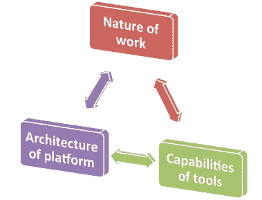

# 移动操作系统范式|通过运输学习

> 原文：<http://blog.learningbyshipping.com/2014/08/12/mobile-os-paradigm/?utm_source=wanqu.co&utm_campaign=Wanqu+Daily&utm_medium=website>

工作性质、工具能力、平台架构的循环。

平板电脑是下一个大事件，一个饱和的市场(已经)，死亡(！)，还是仅仅处于一个平静期？争论仍在继续，而平板电脑的销量继续超过笔记本电脑，并将很快超过所有个人电脑(包括所有外形和操作系统)。真正发生的是一场架构变革——定义 PC 的架构正被移动操作系统架构所取代。

这种动态的争议在于其颠覆性——在 PC 架构中容易做到的事情，在移动操作系统中很难或不可能做到，而移动操作系统中的事情让传统 PC 看起来容易得多。传统应用程序兼容性、整个职业所需的软件、输入偏好、外围设备等等都是其中的一部分。随着软件的发展，场景的适应，所有这些都在快速变化，真正重要的东西也随之变化。

以前的帖子已经讨论过[改变工作性质](https://blog.learningbyshipping.com/2013/08/20/continuous-productivity-new-tools-and-a-new-way-of-working-for-a-new-era/)和[工具](https://soundcloud.com/a16z/when-your-pc-expires)的[新功能](https://blog.learningbyshipping.com/2014/05/06/tablets-v-the-world/)。这篇文章详细介绍了这个平台的架构。这三者共同形成了一个创新循环——相互促进，推动我们今天看到的计算领域的整体变化。

操作系统的根本转变是这一切的关键。尽管移动操作系统架构在短期内会带来诸多负面影响，但它也是一个必不可少且不可避免的转变。在这些转变过程中，我们通常只关注短期的明显差异，而忽略了变化的本质。

在从 mini 到 PC 的过渡过程中，低价和低性能造成了价格/性能差距，mini 认为他们可以利用这一差距。然而，规模、架构开放性和多供应商工具(以及更多)的快速改进促成了无与伦比的快速发展。

在从基于字符的电脑向基于图形用户界面的电脑过渡的过程中，许多人关注的是显卡和鼠标等额外外设的费用、对更多内存和 MIPs 的需求，更不用说新界面在培训和生产力方面的性能影响了。然而，摩尔定律、更强大的外围设备支持(打印机和驱动程序)以及利用多应用场景(剪贴板等)的能力以基于字符的方式无法改变计算。

这同样适用于向浏览器互联的过渡。重点是，这些架构转变的辅助优势经常被忽略，而对话主要关注平台和体验中即时可见的变化。有时，这些变化会随着时间的推移而减轻(例如，向 GUI 添加键盘快捷键，或者 PC 向长文件名、真正的多任务和虚拟内存发展)。其他时候，随着新客户和新场景占主导地位(例如鼠标、颜色、网络)，这些变化成为新的范例。

向移动操作系统平台的过渡也遵循同样的模式。对于所有关于触摸与键盘、屏幕大小、垂直集成或全屏应用的辩论，操作系统的底层实现都发生了根本性的变化，这些变化将持续下去，并改变了计算。

我们在这一转变过程中是幸运的，因为我们第一次在我们都喜爱和使用(比任何其他设备都多)的手机上体验到这一点，所以这些变化与现有行为的脱节较少，但这并没有减少对一些人甚至是辩论的挑战。

## 移动操作系统范式

Android、iOS、Windows RT、Chrome OS、Windows Phone 等定义的移动操作系统与 Windows 7/8、Mac OS X、Linux 桌面所设想的 PC 是非常不同的架构。该范式包括许多关键的创新，这些创新共同定义了新的范式。

1.  **手臂**。面向移动设备的 ARM 架构提供了不同的“处理器”视图:SoC、多供应商、更简单、功耗更低、无风扇、丰富的图形、连接性、传感器等等。所有这些都是以低得多的成本方式*包装的*。我绝对不是针对英特尔/AMD 的这一变化，但该产品与英特尔的 SOC 和业务方法有着根本的不同。ARM 还与 x86 指令不兼容，这意味着即使虚拟化，现有的软件基础也不会运行，这在这一变化中变成了一项资产(OS/360 和虚拟机不会在 PC 上运行)。
2.  **安全**。移动的核心是一个更安全的平台。这并不是因为实现中的指针很少或 API 很少而更安全，而是因为应用程序以不同的概念运行，它们可以/不可以做什么，并且根本没有办法在设备上获得可以违反这些规则的应用程序(当然开发者除外)。那里有一个完整的内核，但是你不能仅仅写你自己的内核模式驱动程序来做你想做的任何事情。安全当然是一场竞赛，因此更多的社交工程，密码窃取，数据包嗅探，呼叫总部邪恶的应用程序无疑将进入移动设备，但你不会看到缓冲区溢出攻击接管你的设备，击键记录程序，或窃取其他应用程序数据的应用程序。
3.  **质量随时间变化和遥测**。我们都很熟悉 PC(以及更少但不是零度的 MAC)随着时间的推移而衰退的方式，或者进入只有重新格式化或重新镜像才能做到的状态。在这方面，PC 架构的脆弱性与开放性直接相关，因此很难防御，即使是在最勤奋的爱好者中(包括我自己)。移动操作系统是从头开始设计的，在操作系统和应用程序之间以及应用程序之间有一定程度的隔离，几乎可以保证设备将继续像第一天一样运行和执行。当性能确实变得更差时，持续的遥测可以很容易地指向错误/原因应用程序，删除它会将事情恢复到卓越的基线水平。
4.  **App store 模式**。app store 模型提供了一个易于搜索的完整应用目录，以及一个已知的/经过审查的应用源，这些应用源符合某些(供应商指定的)标准。虽然供应商在一致性和执行级别上采取了不同的方法，但公平地说，这种方法提供了如此多的优势。即使在审查/批准流程失败的情况下，如果应用程序被证明是恶意的，也可以被撤销，或者如果存在工程错误，也可以被修复。此外，集中审查提供了前所未有的应用程序遥测水平。对于开发者和消费者来说，应用和商业模式的统一条款和许可是重大进步(尽管它们伴随着事情运作方式的变化)。
5.  **全天续航**。自第一代便携式/电池个人电脑问世以来，全天电池寿命一直是设备的目标。x86 芯片组(包括控制器和内存)的功耗、待机电源周期的可靠性挑战以及其他因素，使得它难以可靠地“添加”到开放式 PC 架构中。由于需要设备驱动程序、安全软件等，单次安装或外围设备可能会极大地改变传统设备的电源配置。移动操作系统的“封闭”特性以及进程/应用程序模型使得无论遇到什么情况，都有可能获得全天电池续航时间。
6.  **一直连接**。现代移动操作系统被设计为总是连接到各种网络，最重要的是 WWAN。这是从芯片组到操作系统的一项功能。这种连接不仅仅是网络的一种替代方式，而是内置于网络堆栈、流程模型、应用模型和用户模型的假设中。具有讽刺意味的是，具有可选连接的 PC 架构在处理间歇性连接方面仍然不如移动架构好，而移动架构总是不如 LAN 或 wifi 稳定。处理连接不断变化的需求推动了不同的体系结构。此外，能够在基本无功耗和屏幕关闭的情况下运行，同时针对入站流量即时“唤醒”是一项核心功能。
7.  **始终保持最新的应用/操作系统**。今天的 PC 操作系统都有来自供应商的更新程序和到存储库的连接，但从一开始，现代移动操作系统就被设计为从一个中心位置不断更新应用程序和操作系统(即使两种更新的处理方式不同)。我们处于一种中间状态，因为在 PC 上有一些应用程序(如 Chrome 和 Firefox，以及 Windows 上的安全补丁)在默认情况下更新时没有提示，但在移动设备上我们仍然可以看到一些操作通知。我怀疑在不久的将来，我们将会看到统一的、无缝的、透明的更新。
8.  **以云为中心/无状态**。几十年来，人们已经尝试了各种各样的技巧来维护无状态 PC:“M”驱动器、数据驱动器或分区、漫游配置文件、从服务器、虚拟机或 VDI 启动，甚至例行的重新镜像等。这些都不可靠，都有相同的核心问题，即如果不运行它们，可能会出错的东西仍然可能出错，然后您的一份完好的拷贝到处都坏了。移动操作系统从一开始就被设计为在云中存储状态和数据，借助隔离、分离和内核架构，您通常可以在几分钟内可靠地恢复您的设备。
9.  **触摸**。触摸显然是最明显和最具挑战性的过渡。首先为触摸设计操作系统和应用模型的核心，但支持键盘，这从根本上改变了我们与设备交互的方式。没有人可以否认，对于现有软件上的现有工作负载，鼠标和键盘更胜一筹，并将继续如此(正如我们在从大型机到 mini、从 CUI 到 GUI、从客户机/服务器到 web 等的转变中所看到的那样。)然而，随着软件和用户基数的增长，现实情况是事情会发生变化——工作会发生变化，应用会发生变化，因此工作产品也会发生变化，因此触摸优先将继续崛起。我的观点是，现代商用“笔记本电脑”将继续是带键盘的大屏幕平板电脑(正如最初的 iPad 所表明的那样)。上述价值主张对今天的移动信息工作者更为重要，典型的机场等候区或酒店大堂酒廊就是证明。我仍然确信，创新将继续填补目前移动操作系统和平板电脑在键盘方面存在的漏洞。软件将继续发展，改变精确定位的本质，使它成为你在个人电脑上唯一需要的东西。
10.  **企业管理**。即使在管理最严格的环境中，商用 PC 也展示了架构的挑战。移动操作系统上的企业控制旨在成为一种状态管理系统，而不是一种基于计算的方法。当您使用受管理的移动设备时，企业管理是关于控制对设备的访问和一些功能(策略)，而不是关于运行任意代码和消耗任意系统资源。在接听电话之前，您可能会在移动设备上输入您的 PIN 或密码，并对您的存储进行全面扫描，并安装任意数量的软件，这种想法在现代移动操作系统上是不会出现的。列表中的许多项目都被企业 IT 视为挑战，具有讽刺意味的是，为诊断和缓解这些挑战而开发的工具只会加深 PC 面临的挑战。随着移动存储的深度加密、对企业资源的 VPN 访问以及从不出现在您设备上的云数据，我们有了看待“设备管理”的新方法。

这些都是向移动操作系统转变的基础。许多其他平台功能也得到显著改进，如可访问性、全球语言支持，甚至剪贴板和打印。

重要的是，它们在多大程度上打破了传统的 PC 模式。从转变的角度来看，这不是其中的任何一个，而是总和。

一旦人们将所有这些移动部分内在化，就很清楚为什么强调新架构的操作系统以及与过去的软件和硬件的突破对于实现这些优势是必不可少的。这些好处现在已经成为对计算设备的期望。

虽然今年刚接触计算的人可能完全理解带有键盘的大屏幕设备执行某些任务，但这不太可能有多大意义，因为必须重启、重新镜像或编辑注册表来删除恶意软件，或者为什么设备的电池寿命从 x 小时延长到 1/2 x 小时，只是因为安装了一些新的应用程序。在某些时候，设备的基本预期会发生变化。

我们今天看到的移动操作系统平台代表了一种新的模式。这种新的范式就是为什么你可以在口袋里有一台超级电脑，或者访问数百万个一起“工作”的应用程序。

–史蒂文·辛诺夫斯基([@史蒂夫西)](http://twitter.com/stevesi)

### 像这样:

像 装...

### *相关*