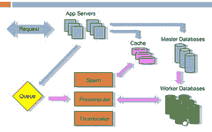
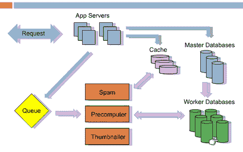

# 7 将 Reddit 构建到每月 2.7 亿页面浏览量的经验教训-高可扩展性-

> 原文：<http://highscalability.com/blog/2010/5/17/7-lessons-learned-while-building-reddit-to-270-million-page.html?utm_source=wanqu.co&utm_campaign=Wanqu+Daily&utm_medium=website>

 [社交新闻网站](http://en.wikipedia.org/wiki/Steve_Huffman) [Reddit](http://www.reddit.com/) 的联合创始人史蒂夫·霍夫曼做了一场精彩的[演讲](http://vimeo.com/10506751) ( [幻灯片](http://www.slideshare.net/carsonified/steve-huffman-lessons-learned-while-at-redditcom)，[文字稿](http://carsonified.com/blog/dev/steve-huffman-on-lessons-learned-at-reddit/))，讲述了他在将 Reddit 建设和发展到每月 750 万用户、每月 2.7 亿页面浏览量和 20 多台数据库服务器时所学到的经验。

史蒂夫说，很多教训都很明显，所以你可能不会在演示中发现很多全新的想法。但是史蒂夫对他的认真和真诚是如此明显地基于他的经验，以至于你不禁会深入思考你可以做些什么不同。如果史蒂夫不知道这些教训，我打赌其他人也不知道。

共有七课，每一课都有自己的总结部分:第一课:经常崩溃；第 2 课:服务分离；第三课:打开模式；第四课:保持无状态；第五课:Memcache 第六课:存储冗余数据；第 7 课:脱机工作。

到目前为止，他们的体系结构最令人惊讶的特点是在第六课，其基本思想是:速度的关键是预计算一切并缓存它。他们将预计算[旋钮调到 11](http://en.wikipedia.org/wiki/Up_to_eleven) 。听起来，你在 Reddit 上看到的几乎所有东西都经过了预先计算和缓存，不管他们需要创建多少个版本。例如，他们预计算所有 15 种不同的排序顺序(热门、新、热门、旧、本周。当有人提交一个链接时。通常开发者会害怕走极端，因为这是一种浪费。但是他们认为提前浪费总比缓慢浪费好。**浪费磁盘和内存总比让用户等待好**。所以如果你一直犹豫不决，去 11，你有一个很好的先例。

## 第一课:经常撞车

这个教训的精髓是:**自动重启失败而癌变的服务**。

在 colo 中运行您自己的系统的缺点是您必须进行维护。当你的服务失效时，你必须现在就修复它，即使是在凌晨 2 点。这是你生活中持续的紧张。你必须随身携带一台电脑，你知道任何时候任何人打电话来都可能是你必须解决的另一场灾难。它会毁了你的生活。

缓解这个问题的一种方法是重新启动已经死亡或癌变的过程。Reddit 使用[监督](http://cr.yp.to/daemontools/supervise.html)自动重启应用。特殊的监控程序会杀死使用太多内存、太多 CPU 或没有响应的进程。不用担心，只要重启一下，系统就启动了。当然，您必须阅读日志并找到根本原因，但在此之前，它会让您保持理智。

## 第 2 课:服务分离

本课的精髓是:**将类似的流程和数据分组放在不同的盒子上**。

在一个机器上做太多的工作会导致**在任务**之间进行大量的上下文切换。尽量让每台数据库服务器以相同的方式为同一种数据库服务。这意味着你所有的索引都将被缓存，它们不会被换入换出。尽可能把所有相似的东西放在一起。不要用 Python 线程。他们很慢。他们把所有东西都放在独立的多个流程中。垃圾邮件、缩略图、查询缓存等服务。它允许你很容易地把它们放在不同的机器上。您已经解决了进程之间的通信问题。一旦解决了这个问题，它就保持了架构的整洁，并且更容易发展。

## 第 3 课:打开模式

这节课的精髓是:**不要担心模式**。

他们过去常常花很多时间担心数据库，保持一切正常。你不应该担心数据库。当你变得更大时，模式更新非常慢。将一列添加到 1000 万行需要锁，并且不起作用。他们将复制用于备份和扩展。模式更新和维护复制是一件痛苦的事情。他们将不得不重新开始复制，并且可能一天都没有备份。部署是一件痛苦的事情，因为您必须协调新软件和新数据库的升级。

相反，他们保存一个事物表和一个数据表。Reddit 中的一切都是一个东西:用户、链接、评论、子编辑、奖项等等。事物保持共同属性，如向上/向下投票、类型和创建日期。数据表有三列:事物 id、键、值。每个属性都有一行。有一行是标题、url、作者、垃圾邮件投票等。当他们添加新功能时，他们不再需要担心数据库。他们不必为新东西添加新桌子，也不必担心升级。更易于开发、部署和维护。代价是你不能使用很酷的关系特性。数据库中没有联接，您必须手动实施一致性。没有连接意味着很容易将数据分布到不同的机器上。你不必担心外键正在做连接或者如何分割数据。效果很好。对使用关系数据库的担忧已经成为过去。

## 第四课:保持无状态

目标是让每台应用服务器处理每种类型的请求。随着他们的成长，他们有更多的机器，所以他们不能依赖应用服务器缓存。他们最初将状态复制到每个应用服务器，这是一种内存浪费。他们不能使用 memcached，因为他们保留了如此大量的细粒度，太慢了。他们重写以使用 memcache，并且不在应用服务器中存储任何状态。如果应用服务器出现故障，这很容易。要扩展，您只需添加更多应用服务器。

## 第 5 课:Memcache

这节课的精髓是: **memcache everything** 。

它们将所有内容存储在 memcache 中:1。数据库数据 2。会话数据 3。渲染第 4 页。记忆(记住以前的计算结果)内部函数 5。限速用户操作，爬虫 6。存储预先计算的列表/页面 7。全局锁定。

他们现在在 Memcachedb 中存储的数据比 Postgres 多。它类似于 memcache，但是存储到磁盘。非常快。所有查询都由同一个控件生成，并缓存在 memcached 中。更改密码链接和相关状态将被缓存 20 分钟左右。验证码也一样。用于他们不想永远保存的链接。

他们在框架中建立了记忆。计算出的结果也会被缓存:规范化的页面、列表等等。

使用 memcache +到期日期对所有内容进行速率限制。保护您的系统免受攻击的好方法。如果没有速率限制子系统，单个恶意用户就可以使系统瘫痪。不太好。因此，对于用户和爬虫来说，他们在 memcache 中保存了大量数据。如果用户在一秒钟内再次出现，他们将被退回。普通用户不会点击那么快，所以他们想引起注意。谷歌爬虫会在你允许的情况下快速攻击你，所以当速度变慢时，只需调高限速器，它就会让系统安静下来，而不会伤害用户。

Reddit 上的一切都是列表:首页、收件箱、评论页。所有这些都经过预先计算并转储到缓存中。当你得到一个列表时，它是从缓存中取出的。每一个链接和每一条评论都可能存储在 100 个不同的版本中。例如，一个 30 秒内有两票的链接被单独呈现和缓存。当它达到 30 秒时，它会被再次渲染。诸如此类。HTML 的每一小段都来自缓存，所以 CPU 不会浪费在渲染上。当速度变慢时，只需增加更多缓存。

当处理脆弱不一致的数据库时，他们使用 memcache 作为全局锁。对他们来说，即使这不是最好的方法。

## 第 6 课:存储冗余数据

这一课的精髓是:**速度的关键是预先计算好一切并缓存**。

制作一个慢速网站的方法是拥有一个完美的标准化数据库，按需收集所有数据，然后呈现出来。每一个请求都要花很长时间。因此，如果您有可能以几种不同格式显示的数据，如首页、收件箱或个人资料中的链接，请分别存储所有这些表示。因此，当有人来获取数据时，它已经在那里了。

每个列表都有 15 种不同的排序顺序(热门、新、热门、旧、本周)。当有人提交链接时，他们会重新计算该链接可能影响的所有可能列表。这可能在前期有点浪费，但在前期浪费总比缓慢要好。浪费磁盘和内存比让用户等待要好。

## 第 7 课:脱机工作

这一课的精髓是:**在后端做最少的工作，并告诉用户你已经完成了**。

如果你需要做什么，在用户没有等你的时候去做。把它放到一个队列里。当用户在 Reddit 上投票时，会更新列表、用户的因果报应和许多其他东西。所以在投票时，数据库被更新以知道投票发生了，然后一个作业被放入队列，该作业知道需要更新的 20 件事情。当用户回来时，一切都已经为他们预先缓存好了。

他们线下做的工作:1。预计算清单 2。获取缩略图 3。检测作弊。4.清除垃圾邮件 5。计算奖励 6。更新搜索索引。

当用户在等你的时候，没有必要做这些事情。例如，随着 Reddit 变得越来越大，作弊的动机越来越强，所以当人们投票检测作弊时，他们在后端花了很多时间。但是他们在后台实时运行，所以不会降低用户体验。演示文稿中的架构图是:

蓝色箭头表示请求进来时发生的情况。假设有人提交了一个链接或投票，它会进入缓存、主数据库和作业队列。然后它们返回给用户。其余的离线进行，用粉色箭头表示。像 Spam、Precomputer 和 Thumnailer 这样的服务从队列中读取数据，完成工作，并根据需要更新数据库。关键技术是 RabbitMQ。

## 相关文章