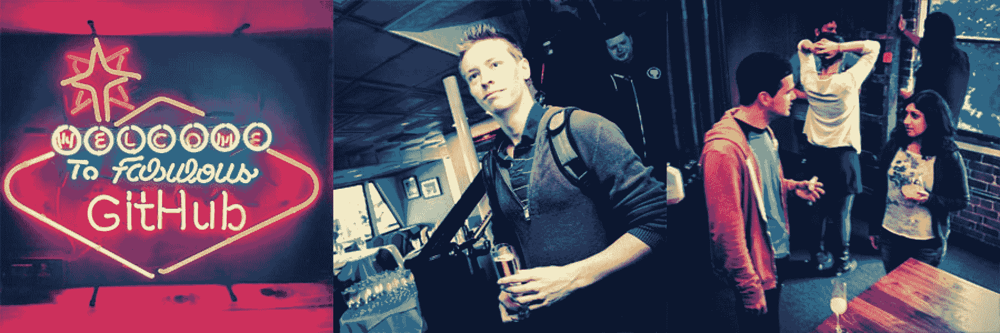

# GitHub 招聘体验| GitHub 博客

> 原文：<https://github.com/blog/1269-the-github-hiring-experience?utm_source=wanqu.co&utm_campaign=Wanqu+Daily&utm_medium=website>

<main role="main" id="post-31217" class="col-12 col-lg-7 post__content col-md-8 post-31217 post type-post status-publish format-standard hentry category-engineering">

打造体验是我们在 GitHub 工作的核心，我们的面试、招聘和入职体验也不例外。最近经历了这一过程的第一手资料，我想分享一点关于它是什么样子的，而它仍然在我的脑海中。

我的故事从一封邮件开始。一天晚上，我发现自己在网上阅读一些文章，喝着啤酒放松，我看到了@kneath 的一篇关于 GitHub 如何做事的帖子。过去，我读过很多 GitHubbers 们的帖子，他们对待商业、技术和生活其他方面的方式给我留下了深刻的印象。我不知道他们是否会招聘，但在决定给凯尔发一封电子邮件介绍我自己的一两天后，我惊讶地发现可以直接在 Skype 上和他聊天。

每个候选人与 GitHub 的第一次接触都略有不同，但几乎总是与一个职位接近候选人的人接触——无论是开发人员、设计师、supportocat、ops 还是其他人。这次谈话让我们有机会初步了解这个人是什么样的人，并开始讨论让他们加入我们团队的可能性。

我和凯尔的第一次聊天非常轻松。我们谈论了我的经历，我对 GitHub 作为一家公司的想法，我典型的设计过程，以及我一般是如何对待我的工作的。这在很大程度上也是一次双向对话——凯尔回答了我所有的问题，并在我们交谈时分享了对公司的有趣见解。这不像是一次典型的面试，也不是一次充满压力的对抗。我当时并不知道，但这种氛围在我的招聘和入职经历中一直持续着。

我们以这种方式接近人们第一次接触的原因很简单。我们认为，确保候选人与**完全了解他们所做的工作**的人进行初步讨论是至关重要的。它让我们知道这个人在技能和文化方面是否很适合 GitHub，但更重要的是，它为接下来的招聘工作定下了基调。我们希望跳过最初基于文书工作的筛选过程，让候选人明白我们不是在玩游戏——我们**真的对他们**感兴趣。

对于我们认为很有可能适合公司的人，下一步就是把他们带到办公室进行面对面的面试。

## 面试

雇佣优秀的员工是我们公司最重要的活动之一，所以我们会尽力确保受访者感到自己很重要。到这个阶段，我们已经有了一个很好的感觉，他们将为团队做出很大的贡献，所以非常值得投资他们的经验，以最大限度地提高候选人与我们合作的愿望。

### 确保人们感到受到重视

对于所有的受访者，我们让他们从他们居住的任何地方飞到旧金山——即使是在世界的另一端，就像我的情况一样。有一个司机举着牌子在机场等着带他们去一个舒适的酒店——这对我绝对是天赐之物。经过近 20 个小时的飞行，我像僵尸一样跌跌撞撞地走出机场，看到一个写有我名字的牌子，我的心情**马上就好了**。我们为受访者做这些事情是为了传达这样一个信息，即 **GitHub 从一开始就重视他们**——这当然也是它给我的印象。

有价值的人应该得到定制的招聘体验，所以我们会尽最大努力解决受访者现有的承诺和时间表，或者人们有家庭要照顾的地方——一点点灵活性大有帮助。我忙于现有的自由职业工作、与我的伴侣的假期计划，以及我大学学位的最后两个科目的作业和考试研究——所以在安排我的旅行时，有 GitHub 的 Spirit Guide[David](https://github.com/newmerator)如此灵活和有帮助真是令人惊讶。

人们的时间也很宝贵，因此我们重视快速完成流程。就我而言，联系凯尔和预订机票之间的时间只有几天。另一个最近被雇佣的人在短短的四天内从候选人变成了签约人。当我们把某人送走的时候，我们是认真的。

### 面试日

面试那天，我被告知大约 10 点左右到达办公室，大卫(和几只狗)在那里迎接我。大卫带我去厨房喝饮料，不久，面试开始了。

一天中，我可能和大约 10 或 12 个人交谈过，大多数时候一次两个人，每个人都非常友好。我的一天还包括与@bleikamp 合作设计和一些 CSS，与@jakeboxer 一起处理制作前端问题，还与@mojombo 一起喝着啤酒一对一地聊天，回顾我以前的一些自由职业工作，与他谈论我的典型流程，并大致相互了解。整个经历是热情的，开放的，悠闲的；我有一个清晰的印象，那就是所有人都只是简单地了解我这个人，这也是 GitHub 的目标。

我的经历对于 GitHub 的应聘者来说是一个相当典型的经历。一般来说，在一天结束时，你会与十几个人交谈，在一些真正的工作中配对，打台球，在办公室里四处看看，还有一个很好的机会，你会被介绍给[Slow Merge](http://f.cl.ly/items/1J2U150d3A2p1z371T07/Image%202012.09.20%203:15:01%20PM.png)，这是我们自己的 GitHub 品牌威士忌。我们希望在你离开的时候，我们对你足够了解，可以说我们希望你加入这个团队，你认为我们很棒，想和我们一起工作。

## 上车

当任何人加入 GitHub 团队时，我们会让他们飞回旧金山，在第一周完成我们的入职流程。每个新员工都有一个伙伴陪伴他们一周，我很幸运地拥有了@jonrohan。好友帮助新员工为我们使用的各种服务设置他们所有的用户账户；向他们介绍 Setup，让他们在新的笔记本电脑上安装一个开发环境，并向新手展示如何以他们最擅长的方式向世界传播精彩。我发现有一个专注的伙伴帮我度过第一周真的很让人放心。消化新成员接触到的大量信息变得更加顺利，因为有人向我介绍了这一切是如何运作的。

一个典型的入职周在午餐、撞球游戏或疯狂的双人乒乓球、[饮料](http://i.imgur.com/TtYVO.gif)、[sparkles::tropical _ fish::cherries:表情符号:企鹅::strawberry::star 2]、了解[Hubot](http://hubot.github.com/)和航运(当然)中飞逝，所以人们有足够的时间适应公司并了解他们的同事。到本周末，从新手到成熟的 GitHubber 的转变就完成了，他们将准备好自己去踢屁股。

## 好人让伟大的经历成为可能

所有这些体验式工艺都是许多人努力工作的结果，我想借此机会亲自感谢大卫、梅丽莎、汤姆、希瑟、珍妮弗、艾玛和其他所有人,他们使这个过程变得如此愉快，让像我一样的新成员和那些跟随他们的人得以经历。

我相信我们在 GitHub 招聘的最大好处是每一个新员工出来时都知道他们是公司有价值和值得信任的一部分。最终，这意味着我们的业务和产品会因此变得更好，每天依靠我们的产品完成工作的人会有更好的体验。

### 我们需要更多的优秀人才

说到招聘，我们目前正在寻找几个人加入我们的团队。查看一下我们在 GitHub 招聘栏上的列表，如果你认为你是合适的人选，我们很乐意收到你的来信。

</main>