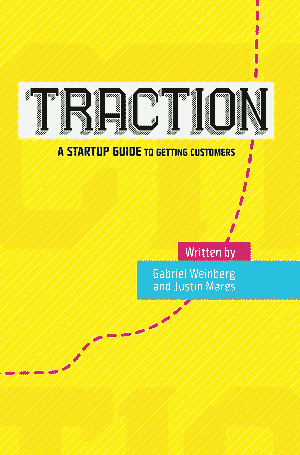

# 创业牵引始于正确的目标。如何把它做好。

> 原文：<http://onstartups.com/startup-traction-starts-with-the-right-goal.-how-to-get-it-right?utm_source=wanqu.co&utm_campaign=Wanqu+Daily&utm_medium=website>

 没有牵引力——可持续的客户增长——你的初创公司将会萎缩或死亡。因此，牵引力应该永远是最重要的。

为了集中你的努力，你需要一个努力的目标。示例目标是 1000 个新用户、100 个新客户或 10%的市场份额。

适合你的目标取决于你的业务。应该仔细选择，并与你公司的下一个转折点保持一致。当你达到这个目标时，什么会有显著的变化？也许你会有利可图，能够筹集资金，或者成为市场领导者。

选择正确的牵引目标的重要性怎么强调都不为过。你是追求增长、盈利还是介于两者之间？如果你需要在 12 个月内筹集资金，你需要多大的牵引力来这样做？这些问题有助于您确定正确的牵引目标。[T2】](http://bit.ly/ostractionbook)

*DuckDuckGo 示例*

DuckDuckGo 是不跟踪你的搜索引擎。2013 年，也就是我创办公司的六年后，我们看到了超过 10 亿次的搜索。在 DuckDuckGo，我们目前的牵引目标是一般搜索市场的百分之一。实现这一目标是有意义的，因为那时我们将成为市场中根深蒂固的一部分，并获得随之而来的一切(认可、更好的交易、公关等。).

这种牵引目标对大多数其他公司来说并不适用，因为通常一个明确定义的市场的百分之一并不那么重要或有价值。它在搜索引擎领域行之有效，因为市场如此之大，而其中的公司却如此之少。这说明了设定一个对你的公司意义重大的牵引目标的重要性。

在这个牵引目标之前，DuckDuckGo 有一个月 1 亿次搜索的牵引目标，这让我们达到了收支平衡。达到收支平衡是与这一牵引目标相一致的重要公司里程碑。

在此之前，牵引目标是让产品和信息达到人们转向 DuckDuckGo 作为他们的主要搜索引擎并无限期坚持下去的程度。公司的意义在于实现真正的产品/市场契合。

这些都是大目标，这才是重点。我们的牵引目标都花了大约两年时间来实现。然而，时间尺度并不重要。对贵公司的意义是重要的。如果你试图实现的意义是盈利，并且你认为你可以在六个月内实现，那就太好了！

*专注于你的目标*

一旦你建立了一个牵引目标，你可以用它来评估你应该做什么。如果活动与实现你的牵引目标无关，你就不应该做。如果营销活动不会移动针，你应该跳过它们。

我喜欢通过一个叫做关键路径的框架来思考这个问题。以最少的步数达到你的牵引目标的路径是你的关键路径。我喜欢把这条路画出来，勾勒出我们需要达到的目标的里程碑。

其中一些里程碑将与牵引力直接相关，例如我们在[牵引力书](http://www.amazon.com/gp/product/0976339609/ref=as_li_tl?ie=UTF8&camp=1789&creative=9325&creativeASIN=0976339609&linkCode=as2&tag=tracbook-onstartups-20&linkId=6NVETZCLE4NWOTKG)中解释的选择和追求正确的营销渠道。然而，这些里程碑不一定都与牵引相关，但对于达到牵引目标是绝对必要的。例如，产品特性、重新设计或关键雇佣都可能是必要的里程碑。

一旦你定义了你的关键路径，就很容易确定前进的方向——只要沿着路径走就行了！特别是，只做第一步，不做其他事情。在这些第一步完成后，用你上次勾画关键路径后获得的知识重新检查你的关键路径。

这种方法有助于你专注于你的牵引目标——你确定的成就将是你公司的一个转折点。你所做的一切都应该根据你的关键路径来衡量，反过来，你的牵引目标。每一项活动要么在路上，要么不在路上。如果不在路径上，就不要做！

不幸的是，这说起来容易做起来难。大多数公司都会分心，偏离理想的牵引关键路径。分心可能是致命的。

创业牵引力始于正确的目标，随后是实现目标的不懈追求。这就是为什么选择正确的牵引目标如此重要。你呢？

**这是一篇客座博文，节选自* [*牵引书*](http://www.amazon.com/gp/product/0976339609/ref=as_li_tl?ie=UTF8&camp=1789&creative=9325&creativeASIN=0976339609&linkCode=as2&tag=tracbook-onstartups-20&linkId=6NVETZCLE4NWOTKG) *，一本由*[*Gabriel Weinberg*](https://twitter.com/yegg)*和*[*Justin Mares*](http://justinmares.com/)*撰写的创业指南。**