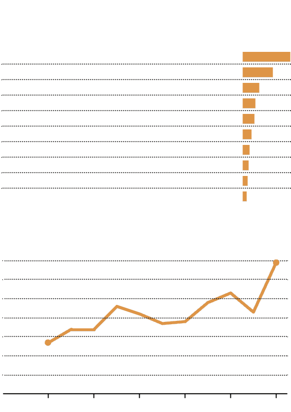

# 在硅谷，合并必须通过牙刷测试——纽约时报

> 原文：<https://dealbook.nytimes.com/2014/08/17/in-silicon-valley-mergers-must-meet-the-toothbrush-test/?utm_source=wanqu.co&utm_campaign=Wanqu+Daily&utm_medium=website>

Photo

Credit Liz Grauman/The New York Times

加利福尼亚州山景城——在决定谷歌(Google)是否应该花费数百万甚至数十亿美元收购一家新公司时，其首席执行官[拉里·佩奇(Larry Page)](https://topics.nytimes.com/top/reference/timestopics/people/p/larry_page/index.html?inline=nyt-per "More articles about Larry Page.")会问收购是否通过了牙刷测试:它是你每天会使用一次还是两次的东西，它会让你的生活变得更好吗？

这一深奥的标准避开了传统的公司估值标准，如收益、现金流贴现甚至销售额。相反，佩奇看重的是实用性而非盈利性，看重的是长期潜力而非近期财务收益。

谷歌的牙刷测试突显出硅谷最大的企业收购者的自主权越来越大，以及投资银行在最近一轮科技交易热潮中扮演的边缘化角色。

许多最大的科技公司现在在进行大型并购时都在单干。像谷歌、[、脸书](https://dealbook.on.nytimes.com/public/overview?symbol=FB&inline=nyt-org "More information about Facebook, Inc.")和[思科系统](https://dealbook.on.nytimes.com/public/overview?symbol=CSCO&inline=nyt-org "More information about Cisco Systems Inc")这样的公司依靠他们内部的企业发展团队来确定目标、进行尽职调查和谈判条款，而不是依赖华尔街的银行家。

谷歌公司发展副总裁唐纳德·哈里森(Donald Harrison)表示:“拉里将在非常早期的阶段寻找潜在的交易。"银行家可能会有所帮助，但他们不一定是讨论的核心."

与不谨慎买家的交易正在迅速增加。根据 Dealogic 的数据，在今年价值超过 1 亿美元的美国技术收购中，收购公司有 69%没有使用投资银行。十年前，这个数字是 27%。

Photo

Above, executives from Beats Electronics and Apple, after Apple bought Beats this year in a $3 billion deal conducted without Wall Street’s help.Credit Paul Sakuma/Apple

当苹果 [今年以 30 亿美元收购 Beats Electronics](https://www.nytimes.com/2014/05/29/technology/apple-confirms-its-3-billion-deal-for-beats-electronics.html "Times article.") 时，它避开了专业交易顾问的帮助。今年 3 月，当脸书[斥资 23 亿美元](https://www.nytimes.com/2014/03/26/technology/facebook-to-buy-oculus-vr-maker-of-virtual-reality-headset.html "Times article.")收购虚拟现实公司 Oculus VR 时，它没有得到银行家的帮助。去年，当谷歌以 10 亿美元收购地图公司 Waze 时，没有一家银行从中获利。

今年 6 月，以拒绝聘用投资银行家而闻名的甲骨文公司(Oracle)和 T2 公司(Bernstein)以大约 50 亿美元的价格收购了微软系统公司(Micros Systems ),这是有史以来规模最大的一笔收购交易。此类交易中最大的一笔发生在 2011 年，当时[微软](https://dealbook.on.nytimes.com/public/overview?symbol=MSFT&inline=nyt-org "More information about Microsoft Corporation")，单独行动[以 85 亿美元从银湖合伙公司收购了 Skype](https://dealbook.nytimes.com/2011/05/10/microsoft-to-buy-skype-for-8-5-billion/ "DealBook post.") 。

对投资银行的依赖减少之际，技术交易正蓬勃发展。根据 Dealogic 的数据，今年美国已宣布超过 1000 亿美元的此类交易，是自 2000 年以来最多的。

科技公司和银行之间脱节的核心是，许多科技高管认为，一些顾问根本不知道谷歌和脸书等公司在寻找什么。

“银行家擅长两件事:财务评估和谈判，”律师事务所 Weil，Gotshal & Manges 的合伙人理查德·e·克里曼(Richard E. Climan)说，他经常与公司合作，在没有银行参与的情况下完成交易。“但有一种感觉是，在评估初创科技公司时，投资银行家可能不那么重要。”

脸书负责企业发展的副总裁阿明·祖弗农(Amin Zoufonoun)表示，一些银行家会进来推介收购候选人，比如用户评论网站 Yelp 或支付网络 PayPal。但是，脸书没有试图吞并已经建立的互联网品牌，而是通过收购来对未来下大赌注，填补技术漏洞。在硅谷相对较小的精英企业家、高管和风险资本家圈子里，人脉既容易又丰富。

脸书最近的一笔大交易，收购 Oculus VR，即使是经验丰富的技术观察家也感到惊讶。但是脸书董事会成员马克·安德森也是 Oculus VR 的董事会成员，为这笔交易铺平了道路。此举与改善社交网络的主网站或增加销售额没有任何关系。相反，人们打赌虚拟现实将作为一种新的操作系统出现。

虽然其他公司专注于提高每股收益的交易，但祖弗农说，“我们没有做过一笔这样的交易，我们是以此为理由来寻找目标的。”。

## 没有银行建议的交易

最近许多最著名的技术收购交易都是在没有银行家建议的情况下完成的，这种趋势似乎正在加剧。

美国技术行业并购交易

在买方没有顾问的情况下达成的选定交易

在没有买方顾问的情况下达成的超过 1 亿美元的交易的百分比

在没有买方顾问的情况下达成的超过 1 亿美元的交易的百分比

美国技术行业并购交易

在买方没有顾问的情况下达成的选定交易

今年，谷歌以 32 亿美元收购家庭监控公司 Nest T1 时，情况也是如此。Nest 目前的销售额是谷歌利润海洋中的一滴，但这笔交易让谷歌进入了一个潜在的巨大新市场。

大型科技公司有时很难向投资者解释这种非常规交易。当脸书花费 190 亿美元收购 WhatsApp 时，股东们试图用 WhatsApp 的小工程师团队和微薄的收入来平衡巨大的价格。

票务初创公司 Eventbrite 的企业发展主管桑杰·卡乔利亚(Sanjay Kacholiya)说，“有时候这更像是艺术，而不是科学。“这对熟悉每股收益和贴现现金流的投资银行家来说很难。”

并非所有未经修改的交易都进展顺利。谷歌在没有银行帮助的情况下，在社交游戏公司 Slide 上花费了 2.28 亿美元，然后[毫不客气地关闭了它](https://archive.nytimes.com/bits.blogs.nytimes.com/2011/08/26/google-to-shut-down-slide-apps-as-slide-founder-departs/ "Bits post.")。思科在支付 5.9 亿美元收购 Flip 摄像机制造商时没有与银行合作，而且它[很快关闭了子公司](https://www.nytimes.com/2011/04/13/technology/13flip.html "Times article.")。但是，由于科技公司的巨额资金，这种错误很少会产生长期后果。

虽然传统的投资银行可能不会建议客户为相对未知的东西支付如此惊人的价格，但许多大型科技公司已经建立了强大的企业发展部门，专门负责这一工作。这些团队主要由前银行家组成，他们放弃了细条纹和翼尖，转而穿 t 恤和运动鞋。

收购了 170 多家公司的思科认为，雇佣自己的全职银行家比每次达成交易时支付数百万美元的费用更有效率，也更经济。

“我们的传统是将并购作为进入新市场的一种方式，”思科公司发展部主管希尔顿·罗曼斯基说，他的职业生涯始于摩根大通的银行家。“以了解市场的团队和人才为中心，围绕 T2 建立相对规模的努力是有意义的。”

脸书从瑞士瑞信银行、杰富瑞和其他公司挖来了银行家，并赋予他们比在银行更多的职责。“他们可以从头到尾运作一笔交易，”祖弗农说。"作为一名分析师，他们正在做推介活动的一部分."

在谷歌，哈里森有一名员工负责公司 12 个产品领域的交易需求，比如广告、YouTube 和搜索。此人参加该小组高级成员召开的所有会议，了解可能的采购需求。

但祖弗农说，工作时间并不一定比华尔街好，他连续几个晚上没睡，努力完成 WhatsApp 的交易，在交易宣布的当天，他在办公室睡着了。

一旦确定了目标，就到了接洽和谈判的时候了，独自工作的企业收购者往往会偏离银行家给出的标准建议。

在脸书收购 Instagram 和 WhatsApp 之前，扎克伯格与这两家公司的首席执行官建立了友谊。只有在这些人相互了解并开始讨论整合产品后，关于实际交易的讨论才开始。即便如此，人们关注的焦点还是目标公司一旦被收购后将如何自主经营。

“以交易的方式对待并购很容易，不要把目标公司放在第一位。我们结盟了吗？我们在收购后想要同样的东西吗？”祖弗农先生说。“我总是用婚姻做例子。你应该先花很多时间约会。跳舞需要两个人。”

一旦达成协议，融合企业文化的真正工作就开始了。“交易的成败实际上是由整合的成败决定的，”哈里森说，他补充说，谷歌两年来一直密切关注新的收购。

诀窍是在混合团队的同时保持适当的平衡，同时允许一定程度的自治。

“作为收购方，你最不想做的事情就是走进去，开始改变现状，”祖弗农说。

科技公司强调，他们与许多银行保持着良好的关系，并在需要融资或公平意见——交易的独立理由——的时候，在大交易中使用它们。例如，当谷歌收购 Nest 时，Lazard 向谷歌董事会提供了一份公平意见。

但通常，当大型科技公司寻求通过收购实现增长时，最重要的是文化和愿景，而不是收益和收入。对于脸书和谷歌这样现金充裕、由人脉广泛的企业家经营的股东宠儿来说，没有银行家，日子比以往任何时候都好过。

“最重要的是那些柔软的东西，”祖弗农说。"对于银行或顾问来说，挖掘这种软性的东西更具挑战性."