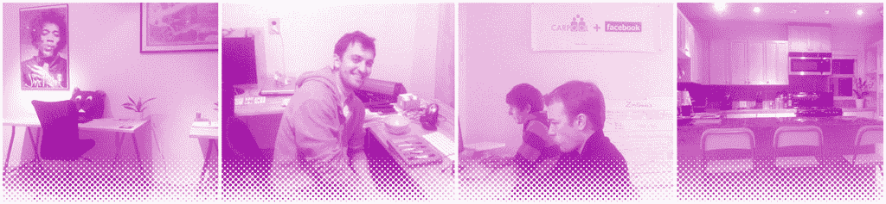
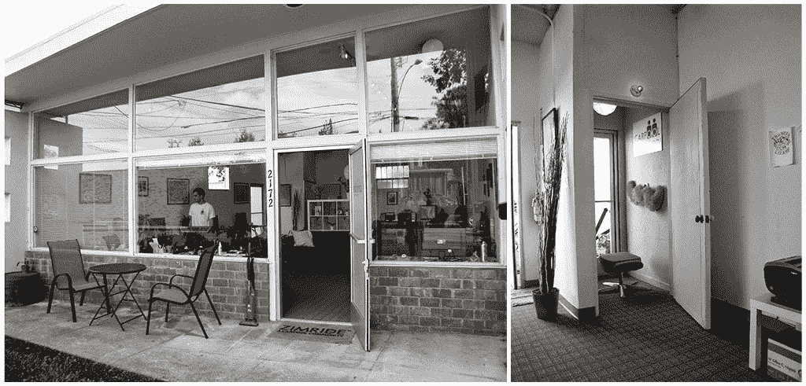
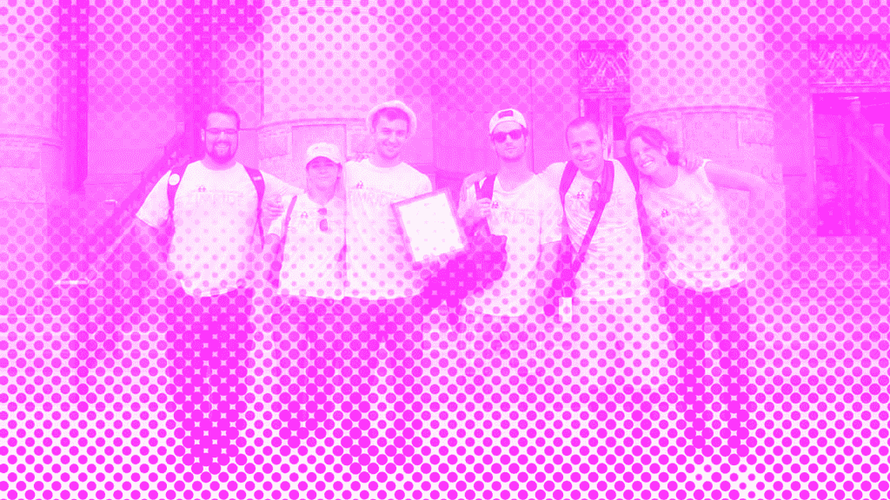
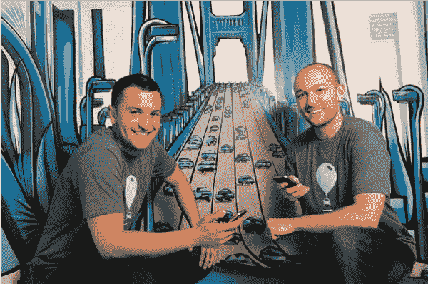

# Lyft-Off: Zimride 一夜成名的漫长道路 TechCrunch

> 原文：<http://techcrunch.com/2014/08/29/6000-words-about-a-pink-mustache?utm_source=wanqu.co&utm_campaign=Wanqu+Daily&utm_medium=website>

当约翰·齐默和洛根·格林在 2012 年春天推出一项名为 Lyft 的新拼车服务时，他们立刻意识到自己成功了。但情况并非总是如此。

在创建 Lyft 作为 hack-day 项目的一部分之前，这位 20 多岁的首次创业者花了五年时间创建了 Zimride，这是一种拼车服务，旨在帮助大学生在假期共乘回家。

当时，齐姆里德正处于身份危机之中。在多年向大学和企业出售企业许可证后，它决定进军消费者市场，并开放其平台供任何人预订拼车。

但是消费者的接受是缓慢的。尽管一些旨在刺激增长的实验失败了，但 Zimride 很难获得和留住新用户。因此，该团队决定是时候让他们在旅途中预订乘车服务了。

Zimride 通过推出其平台的移动网络版本在一定程度上实现了这一目标。然而，在提供移动体验，从根本上改变用户发现和共享乘车的方式方面，未来还有更大的机会。

经过一些试验后，他们推出了 Lyft，这款新产品不仅重新定义了他们的公司，还重新定义了人们想搭陌生人便车的方式。在某种程度上，这是约翰和洛根一直希望的。

早在 Zimride 之前，Logan Green 就想改变人们从一个地方到另一个地方的方式。他在南加州长大，周围都是独自开车的人。

洛根告诉我，“在洛杉矶，这是那种你必须有车才能四处走动的城市。”。“其他选择都很糟糕，你感到糟糕是因为你也是问题的一部分。但你也受到了这个问题的困扰。”

洛根去了加州大学圣巴巴拉分校，那里离他在洛杉矶的家很近。他在大学期间决定把车留在家里，并挑战自己通过拼车和公共交通的组合来出行。

多年来，洛根尝试了各种方式，包括灰狗、美国国家铁路客运公司和 Craigslist，试图搭便车回到洛杉矶，他当时的女朋友(也是未来的妻子)伊娃·贡达将在那里上大学。但是旅途并不总是一帆风顺。时不时地，他的 Craigslist 之旅会变得有点古怪，有一次，当一辆火车抛锚时，他被困住了。

在圣巴巴拉四处走动并不容易，所以当他有机会加入两个交通项目时，他欣然接受了。第一个是他所在的大学发起的一个类似 Zipcar 的汽车共享项目。当时，Zipcar 只存在于东海岸，所以洛根花了两年时间与大学合作，资助这项服务的家庭自制版本。学生们可以在网上注册，用 RFID 卡和通行码从一小队车辆中预订和解锁一辆车。

> 我们意识到，除非公众舆论有大规模的改变，否则 50 年后，公共交通看起来会和现在一样，甚至更糟。洛根·格林

洛根还被招募为圣巴巴拉大都会运输区(MTD)董事会最年轻的成员。正是在那里，他亲眼目睹了为什么美国大部分地区的公共交通都瘫痪了。像许多城市一样，圣巴巴拉正在亏损补贴乘客乘坐公交车的费用。在洛根担任董事会成员的近三年时间里，有两项重大举措付诸表决，以解决这一问题。第一个是提高票价的措施，第二个是增加销售税的建议，以资助当地的交通系统。在面临当地社区的严格审查后，两者都失败了。

洛根说:“我们意识到，除非公众舆论发生大规模的变化，否则 50 年后，公共交通看起来会和现在一样，甚至更糟。”。“当你看到未来的一瞥，却发现它变得更糟，或者至少在任何方面都没有改善，这总是令人失望的。”

如果说圣巴巴拉地铁站让洛根有理由质疑交通运输的未来，那么毕业后与朋友马特·范·霍恩(Matt Van Horn)的一次非洲之旅则给了他希望:津巴布韦当地人使用拼车来更有效地出行。

“街道很安静，因为没有人开车，政府忙于破坏这个国家，没有时间考虑提供公共交通等服务，”洛根说。因此，人们挤在共享的小型货车里，作为出行的一种方式。

“这是一个众包运输网络，任何人都可以成为司机，他们可以设定自己的路线，”他告诉我。洛根印象深刻的是，像津巴布韦这样的国家，他说“几乎没有资源”，在许多方面都比圣巴巴拉这样的富裕城市有更好的交通网络。当他旅行归来时，他开始着手改变这种状况。

2006 年秋天，脸书发布了其 API 的第一个版本[，让第三方开发者有机会基于其身份工具创建应用程序。Logan 开始使用它来建立一个在线平台，让用户可以找到并让其他人也可以拼车。](https://beta.techcrunch.com/2006/08/15/facebook-requests-developer-friends-with-new-api/)

他在津巴布韦的旅行激发了他将这个平台命名为这个拥有强大拼车文化的国家。齐姆里德出生了。

通过脸书，Zimride 为拼车增加了一种身份和信任，这是以前所没有的。与 Craigslist 和其他在线公告牌系统不同，Zimride 上的用户可以在上车之前将一张脸和一个名字联系起来。

Logan 在 2006 年 12 月与 Van Horn 合作，两人与几名兼职开发人员远程合作，充实该平台。脸书在大学生中越来越受欢迎，这帮助 Zimride 获得了早期的牵引力，因为他们中的许多人开始使用该服务来分享从学校回家的旅程。

2007 年 4 月，Zimride 在 Mashable 上获得了第一次新闻报道；一个月后，它成为社交网络 F8 开发者大会上发布的新 [Facebook 平台](https://beta.techcrunch.com/2007/05/24/facebook-launches-facebook-platform-they-are-the-anti-myspace/)的 100 个发布合作伙伴之一。不久之后，它引起了约翰·齐默(John Zimmer)的注意，他将与他们一起追求建立一个更值得信赖的社交拼车平台。

约翰·齐默遇见洛根的那天，他正在护理一个邪恶的宿醉，拿着一块冷敷布敷在头上。虽然他通常不喝酒，但前一天晚上他和一个朋友在东村的酒吧里闲逛。

跌跌撞撞地从一个酒吧走到另一个酒吧，约翰发现了他后来描述的挤在一辆白色奔驰车里的五个“泽西海岸长相的家伙”。约翰知道他第二天会遇到洛根，他想到了拼车，喊道:“嘿，不错的拼车！”

汽车停下来，约翰很快被五名乘客包围了。他试图让他们相信他不是在讽刺他们——他对拼车感兴趣，而且他真的认为他们一起乘车很棒。

没用。其中一个家伙从后面打了他一拳，这群人迅速跑回汽车，而约翰在人行道上看着。

洛根在第一次见面时就听到了这个故事，很明显，约翰深深地致力于同样的事业。不过，虽然洛根对拼车的兴趣来自于他在南加州的成长经历和他在当地政治的经验，但约翰的追求更具学术性。

在康乃尔大学，约翰上了一门名为“创造绿色城市和可持续未来”的课，老师是罗伯特·扬教授。在这一学期的课程中，杨带领学生经历了几个世纪以来城市基础设施的变化，并挑战他们想象未来使城市生活可持续的必要转变。

其中一次会议集中讨论了交通运输，并绘制了历史上人类出行的不同方式，包括运河、铁路和高速公路。在每一种情况下，这些路径都像动脉一样蔓延，将不同的城镇连接在一起。

但在约翰看来，物质基础设施不是问题。作为该大学酒店管理学院的学生，他关心的关键指标是路上车辆的占用率。大约四分之三的座位没有被使用，他认为解决低效问题的关键是建立某种信息基础设施。

这就是他在 Zimride 发现的，他第一次听说 Zimride 是在他的一个脸书朋友分享了一个网站链接的时候。这引起了他的注意，因为这个概念与他一直记下来的想法相似。他说，这也引起了他的注意，因为该服务的名称恰好包括他姓氏的前三个字母。约翰得到了洛根的介绍，尽管他在第一次见面时宿醉未醒，两人还是决定联手。

他们会成为一对有趣的搭档。洛根所谓的嬉皮士父母把他送进了一所极端自由的高中——那种通过班级旅行到血汗工厂帮助学生发现自我的学校——而约翰在康涅狄格州斯坦福德的中上阶层郊区长大，上的是公立学校。

洛根沉默寡言，但约翰可能热情洋溢，喋喋不休。虽然洛根把他的反馈留到真正重要的时候，但约翰是那种会讨论问题并试图找到解决方案的人。

然而，他们合作得非常好。在 Zimride，Logan 负责所有的产品和工程，而 John 负责市场营销和业务开发。两人对业务中正在发生的事情都同样了解，并且在如何前进的问题上基本一致。

当与约翰和洛根交谈时，他们似乎有共同的大脑，偶尔会结束彼此的句子。对于一些投资者来说，看到两位如此合拍的联合创始人令人耳目一新。但对其他人来说，这令人担忧——很少有人愿意押注于一个本质上有两位联席首席执行官的团队。

不过，在那个时候，他们两人都没有准备好成为全职企业家。在 2007 年和 2008 年初的大部分时间里，Zimride 作为一个副业项目存在，两人与其他一些合作者一起工作。

从加州大学圣巴巴拉分校毕业后，洛根在大学管理绿色倡议基金(TGIF)，该基金旨在投资环境项目。与此同时，约翰在雷曼兄弟公司担任分析师，构建房地产模型。

尽管他们没有全职从事 Zimride 的工作，但他们仍然为这家年轻的公司找到了一个可行的商业模式。在看到 Zimride 被大学生持续采用后，他们决定将大学作为目标客户。Zimride 将向每所学校注册的前 50 名学生免费提供其平台，但之后它将试图与大学签订合同，使 Zimride 成为他们的在线骑行平台。

> 我想他很难相信有人会为他的工作给他钱。Zimride 投资人 Sean Aggarwal

在 Zimride 在 Mashable 上发表个人简介后不久，Logan 开始收到一个名叫 Sean Aggarwal 的家伙发来的电子邮件，他对投资很感兴趣。阿格沃尔当时是易贝的财务副总裁，偶尔也是一位天使投资者，他希望把投资拼车公司作为他的投资主题之一。

当时，Aggarwal 还没有太多的网站，2007 年的 LinkedIn 也不是今天的样子。此外，洛根从来没有筹集到任何资金，并发现奇怪的是，有人会有兴趣为他的宠物项目写一张支票。事实上，他认为这些邮件是精心策划的 419 骗局的一部分。

他最终同意与阿格沃尔见面，但有两个条件:第一，他们在公共场所见面，第二，他们不会单独见面。他们在一家可可餐厅相遇，范·霍恩尾随其后以确保一切顺利。

事实证明洛根的担心被夸大了。他和阿格沃尔一拍即合，当天聊了大概两个小时。更重要的是，Aggarwal 同意对 Zimride 进行第一笔天使投资。

不过，首先，阿格沃尔说他需要确保洛根是他所说的那个人。所以在同意交出投资之前，他在犯罪背景调查、性犯罪者调查和其他一些数据库中搜索了洛根的名字。

归根结底，这是值得的。Zimride 有了第一个投资者，Aggarwal 开始每周和 Logan 一起工作 5 到 10 个小时。随着时间的推移，他将成为洛根最亲密的导师和最信任的顾问。

“我想他很难相信有人会为他的工作给他钱，”阿格沃尔回忆道。“钱的数量不多。我认为这不是数量的问题，而是验证的问题。这是因为除了他之外，还有人相信他所做的事情。”

现在，齐姆里德在银行里有些钱，但约翰和洛根不知道该怎么花。阿加瓦尔投资的第一批商品是青蛙和海狸的服装，每件 30 美元。

这些服装被认为是“营销费用”，男生们在大学校园分发宣传 Zimride 的传单时会穿这些服装。

约翰当时仍在雷曼工作，一个周末，他被要求返回康奈尔大学参加校园招聘活动。约翰提前几天来到学校，他和一个朋友装扮成这种服装来吸引人们对齐姆里德的兴趣。

这些服装大受欢迎，吸引了许多学生报名。一切都很好，直到几天后在雷曼兄弟的招聘活动中，一名学生走向站在他老板旁边的约翰，问道:“几天前我是不是看到你穿着海狸装？”

很快，约翰就有了一个退出金融游戏的理由，开始全职从事 Zimride 的工作。2008 年夏天，该公司和其他一些早期的脸书 API 合作伙伴获得了 25 万美元的资助，继续在该平台上进行开发。

有了额外的资金，约翰准备搬到全国各地，但其他人有他们的疑虑。"你怎么能离开像雷曼这样稳赚不赔的公司去做一个疯狂的拼车创业呢？"约翰回忆起他告诉一个朋友的母亲他的计划后，她说。

那是 2008 年 8 月。次月，雷曼兄弟破产后不久，全球金融危机爆发。约翰已经搬到了帕洛阿尔托，他把这次旅行作为 Zimride 的营销机会，当时很少有人听说过它。他和其他三个人没有把他的东西空运或海运到西海岸，而是分享了一次从纽约到湾区的跨州 Zimride 之旅。美国广播公司世界新闻报道了这次旅行。

廉价的服装并不是 Zimride 公司在尽可能少花钱的情况下发展的唯一途径。

齐姆里德工作的第一间办公室勉强够容纳四个人，但约翰和洛根却能在这件事上做一笔很好的交易。它位于帕洛阿尔托大学大道几个街区外的一栋建筑里，后来因为不符合抗震建筑规范而被拆除。

尽管有一间办公室和几名员工，24 岁的约翰还是对成为全职企业家感到不安。“我们真的不知道我们在做什么，当时感觉很疯狂。我还不太觉得自己是个成年人，”约翰回忆道。

对于他们的第二个办公室，他们称之为“公寓”，约翰和洛根租了一个公寓，他们也将作为工作的地方。它有一个大客厅，有六张桌子和两个卧室——一个是洛根睡的，另一个有一个沙发，被用作偶尔的会议室或任何来访或工作到很晚的人的临时住所。

为了节省生活开支，约翰在搬进朋友的父母家之前，在沙发上睡了大约六个月。但是洛根一直住在公寓外面，直到齐姆里德住不下了，有了足够的钱搬进一个合适的办公室。

2010 年， [Floodgate](http://www.floodgate.com/) 的安·米乌拉-科正在寻找“交通工具的 Airbnb”她错过了 Airbnb 的种子融资，但她相信，在其他几个垂直领域，同样的 P2P 模式是有意义的。

她和 Floodgate 已经投资了几家市场公司，但他们看到了运输行业的巨大机会。这是在优步、RelayRides 和 Getaround 之前，那时 Zipcar 是唯一一家成功的改变人们出行方式的科技公司。

但是她真正要寻找的是“雷电蜥蜴”受电影《从放射性卵中孵化出的怪物哥斯拉》(Godzilla)的启发，雷霆蜥蜴闸门寻找的是他们认为“来自不同类型 DNA”的企业家，他们可能会扰乱一个行业。

对于一个局外人来说，约翰和洛根可能不像是那种会摧毁建筑物或造成大破坏的人，但米乌拉-科对他们改变交通运输本质的愿景很感兴趣。即使别人不太确定，她也能从他们身上看到希望。

“约翰和洛根认为很多风投太好了，”米乌拉-科告诉我。“但归根结底，这是一个特性，而不是一个缺陷。如果没有那个组件或特征，Lyft 就不会诞生。”

最后，洛根的创始故事引起了她的共鸣，因为她也去过津巴布韦，看到了拼车在那里有多么重要。米乌拉-科决定与 K9 Ventures 的马努·库马尔(Manu Kumar)一起投资 Zimride 的种子期项目，他们在约翰和洛根搬到帕洛阿尔托大约一个月后见过面。

> 约翰和洛根认为很多风投太好了，但归根结底，这是一个特点，而不是一个缺陷。没有那个… Lyft 就不会诞生。<cite>安·米乌拉·科，Zimride 投资人</cite>

当时，Zimride 还没有一个合适的办公室，也没有任何地方可以让创始人和投资者见面。他们没有挤进公寓，而是聚集在斯坦福大学芒格大厅研究生宿舍的大厅里。

约翰、洛根、米乌拉-科和库马尔就是在这里召开了他们的第一次董事会议。在那个夏天，“T0”结冰成了一件事。作为礼物，约翰和洛根包装了两瓶斯米尔诺夫冰，送给他们的新投资者。库马尔优雅地[单膝跪地](http://www.theawl.com/2010/05/guest-op-ed-why-bros-get-iced-bro)并放下他的。当时已经怀孕的米乌拉拒绝了。

她还留着那瓶 Smirnoff 冰，说等公司 IPO 再喝。

Zimride 已经三岁了，收支平衡，团队已经与几十所大学签约，包括 10 所加州大学中的 9 所，以获得其在线骑行板的许可。它还让许多公司将其平台提供给员工使用，以建立拼车服务。

企业业务稳定且可预测，产生经常性收入并不断增长，但 John 和 Logan 有更大的野心。虽然向企业客户销售利润丰厚，但这并不性感。他们的主要目标是提高道路上所有汽车的占用率，为此，他们决定向普通消费者开放 Zimride。

当时在梅菲尔德的拉兹·卡普尔站出来帮忙。他领导了该公司对 Zimride 的投资，作为其 600 万美元首轮投资的一部分。厌倦了做全职投资者，渴望重返创业游戏，他每周花大约一天时间与他投资过的几家公司呆在一起，包括 Zimride。

Zimride 用一个任何人都可以使用的新拼车门户网站取代了之前针对企业的主页。即便如此，消费者的接受并没有他们希望的那么快。

“我们希望人们会回来并再次使用它，但这些类型的旅行人们一年只会去一次或两次，”约翰说。“当时，我们知道有很多变量，但我认为我们没有足够快地权衡频率的重要性。”

在接下来的六个月里，Zimride 进行了大量的实验，试图让更多的用户注册并更频繁地使用这个平台。它推出了旧金山和洛杉矶等热门目的地之间的线路，有时约翰或洛根会开着小巴；它与当地公交公司合作，接送通勤者；而且它[推出了手机网站](https://beta.techcrunch.com/2012/04/05/zimride-goes-mobile/)。

路线图上的下一个是移动应用程序，但工程师们对构建另一个很少有人使用的产品变得小心翼翼。他们有理由担心，因为过去所有的实验都需要工程技术的帮助才能启动和运行。然而，它们都没有产生大量的收入，也没有说服许多 Zimride 用户回来更频繁地使用该平台。

约翰和洛根知道，团队对创建移动 Zimride 应用程序不感兴趣是一个不好的迹象，所以他们做了可能是任何工程组织最难做的事情——他们停止了工作。

Zimride 的黑客日到来的时候，还不清楚该团队将如何前进。但是，他们没有开发一个没有人有信心的本地应用，而是寻求团队更感兴趣的新想法。

John 和 Logan 与新的移动产品负责人 Frank Yoo 一起工作，头脑风暴移动应用程序的想法，这些想法将吸引使用 Zimride 平台的消费者。

这些想法中的第一个是名为“在路上”的产品，它允许用户提醒朋友他们从哪里出发，并给出他们到达的估计时间。接下来是一个叫做“旅程”的东西，它使用户能够通过照片、视频和他们沿途听的音乐来记录一次公路旅行。

但是第三个想法是明显的赢家。它被称为 Zimride Instant，与优步类似，用户可以通过手机请求搭车。但是，Zimride Instant 没有像优步那样使用有执照的司机，而是依靠社区成员在镇上互相搭车。

Zimride Instant 是其员工真正想要使用的产品。也许更重要的是，它与约翰和洛根的使命相一致，即让更多的人挤进已经上路的汽车，并提高它们的占用率。

一旦他们决定继续开发产品，是时候提醒团队的其他成员了。约翰和洛根与公司的工程师开了个会，宣布了这个计划。

有人举手了。

“你衡量成功的标准是什么？”他们问。“如果你不击中它，我们什么时候可以关闭它？”

> 当我们设计 Lyft 体验时，我们认为我们正在设计一个有趣、独特的酒店。我们在想，‘我们如何将快乐和幸福融入每一个生活？’约翰·齐默

这是一个合理的担忧。Zimride 在关闭失败的实验方面表现很差，但约翰和洛根不相信这将是其中之一。他们询问首席工程师 Sebastian Brannstrom 需要多长时间来确定新产品的规格。“大约两个月，”他回答说。他们告诉他两周内完成。

洛根、尤和布兰斯特罗姆开发了产品背后的技术，而约翰则致力于定义游乐设施本身的用户体验。设计两个人之间的离线交互并不像围绕一个移动应用建立导航流那么简单。然而，约翰有他在酒店的背景来帮助指导他。

“当我们设计 Lyft 体验时，我们认为我们正在设计一个有趣、独特的酒店，”约翰回忆道。“我们在想，‘我们如何将快乐和幸福融入每一个 Lyft？’"

该团队希望将新产品定位为独立于现有的 Zimride 服务，因此它放弃了“Zimride Instant”的名称，并将其命名为“Lyft”。这款应用的最初版本设计得很友好，有一种近乎卡通的感觉。

然而，除了应用程序之外，还特别强调让乘车服务反映公司的价值观。创始人不希望这种体验像出租车或优步之旅，乘客坐在后面，不与司机互动。毕竟，Zimride 是关于社区的，他们决心确保它保持这种方式。

由于乘客坐在前排，约翰认为这种体验更像是和朋友一起乘车。考虑到这一点，他们选定了“你有车的朋友”的口号来定义这项新服务的社交性质。

然而，是洛根在争辩说乘客不想握手后，想出了撞拳的主意。“没人想担心手心出汗，”他说。

2010 年，约翰听说了 [carstache](http://www.carstache.com/) ，这是一种模糊的、颜色鲜艳的装饰物，司机可以挂在他们的车上。作为玩笑，他甚至给他的投资者和顾问发了一些。对于 Lyft，他认为 carstache 是一种严肃的方式，可以让人们谈论这项新服务，并给司机和路人带来微笑。

尽管团队中的一些成员认为在司机的汽车上贴上粉红色的胡子很疯狂，但这很快就会成为这项新服务最具定义性的特征。

如果乘客不喜欢和陌生人一起乘车，这些都不重要。在那之前，还没有人试水点对点乘车服务——即使是优步也没有，它只使用商业许可的司机。

约翰和洛根知道安全是用户信任和采纳的关键，他们与 TaskRabbit 创始人 Leah Busque 进行了交谈，他们是通过 fbFund Rev 孵化器认识的。他们问她的公司是如何审查签约在该平台上完成任务并实施类似系统的承包商的。

Lyft 将要求其所有司机进行彻底的犯罪和司机背景调查。然而，更重要的是提供乘车服务的人的个性。该团队招募了评价很高的 Zimride 用户作为他们的第一批司机，John 和 Logan 对每个进入该系统的新司机进行面试。

三周后，洛根和他的妻子伊娃申请了第一辆 Lyft。他们刚刚搬到 Pac Heights，并使用该服务将他们从 SOMA 的 Zimride 办公室带到他们社区的 Lion 酒吧。然而，当他们到达酒吧时，他们决定不进去了。这次旅行很成功，但洛根觉得还有更多工作要做，于是就回到了办公室。

在约翰和洛根提交 Lyft 时，Zimride 的董事会已经习惯了他们不断的实验。他们支持引入路线、公交伙伴关系和其他新产品，以增加公司的使用率。但是他们对乘客是否愿意乘坐陌生人的车有疑问。

Lyft 能与出租车甚至优步竞争吗？后者的用户已经习惯了。在这方面，通常说话温和的洛根做出了不同寻常的强烈回应。

“你在开玩笑吗？它更实惠，更安全，体验更好…如果我们能做到这一点，毫无疑问这项服务会有需求，”他告诉董事会。

人们拼车已经很多年了，他们一生都和陌生人一起乘坐出租车和黑车。他们认为，如果有什么不同的话，坐在前面与司机交谈会创造更好的用户体验。他们得到了批准，Lyft 也上路了。

在向一群精选的朋友和家人推出八周后，Zimride 的新任沟通总监艾琳·辛普森邀请科技媒体的成员了解新产品。

辛普森几个月前刚刚加入 Zimride，担任这家初创公司的新角色。在那之前，大部分媒体和营销都是由约翰负责的，这是她第一次发布重要产品。

计划是让当地科技媒体在周四晚上与 Zimride 社区的创始人和成员见面。通过电子邮件，辛普森要求与会者将新闻保留到下周。但是出了点问题，一位与会者写了那晚的活动。

那是我第一次见到约翰、洛根和 Zimride 团队的其他成员。他们的远见和新产品给我留下了深刻的印象，我迫不及待地想使用。但是当我第二天早上看到禁运被打破时，我很矛盾。

12 小时后我不想再跟别人报道了。因此，我没有写 Lyft 的发布，而是写了这个[发布是如何被“毁掉”的](https://beta.techcrunch.com/2012/08/24/the-lyft-launch-that-coulda-been/)

辛普森呆呆地盯着她的屏幕，洛根在她身后读着故事。“你说‘毁了’是什么意思？怎么会这样？”洛根问道，然后气冲冲地走了。辛普森确信自己坚持不了多久了，于是她在街区周围散了散步，让自己的神经平静下来。

这篇文章引起了轩然大波，但是我关于这次发射是如何被“毁掉”的故事只是让更多的人知道了这件事。几天后，我决定[写一下这次发射到底](https://beta.techcrunch.com/2012/08/25/lyft-san-francisco-launch/)。与此同时，Lyft 被其他媒体采用，包括主流出版物，如[时代杂志](http://business.time.com/2012/09/04/need-a-lyft-ride-sharing-startup-zimride-hits-the-gas-pedal/)。

“我认为，总的来说，结果是净阳性，”尘埃落定后，约翰告诉我。这不是 Zimride 所希望的发射，但它至少让人们开始谈论。

它也让人们使用这项服务。在花了五年时间试图让人们共乘汽车后，Zimride 终于找到了一种可行的模式。它如此受欢迎，以至于几个月后 Lyft 不得不[增加一个等待名单](https://beta.techcrunch.com/2012/10/18/lyft-waitlist-cancellation-fee-etc/)，因为它跟不上需求。

Lyft 的早期成功是一股新鲜空气，但它在部队中引起了一些混乱。最初的产品是由一小群工程师开发的，但现在公司的每个人都想开发这个闪亮的新东西。然而，由于有 150 多个付费客户，约翰和洛根知道他们不能忽视齐姆里德。

还有一个更大的问题悬而未决:Zimride 的未来是什么？它是团队花了五年时间构建的产品，还是三周黑客项目的结果？

事后看来，约翰和洛根会选择哪条路似乎是显而易见的，但当时并非如此。他们花了大约一个月的时间讨论如何重组公司以适应新产品，并向董事会和顾问征求意见。

决定公司未来的压力正在损害约翰的健康。由于一群员工依赖他，而且他需要给投资者留下深刻印象，约翰开始出现可怕的偏头痛，似乎不知道从哪里来的。它们影响了他思考和工作的能力，而且随着时间的推移只会变得更糟。他首先去看了他的初级保健医生，但最终被转到医院进行脑部扫描。即便如此，没人能发现他身体上有什么毛病。

经过一番深思熟虑后，创始人决定继续支持 Zimride，但由少量销售支持人员负责运营。其他 90%的员工转到 Lyft 工作，他们认为这是一个更大的整体机会。在大约一个月无法集中注意力后，约翰的头痛消失得和开始时一样神秘。

因此，Lyft 不再仅仅是 Zimride 创造的一种产品，而是该公司的主要关注点。2013 年 5 月，该公司通过将[重组为 Lyft](https://beta.techcrunch.com/2013/05/09/zimride-no-more-lyft-chicago/) 而正式实现了这一转变。

知道他们不能永远支持 Zimride，创始人开始寻找收购其遗留业务的人。2012 年末，约翰和洛根开始接触业内人士，看看他们能引起什么兴趣。

在接下来的几个月里，他们确定了 Zimride 的四个潜在买家。在这个过程的最后，Lyft [决定将 Zimride](https://beta.techcrunch.com/2013/07/12/lyft-zimride-enterprise/) 出售给企业控股公司。

约翰通过多年来参加各种运输会议了解了企业团队。然而，这不仅仅是钱的问题——Enterprise 有一个货车拼车业务，他们认为可以从 Zimride 的资产中受益。有了它们，这家汽车租赁集团可以在已经开发的基础设施上增加许多新客户和一些软件。

Zimride 的成立确实导致了某种形式的退出，尽管这并不是创始人或早期投资者所期待或希望的。它在企业交易中获得的资金回到了战争基金，以帮助资助 Lyft 的扩张。

随着销售的结束，约翰和洛根作为 Zimride 创始人的六年旅程宣告结束。但是他们在 Lyft 的工作才刚刚开始。

在 Zimride 出售的时候，Lyft 在六个城市有售。自那以后，它已经扩展到美国近 70 个市场，但随着 Lyft 的快速扩张，超快速的增长也带来了许多挑战。

这场斗争的一部分是监管方面的，Lyft 不得不应对其新服务受到的越来越多的审查。似乎在每一个新市场，P2P 模式都面临着来自全美强大出租车游说团体的压力。

在加州和西雅图等地，it 和其他拼车公司已经与监管机构合作，为他们的服务建立一个新的框架。即便如此，一些当地立法者仍然试图关闭其服务，因为他们声称这是一个公共安全问题。

然而，该公司最大的挑战来自与市场领导者优步的竞争。在许多方面，优步帮助 Lyft 铺平了道路，让消费者习惯了通过移动应用程序雇佣司机的想法。但是，尽管它为市场中的其他参与者打开了大门，优步已经积极地采取行动来消灭竞争对手。

Lyft 可能是地面交通点对点模式的先驱，为优步和当地出租车服务提供了一种低成本的替代选择。然而，优步[很快复制了它](https://beta.techcrunch.com/2012/09/12/uber-ride-sharing/)，通过雇佣自己的[非商业执照司机队伍](https://beta.techcrunch.com/2013/04/12/uber-ride-share-almost-everywhere/)来与新进入者竞争。

过去两年，优步和 Lyft 一直在争夺各自运营城市的市场份额。在过去的一年里，通过一场激烈的价格战来吸引用户，也通过一场为每项服务招募和留住司机的战斗，这一切都在上演。在许多情况下，司机都保持两个应用程序打开，以获得更多的乘坐。

鉴于优步的早期领先地位——甚至在 Lyft 在三藩市推出之前，它就已经在几十个市场领先了——以及它在过去四年中筹集的[资金量](https://beta.techcrunch.com/2014/06/06/uber-1-2b/)，Lyft 不太可能在短期内超越它。然而，城市交通市场是巨大的，有充分的理由相信多个参与者可以共存。在美国的许多地方，Lyft 都稳坐第二把交椅。

它还在一些你可能不认为是高密度城市的市场中被采用——想想像罗德岛普罗维登斯这样的地方，这表明它的模式可以扩展到更多的郊区，帮助人们出行，即使是在汽车目前无处不在的地方。

虽然 Lyft 在随处可用之前还有很长的路要走，但它最近的实验也可能是最重要的。其按需拼车服务 Lyft Line 在旧金山的推出，使其向减少道路上的汽车数量又迈进了一步。

通过 Line，该公司将多名乘客配对成一辆车。该产品让更多人乘坐每辆 Lyft，并降低所有人的价格，这可能会带来共同的好处，即增加需求，提高入住率，减少用户独自通勤的需求。

就这样，约翰和洛根似乎终于注定要完成他们的建国使命。

