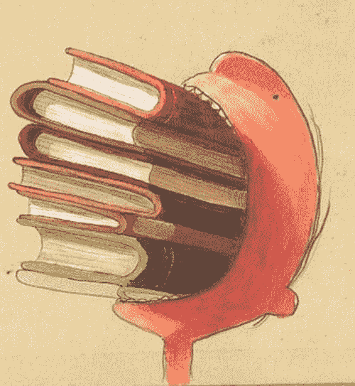

# 如何提高你的产品和设计品味

> 原文：<http://thenextweb.com/dd/2014/04/03/eat-improve-product-design-taste/?utm_source=wanqu.co&utm_campaign=Wanqu+Daily&utm_medium=website>

* * *

在一个数据驱动的世界里，品味是少数难以商品化的品质之一。它也是设计师、产品经理、开发人员、企业家、艺术家和各类创作者在工作中最重要的资产之一。

设计师巴里·史密斯[写道](https://medium.com/web-design-technique/9375ce2c99fd)“你的天赋永远不会超过你的品味。”对于任何天生没有味觉倾向的人来说，挑战在于如何培养它。

多样性通常有助于提升品味。我们希望美食评论家们拥有精致的调色板，亲身体验过世界各地许多不同的食物。不幸的是，这并没有转化为我们的思想和品味；[过滤泡沫](https://www.ted.com/talks/eli_pariser_beware_online_filter_bubbles.html)我们自己根深蒂固的习惯性，已经让我们更容易反复消费和消化同样的东西。

[

<noscript></noscript>](https://thenextweb.com/wp-content/blogs.dir/1/files/2014/04/jobs.jpg) 

苹果和皮克斯的创始人史蒂夫·乔布斯，可以说是上个世纪最有设计品味的人之一，曾经在接受《连线》采访时说:

> 创造力只是把事物联系起来。当你问有创造力的人他们是怎么做一件事的时候，他们会觉得有点内疚，因为他们并没有真的去做，他们只是看到了一些东西。过了一会儿，他们似乎明白了。这是因为他们能够将他们的经历联系起来，并综合新的东西。他们能够做到这一点的原因是他们比其他人有更多的经历，或者他们对自己的经历思考得更多。

不幸的是，这种商品太稀有了。我们行业中的很多人都没有非常多样化的经历。所以他们没有足够的点来连接，他们最终得到非常线性的解决方案，而没有对问题的广泛视角。一个人对人类经验的理解越广，我们的设计就越好。

乔布斯从整个人类经历的角度进行了广泛的思考。试图在一篇文章中涵盖所有这些内容是愚蠢的；相反，我更喜欢探索某些有助于提升精神品位的领域。就像食物评论家强调质地和味道这样的标准一样，你可以使用某些类型的媒体来发展你的口味:

### **你是你所读到的人**

> 当然是心灵感应。当你停下来思考这个问题时，这很有趣——多年来，人们一直在争论这种东西是否存在，像 J. B. Rhine 这样的人绞尽脑汁试图建立一个有效的测试过程来分离它，而它一直就在那里，就像坡先生被盗的信一样躺在外面。
> 
> ——斯蒂芬·金，[写作时](http://user101.tccc.cc.nc.us/Swood/111/KingonWriting.htm)

很难忽视写作和阅读。文字是网络的基本要素之一。阅读对于二手学习尤为重要；这是我们从现在到过去，或者到一个潜在的未来的最接近的运输方式。

这种经历有助于我们将不同寻常的点联系在一起，这让我们更有创造力(恕我插一句时髦的话——创新)。

[

<noscript></noscript>](https://thenextweb.com/wp-content/blogs.dir/1/files/2014/04/eating-books.jpg) 

像听演讲或谈话一样对待阅读；这两种活动都是为了获取信息。接触这些不同类型的经历和想法对提升品味至关重要。

阅读也对我们看待世界的视角产生巨大的影响。正如营销人员兼作家查理·赫恩(Charlie Hoehn)所写的那样，“当我承诺将新闻从我的生活中彻底剔除时，我的焦虑在不到两周的时间里直线下降。”

阅读帮助我们提升认知品味。我们并不总是有足够的时间进行适当的过滤和思考——以至于作者[阿兰·德波顿总结得很好](https://twitter.com/alaindebotton/status/383459391338721280):

> 厨师:让别人忙得没时间准备食物。作家:表达别人太专注而无法表达的想法。

### **产品管理味道**

> 我记得史蒂夫是我在加州伍德赛德的邻居，他没有家具。我突然意识到世界上没有对史蒂夫来说足够好的家具。如果他不能拥有完美，他宁愿一无所有。我和史蒂夫的不同之处在于，我愿意和世界上最好的人一起生活。对史蒂夫来说，这并不总是足够好。
> 
> –拉里·埃里森，甲骨文公司的联合创始人兼首席执行官

好的品味并不总是带来最快乐的结果；事实上，好的品味是在追求完美，这是一个永远难以实现的目标。最优秀的产品经理理解并能够用乔布斯的名言来平衡完美:“真正的艺术家会带来真正的艺术。”

为了培养你对产品的品味，Y-Combinator 创始人[保罗·格拉厄姆写道](http://www.paulgraham.com/taste.html):

> 和任何工作一样，当你继续设计东西时，你会做得更好。你的品味会改变。而且，像任何在工作中变得更好的人一样，你会知道你正在变得更好。如果是这样，你以前的品味不仅不同，而且更差。味道不会错的公理不攻自破。

无论是通过外部验证还是内部直觉，简单地获得更多的产品经验——无论是通过工作还是通过交谈，或者是[副业](http://busybuildingthings.tumblr.com/post/68179351955/start-something-the-power-of-side-projects)——都将有助于提升你的品味。

对于那些想加速发展自己品味的人来说，脸书产品设计总监[朱莉卓](https://twitter.com/joulee) [写道](https://medium.com/the-year-of-the-looking-glass/dc3aaad8c27c):

1.  按照正确的优先顺序对正确的事情进行评论:不要评论视觉效果或修饰，除非不能对功能和流程进行评论。
2.  对自己的工作持批评态度:“如果有什么不同的话，设计师应该对自己的工作比对别人的更挑剔，因为他们对自己的工作更熟悉。"
3.  给予批评，并提出一系列有益的改进建议:如果你不提供替代方案或改进建议，你就是在帮倒忙。
4.  保持高标准:想办法改进最成功的应用程序，不要害怕箭少柴多。

接触新的应用程序，除了可能的功能集和流程，以及验证这些想法的专家反馈，将帮助您完善您的品味。

### **人与教育**

> 品味是通过与他人接触而获得的。你通过不断的锻炼使它成为你自己的。如果你能和一个品味完美的人交往，你是幸运的。但不要自称对什么都不满意；这是一个愚蠢的极端，如果是出于做作，比出于性格更令人厌恶。有些人希望上帝创造了另一个世界和其他完美，只是为了满足他们自己奢侈的想象力。
> 
> –巴尔塔沙·葛拉西安，[作家兼哲学家](http://community.fortunecity.ws/roswell/vortex/401/library/aoww/aoww03.htm)

[

<noscript></noscript>](https://thenextweb.com/wp-content/blogs.dir/1/files/2014/04/tumblr_inline_n2aimzq8r11qzc4w7.png) 

Artistotle was mentored by Plato which had a strong influence on his taste and way of thinking.

作为企业家和作家 [，吉米·罗恩写道](https://www.goodreads.com/quotes/1798-you-are-the-average-of-the-five-people-you-spend) “你是和你相处时间最长的五个人的平均值。”

与他人一起培养你的品味需要态度的转变:你是一个热情的学生，他人是你的老师。

Basecamp 的合作伙伴 David Heinemeier Hansson 写了关于发展品味的文章:“发展眼光、发展品味需要决心和奉献，但这是完全可能的。有些人可能是天生的，但任何愿意做学生的人都可以做到。”

同样，屡获殊荣的音乐家、设计师和艺术家[法瑞尔·威廉姆斯在一次 Design Miami 采访中对坎耶·韦斯特](https://www.youtube.com/watch?v=1tYvnV_mz6g)说:“老实说，只要和合适的人在一起，不怕学习，不要觉得自己无所不知。这是有史以来最伟大的教训之一。”

乔布斯将他最重要的学习课程之一归功于一种更正式的教育方式:“我学习了衬线字体和三衬线字体，学习了不同字母组合之间的间距，学习了什么让伟大的排版变得伟大。这是一种科学无法捕捉的美丽、历史和艺术上的微妙，我觉得它很迷人。”

第一步是开始寻找这些老师是谁。虽然你可以从每个人身上学到一些东西，但并不是每个人都有资格成为你特定领域的老师。

如果你不知道他们是谁，那就从业内最受认可的公司和领导它的设计师或产品经理开始。我通常密切关注行业出版物；如果他们的采访主题让我感兴趣，我会深入挖掘。你也可以从[十大榜单或行业奖项获得者](https://medium.com/the-year-of-the-looking-glass/d7d9f069f0b2)开始。

如果你没有机会见到他们，你可以通过阅读他们的博客帖子和采访，或者在社交媒体上关注他们来了解他们的想法。开始尝试理解他们的价值观；确定他们在产品、设计或创业中寻找什么，并了解你当前的品味和你的专家的价值观之间的差距。

> 我们可以把知识等同于食物。老师可以提供任何种类的食物。食物的质量可能好也可能坏，取决于老师的能力。但是我们吃什么取决于我们的口味。我们最终吸收的东西取决于我们的消化能力。所以我们学到的东西既取决于老师教的东西，也取决于我们自己。
> 
> –dev dutt pattan aik 博士，[消化能力](http://devdutt.com/articles/indian-mythology/the-ability-to-digest.html)

### **结束语**

品味是一种非常值得培养的品质。事实上，品味对于任何领域的卓越都至关重要。理解你应该渴望什么，以及你不优先考虑什么的能力，将带来一种新的清晰形式，帮助你集中注意力。

记住，你吃什么就是什么——阅读各种各样的书籍，评论和消化产品，并明白总是要向你所在领域的专家学习。