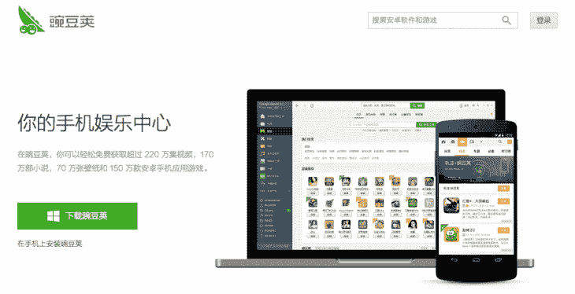
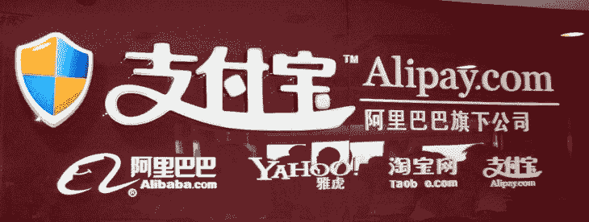

# 中国的移动生态系统与西方有何不同

> 原文：<http://thenextweb.com/asia/2014/08/26/wechat-and-third-party-android-app-stores-how-chinas-mobile-ecosystem-is-different-from-the-west/?utm_source=wanqu.co&utm_campaign=Wanqu+Daily&utm_medium=website>

中国是全球最大的智能手机市场，随之而来的是人们对手机用户行为的极大兴趣。作为消费者获取内容的主要方式之一，应用尤其是一个重点关注的领域。

对于不熟悉其工作方式的人来说，中国的应用生态系统有点像迷宫。就 iOS 而言，苹果应用商店在中国的存在使得追踪变得相当简单，但对于安卓而言，就要复杂得多。在 Google Play 于 2010 年退出中国后留下的真空中，数百家第三方 Android 应用商店如雨后春笋般涌现。不过现在已经缩小到六大店左右: [360 Market](http://zhushou.360.cn/) ，百度旗下 [91 Wireless](http://www.91.com/) ， [UCWeb](http://www.ucweb.com) ，腾讯的 [MyApp](http://android.myapp.com/) ，小米的 [Mi Market](http://app.mi.com/) ，以及[万豆家](https://www.wandoujia.com/)。

### 微信驾驶 app 行为

在这一切当中，流行的信息服务微信极大地推动了中国 iOS 和 Android 手机用户的行为。这是应用排名和市场情报公司 App Annie 亚太区副总裁于俊德的个人观察。

[

<noscript></noscript>](https://thenextweb.com/wp-content/blogs.dir/1/files/2014/05/wechat-645x2501.jpg) 

App Annie 目前没有整合中国第三方安卓应用商店的数据，不过有计划在明年初整合这些数据。在 iOS 收入方面，中国已经稳步攀升至全球第三。俞敏洪在最近的一次采访中告诉，这种在应用上的消费趋势可以归因于微信的影响。这不仅是因为微信庞大的用户群——最近它的月活跃用户突破了 4.38 亿，还因为它向用户介绍了休闲游戏。

于指出，微信上的移动游戏基本上开启了中国移动用户为应用付费的习惯。

> 首先,(微信上)有一个巨大的用户群，每天都有人登录——因为它不仅仅是一个信使，它还是一个微博，你还可以玩游戏，看看你的朋友在做什么，还可以结交新朋友。从这个庞大的用户群开始，微信首先涉足的是休闲游戏…
> 
> 他们首先推出休闲游戏，人们开始玩它，即使他们不是游戏玩家——我们在这里谈论的是大众。因为微信游戏这么好玩，这么好拿，过段时间就迷上了，开始付费。
> 
> 所有这些人以前从未为移动内容付费，但一旦他们支付了第一笔费用，就这样了。第一次付款后，他们开始支付更多。微信带他们通过闸门，为他们打开闸门:进行第一次支付，之后你可能会支付更多费用，不仅是微信和腾讯的服务和游戏，而是所有的东西。

拥有微信的腾讯公司业务发展副总裁王博最近告诉 TNW 记者，他不认为游戏市场会如此巨大，他相信在用户和收入方面会“大得多”。这显示了游戏在中国起飞的程度，以至于腾讯现在正在寻找外国游戏发行商，在其平台上建立更有吸引力的内容，从而更有效地赚钱。

### 不仅仅是一个应用商店

随着微信将用户引入更广泛的应用生态系统，应用商店成为一个非常重要的地方。iOS 应用商店吸引了所有苹果用户，但在中国，谷歌 Play 退出后，安卓生态系统陷入了支离破碎的状态。这导致了几个第三方 Android 应用商店的迅速发展。

<noscript></noscript>

其中之一的 Wandoujia 最初更倾向于成为 Android 的 iTunes 或 Android 设备的桌面电话管理器。在 Google Play 在中国停止存在后，它推出了一个应用搜索功能，这个功能现在已经决定了万豆家，它通常被称为“安卓应用商店”。

然而，公司发言人泰勒·科顿在最近的一次采访中告诉 TNW，豌豆荚远不止如此。其实万豆家的工作方式和 Google Play 很不一样。它不是托管所有的应用程序，而是抓取列表——有些直接来自开发者的网站，有些甚至来自竞争对手的分发服务——来索引大约 160 万个游戏和应用程序。它只托管 10000 个左右，即使这些也大多是合作的结果。

相反，Cotton 表示，豌豆荚更像是一个“移动用户的一站式娱乐中心”，不仅提供应用和游戏，还提供视频、电子书和壁纸等产品。

> 我对我们只是一个应用商店的想法犹豫不决，因为我们有许多不同的合作方式(公司)，这种方式模糊了竞争的边界。用户使用我们的方式不一定局限于应用商店的概念。你可以把我们更多地看作是一个移动搜索，一个为移动用户提供各种内容的门户网站…
> 
> 我们正以“移动优先”的心态专注于移动搜索。传统的搜索引擎主要是引用数据，所以你要进行搜索，你会得到搜索结果，通常如果你在电脑上，你会点击几次，通读一遍，看看你想要什么。在你的手机上，你不会真的想这么做。说到娱乐，你想要一些人所说的可操作的搜索。你想要内容，你想推出它。

### 征服支付的战斗

用户下载应用程序后，增加收入的下一步是让他们更容易为额外内容付费。

[

<noscript></noscript>](https://thenextweb.com/wp-content/blogs.dir/1/files/2014/05/alipay2.jpg) 

App Annie 的俞表示，中国互联网巨头正在打一场“移动支付的用户争夺战”。一旦用户的银行账户与移动应用相连，他们就会继续消费——特别是在中国使用充值系统的情况下，这导致人们不得不继续购买应用，以完成他们增加的金额。例如，如果他们充值 5 美元，只花 0.99 美元购买一个应用程序，这将使他们有钱购买更多的应用程序。

> 在新加坡、香港、美国和世界上大多数其他国家，除了发展中国家——人们有 Visa、MasterCard、Amex 等等，所以很容易在 Google Play 或(苹果)App Store 上支付。但在中国大多数人没有，所以他们必须通过将银行卡绑定到 iTunes 来支付。绑定他们的银行卡意味着他们不能直接购买，他们实际上只能充值。

俞敏洪指出，虽然购买可能会从应用程序等较小的应用程序开始，但中国人将继续在“一系列服务”上花费

例如，现在在微信上，除了游戏和应用程序，你还可以与你的朋友进行点对点交易，叫出租车并立即支付，购买机票，预订酒店，购买电影票和充值话费等。

俞渝对表示，他认为腾讯旗下的微信已经赢得了中国的社交战，但在支付方面，“阿里巴巴和腾讯都是赢家。”这是因为用户可以使用微信的支付功能来获得一些服务，但由于他们多年来可能一直在阿里巴巴的淘宝网上购物，他们仍然会使用支付宝。

### 外国出版商瞄准中国

寻求打入中国市场的海外应用发行商可能会发现，在他们不得不面对的复杂生态系统中，这是一项艰巨的任务。

[

<noscript></noscript>](https://thenextweb.com/wp-content/blogs.dir/1/files/2014/08/Screen-Shot-2014-08-25-at-7.17.49-pm.png) 

App Annie 的于表示，有几类游戏可以凭借自己的力量获得成功，特别是独立游戏(“但那是基于运气，你不能打赌”)，以及国内公司无法复制、必须购买许可的大品牌游戏。否则，与当地公司合作是最明智的选择。他说:

> 分配并不简单。如果你没有一个强大的品牌，如果你不了解当地的景观，你需要当地的帮助。如果你没有顶级品牌，那么你肯定需要分销。你需要支付网关，本地化——这不仅仅是简单的翻译，你需要知道流行的短语等等，还有很多文化元素。

就哪种应用程序在中国脱颖而出而言，万斗家的 Cotton 表示，游戏(按下载量计算)“肯定”是最受欢迎的，尽管他确实指出，该公司认为游戏的生命周期相对较快。他补充说，最近出现了一种被称为“中核心”的游戏，这种游戏有简单的游戏机制，但有更多的故事元素，“所以这是一种容易玩的交叉，所以每个人都可以玩，但有更多的故事元素，所以它更书呆子气，让你着迷。”

除此之外，按下载量计算，中国最受欢迎的应用仍然是必需品——地图、即时通讯和生活应用，如即时通讯平台手机 QQ、聊天应用 Line 和百度地图。

### 在中国寻找自己的路

[

<noscript></noscript>](https://thenextweb.com/wp-content/blogs.dir/1/files/2014/06/452342675.jpg) 

如此巨大的智能手机市场是一把双刃剑——这意味着应用程序开发者拥有大量潜在用户，但也更难弄清楚什么可行，什么不可行。这就是俞相信 App Annie 能够帮助外国公司在中国发展的原因。他说:

> 移动电话是一座金矿。每个人都想去寻找黄金，但没有多少人找到黄金——也许 100 个人中有两三个。每个出门的人都向我们买水，或者每个在路上的人都向我们买水，因为我们提供数据帮助你做决策。
> 
> 我们提供世界上每个应用程序的数据——世界上每个国家的每个应用程序、每个发行商和每个类别，以及市场水平的数据。因此，如果你想做出明智的预算决策，或者看看竞争对手或其他什么，你可以看看我们的数据。

有趣的是，他还透露，中国公司正在越来越多地购买 App Annie 的数据，因为他们寻求在海外扩张，“需要先了解它是什么样的。”

鉴于中国移动生态系统的独特情况和激烈竞争，随着中国公司目前着眼于海外扩张，这可能是外国应用发行商进入中国看看如何应对挑战的最佳时机。

*标题图片经由 [Getty Images](http://www.gettyimages.com/detail/news-photo/man-talks-on-a-mobile-phone-featuring-a-chinese-flag-near-news-photo/156305046) ，图片经由 [Bryanlyt](http://bryanlyt.com/2012/07/wechat-avast/) ， [Flickr](https://www.flickr.com/photos/fenng/3073304460) ， [Getty Images](http://www.gettyimages.com/detail/news-photo/in-a-photo-taken-on-november-27-2013-people-use-their-news-photo/452342675)*