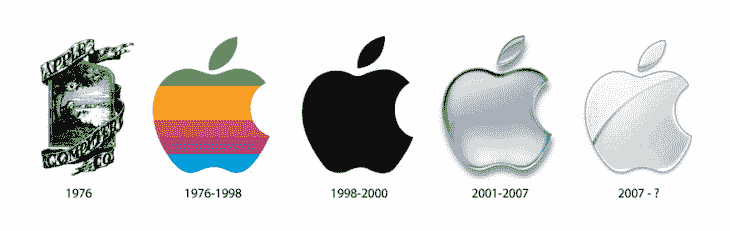
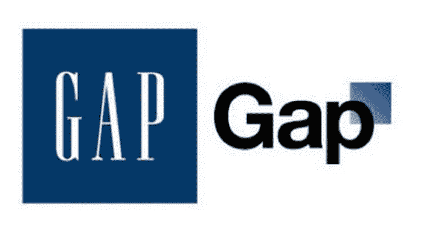
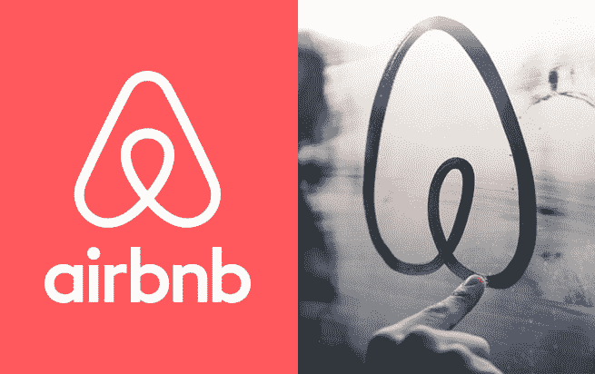
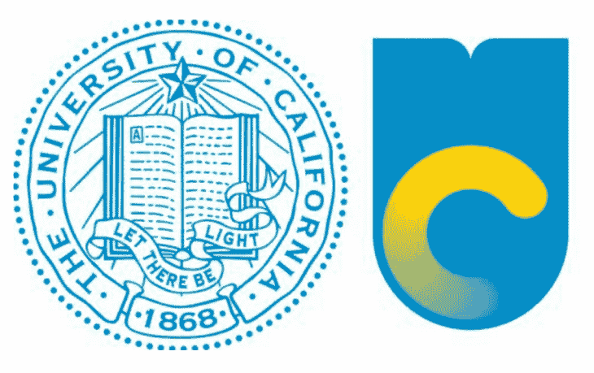

# 如何处理一个标志失火

> 原文：<http://thenextweb.com/dd/2014/08/26/how-to-avoid-a-logo-misfire/?utm_source=wanqu.co&utm_campaign=Wanqu+Daily&utm_medium=website>

随着一家公司的创新和发展，重塑品牌往往是这一过程中不可避免的一步。企业的变化需要反映在新的视觉识别中，以反映公司的新文化。

重塑品牌是向世界展示变化正在发生，一家公司正在朝着不同的方向前进的最简单的方式。即使大部分品牌重塑和重新定位的变化都是以商业为中心的，但为了保持品牌与时俱进，对标识进行调整或彻底改造也是很常见的。

正如过去十年中一系列品牌重塑适得其反所表明的那样，人们并不倾向于对标志的改变做出良好的反应。对品牌的彻底改革可能会引起极大的争议，尤其是对那些拥有忠实追随者或深厚历史背景的公司而言。

因此，做好准备[恰当地展示品牌重塑](https://thenextweb.com/news/8-steps-successfully-rebrand-business)很重要，坚持改变的承诺，仔细倾听人们的意见，并最终决定坚持到底还是放弃新形象。

### 为什么重塑品牌

这可能看起来过于简单，但在开始品牌重塑过程之前，你需要完全理解这一变化背后的原因。在这个过程中记住“为什么”会让你集中精力。

重塑品牌的原因有很多，有些比其他的更积极。希望您对品牌重塑的需求是积极的，即您的公司已经与另一家公司合并，您希望品牌反映新的合作关系，您正在扩展您的服务产品，或者可能还有现代化的空间。

有时候你就没那么幸运了——糟糕的公关、丑闻或内部动荡也是重塑品牌的理由。不管怎样，你需要准备好解释为什么会发生变化。

如果你正在进行现代化，如果你保持老品牌的精神，解释这种变化并不重要。自 1976 年以来，苹果经历了四次标志重新设计，但它保持了相同的苹果形状，并改变了苹果的颜色和风格，以反映风格趋势。

[

<noscript></noscript>](https://thenextweb.com/wp-content/blogs.dir/1/files/2014/08/apple-logos.png) 

保持原始外观的小品牌变化不需要太多解释——消费者理解相关性的需要，通常会原谅小的调整。不幸的是，有些品牌并不微妙，但更多的是在下面。

### 在品牌重塑期间

既然您已经决定重塑品牌，请务必对您现有的品牌资产进行审核。品牌重塑不仅仅是一个标志——它传达了你的整个身份，如果你忽视了你已经拥有的东西，那就是失职。

你的公司历史是怎样的？这对你过去的商业目标和品牌有什么影响？你因什么而出名？不要低估怀旧的力量。

[

<noscript></noscript>](https://thenextweb.com/wp-content/blogs.dir/1/files/2014/08/gap-logos.png) Gap 使其外观更加现代化，[留下了标志性的蓝色正方形](http://adage.com/article/news/branding-gap-s-logo-change-disaster/146525/)和衬线字体，这与多年的节日礼物有关。

该公司正从几年的低收入中走出来，需要重塑品牌来重振业务，提醒人们它的相关性，但新品牌忽略了人们一开始就喜欢 Gap 的东西——简单的风格和经典永恒的感觉。

### 公告

Airbnb 是一家最近很好地展示了其品牌重塑故事的公司。Airbnb 没有通过精心安排的新闻稿和新网站悄悄推出新品牌，而是提供了一个直播视频，用户可以收听 Airbnb 如何成长并成为一个全球社区的故事。

创始人们接着讲述了他们公司的形象是如何在这些年里演变的，然后推出了一个新的标志，并根据所吸取的经验教训和有机发生的变化重新设计了网站。

[

<noscript></noscript>](https://thenextweb.com/wp-content/blogs.dir/1/files/2014/07/0716_airbnb.jpg) 

airbnb 从一个草书的气泡字母“Airbnb”变成了一个符号，[bélo](https://thenextweb.com/news/airbnb-updates-design-introduces-new-belo-logo)。更名背后的故事和它的介绍都符合 Airbnb 试图传达的故事，并导致了成功的初步转变。尽管这个标志得到了褒贬不一的评价，但这并没有阻止用户使用它的服务。

### 操纵间隙

正如我们在新的 Airbnb 或 Foursquare logo 中看到的那样，你的新品牌将不可避免地遭到一些抵制。消费者不喜欢变化，互联网为未经审查的讨论提供了一个开放的论坛。每个对你的品牌有任何情感忠诚的人都会认为自己是权威。

如果处理得当，这是一件了不起的事情。在预期的反弹，做好准备，并准备好你的反应。听听你的观众在说什么，然后决定你是要坚持你的新形象还是回到你的旧品牌。

加州大学在 2012 年底重塑其营销努力时失去了联系，并且立即遭到了强烈反对。为了显得更加现代，这家拥有近 150 年历史的教育机构委托制作了一个更时尚、更简单的标志，以取代其营销和宣传材料上的印章。

[

<noscript></noscript>](https://thenextweb.com/wp-content/blogs.dir/1/files/2014/08/uc-logos.png) 

该大学在宣布新标志时没有控制住故事，并且哑火了，这一误解使 UC 损失了一百万美元的品牌大修。慷慨激昂的加州大学学生和校友，以及许多加州居民，立即拒绝了新的品牌，并通过请愿书，专栏和抗议表达了他们的意见。

如果加州大学更清楚新标志的目的，或者如果它收回并坚持其历史身份，加州大学可能会保留它。反而更名被撤销，大学丢了脸。

重塑品牌是一个困难和令人生畏的过程，但绝不是不可能的。如果你之前做了调查，牢记你的目的，控制你的故事并听取反馈，你可以适当地重塑你的公司，并成功地走出转型。

一个好的品牌重塑是非常强大的——它可以给一个垂死的品牌注入新的生命，或者保持一个品牌的相关性，或者只是向世界宣告已经发生的变化。最重要的是，谨慎自信地行事，保持沟通畅通，以新的面貌和新的能量出现。

**阅读下一篇:** [避免的 7 个更名错误](https://thenextweb.com/news/7-rebranding-mistakes-avoid)

*特色图片鸣谢:[设计工作室](http://www.wearedesignstudio.com/works/airbnb-process/)T3】*