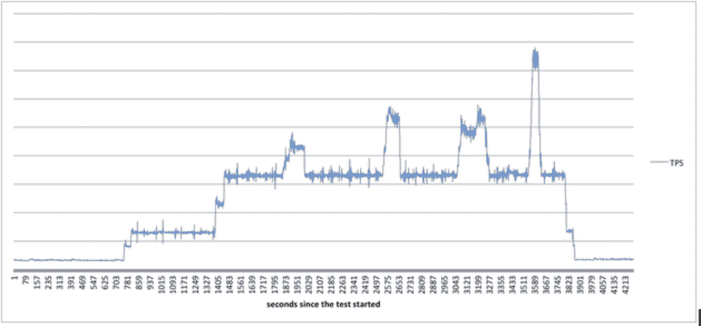

# 挑战极限 Twitter 的可靠性测试

> 原文：<https://blog.twitter.com/2014/push-our-limits-reliability-testing-at-twitter?utm_source=wanqu.co&utm_campaign=Wanqu+Daily&utm_medium=website>

在 Twitter，我们努力为持续的流量和高峰做好准备，其中一些我们可以计划，一些会在意想不到的时间或以意想不到的方式出现。为了帮助我们为这些不同类型的流量做好准备，我们不断对我们的基础设施进行测试，以确保它仍然是一个可扩展和高度可用的系统。

我们的站点可靠性工程(SRE)团队创建了一个框架来执行不同类型的负载和压力测试。我们在不同的环境中测试服务生命周期的不同阶段(例如，在一个阶段环境中的发布候选服务)。这些测试帮助我们预测我们的服务将如何处理流量高峰，并确保我们为这样的事件做好准备。

此外，这些测试有助于我们更加确信，驱动 Twitter 产品的松散耦合的分布式服务在任何时候和任何情况下都是高度可用和响应迅速的。

在发布新版本的服务之前，作为部署流程的一部分，我们运行负载测试来检查和验证服务的性能回归，以估计单个实例可以处理多少请求。

虽然在临时环境中对服务进行负载测试是一个很好的发布实践，但是它并不能提供对整个系统在过载时的行为的洞察。负载下的服务失败有多种原因，包括 GC 压力、线程安全违规和系统瓶颈(CPU、网络)。

下面是我们评估服务性能的典型步骤。

**绩效评估**

出于不同的目的，我们以多种方式评估绩效；这些可以大致分类如下:

**暂存中**

*   负载测试:在非生产环境中对少数服务实例执行负载测试，以确定新服务的性能基线，或将特定版本的性能与该服务的现有基线进行比较。
*   Tap compare:向生产和暂存环境中的服务实例发送生产请求，比较结果的正确性，并评估性能特征。
*   暗流量测试:向新服务发送生产流量，以监控其健康状况和性能特征。在这种情况下，响应不会发送给请求者。

**生产中**

*   Canarying:将小部分生产流量发送到集群中运行不同版本(大多数情况下是较新版本)的一些实例。目标是测量性能特征，并将结果与现有/旧版本进行比较。假设性能在可接受的范围内，新版本将被推送到集群的其余部分。
*   压力测试:向生产站点发送流量(带有特定标志),以模拟意外的负载高峰或预期的有机增长。

在这篇博客中，我们主要关注我们的压力测试框架、挑战、经验教训和未来的工作。

**框架**

我们通常不会面临典型的性能测试问题，比如[收集服务的指标](https://blog.twitter.com/2013/observability-at-twitter)、[分配资源生成负载](https://blog.twitter.com/2013/mesos-graduates-from-apache-incubation)或[实现负载生成器](https://blog.twitter.com/2012/building-and-profiling-high-performance-systems-with-iago)。显然，系统的任何部分都有可能受到影响，但是有些更有弹性，有些需要更多的测试。尽管我们仍然专注于上面提到的项目，关于这个博客和这种类型的工作，我们专注于系统的复杂性和可伸缩性。作为可靠性测试的一部分，我们生成分布式多数据中心负载，以分析影响并确定瓶颈。

我们的压力测试框架是用 Scala 编写的，并利用 [Iago](https://blog.twitter.com/2012/building-and-profiling-high-performance-systems-with-iago) 来创建运行在 [Mesos](https://blog.twitter.com/2013/mesos-graduates-from-apache-incubation) 上的负载生成器。它的负载生成器向 Twitter APIs 发送请求，以模拟 Tweet 创建、消息创建、时间轴读取和其他类型的流量。我们模拟过去事件的模式，如新年前夜、超级碗、格莱美、国情咨文、NBA 总决赛等。

该框架非常灵活，并且与 Twitter 基础设施的核心服务相集成。我们可以轻松启动能够产生大量流量峰值或大量持续流量的作业，只需对配置进行少量更改。配置文件定义了所需的计算资源、事务速率、事务日志、要使用的测试模块以及目标服务。下面的图 1 显示了一个启动器配置文件的例子:

```
new ParrotLauncherConfig {

  // Aurora Specification
  role = "limittesting"
  jobName = "limittesting"
  serverDiskInMb = 4096
  feederDiskInMb = 4096
  mesosServerNumCpus = 4.0
  mesosFeederNumCpus = 4.0
  mesosServerRamInMb = 4096
  mesosFeederRamInMb = 4096
  numInstances = 2

  // Target systems address
  victimClusterType = "sdzk"
  victims = "/service/web"

  // Test specification
  hadoopConfig = "/etc/hadoop/conf"
  log = "hdfs://hadoop-nn/limittesting/logs.txt"
  duration = 10
  timeUnit = "MINUTES"
  requestRate = 1000

  // Testing Module
  imports = "import com.twitter.loadtest.Eagle"
  responseType = "HttpResponse"
  loadTest = "new EagleService(service.get)"
}

```

该框架首先在 Aurora 中启动一个作业，这是 Mesos 的作业调度器。它在 Zookeeper 中注册自己，并发布到 Twitter 观察堆栈(Viz)和分布式跟踪系统(Zipkin)。这种无缝集成让我们能够监控测试的执行。我们可以测量测试资源使用、事务量、事务时间等。如果我们想增加流量，我们只需要点击几次来改变一个变量。

**T2】**

*图 2:压力测试期间产生的负载*

**挑战**

比较测试运行的性能特征是复杂的。随着我们在所有服务中不断集成和交付变更，确定一个比较基准变得越来越困难。由于许多因素，比如新的服务构建和发布，测试环境在测试运行之间会发生多次变化。测试环境中的不一致性使得很难确定引入瓶颈的变更。

如果确定了一个回归，我们将研究可能导致它的因素，包括但不限于，服务在上游和下游故障下的行为，以及流量模式的变化。在某些情况下，检测根本原因可能具有挑战性。我们检测到的异常可能不是根本原因，而是上游或下游问题的副作用。在许多服务的数千个变化中寻找根本原因是一个耗时的过程，可能需要大量的实验和分析。

针对单个或多个数据中心生成测试流量需要仔细规划和测试用例设计。需要考虑许多因素(如缓存命中率)。tweet 读取的缓存未命中会触发缓存填充，这又会触发多个后端读取请求来填充数据。因为缓存未命中之类的事情比缓存命中代价更高，所以生成的测试流量必须考虑这些因素，以获得与生产流量模式相匹配的准确测试结果。

由于我们的平台是实时的，我们可以随时观察到额外的流量激增。我们已经看到的两种更常见的负载:在某个特殊事件期间几分钟或几小时的繁忙流量，以及当[用户](https://blog.twitter.com/2012/election-night-2012) [共享](https://blog.twitter.com/2013/new-tweets-per-second-record-and-how)[时刻](https://blog.twitter.com/2014/the-reach-and-impact-of-oscars-2014-tweets)时一两秒钟内发生的峰值。模拟持续几秒钟的峰值，同时监控基础设施以实时检测异常是一个复杂的问题，我们正在积极改进我们的方法。

**吸取的教训**

我们最初的重点是过载整个 Tweet 创建路径，以找到特定内部服务的限制，验证容量计划，并了解压力下的整体行为。我们希望找出堆栈中的弱点，调整容量并实施安全检查，以保护次要服务免受上游问题的影响。然而，我们很快发现这种方法并不全面。我们的许多服务都有独特的架构，这使得负载测试变得复杂。我们必须集中精力确定工作的优先顺序，回顾主要的呼叫路径，然后设计并涵盖主要的场景。

一个例子是我们的[内部网络爬虫](https://blog.twitter.com/2011/spiderduck-twitters-real-time-url-fetcher)服务，它将站点爬行任务分配给集群中的一组特定机器。该服务这样做是出于性能原因，因为这些机器更有可能已经建立了到目标站点的连接。该服务将其已经被抓取的站点复制到其他数据中心，以节省计算资源和出站互联网带宽。

处理所有这些步骤使链接的收集、它们的类型以及它们在测试建模期间的分布变得复杂。在整个测试中，负载生成器之间的链接分布是一个问题，因为这些是真实的生产网站。

为了应对这些挑战，我们设计了一个系统，该系统将链接分布在所有负载生成器上，保证在集群中每秒钟爬取的任何网站的链接不超过 N 个。我们必须仔细指定链接类型和分布。如果大多数链接都是无效的、垃圾的或包含恶意软件的，我们可能已经淹没了内部系统。此外，如果所有链接都是针对一个网站，我们可能会淹没外部系统。堆栈的整体行为会随着每个类别所占百分比的变化而变化。我们必须找到合适的平衡点来设计一个涵盖所有可能场景的测试。每次我们建模新的测试时，这些定制的过程都会重复。

我们通过关注特定的站点特性，比如 tweet 的读写路径，开始了我们的测试方法。我们的第一个方法是模拟大量持续的推文创建和阅读。由于我们平台的实时性、峰值的变化以及我们观察到的流量类型，我们不断扩展我们的框架，以涵盖其他功能，如用户转发的推文、收藏的推文、对话等。我们的各种功能(推文、媒体推文、搜索、发现、时间轴视图等)要求我们的方法多样化，以确保我们的测试模拟结果完整准确。

Twitter 的内部服务有保护自己和下游的机制。例如，服务将开始进行进程内缓存以防止缓存过载，或者将引发特殊异常以触发上游重试/回退逻辑。这使得测试执行变得复杂，因为缓存屏蔽了下游服务的负载。事实上，当进程内缓存启动时，服务的整体延迟会降低，因为它不再需要与分布式缓存之间的往返。我们必须通过围绕一个单一的测试场景创建多个测试模型来解决这样的防御机制。一个测试验证进程内缓存已经启动；另一个测试模拟了没有进程内缓存的服务行为。这个过程需要跨堆栈进行更改，以通过和遵守特殊的测试标志。在经历了这个过程之后，我们学会了用可靠性测试来设计和架构服务，以简化和加速未来测试的建模和设计。

**未来工作**

由于 Twitter 发展迅速，我们的服务也在不断变化，我们的策略和框架也应该如此。我们继续改进并在某些情况下重新设计我们性能测试策略和框架。我们正在自动化压力测试的建模、设计和执行，并使压力测试框架具有上下文感知能力，因此它是自我驱动的，能够针对特定或 N 个数据中心。如果你对此感兴趣，我们可能需要你的帮助——加入这个群体吧！

*特别感谢[阿里·阿尔扎巴拉](https://twitter.com/alialzabarah)领导改进和扩展我们的压力测试框架的努力，以及他对本博客的辛勤工作和奉献。*

*非常感谢 [@twittereng](https://twitter.com/intent/user?screen_name=twittereng) 的许多人，特别是[詹姆斯·沃尔德罗普](https://twitter.com/HiveTheory)、[汤姆·豪兰](https://twitter.com/WamBamBoozle)、 [史蒂文·萨利文](https://twitter.com/stevesalevan)、[德米特里·里亚博伊](https://twitter.com/squarecog)和[尼兰詹·白菊](https://twitter.com/razb0x)。此外，感谢[约瑟夫·史密斯](https://twitter.com/Yasumoto)、[迈克尔·莱纳尔塔斯](https://twitter.com/mleinart)、[拉里·霍斯肯](https://twitter.com/lahosken)、[斯蒂芬妮·迪安](https://twitter.com/sdean)和[大卫·巴尔](https://twitter.com/davebarr) r 对这篇博文的贡献。
T25】*