# 为什么亚马逊没有利润(以及为什么它有效)|安德森·霍洛维茨

> 原文：<https://a16z.com/2014/09/05/why-amazon-has-no-profits-and-why-it-works/?utm_source=wanqu.co&utm_campaign=Wanqu+Daily&utm_medium=website>

亚马逊有分化人的倾向。一方面，无情、无情、效率极高的公司正在打造 21 世纪的西尔斯·罗巴克。但另一方面，事实是，在推出近 20 年后，它仍未报告有意义的利润。这张图表很好地捕捉到了矛盾——巨大的收入增长，没有利润，或者看起来是这样。但实际上，这两行都不能让你很好地理解到底发生了什么。

[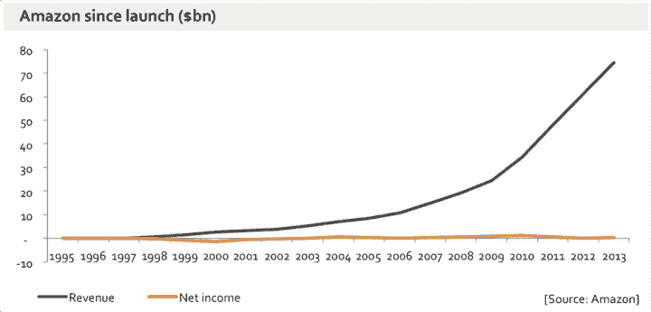](https://i1.wp.com/a16z.com/wp-content/uploads/2014/09/1.png)

Source: a16z

亚马逊披露了三个部分的收入——媒体、电子和百货(EGM)和“其他”,其中大部分是 AWS。正如这张图表所示，这些看起来非常不同(这张和后面的大多数都使用“TTM”——跟踪 12 个月，这消除了季节性波动，更容易看到潜在的趋势)。媒体业务仍在增长，但在过去几年里，推动收入爆炸式增长的是普通商品。与此同时,“其他”线正在增长，但仍然小得多。

[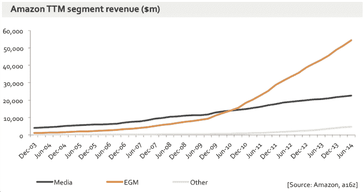](https://i2.wp.com/a16z.com/wp-content/uploads/2014/09/2.png)

Source: a16z

分开细节，我们可以看到这一趋势在北美和国际上…

[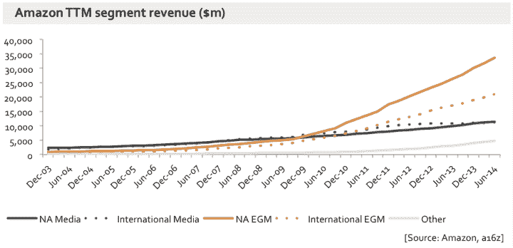](https://i0.wp.com/a16z.com/wp-content/uploads/2014/09/3.png)

Source: a16z

尽管美国的起飞特别强劲。

[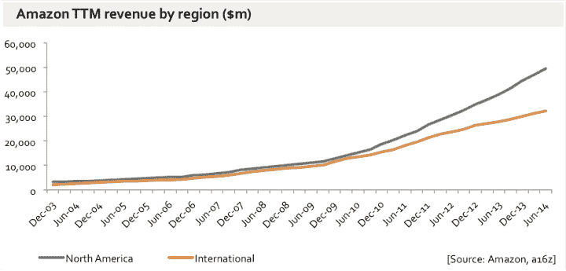](https://i1.wp.com/a16z.com/wp-content/uploads/2014/09/4.png)

Source: a16z

媒体整体收入仅占亚马逊上季度收入的 25%，占北美收入的 20%。

[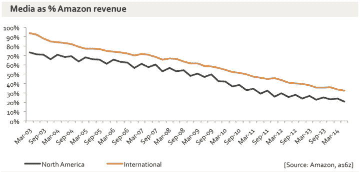](https://i2.wp.com/a16z.com/wp-content/uploads/2014/09/5.png)

Source: a16z

如果我们回到“其他”并放大，那里的增长也相当惊人。

[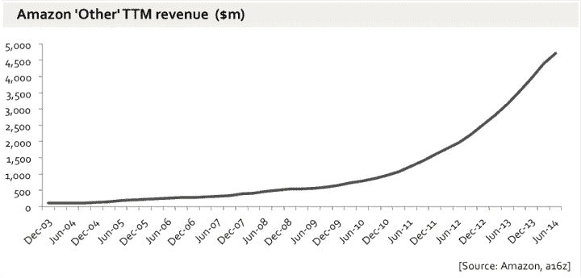](https://i1.wp.com/a16z.com/wp-content/uploads/2014/09/6.png)

Source: a16z

看起来很有可能的是，这些企业，以不同的议价地位向不同的人出售非常不同的产品，不同的运输成本，有不同的利润潜力。

尽管如此，这仍然不能给出一个准确的图像。事实上，亚马逊组织的不仅仅是这些细分市场，而是几十个独立的团队，每个团队都有自己的内部 P&L 和高度自治。所以，比方说，德国的鞋子、法国的电子产品或美国的化妆品都是不同的团队。顺便提一下，这些企业都有自己的定价。与此同时，所有这些业务都处于不同的成熟阶段。有些相对来说历史悠久。尽管这些成熟的业务增长较慢，但它们是盈利的。其他人是新的创业公司，像其他任何新的企业一样，建立自己的企业，并在这样做的过程中赔钱。有些非常有利可图，有些以成本价或亏本销售来提高网站的流量和忠诚度。书籍就是一个很好的例子。人们普遍认为亚马逊亏本销售图书，但平均销售价格实际上似乎非常接近实体零售商——它对一些图书打折，但不是所有图书，尽管在代理诉讼中存在争议，但具体有多少和多少(故意)一清二楚。

亚马逊是捆绑的。

这一点最清楚的表达是 Prime，其中(除其他外)娱乐内容以亚马逊的高固定成本(购买权利)包含在内，但除带宽外没有边际成本，作为一种增强 Prime“会员”吸引力的方式。Prime 会员反过来吸引人们将越来越多的线上和线下消费转移到亚马逊。试图只看视频的盈利能力是没有抓住重点的。

然后就是第三方销售。正如 AWS 是亚马逊自己的内部技术和数千家初创公司的平台一样，物流和商业基础设施本身也是许多不同亚马逊业务的平台，也是许多通过亚马逊网站销售实物产品的其他公司的平台。通过亚马逊自己的平台销售产品的第三方现在占单位销售额的 40%，向这些供应商收取的费用现在占亚马逊收入的 20%。

[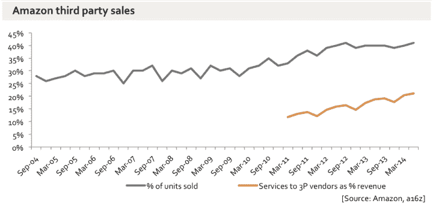](https://i1.wp.com/a16z.com/wp-content/uploads/2014/09/7.png)

Source: a16z

顺便说一句，这意味着在 Amazon.com 上售出的近一半商品，亚马逊并不定价，它只是收取利润。仅凭这一点，就应该指出亚马逊的增长是基于成本价或亏本销售这一观点的弱点。

这些第三方(“3P”)销售的棘手之处在于，亚马逊只确认其向这些公司提供的服务的收入，而不是所售商品的价值。因此，如果你在亚马逊上从第三方购买一双鞋，亚马逊可能会通过你的亚马逊账户收款，并通过其货运合作伙伴从其仓库发货——但只显示其向鞋商收取的运费和付款费用作为收入。它没有披露总收入(“GMV”)。鉴于(正如它所披露的)第三方销售往往具有更高的单位价值，这意味着通过亚马逊获得一定比例的商品总价值可能是亚马逊实际报告收入的两倍。收入线并没有真正告诉你发生了什么，这也是为什么毛利润很容易让人误解的一个原因。毛利从 2011 年的 22.4%上升到 2013 年的 27.2%，但这并没有真正反映消费者定价和利润的变化，而是反映了这种组合的变化。

因此，我们在亚马逊内部有几十个独立的企业，以及超过 200 万个第三方卖家账户，所有这些都位于亚马逊履行和商务平台之上。有一些是成熟的盈利的，有一些不是。亚马逊的某个人负责确保每个季度的净收入尽可能接近于零——至少就净收入而言。也就是说，净收入的问题在于，它告诉我们的是，每个季度，亚马逊都会花掉剩余的钱，以使数字为零或接近零。真的没有其他方法可以达到这种一致性。

如果你仔细听，亚马逊自己告诉我们这一点。下图直接来自亚马逊——最初是杰夫·贝索斯的餐巾草图。请注意，没有一个指向外面的箭头标着“获利了结”。这是一个闭环。

[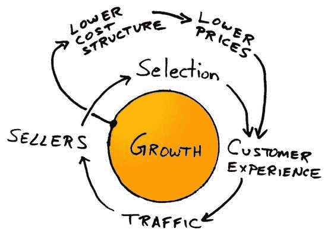](https://i2.wp.com/a16z.com/wp-content/uploads/2014/09/amazon-cycle.jpg)

Source: a16z

在任何情况下，净利润线中报告的利润都是试图理解这种业务的一种非常糟糕的方式——实际现金流更好。俗话说，利润是观点，但现金是事实，亚马逊自己谈论的是现金流，而不是净收入(出于明显和邪恶的原因，安然正好相反)。亚马逊非常关注自由现金流(FCF)，但看看运营现金流(OCF)也非常有用，运营现金流只是你加回资本支出(“资本支出”)后得到的结果。实际上，在基础设施成本、M&A 和融资成本之前，OCF 是企业运营的主体。这就向你展示了低价销售的效果。正如我们在这里看到的，亚马逊的 OCF 利润率十年来一直非常稳定，但 FCF 却下降了，原因是资本支出大幅增加。

[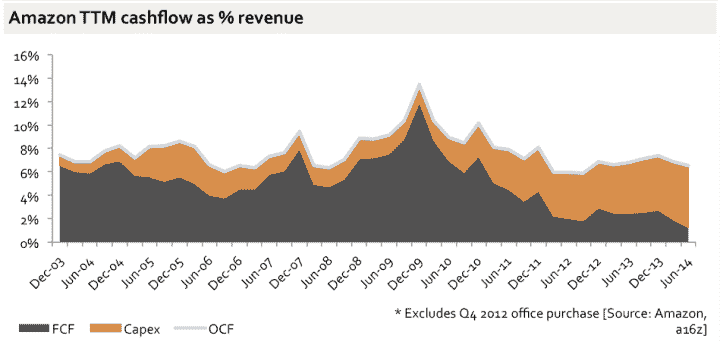](https://i2.wp.com/a16z.com/wp-content/uploads/2014/09/8.png)

Source: a16z

因此，从绝对值来看，你可以看到一家企业的运营现金流迅速增长——过去 12 个月超过 50 亿美元——并作为资本支出重新投入业务。

[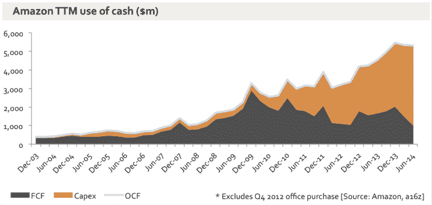](https://i1.wp.com/a16z.com/wp-content/uploads/2014/09/9.png)

Source: a16z

用线而不是区域来表示，显示了资本支出的增长有多稳定。

[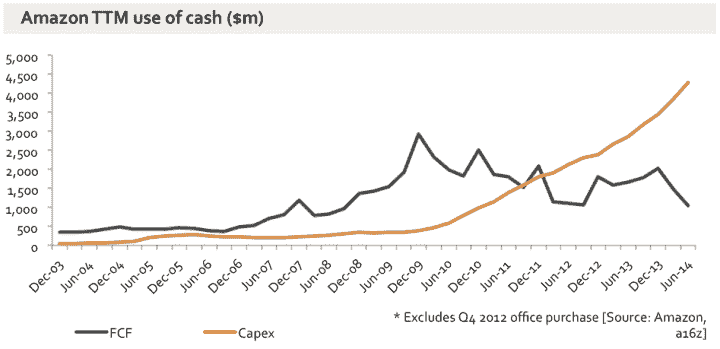](https://i2.wp.com/a16z.com/wp-content/uploads/2014/09/10.png)

Source: a16z

有人可能会说，在收入快速增长的物流业务中，资本支出的快速增长是很自然的，应该单独考察资本支出与销售额的比率。但事实上，这里的涨幅更为惊人。从 2009 年开始，亚马逊开始在资本支出上花更多的钱，而且增长速度没有放缓的迹象。

[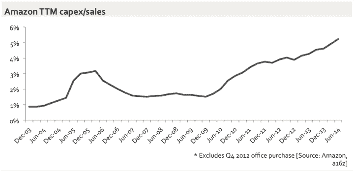](https://i0.wp.com/a16z.com/wp-content/uploads/2014/09/11.png)

Source: a16z

如果亚马逊在 2009 年爆发之前，资本支出/销售保持同样的比率，那么 FCF 看起来会是这样。这一差额在过去 12 个月里总计超过 30 亿美元。也就是说，如果亚马逊每美元收入的资本支出与 2009 年相同，那么它在过去 12 个月里将多持有 30 亿美元现金。

[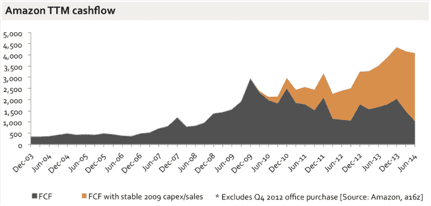](https://i0.wp.com/a16z.com/wp-content/uploads/2014/09/12.png)

Source: a16z

那么，所有额外的资本支出都去了哪里？而且，至关重要的是，它需要停留在这些新的、更高的水平上来支持亚马逊的业务吗，或者它在未来会回来吗？

很明显，这些钱被投入到更多的履行能力(粗略地说，是仓库)和 AWS 中。因此，这张图表显示了亚马逊的物理基础设施的巨大增长，以平方英尺衡量——这几乎都是履行而不是数据中心，尽管亚马逊不再给出分割。

[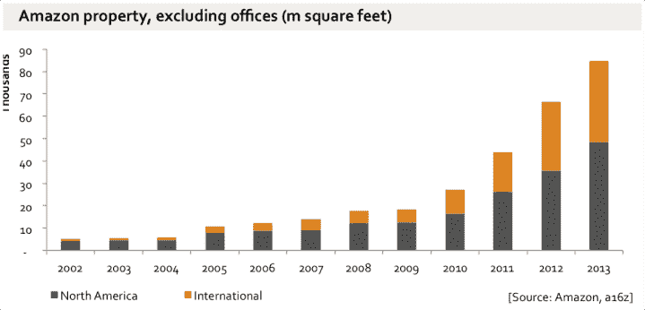](https://i0.wp.com/a16z.com/wp-content/uploads/2014/09/13.png)

Source: a16z

不过，要精确地分析资金的去向，就有点复杂了。这种增长是由以下四个因素共同推动的:

> 1.更多产品的更大容量，包括 3P 产品
> 2。邻近性——随着亚马逊在离客户更近的地方建立仓库，运输时间下降，运输成本也下降，这是 Prime
> 3 的进一步飞轮效应。AWS
> 4。更昂贵的仓库——也就是说，现有业务的运营成本越来越高

前两种是对未来的直接投资，通常会带来更高的未来利润。AWS 是一个黑匣子，也是一个备受争议的难题，但它也是一个需要投资才能增长的新业务的定义。这里真正的熊市是最后一点——现有业务正变得越来越资本支出密集——每一美元的当前收入需要更多美元的资本支出。

只是为了让那些希望了解亚马逊财务状况的人日子更难过，仓库扩张、资本支出扩张和 AWS 扩张几乎同时开始，与此同时，亚马逊改变了报告方式，使其很难区分它们。直到 2010 年，它在履行和数据中心之间分割财产和资产价值，但那时它停止了，可能不是因为共同事件(2010 年亚马逊只有 77.5 万平方英尺用于数据中心和客户服务)。与此同时，各种指标(例如，每平方英尺的资本支出)将显示支出从廉价仓库向昂贵数据中心的转移，但它们也将显示从维护现有仓库向建设新仓库的转移。所以我们没有直接、简单的方法来观察这种分裂。

不过，我们仍然可以对关键仓库问题有所了解——业务运营成本是否变得更高了？答案似乎是否定的。首先，第三方销售似乎不是问题所在:3P 单位的比率并没有像同期的资本支出/销售那样上升(这又是一张图表)。

Source: a16z

也没有任何迹象表明这一时期的履约成本发生了变化(亚马逊似乎忘记了停止披露这些信息)。实体产品组合的运输成本并没有显著增加，那么它的仓储成本会显著增加吗？这显然不是一个确切的代理，但似乎不太可能。

[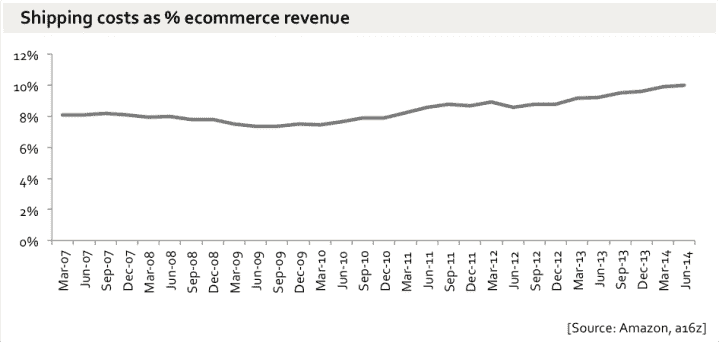](https://i1.wp.com/a16z.com/wp-content/uploads/2014/09/15.png)

Source: a16z

因此，虽然我们不能确定，但看起来资本支出并没有上升，因为亚马逊现有业务的运营成本变得更高了，而是因为亚马逊正在将不断增长的运营现金流池投资于未来。所有这些都让我们回到了起点——亚马逊的业务正在实现非常快速的收入增长，但没有积累任何剩余现金或利润，因为每一分钱的现金都被投入到进一步扩展业务中。但是，这并不是因为任何特定的业务都是长期亏损的——而是因为已有业务的利润被用于开发新业务。过去，这主要是在运营方面，但近年来，投资消防再次指向了资本支出。

这项投资将持续多久？那么，我们相信产品和企业向在线商务的转换已经完成了吗？让我们重新调整一下收入图表，将其视为美国零售收入的份额。除去汽油、食物以及木材和植物等难以运输的东西，至少目前亚马逊有大约 1%的份额。

[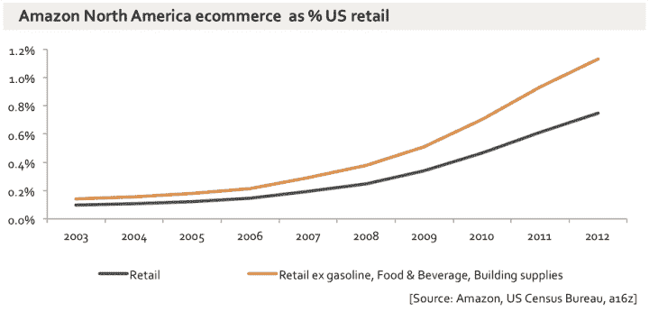](https://i1.wp.com/a16z.com/wp-content/uploads/2014/09/16.png)

Source: a16z

总体而言，美国商业增长非常稳定:

[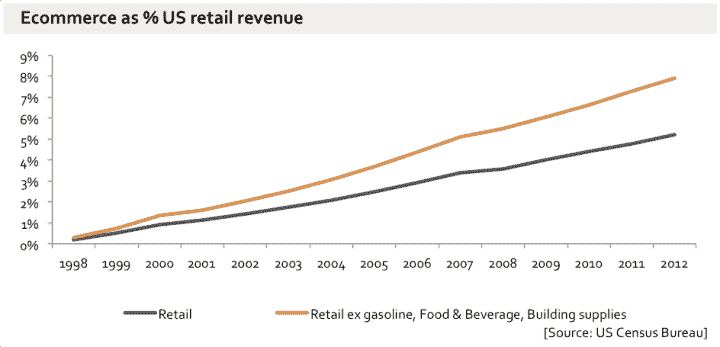](https://i1.wp.com/a16z.com/wp-content/uploads/2014/09/17.png)

Source: a16z

亚马逊在其中的份额也在不断增加。

[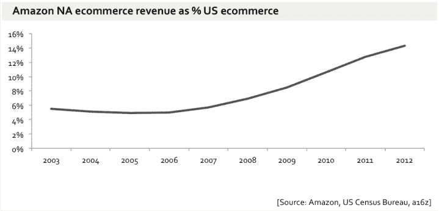](https://i0.wp.com/a16z.com/wp-content/uploads/2014/09/18.png)

Source: a16z

按价值计算，亚马逊大约拥有美国零售市场的 1%。它是否应该停止进入新的类别和市场，转而获取利润，进而将这些细分市场和市场留给其他公司？还是应该继续投资把他们扫进平台？杰夫·贝索斯的观点非常明确:继续投资，因为从业务中获利会浪费机会。他似乎非常乐于不断抓住新的机会，创造新的业务，并利用每一分钱来做到这一点。

尽管如此，投资者还是将资金投入公司，包括亚马逊和其他任何公司，期望在某个时候他们能够套现。有了亚马逊，贝佐斯几乎无限期地推迟了这一创造利润、回报投资者的日子。这促使人们认为亚马逊是世界上最大的“生活方式企业”——贝佐斯经营它是为了娱乐，而不是为了给股东带来经济回报，至少短期内不会。

但是，尽管他看起来确实很开心，但他也在建立一家公司，用他能得到的所有现金，在未来的商业中占据越来越大的份额。当你购买亚马逊股票(顺便提一下，亚马逊员工的主要支付货币)时，你是在押注他可以将所有商业的很大一部分转化为通过亚马逊机器的流动。要问的问题不是亚马逊是否是某种无利可图的庞氏骗局，而是你是否相信贝佐斯能够抓住未来。那，你愿意等多久？

*此处表达的观点是引用的 AH Capital Management，l . l . c .(“a16z”)人员个人的观点，并非 a16z 或其关联公司的观点。此处包含的某些信息来自第三方，包括 a16z 管理的基金组合公司。虽然来自据信可靠的来源，但 a16z 没有独立核实此类信息，也没有对信息的持久准确性或其在给定情况下的适当性做出任何陈述。T3】*

*本内容仅供参考，不应作为法律、商业、投资或税务建议。关于那些事情，你应该咨询你自己的顾问。对任何证券或数字资产的引用仅用于说明目的，并不构成投资建议或提供投资咨询服务。此外，本内容不针对任何投资者或潜在投资者，也不打算由任何投资者或潜在投资者使用，并且在决定投资 a16z 管理的任何基金时，在任何情况下都不得依赖本内容。(投资 a16z 基金的要约只能通过私募备忘录、认购协议和任何此类基金的其他相关文件进行，并应完整阅读。)提及、提及或描述的任何投资或投资组合公司并不代表 a16z 管理的投资工具的所有投资，也不能保证这些投资是盈利的，也不能保证将来进行的其他投资会有类似的特征或结果。安德森·霍洛维茨基金管理的基金的投资清单(不包括发行人未允许 a16z 公开披露的投资和某些公开交易的加密货币/数字资产)可在 https://a16z.com/investments/.T3 获得*

*其中提供的图表仅供参考，不应作为投资决策的依据。过去的表现并不代表未来的结果。该内容仅在所示日期有效。这些材料中表达的任何预测、估计、预测、目标、前景和/或观点可能会随时更改，恕不另行通知，并且可能与他人表达的观点不同或相反。更多重要信息，请见 https://a16z.com/disclosures。T3】*