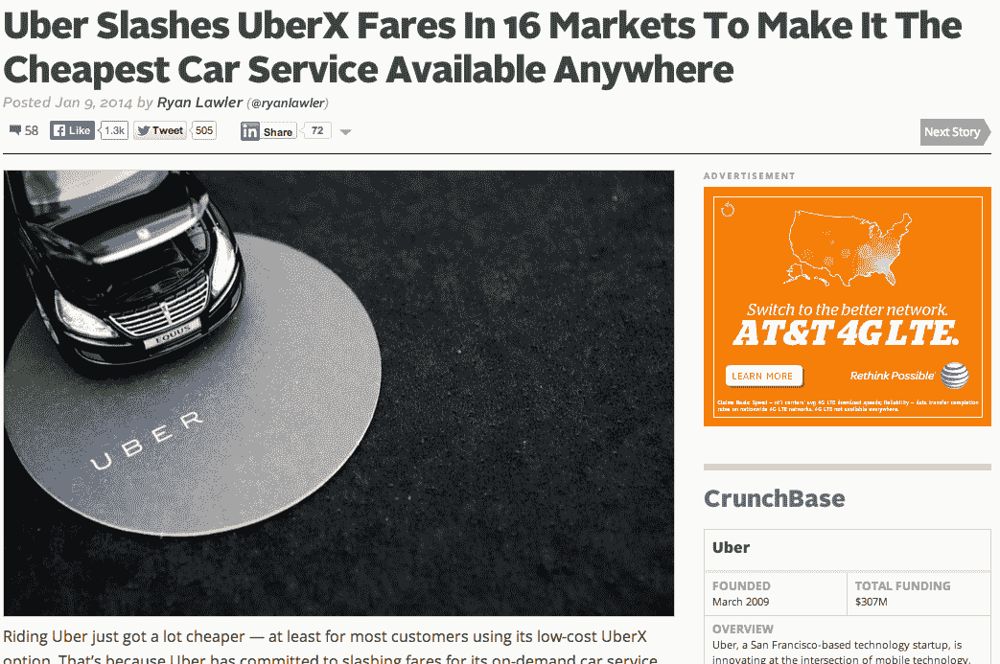
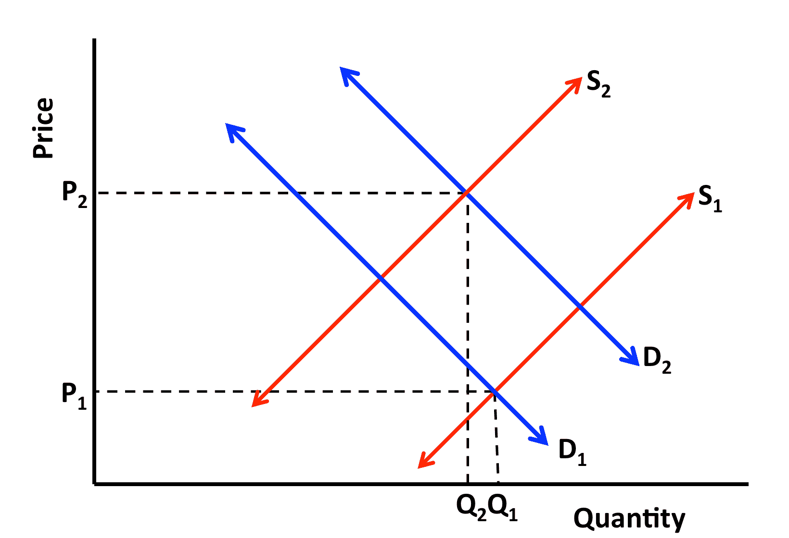

# 深入了解优步的动态定价模型——超越人群

> 原文：<http://abovethecrowd.com/2014/03/11/a-deeper-look-at-ubers-dynamic-pricing-model/?utm_source=wanqu.co&utm_campaign=Wanqu+Daily&utm_medium=website>

March 11, 2014:

[

<noscript></noscript>](https://i0.wp.com/abovethecrowd.com/wp-content/uploads/2014/03/New-Logo-Vertical-Dark.jpg?ssl=1) 在过去的一年里，许多作家都对优步的动态定价策略发表了自己的看法。也许唯一的一致性是人们对这个话题有着深刻热情的观点。然而，对于该模型的工作原理仍有许多误解，这篇文章的目的是澄清一些误解。

我是优步的投资者和董事会成员，因此我认为许多人会把这些想法视为赤裸裸的偏见。但考虑到我的角色，我可以接触到更多的信息，可能会有更深入的视角。我也有相当多的风险，因此我花了大量的时间来思考这项政策以及潜在的替代方案。

#### 澄清关于优步的某些细节

在深入研究优步的动态定价模型之前，有必要澄清优步是如何构建和运作的一些关键要素。

1) 优步是一个市场，优步的司机都是独立的代理商。优步的司机是独立的代理人，他们要么是个体经营者，要么为拥有多辆汽车的人工作。优步没有汽车，也不雇佣司机。每一天，每一个小时，这些司机决定是否打开优步应用程序，接受来自优步客户的乘车请求。这些司机不受排他性的约束。他们中的许多人从事多种服务，许多人有他们在优步平台上接触的“常客”。

优步的大部分车费都流向了这些独立司机。平均而言，超过 80%的总票价最终落入司机手中。此外，在优步保留的百分比中，很大一部分用于支付服务中的可变费用。这些费用包括支付处理、支付欺诈、退款、客户服务、争议解决、手机和司机服务费，以及当地监管工作。底线是这是一个低利润的业务——更像亚马逊而不是谷歌。

3) 优步致力于成为低价领导者。有些人认为优步是一个“奢侈品牌”这种困惑是可以理解的，因为优步最初关注的是传统的黑车服务。然而，自从 18 个月前在[推出低价优步品牌](http://allthingsd.com/20120702/a-status-symbol-moves-down-market-whats-behind-the-uberx-launch/)以来，优步一直专注于在所有价位保持领先。这个目标是向更广泛的人群展示优步令人惊叹的客户体验。 *UberX 现在是该公司最具战略意义、增长最快的产品，在许多城市已经超过优步布莱克，成为该公司最大的产品。* 该公司还有意[尽可能多地降低 uberX 的价格](http://techcrunch.com/2014/01/09/big-uberx-price-cuts/)(在一些市场，它已经四次降低价格)。尽管如此，一些竞争对手仍然抱着方便的错觉，认为优步只是一个高端服务，或许类似于 CDNow，假设亚马逊只是一家书店。

[

<noscript></noscript>](http://techcrunch.com/2014/01/09/big-uberx-price-cuts/) 

4) 优步的动态定价(“高峰定价”)影响了所有优步乘车的极少数，不到 10%的行程。动态定价最常见于周五和周六晚上的高峰时段，某些节假日，如万圣节和新年前夕，以及在特别重大的活动和恶劣的天气条件下。总的来说，这只是优步司机工作时间的一小部分。绝大多数时候，优步越来越低的基本费率(uberX 通常比当地出租车便宜 40%)是该服务的主要价格点。

优步对其动态汇率非常透明。自从该公司第一次遇到关于其定价模式的反馈，该公司就想方设法确保客户了解该政策及其运作方式。他们插入了特殊的闪屏，客户必须在那里输入具体的提价确认。此外，该公司还不遗余力地宣传该计划的运作方式和原因。在刚刚过去的新年前夕，[的首席执行官甚至发布了一个指导视频，鼓励乘客不要在特定时间乘坐](http://vimeo.com/82915850)。

#### 优步动态定价的起源

那么，为什么优步的动态定价会存在呢？答案在于理解优步从根本上来说是一个市场，供应不是由公司控制，而是由与他们合作的大量独立承包商和运输供应商控制。

回到 2012 年初，优步的波士顿团队注意到一个问题。周五和周六晚上，大约凌晨 1 点，该公司遇到了“未实现的请求”高峰根本原因是，就在周末参加派对的人准备冒险回家之前，司机们正在打卡下班回家。供求失衡，结果是很多顾客非常不高兴。所以波士顿团队有了一个想法。如果他们给司机更高的价格，让他们在系统上停留更长时间(直到凌晨 3 点左右)，会怎么样？司机带回家的钱多了会增加供应吗？仅仅两周之后，他们就有了一个响亮的答案。通过向司机提供更多的钱，他们能够增加 70-80%的道路上的司机供应，更重要的是消除了三分之二的未实现的请求。供给曲线非常有弹性。司机的确是被价格所驱使。

根据波斯顿实验的结果，优步实施了动态定价政策，仅在供不应求时使用。当等待时间急剧增加，并且“未满足的请求”开始增加时，动态定价变化由算法驱动。实质上，加价模式有两个功能。一是增加供给。涨价的第二个作用是暂时有意减少需求。通过这两种机制，该公司能够(a)增加供应，(b)确保可靠性，这是该公司的一个关键原则，以及(c)最大限度地提高完成的游乐设施的数量。

#### 经济学 101:供给和需求曲线

如果你拿起一本经济学入门教材，无论是第一章还是第二章，你都会找到对供求曲线的描述。它是经济分析的关键操作模型，对于经济学来说就像 DNA 对于生物学一样重要。如果你从未接触过这些话题，我强烈推荐[可汗学院的微观经济学课程](https://www.khanacademy.org/economics-finance-domain/microeconomics/supply-demand-equilibrium)。正如你所料，需求和供给曲线是前两部分。

[

<noscript></noscript>](https://i0.wp.com/abovethecrowd.com/wp-content/uploads/2014/03/Screen-Shot-2014-03-07-at-6.41.40-AM.png?ssl=1) 

关于优步的市场和供求曲线，有一些事情需要注意。首先，优步的分析和研究表明，供给曲线和需求曲线都具有很高的弹性。波士顿实验，以及从那以后的每一次努力，都证实了在其他条件不变的情况下，更高的价格会增加供给。公司进入的每个市场都是如此。

在需求方面，该公司证实了两个不同领域的价格弹性。首先，当价格飙升时，他们会看到订单开放率立即下降。正如所料，更高的价格确实减少了需求。此外，正如在优步首席执行官特拉维斯·卡兰尼克的视频采访中提到的，反过来也是正确的。优步的多次降价都导致了需求的大幅增加。基本上，优步的市场是高效的，并以经济学教授所期望的方式运行。当你考虑到模型的双方——优步的骑手和司机——都是分散的独立代理人的大团体时，这并不奇怪。市场应该有效运作。

使用供求曲线作为模型，优步的动态定价模型相当简单。当需求超过供应时，动态定价算法会提高价格，以帮助市场达到平衡。当然，这些情况总是暂时的，最终供大于求，价格回落到正常水平。如果需求激增而没有导致价格上涨，就会出现所谓的经济短缺。如果不提价，优步的未履行率将飙升，大多数客户将无法乘车。然而，有了动态定价，图表上的变量 Q 比没有动态定价时更靠右。更多的绝对游乐项目正是因为供给增加而得以实现。

#### 将优步与酒店、航空公司和租车公司进行比较

许多关于优步定价模式的文章指出，航空公司、酒店和租车公司经常使用动态定价，通常比率(这些行业中 10 倍的差异很常见)非常类似于优步新年前夕的最高峰值。对于一个酒店经营者来说，新年前夜的客房需求比两周后的某个工作日要高得多。由于没有能力增加供应，他们只能选择卖给出价最高的买家。这是一个相对容易理解和接受的实践。没有人对此表现出哪怕一点点情绪，因为这是很好理解和预期的。

然而，在优步的案例中，有一个关键的区别极大地增加了对动态定价的需求。 拥有酒店、飞机和出租汽车，供给相对固定。一个人不能为新年夜建造更多的房间，然后把它们拆掉。优步有一个这些公司没有的问题。在骑车人希望有更多空闲时间的时候——星期五和星期六晚上，在暴风雨中，在新年前夕——司机们宁愿不开车。你看，虽然酒店房间是固定的，但优步的供应在这些时间实际上是萎缩的，因为司机们也不愿意在这些时间工作。增加对司机需求的确切事件也会导致供应减少。在这些情况下，供给曲线向左移动的同时，需求曲线向右移动。因此，就优步而言，增加供应的价格催化剂是至关重要的。

影响司机供应的另一个因素是替代机会。司机们在除夕夜这样的活动之夜有利润丰厚的替代机会。一些参加派对的人愿意以每晚超过 1000 美元的统一价格预订一名专属司机。在这种情况下，司机享受相当多的停机时间。

#### 唯一真正的选择——“无车可用”

一些人认为他们理解优步动态定价的经济基础，但他们认为“公关打击”如此之大，公司应该重新考虑其政策。这种单步分析未能考虑动态定价的真正替代方案——无数不满意的客户抱怨缺乏可用性/可靠性(优步客户提案的两个关键原则)。

[

<noscript></noscript>](https://i0.wp.com/abovethecrowd.com/wp-content/uploads/2014/03/photo.png?ssl=1) 底线是，动态定价的唯一真正替代方案是一大堆盯着屏幕显示“无车可用”的顾客这是优步的批评者最不欣赏的事实。还记得联合包裹服务公司在今年圣诞节遭受的公关打击吗？当时他们无法像顾客期望的那样递送包裹。在需求增加、供应减少的情况下，优步可以让其网络以正常状态和正常价格运行，这种想法完全不可行。认为优步应该在需求高峰时期保持价格不变的观点，实际上是在说，优步应该接受让大部分消费者陷入失望的信息:“没有车可用。”

如果这听起来像是对价格上涨的道歉，请尝试以下实验:下次你看到一条消息表明优步的飙升定价正在生效时:立即尝试优步以外的替代选择。换句话说，试着叫一辆出租车，叫一辆传统的黑车服务，找一辆出租汽车，或者跳上一辆公共汽车或地铁。你会发现所有交通方式的可用性和可靠性在同一时刻都面临着压力。在这些时候，固定价格的出租车将很难找到，而固定价格的地铁将非常拥挤。相对于这些选择，优步更喜欢可靠和可用的最大数量的客户，它可以服务，并认为，客户不满意不可用会比有限的客户不满意他们的动态定价模式更糟糕。

#### 司机也是人

另一点需要注意的是，优步服务中每辆车的操作者都是人，就像所有乘客一样。为什么我们要期望那个人在我们想要出城的时候对工作感到兴奋呢？你喜欢星期五和星期六晚上工作吗？假期呢？除夕呢？护士和医生通常在这些时间获得 2-3 倍的加班费；司机有理由不这样做吗？在非常恶劣的暴风雨期间呢？独立司机应该更关心你的需求，还是自己家人朋友的需求？这并不是恳求你对优步系统中的独立司机过于同情，而是简单地请你考虑一下基本的人类原因，为什么他们可能会在你最不想开车的时候选择不开车。如果他们在最不方便的时候牺牲自己的时间，期望更高的票价是不合理的吗？

#### 理解会随着时间的推移而提高

优步确实对一些客户对动态定价的看法很敏感，这也正是他们如此努力向消费者传达意识的原因。就在上周，该公司[宣布了一项名为 Surge Drop](http://blog.uber.com/surgedrop) 的新功能，当飙升的价格下降时，该功能将通知客户，使人们能够等到供需更加平衡，并避免更高的费用。

正如许多人注意到的那样，动态定价政策在酒店、航空公司和汽车租赁公司中已广为人知。这种意识使得变化在意料之中，也不那么令人惊讶。提高意识将有助于减少一些客户可能遇到的意外因素。它还会导致某些客户避开价格较高的时间窗口，而此时他们不愿意进行交易。基本上，随着越来越多的人理解这个模型，他们会对所期待的事情更加放心，并且能够做出明智的选择。

[

<noscript></noscript>](https://i0.wp.com/abovethecrowd.com/wp-content/uploads/2014/03/Screen-Shot-2014-03-06-at-11.47.32-PM.png?ssl=1) 

从根本上说，大多数批评优步定价模式的人没有认识到优步是一个真正的市场。当面临供应短缺时，大多数领先的互联网市场公司使用动态定价作为解决方案。这是 Ebay 最初拍卖模式背后的基本前提。这也正是 StubHub (ebay 的票务引擎)以及 Airbnb 和 Homeaway 的工作方式。此外，它还是谷歌核心 Adwords 产品背后的关键定价算法——这项服务拥有超过 100 万客户，收入接近 500 亿美元。它的用法是可靠的，这也是为什么优步的首席执行官有信心它也是这里的正确模式的部分原因。优步无意放弃动态定价，正是因为这符合消费者的最佳利益，尤其是当人们了解真正的替代方案时。

### *相关*