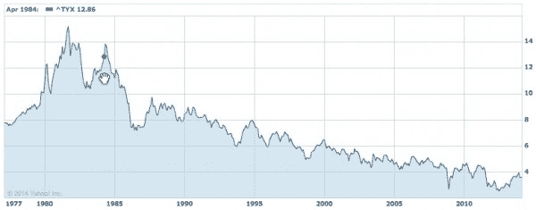

# 泡沫问题- AVC

> 原文：<http://avc.com/2014/03/the-bubble-question/?utm_source=wanqu.co&utm_campaign=Wanqu+Daily&utm_medium=website>

无论我去哪里，无论我在哪里讲话，都会有人问我这个问题。我们是在泡沫中吗？

这个问题已经问了我至少四年了。泡沫很难维持四年。但我们也没有处于高增长科技公司的正常估值环境中，而且我们已经有一段时间没有处于这种环境中了。

我是这样回答这个问题的。

我在商学院学到，一家企业应该支付的收益倍数大致与利率成反比。原因是，如果你购买一家年收入 1000 万美元的企业，并为此支付 1 亿美元，那么你实际上获得了 10%的投资收益率(年收益/购买价格)。这种数学非常简单，但对本文的目的来说很好。如果利率是 5%而不是 10%，那么你将为这笔生意支付 2 亿美元(1000 万美元/2 亿美元= 5%)。所以这里的数学是利率=年收入/购买价格。这又是非常简单的，因为它没有处理重要的问题，你用什么利率，你如何处理收益的增长或下降，以及许多其他问题。但归根结底，这个数学公式(年收入/收购价格=收益率)是最基本的，资产价值、资本市场和估值的一切都源于它。

自 2008 年金融危机以来，发达国家的政策制定者一直将利率维持在零水平或接近零。他们用廉价资金涌入市场，试图治愈金融危机的创伤(损失),激励企业主投资和发展业务。这种方式效果不是特别好，但已经有点效果了。尽管近年来他们的言辞有所改变，但他们的行动并没有太大变化。我们仍然处在一个货币廉价、利率接近于零的政策框架中。

如果你回头应用公式[收益=收入/购买价格]并使用零作为收益/利率，那么你将为收入流支付无限的金额。当然，这没有意义，也没有发生。但估值处于极端水平，因为你的钱做任何其他事情都无法获得可观的回报。

在某个时候，这种情况将会改变。自金融危机以来，30 年期美国国债收益率一直低于 5%。如果(什么时候？)回到 20 世纪 90 年代大部分时间的 6-8%区间，我们将处于一个不同的位置。这是 30 年期国债收益率的 40 年历史。您可以看到，我们现在已经处于非常低的利率环境中有一段时间了。

[T2】](https://avc.com/wp-content/uploads/2014/03/30-year-treasury-yield.jpg)

我们注意到的另一件事是，这种低利率环境导致资产价值/收益比率呈非线性。你通常看到的是价值/收益比随着收益增长率线性增长。如果收益以每年 20%的速度增长，你会得到 x 倍的市盈率。如果收益以每年 40%的速度增长，你会得到 2 倍的市盈率。但我们看到的是，当你开始在更高的收益增长率下建模时，你会看到一些看起来更像指数而不是线性的东西。当收益增长率达到每年 50-100%,并且看起来可以继续以这个速度增长若干年时，你会得到令人瞠目的市盈率。投资者似乎如此渴望回报，以至于他们愿意为能够快速增长的收益支付更多的钱。

这两个因素结合在一起，实际上只是一个因素(廉价资金/低利率)，这是我们所处的估值环境的根本原因。这种局面何时/是否会结束，取决于全球经济何时/是否开始加速增长，吸收过剩的流动性，以及政策制定者何时/是否开始收紧宽松的货币政策。

我不知道这何时会发生，是否会发生。但在此之前，我相信我们将继续看到高增长科技公司令人瞠目的 EBITDA 倍数。那些 EBITDA 倍数令人瞠目的科技公司将利用其高估值股票，以令人瞠目的估值收购其他高增长科技业务和战略资产。

现在是从事风险投资和创业的好时机，我认为只要全球经济疲软，利率低，这种情况就会持续下去。