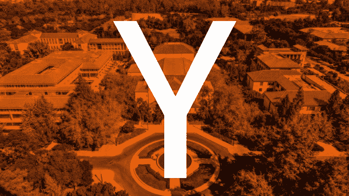

# 今年秋天，Y Combinator 将在斯坦福大学教授一门关于创业的课程

> 原文：<http://techcrunch.com/2014/09/16/y-combinator-will-teach-a-class-on-startups-at-stanford-this-fall/?utm_source=wanqu.co&utm_campaign=Wanqu+Daily&utm_medium=website>

创业加速器 Y Combinator 是创业者在艰难的创业过程中寻求指导的有用资源。不幸的是，这是一个非常资源密集型的项目，因为加速器的合作伙伴只能在不过度紧张的情况下将时间投入到如此多的创业公司中。

虽然每年有数百名企业家通过该项目，但世界上还有数千人可以从 YC 大学的课程中受益。Y Combinator 总裁萨姆·奥尔特曼表示，他大约在一年前开始考虑这个想法，结果是在斯坦福大学开设了一门名为[“如何创业”的新讲座](http://startupclass.samaltman.com/)

从今天开始的一周内，这门课将提供一系列的讲座，包括你如何获得和评估想法，筹集资金，制造一个人们会喜欢的产品，以及成长。虽然奥特曼将主持前两次讲座(每周两次，持续 10 周)，但计划并不是简单地让 Y Combinator 的合伙人停下来，闲聊他们对创业公司的想法——尽管有人会认为这足以吸引一群人。

相反，加速器正在引进硅谷投资界的知名人士，在他们最著名的领域授课。演讲者名单包括行业重量级人物，如保罗·格拉厄姆、彼得·泰尔、马克·安德森、罗恩·康韦、本·霍洛维茨和玛丽莎·梅耶尔，每个人每次演讲有 50 分钟的时间来讲述他们认为的主题要点。

奥尔特曼指出，虽然讲座肯定会给与会者提供知识，帮助他们自信地起步，但它们不能取代完整的 YC 体验。他在电话中告诉 TechCrunch，“创业所需的建议中，可能有 30%是通用的，本课程涵盖了这些建议。”。

一个关于 Y Combinator 的常见观察是，在某些方面，它似乎就像是科技界的商学院。在最近[新闻天才对《信息报》一篇文章的注释中，](http://news.genius.com/Eric-newcomer-venture-firms-fret-as-y-combinator-soars-annotated)奥特曼写道，“我不认为我同意这个比喻——我们在 YC 资助的人中，很少有人在商学院和 YC 之间做出决定。更准确地说，我们正在扰乱在谷歌或脸书的工程工作。”

YC 在斯坦福大学的新班级似乎遵循了这一模式。这门课在计算机科学系教授，并且只限于工科学生。

尽管如此，一个 250 人的场地似乎并不是试图接触成千上万想听听该课程讲师所讲内容的人的最佳场所。这就是为什么每次讲座开始后不久就可以在 YouTube 和 iTunes Connect 上看到，相关的阅读材料和作业也会链接到课程网站上。为了与远方的听众保持联系，将会有一个论坛和脸书小组来讨论他们的内容，并提供进一步的机会向那些参与创业的人学习。