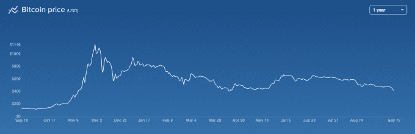

# 比特币跌破 400 美元 TechCrunch

> 原文：<http://techcrunch.com/2014/09/19/bitcoin-slips-back-under-400/?utm_source=wanqu.co&utm_campaign=Wanqu+Daily&utm_medium=website>

# 比特币跌回 400 美元以下

在从年中的高点稳步下跌后，比特币现在回到了 400 美元以下。加密货币在 4 月份达到这一水平，当时 [TechCrunch 指出](https://beta.techcrunch.com/2014/04/10/bitcoin-falls-below-the-400-mark-down-more-than-60-from-its-all-time-high/)这种货币比其历史高点下跌了 60%。

比特币价格回升。然后就再也没有恢复。和之前一样的问题:“比特币会到达下一个百年关口？300 美元还是 500 美元？”上一次，答案是 500 美元。但到目前为止，过去并不能很好地预测比特币。

这是图表，[由比特币基地](https://coinbase.com/charts)提供:

今年，比特币出现了一个近乎悖论的现象:随着接受度的提高，以及媒体不断追问比特币是否会消亡的周期放缓，比特币的价格出现了下滑。在每枚硬币 400 美元的情况下，采矿业务的盈利比例是多少？

如果比特币的价格继续下滑，同时拖累消费者的兴趣，这是否意味着比特币的采用可能会出现类似于“通缩”的情况，从而可能将其降级为利基市场？