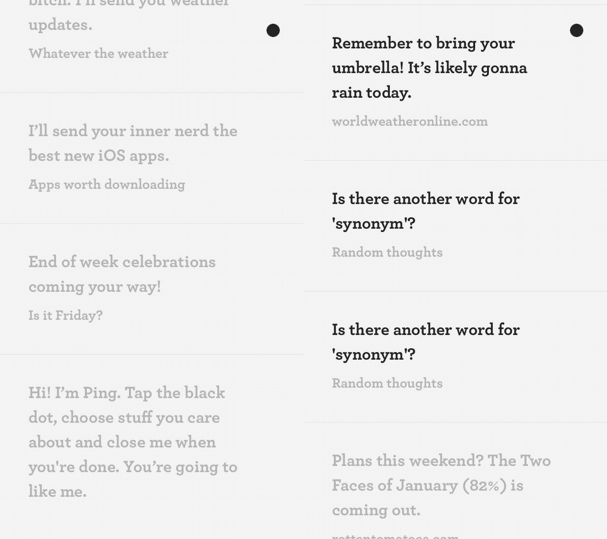

# 体验来自 Secret 的新应用 Ping

> 原文：<http://thenextweb.com/apps/2014/09/27/hands-ping-mysterious-new-app-people-behind-secret/?utm_source=wanqu.co&utm_campaign=Wanqu+Daily&utm_medium=website>

匿名分享应用 [Secret](http://secret.ly) 背后的公司推出了一款新的应用，Ping，它试图成为你新的最好的朋友。

这款应用适用于 [iOS](https://itunes.apple.com/US/app/id922669797?mt=8) 和 [Android](https://play.google.com/store/apps/details?id=ly.secret.ping) ，简单而神秘，甚至应用商店列表也只提供了“你会喜欢我”的描述。一旦启动，你只需点击黑点，从一个看似随机的类别列表中选择你喜欢的，比如随机想法、Twitter 上的趋势、值得下载的应用以及“今天是周五吗？”

然后，Ping 会根据你的选择，向你发送它认为你会喜欢的东西的推送通知。从我收到的一些通知来看，似乎是推荐一部受欢迎的电影，警告我今天会下雨，并思考着“如果科比吞下你，他会获得什么超能力？”

目前还不清楚这些信息从何而来，但 Ping 的妙处在于其不可预测的推荐。我喜欢不知道它接下来会提供什么，每个通知都是我期待阅读的。就像是给你今天的一个小惊喜。

[

<noscript></noscript>](https://thenextweb.com/wp-content/blogs.dir/1/files/2014/09/ping.jpg) 

Ping 似乎也不经常通知，只是偶尔选择发送通知。你还不能用这个应用做更多的事情；你现在不能请求推荐*了*也不能做除了滚动以前的通知之外的任何事情，但是这种简单令人耳目一新。

Secret [告诉 Recode](https://recode.net/2014/09/26/startup-behind-anonymous-app-secret-unveils-another-new-app-ping/) 该 app 与公司主 app 无关，不与其共享信息。首席执行官 David Bytow 还表示，Ping 将随着时间的推移“不断发展并适应您的需求”，因此，看看它在未来几天如何发展会很有趣。

➤平[ [iOS](https://itunes.apple.com/US/app/id922669797?mt=8) ，[安卓](https://play.google.com/store/apps/details?id=ly.secret.ping)

<footer class="c-article__pubDate md:flex md:justify-between">

发布时间<time datetime="2019-02-11 12:07:00">世界协调时 2014 年 9 月 27 日晚 9:54</time>

[Back to top](#)</footer>