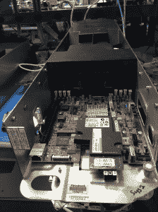
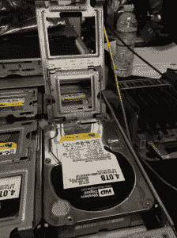
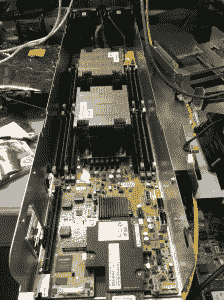

# 谈到脸书规模，你可以扔掉规则手册 TechCrunch

> 原文：<http://techcrunch.com/2014/09/24/when-it-comes-to-facebook-scale-you-can-throw-out-the-rulebook/?utm_source=wanqu.co&utm_campaign=Wanqu+Daily&utm_medium=website>

硬件工程中有一些特定的做事方式，工程师只是简单地遵循这些规则，因为即使他们想反对也没有用。坦率地说，大多数人甚至不会考虑它，因为它只是一个既定的，但在最近参观脸书的硬件实验室时，工程总监马特·考德里(Matt Corddry)表示，脸书秤要求他们重新思考旧的规则，让工程师们在行业标准之外进行想象。

由于脸书已经开始建造自己的大部分硬件，这意味着工程师可以重新思考事情是如何做的，当你建造脸书规模的设备时，它需要创造性思维。“我们比外部供应商更了解我们的挑战、成本、运营环境和需求，我们能够专注于脸书的特定需求，”Corddry 最近告诉我。

Corddry 解释说，脸书鼓励这种创造性思维的方法之一是让工程师们跨专业工作并相互交流。“我发现，你需要给工程师提供学习经验，以找到优化方法，打破界限，进行跨学科讨论，”他说。

脸书发现，当工程师们一起工作而不是孤立工作时，有趣的事情开始出现。“许多人将这些工程团队孤立起来，包括服务器、存储、数据库等等。我们不会制造这些障碍，”他说。“我们将不同的团队聚集在一起，寻找解决问题的新方法。”

他们做的另一件事是，许多公司，甚至是硬件制造商都没有做到的，那就是他们把工程师带到他们的数据中心，观察人们如何维护他们设计的设备。当你看到有人取出 6 颗螺丝(或 16 颗)来更换硬盘，而你一年需要这样做数百次时，你开始意识到需要一种更简单的方法。

这就是他们设计此处所示磁盘阵列的方式。它的设计无需螺丝即可轻松维护。您只需翻转大的绿色拉杆滑出阵列，将小的绿色拉杆弹出到需要更换的硬盘前面，提起铰接盖(如下所示)，拉出硬盘并插入新硬盘。根本不涉及螺丝，当你有脸书秤时，你需要考虑这些类型的问题。

他说，我所看到的磁盘阵列设计已经随着时间的推移进行了迭代，以使其尽可能易于维护。有可能他们还没有完成。

相比之下，Corddry 告诉我，他与一位未透露姓名的供应商的硬件工程师交谈过，他承认自己从未见过技术人员试图修复他的设计。当你不考虑维护的时候，它会显示出来，我们都处理过有太多小螺丝和不良放置的设备。你最终会因为摩擦机器内部而导致指关节流血，这一点都不好玩。

当你处理几台机器时，那就麻烦了。当你面对成千上万的人时，情况就不同了。

脸书工程师跳出框框思考的另一种方式(字面上)是服务器设计。Corddry 告诉我，工程师们习惯于服务器设计必须适合 2u 机架，但他允许他们忘记这一点，想象一下如果没有机架限制，他们将如何设计服务器。

当他们把那些限制抛在脑后，它打开了各种可能性。工程师们自行设计了一个狭长的盒子。脸书设计了一个架子来适应新的尺寸。当你是脸书的时候，你可以负担得起。盒子滑出机架，顶部滑落-同样没有螺钉-正如你从下面的图片中看到的，工程师布置了盒子，这样你就可以一眼看到不同的部分。正如一位看了这些照片的硬件工程师朋友指出的那样，一些设计原则仍然适用于你相对于 CPU 的内存位置以及你希望信息传输的距离，但脸书再次允许其工程师打破设计模式，做自己认为正确的事情。

Corddry 说，这个想法是将专注于狭窄和深度的专家与广泛的多面手放在一起，采用黑客马拉松式的方法，让他们解决这些设计问题，他们真的会想出创造性的方法来解决更困难的设计问题。

值得注意的是，当他们完成生产这些独特形式的硬件时，他们将它们开源到开放计算项目，在那里设计被交付给设计师社区，以进一步解决规模计算问题，并找出方法来生产更易于维护、运行效率更高、在整个生命周期中管理更具成本效益的硬件。