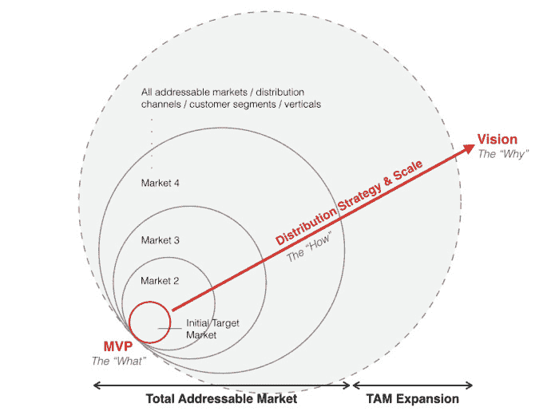

# 投球视觉指南-第一版

> 原文：<http://versiononeventures.com/visual-guide-pitching/?utm_source=wanqu.co&utm_campaign=Wanqu+Daily&utm_medium=website>

有很多很棒的文章概述了一个企业家在推销中应该涵盖的内容，但很少有人讨论 T2 如何以令人信服的方式传递这一信息。这就是为什么我在今年早些时候写了“[一个好故事是任何推介的关键](http://versionone.vc/good-story-key-to-pitch/)”。

我想我会用我的讲故事视觉指南重温这个话题。

几乎每次与企业家或投资伙伴会面时，我都会被问到，当我们评估投资机会时，我们在寻找什么。显而易见的答案是[一个一流的团队](http://www.inc.com/will-yakowicz/boris-wertz-5-entrepreneurial-traits.html)，但事实远不止如此。下面，我画出了我如何将一个典型的清单映射到一个框架中，以帮助您更好地理解我们在推销中所倾听的内容。

[

<noscript></noscript>](http://versionone.vc/wp-content/uploads/2014/09/Storytelling.0011.jpg) 

那么，在推销期间，你如何着手画这幅画呢？以下是一些建议:

*   **从分享你的愿景开始(“为什么”)**。我喜欢知道一个创始人为什么要建立他或她的企业。当我能够理解并认同创始人的动机、价值观以及对世界的总体看法或视角时，我会感到兴奋。这就是为什么传达你的愿景是为你的推介搭建舞台的最佳方式。

*   **描述并演示到目前为止你已经建立了什么(“什么”)**。对你的宏伟愿景的初步验证是你的 MVP。我总是建议浏览一下你的产品的简短演示，因为它为你未来的目标提供了基础，并帮助我们回答那个至关重要的问题:成为一个品类的领导者是可能的，还是不切实际的白日梦？在第一版中，我们很少在构思阶段投资。我们希望看到吸引力——特别是，你能多快抓住你的目标市场或垂直**以及这些早期用户的参与程度。

*   **完成你的成长计划(“如何”)**。在你展示了你对产品设计和开发的强烈感觉后，我们想知道你将如何建立一个超越功能的真正的企业。因此，需要回答的核心问题是分销和规模，以及你的[商业模式](https://gist.github.com/ndarville/4295324)。一些示例问题包括:*你获取客户的策略是什么？通过网络效应付费还是有机？你的内向和外向销售渠道和流程是什么样的？怎么能扩大 TAM**？你如何从一个对你的产品最有热情的服务不足的用户转向一个竞争更加激烈的市场中的更多的用户？你是* [*“卖给少数人”还是“卖给许多人”*](http://versionone.vc/selling-enterprise-sell-vs-sell-many/) *？你的产品如何演变成你更宏伟的愿景(即你的产品路线图)？*我们知道初创公司的生命周期会发生很多变化。虽然我们不会要求创始人回答每一个问题，但我们当然希望了解他们如何看待自己的业务和未来的机遇。

* *注意:我使用的“市场”或“垂直”一词适用于能够以这种方式扩张的公司(如亚马逊、易贝等)。).然而，该图仍然适用于从小众受众(按人口统计、地理位置)向大众扩展的平台，以及从个人用户或 SMB 向企业扩展的 SaaS。

**提出你的原因、目标和方式**

许多企业家犯了一个错误，向投资者推销，就像他们向顾客推销一样。是的，我们投资的公司正在为客户解决真正的难题，了解这一难题以及您如何提供帮助对我们来说非常重要。然而，除了您已经建立的，我们还投资于未来。

推销“什么”作为你正在做大事的证据，但永远记住投资者买的是“为什么”。毫无疑问，你有宏伟的计划来实现它，现在就让我们知道吧。