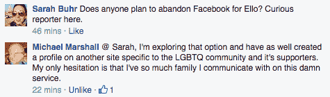
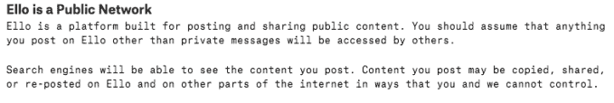

# 不，人们不会为了 Ello TechCrunch 而成群结队地离开脸书

> 原文：<http://techcrunch.com/2014/09/29/no-people-are-not-leaving-facebook-in-droves-for-ello/?utm_source=wanqu.co&utm_campaign=Wanqu+Daily&utm_medium=website>

Ello 不是第二个脸书，脸书用户也不会成群结队地离开这个社交网络巨头。我怎么知道这个？那些拥有闪亮的新 Ello 个人资料的人正在脸书上发布关于它的消息。

尽管有一个没有广告的网络的承诺，并且有机会给自己起一个你想起的名字，但是如果没有一些大的激励，人们不会离开一个为他们工作的网络。吹嘘你收到了邀请是不够的。

在这一点上，拖拉社区可能有一些离开的动机。脸书仍然拒绝让女王们保留她们选择的艺名，并给了她们一个宽限期来将她们的个人资料页面改成她们的出生名，否则将面临个人资料被删除。尽管[其他报道](http://www.pcworld.com/article/2688532/5-reasons-why-ello-isn-t-the-second-coming-of-facebook.html)称 LGBT 群体在某种程度上引领了 Ello 人气的突然上升，但这根本不是真的。我采访过的男扮女装的人都没提到他们会跳槽。“我认为人们两者都在使用。“尽管脸书很糟糕，但要戒掉它还是很难，”广受欢迎的科幻男扮女装者赫克琳娜说。另一名脸书用户也发帖表示他对离开脸书犹豫不决，称他正在考虑，但脸书是他所有朋友和家人的地方。

Ello 绝对有一个时刻。据报道，它现在每小时收到 4 万个邀请请求。

尽管如此，即使有所增长，该网站目前也不具备其他网站所具备的保持社区回头率的内在粘性。当然，它还处于测试阶段，因此人们不应该期望这个网站是完美的，但是有了这么多的增长和无穷无尽的邀请，这个网站可以很开放地说它处于测试阶段。事实上，它发展得如此之快是一个悲剧。[功能列表](https://ello.co/wtf/post/privacy)实际上看起来很酷。然而，它的大部分都没有构建好或者不能很好地工作。

搜索功能应该是 Ello 的最高优先级，尤其是在这种增长情况下。Ello 的用户界面非常简单，这使得这个功能很难找到。搜索选项不起作用，网站只是给你提供一堆可以关注的人，没有任何关于你为什么应该关注他们的背景。你找不到你的朋友，即使有他们的名字。前往噪音区，你会看到各种各样的图片，包括色情图片。据我所知，一些迪克的照片夹杂着一些自拍和一只可爱的考拉。目前无法过滤此部分或阻止不需要的图片。

还有一个明显的隐私问题，可能会让变装社区和其他人容易受到网络欺凌。拖动女王 Creatrix Tiara 点[在她的 Tumblr 页面](http://notyourexrotic.tumblr.com/post/98292236476/goodbye-ello-privacy-safety-and-why-ello-makes-me)出来，该网站，“..没有任何阻止或报告个人的功能，也没有任何同意被跟踪的方式。”她说，这实际上让她更容易受到虐待，而不是更少。

也有模仿的可能。一个冒名顶替的马克·扎克伯格(Mark Zuckerberg)盗用了这位脸书首席执行官的个人资料，并假装是他开始发帖。Ello 特别将“模仿他人”列为虐待行为，但却未能抓住这一特征并将其删除。目前，除了向网站上列出的通用电子邮件地址发送消息之外，没有其他方法可以报告这种滥用行为。

Ello 自己的[隐私政策](https://ello.co/wtf/post/privacy)警告用户，他们发布的任何内容都可以通过搜索找到:

还有一个问题是，Ello 实际上打算如何在不卖广告的情况下赚钱。投资者想知道该网站计划如何盈利。Ello 声称，它计划[提供免费增值模式，但提供一些付费功能](https://ello.co/wtf/post/why-no-ads)。它以后会卖广告吗？也许吧。或者它会出售你的数据。Ello 告诉我们，我们是在其他社交网络上买卖的产品。然而，该网站的隐私政策暗示了未来的销售功能，警告称将向第三方出售个人信息。

> 我们可能会在几种情况下与第三方分享您的个人信息，包括(1)如果您告诉我们这样做是可以的(2)如果我们认为我们需要依法这样做(3)如果我们与第三方服务提供商签约为您提供服务-例如，如果您决定通过 Ello 购物，则与信用卡处理公司签约。

在这个新生阶段，安全和稳定也是有问题的。Ello 本周末已经遭受了第一次 DDoS 攻击。在网站创建者能够屏蔽相关 IP 地址后，这种情况似乎已经停止。

也许创作者并不希望增长如此之快，一切都将在“公开”发布前修复，但它看起来只是另一个社交网络，没有脸书提供的一切，加上一些严重的漏洞。公司有一个机会把事情做好。增长如此之快，实际上只有十分之一的功能可以工作，这可能会让人们失去兴趣。当这个东西不工作的时候，谁还想再去买呢？