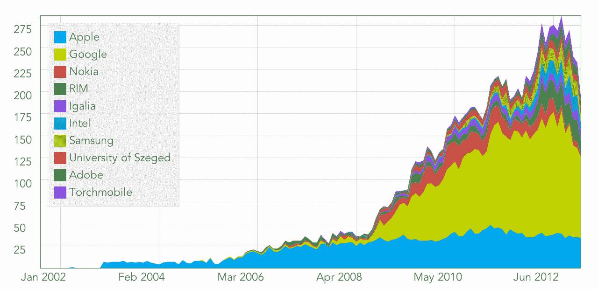

# 虚伪:努力编码或者回家

> 原文：<http://hypercritical.co/2013/04/12/code-hard-or-go-home?utm_source=wanqu.co&utm_campaign=Wanqu+Daily&utm_medium=website>

* * *

# 努力编码或者回家

<time datetime="2013-04-12T19:53:27-04:00">April 12, 2013 at 7:53 PM</time> by [John Siracusa](/about/)

当苹果在 2001 年决定开发自己的网络浏览器时，它选择了来自 [KDE](http://en.wikipedia.org/wiki/KDE) 项目的 [KHTML](http://en.wikipedia.org/wiki/KHTML) / [KJS](http://en.wikipedia.org/wiki/KJS_(KDE)) 作为其渲染引擎的基础。苹果不仅仅是“采用”了这项技术；它获取源代码并运行，雇佣了一群聪明、有经验的开发人员，给他们所需的时间和资源，在几年的时间里大规模改进 KHTML/KJS。于是， [WebKit 诞生了](http://en.wikipedia.org/wiki/Webkit#Origins)。

在开源软件的世界里，这是维护项目“所有权”的唯一合法方式:通过贡献最大的——最好的——变更，成为开发过程背后的驱动力。当 WebKit 跑在前面时，苹果没有动力帮助 KHTML 保持同步。这两个项目有不同的目标和非常不同的限制。KDE 最终[并入了 WebKit](http://kde.org/announcements/4.5/platform.php) 。尽管 KHTML 的开发还在继续，但是 WebKit 显然已经把它抛在了后面。

当谷歌在 2008 年推出自己的网络浏览器时，它选择了 WebKit 作为其渲染引擎的基础。谷歌选择加入现有的 WebKit 社区，而不是[分出](http://en.wikipedia.org/wiki/Fork_(software_development))自己的基于 WebKit 的引擎。当时，苹果显然是 WebKit 世界的老大。但只要看看谷歌加入派对后发生了什么。(数据来自[比特尔格](http://bitergia.com/public/reports/webkit/2013_01/)。)

 WebKit:已审核的提交

WebKit:活跃作者

根据这些图表，并了解苹果和谷歌在过去十年间的历史，两件事情中的一件似乎是不可避免的:要么谷歌将成为 WebKit 开发的新的事实上的“所有者”，要么它将创建自己的 WebKit 分支。原来是后者。于是，[眨眼就诞生了](http://www.chromium.org/blink)。

谷歌已经证明了它有能力、经验和资源来开发世界级的网络浏览器。它让[拥有自己的 JavaScript 引擎](http://en.wikipedia.org/wiki/V8_(JavaScript_engine))，拥有自己的[多进程架构](http://en.wikipedia.org/wiki/Google_Chrome#Stability)以实现稳定性和代码隔离，并对 WebKit 本身进行了大量改进。现在它也控制了渲染引擎。

这给苹果带来了什么？所有有争议的代码都是开源的，所以苹果可以自由地将 Blink 的改进引入 WebKit。当然，谷歌没有多少动力来帮助这一努力。此外，Blink 是一个明确声明的分支，可能会迅速偏离其 WebKit 起源。来自[谷歌关于 Blink](http://blog.chromium.org/2013/04/blink-rendering-engine-for-chromium.html) 的新闻稿:“我们预计我们将能够立即删除 7 个构建系统和超过 7000 个文件——包括超过 450 万行。”(栅栏另一边的[也在进行一些精简](https://lists.webkit.org/pipermail/webkit-dev/2013-April/024388.html)。)

苹果——以及 WebKit 社区的其他人——是否有能力和技能继续推动 WebKit 向前发展，赶上谷歌对 Blink 的宏伟计划？简单的回答是，“当然有！苹果创建了 WebKit 项目，在谷歌开始贡献之前，它进展得很好。”但是我看着这些图表，不禁想知道。

WebKit 最近的历史也让我犹豫。谷歌[不想将其多进程架构贡献给 WebKit 项目，所以苹果创造了自己的解决方案:有点令人困惑的命名](https://news.ycombinator.com/item?id=5490242) [WebKit2](http://trac.webkit.org/wiki/WebKit2) 。当 Google 选择将进程管理放入浏览器应用程序时，Apple 将多进程支持放入了 WebKit 引擎本身。这意味着任何使用 WebKit2 的应用程序都可以获得多进程隔离的好处，而不必做任何特殊的事情。

这一切在理论上听起来很棒，但在(几年的)实践中，谷歌的 Chrome 被证明在面对行为不端的网页时比苹果基于 WebKit2 的 Safari 更加稳定和有弹性。我一整天都在运行这两个浏览器，几乎每周我都会在 Safari 中面对可怕的“[网页没有响应](/2013/04/img/web-pages-are-not-responding.png "I wasn’t sure I’d be able to find a clean screenshot of this dialog box, but I needn’t have worried.  One appeared on my own Mac while writing this article.")”对话框，它邀请我重新加载每个打开的标签页以恢复正常操作。

## 安卓王子

拥有控制基础技术的开发人才是企业自力更生的另一个方面。三星的智能手机业务目前依赖于另一家公司开发的[平台](http://www.android.com)。利用他人的工作可以节省时间和金钱，但如果三星对其最赚钱的产品线之一的基础有更多的控制权，它无疑会舒服得多。

问题是，我不认为三星有专业知识来独自完成一个假设的 Android 分叉。开发一个现代操作系统及其相关的工具链、文档、开发者支持系统、应用商店等等是一项巨大的任务。历史上只有少数几家公司大规模成功做到了这一点——三星不是其中之一。当然，这是可能的，但这并不容易，需要多年的努力。我打赌三星不会成功。

也可以通过基于开发者的自力更生的视角来看待 Facebook Home。脸书显然希望确保它是移动计算未来的重要组成部分，但当你“只是一个网站”时，这并不容易做到 Home 让脸书在现有的基于安卓系统的智能手机上成为焦点。

脸书将其移动战略建立在其死敌谷歌控制的平台上似乎是不明智的。但也许 Home 只是一个长期计划的第一步，这个计划最终将导致 Android 的脸书分叉。如果是这样，问题不可避免地随之而来:没有谷歌的帮助，脸书真的能拥有自己的平台吗？

脸书已经证明，它可以扩大自己的技能组合。在过去的几年里，它一直在雇佣[有才华的设计师](http://www.mikematas.com)并收购[有着成熟设计理念的公司](http://www.madebysofa.com)。Facebook Home 是这些努力的第一个成果，从各方面来看，其用户界面展现出的精致程度更像是苹果公司的产品，而非脸书。

不过，锁屏替换和完整的操作系统相差甚远。也许脸书只是打算骑熊，依靠谷歌尽可能长时间地做维护和推进平台的繁重工作，而脸书慢慢接管越来越多的用户体验。

有些人想知道，如果源代码是免费的，谷歌怎么可能在 Android 生态系统中拥有任何权力。Facebook Home 被认为是谷歌效率低下的一个例子。他们说，看看谷歌最大的敌人之一是如何愚弄它的。谷歌做了所有的艰苦工作，然后脸书在最后一分钟加入进来，并为自己的目的吸收了所有的工作。

但是再看看上面的[图](#graphs)。现在想象一下 Android 源代码的类似图形。任何拥有基于 Android 产品的公司，想要真正摆脱谷歌的控制，都必须准备好——并且能够——匹配谷歌的产出。操作系统不会自己写；平台不维护自己；开发者需要工具和支持；技术在进步。仅仅修复错误和支持新硬件是不够的。为了在 Android fork 上取得成功，一家公司必须像苹果从 KHTML 衍生出 WebKit 那样推动开发，就像谷歌从 WebKit 衍生出 forks Blink 那样。

这不是一款[即时战略游戏](http://en.wikipedia.org/wiki/Real-time_strategy)。像三星和脸书这样的公司不能只是开采更多的资源，建造新的开发商[兵营](http://starcraft.wikia.com/wiki/Barracks "hatcheries?")。在一个新领域积累专业知识需要多年的共同努力——在招聘方面，一点点运气也没有坏处。

脸书可能已经进行了几年。最近对神秘的、可能与操作系统相关的初创公司 [osmeta](http://osmeta.com/about/) 的收购提供了另一个数据点。与此同时，三星刚刚加入了一个探索性项目，即[开发一个新的网络渲染引擎](http://blog.mozilla.org/blog/2013/04/03/mozilla-and-samsung-collaborate-on-next-generation-web-browser-engine/)。

谷歌当然也有自己的问题，但最终可能拯救它的是它处理雄心勃勃的软件项目并取得成功的能力。摆在脸书、三星和其他觊觎安卓宝座的公司面前的挑战是显而易见的。正如[的智者](http://en.wikipedia.org/wiki/Omar_Little)曾经说过的，你来到朝，你最好不要错过。

* * *

2010-2022 年约翰·锡拉库扎