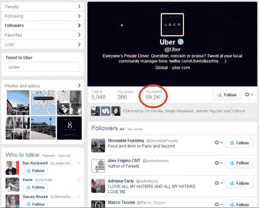
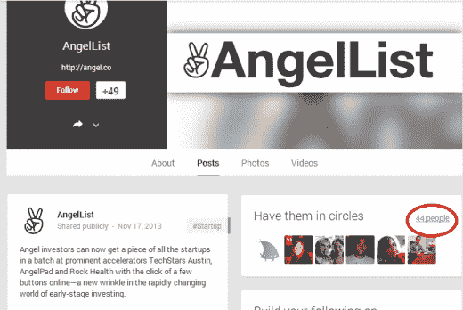
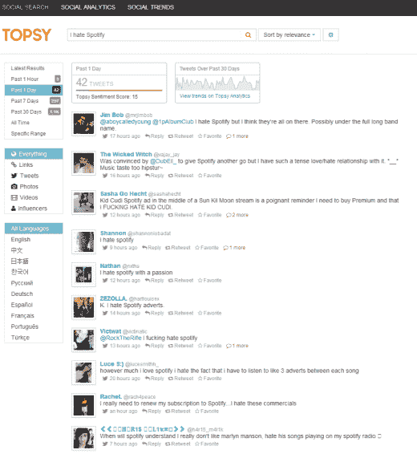
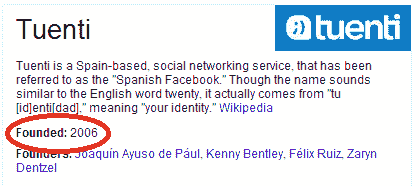
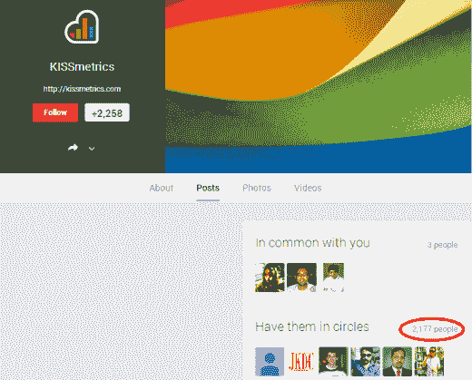

# 你可以从成功公司合法窃取的 7 样东西

> 原文：<http://thenextweb.com/entrepreneur/2014/02/20/7-things-can-legally-steal-successful-companies/?utm_source=wanqu.co&utm_campaign=Wanqu+Daily&utm_medium=website>

*[丹尼斯·杜沃切尔](https://www.twitter.com/desduvauchelle)是 [Twoodo](http://www.twoodo.com?track=thenextweb&article=6thingsyoucansteal&link=one) 的首席执行官和联合创始人，帮助你的团队使用简单的#标签组织自己。*

* * *

创新的本质，也是很多初创企业的立身之本，就是从已有的理念中模仿和改编。新的想法大多是对过去想法的渐进改进，正如我们作为一个生物物种已经进化了几个世纪。例如，我们 Twoodo 正在努力使团队协作工具变得更好。

在商业中，有一件事永远不会过时，那就是了解你的客户——这是因为我们经常弄错。太多时候，我们依靠自己狭隘的世界观来告诉我们，我们认为谁会使用我们的产品或服务。

从头开始收集数据是一个令人生畏的前景。好消息是，稍加研究，您会发现已经为您收集了大量数据。

你只需要知道去哪里找。通常它离你的竞争对手不远。

### 1.借用他们的推特粉丝

除非你进入了一个“蓝海市场”，否则很可能至少有 10 家其他更成功的公司正在做你现在正在尝试做的事情。

不过没关系！这意味着有 10 家公司有对你的服务感兴趣的人的精选名单。

这就是劫持开放社交平台的原因。Twitter 就是一个著名的例子。只要点击竞争对手公司的“关注者”列表，你就有了一个值得了解的 Twitter 账号列表。

如果您只想获得一个客户的主要影响者列表，[使用这个工具](http://simplymeasured.com/freebies/twitter-follower-analytics)来生成数据。如果你想要竞争对手追随者的更全面的数据，你可以[使用这个工具](http://www.twitonomy.com/)。尽早与有影响力的人建立联系很重要，这样他们就可以成为你品牌的传播者。

[

<noscript></noscript>](https://thenextweb.com/wp-content/blogs.dir/1/files/2014/02/twitter-followers.png) 

同样，在 Google+上，你可以进入一个页面，点击查看某个品牌的关注者是谁。与他们联系很容易，一旦你联系上了，G+允许你发送邮件通知他们你的更新或分享的新闻。

我不是建议你应该联系他们给他们发垃圾邮件或者告诉他们你的服务更好。但是，开始一场对话，找出他们喜欢你的竞争对手或对你的竞争对手感到沮丧的原因，是找到重要信息的一个好方法。你会惊讶于有多少人愿意分享他们的经历。

如果你想充分利用 Google Plus 的增长潜力，这里有一篇很酷的文章,讲述如何增长黑客 Google Plus！

[

<noscript></noscript>](https://thenextweb.com/wp-content/blogs.dir/1/files/2014/02/Gplus-find-followers.png) 

[T9】](https://thenextweb.com/wp-content/blogs.dir/1/files/2014/02/Gplus-find-followers.png)

### 2.窥探他们的功能请求

想要确保你的新应用不会陷入你的竞争对手曾经陷入的陷阱吗？查看他们的“功能请求”列表和过去的常见问题，了解用户/客户发现哪些挑战。

只需进入你喜欢的搜索引擎，输入“公司功能请求”即可

你可以通过避免你的竞争对手过去所犯的错误来创建一个改进的业务，也可以通过提供用户要求的功能(但还没有开发出来)来争取领先。完全合法，完全为用户服务。

[

<noscript></noscript>](https://thenextweb.com/wp-content/blogs.dir/1/files/2014/02/Snapchat-Support.png) 

### 3.战胜他们的敌人

这就像在托普斯输入“我讨厌 XXX”一样简单，看看谁讨厌这家公司，为什么。这也是发现人们讨厌/喜欢/想要的功能，并将这些信息整合到你的业务中的好方法。

抓住他们的 Twitter 手柄，为他们提供你的卓越服务！小心别成为他们的下一个出气筒！

[

<noscript></noscript>](https://thenextweb.com/wp-content/blogs.dir/1/files/2014/02/Twitter-Search-Monitoring-Analytics-Topsy.com_.png) 

### 4.利用他们不能无处不在的优势

这在北美不会构成太大的挑战，因为英语和西班牙语几乎覆盖了整个人口。然而，走出泡沫，进入欧洲、非洲和亚洲，你会发现，用当地语言提供的几乎是模仿的服务是一项利基业务，足以让你成为一笔好生意。

这里有一个早期的例子:

[

<noscript></noscript>](https://thenextweb.com/wp-content/blogs.dir/1/files/2014/02/tuenti.png) 

Tuenti 作为西班牙社交网络在西班牙成立，当时脸书在美国只允许 13 岁的学生上网。

西班牙有 5000 万人口——足够创始人享受高收入了。这证明，如果没有别的，你可以用语言作为你的利基。

### 5.…以及他们不能做任何事情

并购有人吗？这是您对常见问题和功能请求的研究有用的另一个领域。

建立一家公司或开发一些功能来满足你的大型竞争对手的需求。然后，协商合作关系或者互相买断。

一个著名的例子是[易贝收购了 PayPal](http://investor.ebay.com/releasedetail.cfm?releaseid=84142) 和 iBazar(一个欧洲在线市场),因此获得了一个支付系统和一大洲的客户，这些客户可以转化为易贝用户。

如果你决定走这条路，你必须迅速行动起来，以防你心目中的公司大到足以自己建立一个解决方案。

### 6.借用他们的人口统计数据

访客和顾客的数据正在大量生成。这不仅限于网站——有初创公司正在开发使用街头摄像头来分析谁走进了商店。

尽管这些数据大多是隐藏的或受法律保护的，但网上还是有一些花絮可以让你对你的目标市场有所了解。例如，[如果你的目标是美国女性](http://expandedramblings.com/index.php/pinterest-stats/)，那么不上 Pinterest 就是疯狂。Pinterest 拥有 80%的女性用户，其中 20%是美国女性。

如果你坚持使用搜索引擎，还有其他种类的数据可以帮助你建立关于潜在用户的信息。如果你是一家游戏公司，知道[玩《糖果粉碎》](http://techcrunch.com/2013/11/15/ahead-of-possible-ipo-king-reveals-candy-crush-hits-half-a-billion-installs-150-billion-plays-to-date/)的人在晚上 6 点到 9 点和周日做这件事是很有趣的。

这对您的营销工作和现场客户支持非常重要。这里有一个了解竞争对手用户的方法:

1.  选择一个社交网络平台(这里我们用 G+)
2.  转到你的竞争对手的页面
3.  点击右边的“让他们围成圈”
4.  查看粉丝列表，包括联系方式、地理位置、电子邮件(经常)、爱好和大量令人敬畏的定性客户信息

[

<noscript></noscript>](https://thenextweb.com/wp-content/blogs.dir/1/files/2014/02/kiss-community.png) 

我最近和脸书做的一个实验也带来了一些有趣的结果。我加入了一个兴趣小组(Arduino boards)，并在所有有这个选项的成员上点击了“添加好友”(有很多)。

很多人在确认我是一个合法的人后又把我加了回来。一旦我与足够大的群体样本建立了联系，我就能够找到诸如年龄、性别、地点、行业等数据。

当你试图找出谁是你的理想客户时，这就是黄金。

### 7.劫持他们的搜索引擎排名

如果你在谷歌上搜索关键词，你可能会在第一页结果中看到一堆竞争对手。如果他们在第一页，那么他们必须做一些正确的反向链接策略。想象一下，如果你的网站有相同的反向链接，不仅是第一个结果，而且是前 10 个结果中的每一个，这将是多么强大！

只要几个步骤和一点努力，这是可能的。好消息是，你可以准确地看到这些竞争对手使用的反向链接策略。

你可以找到所有你的竞争对手链接的网站、博客、论坛或在线杂志。一旦你有了这个列表，你就可以开始忙碌，通过评论相同的博客文章，从相同的博客上请求客座博文，在相同的论坛上发帖等等来复制它们。

Matthew Woodward 为这种增长黑客创造了一个全面的指南。你很快就会出现在你的目标关键词的前 10 名结果中——显然它甚至可以在谷歌的算法更新中存活下来。

这是一个有着坚实基础的长期 SEO 一个从早期开始的有用习惯。

### 有什么东西是我不该偷的(我是说借的)？

受到其他企业的“启发”或“采用其他企业的特点”是常见的做法。与任何决定采纳你的想法并付诸实施的人打法律战既费钱又困难。专利法在世界各地的执行并不平等，在互联网上保守你的秘密很难。

甚至像三星和苹果这样的巨头也不能置身于这样的争议之上。据称，优步通过呼叫和取消出租车(从而获得司机的号码)，然后为他们提供一份工作，从竞争对手那里挖走司机。

这有多错？我不确定。市场道德是一个灰色地带。

*Top image credit:[Shutterstock](http://www.shutterstock.com/pic-129266471/stock-photo-lightbulbs-on-yellow-background-idea-concept.html)/[Peshkova](http://www.shutterstock.com/gallery-655432p1.html)T5】*