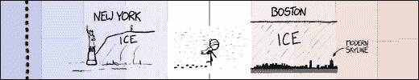

# xkcd:任务

> 原文：<https://xkcd.com/1425/?utm_source=wanqu.co&utm_campaign=Wanqu+Daily&utm_medium=website>

预购

*What If? 2*

(所有美国预购都符合条件)以及

[enter our contest](https://sites.prh.com/whatif2)

有机会赢得一个专门的漫画和如果博客帖子！

任务

此漫画的永久链接:

[https://xkcd.com/1425/](https://xkcd.com/1425)

图像 URL(用于热链接/嵌入):

[https://imgs.xkcd.com/comics/tasks.png](https://imgs.xkcd.com/comics/tasks.png)

一个人影站在一个女人身后，她正坐在一张放着电脑的桌子前。]]图:当用户拍照时，应用程序应该检查他们是否在国家公园里...女程序员:当然，简单的地理信息系统查找。给我几个小时。图:...并检查照片是否是一只鸟。女程序员:我需要一个研究团队和五年时间。在计算机科学中，很难解释容易和几乎不可能之间的区别。{{Title text:在 60 年代，马文·明斯基指派几个大学生花了一个夏天给计算机编程，让它使用相机来识别场景中的物体。他认为他们会在夏天结束时解决这个问题。半个世纪后，我们仍在努力。}}

 <map id="comicmap" name="comicmap"> </map> 

我喜欢的漫画:

[Three Word Phrase](http://threewordphrase.com/)

,

[SMBC](https://www.smbc-comics.com/)

,

[Dinosaur Comics](https://www.qwantz.com)

,

[Oglaf](https://oglaf.com/)

(nsfw)，

[A Softer World](https://www.asofterworld.com)

,

[Buttersafe](https://buttersafe.com/)

,

[Perry Bible Fellowship](https://pbfcomics.com/)

,

[Questionable Content](https://questionablecontent.net/)

,

[Buttercup Festival](http://www.buttercupfestival.com/)

,

[Homestuck](https://www.homestuck.com/)

,

[Junior Scientist Power Hour](https://www.jspowerhour.com/)

本作品根据[知识共享署名-非商业性使用 2.5 许可协议](https://creativecommons.org/licenses/by-nc/2.5/)进行许可。

这意味着你可以自由复制和分享这些漫画(但不能出售)。[更多详情](/license.html)。