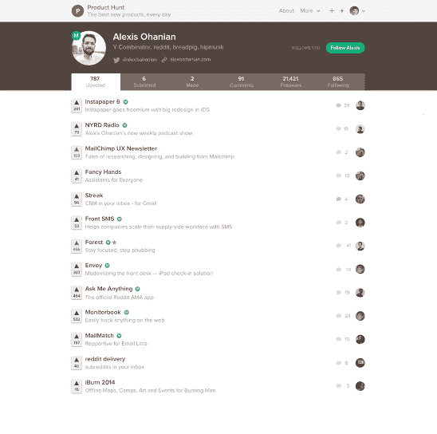

# Product Hunt 从 A16Z 和 Alexis oh anian TechCrunch 获得 610 万美元的首轮融资

> 原文：<http://techcrunch.com/2014/10/08/product-hunt-gets-6-1-million-series-a-funding-from-a16z-and-alexis-ohanian/?utm_source=wanqu.co&utm_campaign=Wanqu+Daily&utm_medium=website>

[Product Hunt](http://www.producthunt.com/) ，一个人们可以投票支持科技产品的社区委员会，[今天正式宣布在首轮融资中筹集 610 万美元，由](https://beta.techcrunch.com/2014/09/13/producthunt-raises-6-million-from-a16z/)[安德森·霍洛维茨](http://a16z.com/)牵头。Y Combinator 合伙人、Reddit 联合创始人亚历克西斯·奥哈尼安(Alexis Ohanian)作为该公司的新投资者参与了这一轮投资。

产品搜索的创始人瑞安·胡佛参加了 Y Combinator 的 2014 年夏季班，但他告诉我们，奥哈尼安实际上在 YC 日之前就迷上了他的网站。“加里·谭(Garry Tan)向亚历克西斯·奥哈尼安(Alexis Ohanian)介绍了我，我们用 Skyped 聊了一个小时。胡佛说:“他很快就明白了我们在构建什么，并就他在 Reddit 早期如何构建社区向我提供了建议。

Ohanian 说他投资 A 轮主要是因为他是产品的[用户，并且总是在网站上。“Ryan 和团队围绕该产品建立的社区给我留下了深刻的印象。很少有创业公司能做到这一点，鉴于我自己在 Reddit 和 Hipmunk 周围建立社区的背景，这是我作为投资者所寻求的东西……Reddit 为分享内容的社区所做的事情，Product Hunt 将为分享东西的社区所做的事情，”奥哈尼安在一封电子邮件中说。](http://www.producthunt.com/alexisohanian)



前一轮的某些参与者也加入了 A 轮投资，包括: [A 级投资](http://www.agradeinvestments.com/)、[阿卜杜勒·乔杜里](http://www.crunchbase.com/person/abdur-chowdhury)、[陈楚翔](http://www.crunchbase.com/person/andrew-chen)、[贝塔沃克斯](http://betaworks.com/)、[牛仔风投](http://cowboy.vc/)、[克朗彻基金](http://www.crunchbase.com/organization/crunchfund)、[格雷洛克](http://www.greylock.com/)、[拉德洛风投](http://ludlowventures.com/)、[海军拉维坎特](http://www.crunchbase.com/person/naval-ravikant)、[尼尔·埃亚尔](http://www.crunchbase.com/person/nir-eyal)新的资金使 Product Hunt 迄今为止的总投资达到 710 万美元。

Product Hunt 还宣布 A16Z 的合伙人[史蒂文·辛诺夫斯基](http://www.crunchbase.com/person/steven-sinofsky)将加入公司董事会。“Product Hunt 的独特性来自于围绕新产品和对新产品充满热情的人们的广泛活动。这是一个启动、学习、分享和策划的地方。我们坚信 Product Hunt 的愿景，”辛诺夫斯基解释了 A16Z 选择投资的原因。

创始人瑞安·胡佛(Ryan Hoover)在 2013 年底推出了产品搜索(Product Hunt)，作为一种“实验性”的电子邮件通讯，介绍他喜欢的产品。这家初创公司从最初的不起眼开始就越来越受欢迎，现在已经成为一个目的地网站，人们可以在这里提交并投票选出他们最喜欢的技术产品。今年夏天早些时候，它还推出了一个开源 API 和一个 iOS 应用。该网站现在大约有 8 万用户，其中大部分位于硅谷。这和访客不一样。胡佛说每天都有成千上万的人。

你可以看到胡佛在 TechCrunch Disrupt SF 2014 上与我们的作家 Josh Constine 的采访中讨论了产品搜索的起源和他的“超级英雄起源故事”。

```
 Product Hunt 还宣布，它将推出重新设计的用户资料、改进的用户邀请系统以及跟踪网站内个人的能力。产品搜索已经开始引入名人和有影响力的人策划的“搜索”，从说唱歌手 Nas 开始。
“尽管他是皇后区的人，我是布鲁克林的人，但 Nas 最近的选择是该平台多功能性的一个很好的例子。奥哈尼安说:“再过六个月，名人就会像 AMAs 一样排队寻找自己的产品。希望他们足够聪明，以 Nas 为榜样，也参与评论。"

```