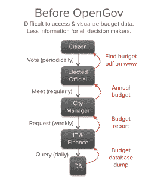
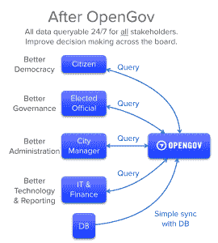

# OpenGov:分析 500 亿美元支出的创业公司

> 原文：<https://a16z.com/2014/09/24/opengov/?utm_source=wanqu.co&utm_campaign=Wanqu+Daily&utm_medium=website>

> "这里 10 亿，那里 10 亿，很快你就可以说是真金白银了！"— [归因于 Fmr。参议员埃弗雷特·德克森](http://www.dirksencenter.org/print_emd_billionhere.htm)

当一个企业家带着年收入超过 500 亿美元的活跃客户名单到来时，人们往往会注意到他。扎卡里·布克曼就有这样一份客户名单，因为他已经成功地开始改造世界上最大的行业:政府。

几年前，当扎克住在阿富汗的一个集装箱里时，他和他的合伙人(包括 Palantir 的联合创始人 Joe Lonsdale)创建了一家初创公司 [OpenGov](https://www.opengov.com/ "OpenGov") ，旨在改变政府可视化、分析、合作、预算和分配税收的方式。既然 OpenGov 已经与代表 2200 多万居民的 150 多个政府(包括[市](https://losangeles.opengov.com/transparency#274/breakdown=F88F1D3E24CF43BBB5BEFD14BA5415FD&accountType=expenses&graph=stacked&selection=E6B6597C8FFAD1B1AA8092C538AE63DD)、[县](https://sierracounty.opengov.com/transparency#117/breakdown=FD28C3A2F29C4B8E9E279EE8AD90898B&accountType=expenses&graph=stacked&selection=E02F580021784324224D2A5950D469F9)、[州政府机构](https://svswa.opengov.com/transparency#94/breakdown=5BE871C3AEFF4BD09F4C92CBEF4F2E55&accountType=expenses&graph=stacked&selection=6DB1A99265FC13CB98193138FCBDE751)和[学区](https://hlpusd.opengov.com/transparency#53/breakdown=A051DFF6C63E49FF96FF78425C3ACE45&accountType=expenses&graph=stacked&selection=DA1495221177FED09B1E673847B854C7))签约，我们认为讨论一下为什么我们安德森·霍洛维茨[资助](http://dealbook.nytimes.com/2014/05/15/andreessen-horowitz-bets-on-a-government-software-start-up)他们，为什么他们发展如此迅速，以及为什么我们认为他们 500 亿美元的客户名单只是一个开始是有益的。

## 问题是

仅在美国，就有超过 90，000 个不同的地方、州和联邦组织，它们每年的支出超过 7 万亿美元([、3.7 万亿美元联邦](http://www.whitehouse.gov/sites/default/files/omb/budget/fy2015/assets/budget.pdf)、[、3.4 万亿美元州](http://www2.census.gov/govs/local/summary_report.pdf))。政府花钱购买影响我们日常生活的商品和服务，包括道路、水、消防队员、警察、教师、研究、社会服务、军事等等。

人们经常争论政府支出应该增加还是减少，但是几乎每个人都同意政府支出应该尽可能透明和有效。毕竟，税收是许多公民最大的单项支出，也是许多政府最大的收入来源。不幸的是，即使数百万人在艰难时期依赖社会服务，T4 对政府的信任度也降到了历史最低水平。因此，为了恢复信心，政府官员拥有确保每一美元都得到合理、透明使用的工具将非常有用。

然而令人惊讶的是，管理和分析政府支出的软件却落后了，尤其是在地方一级。回答关于政府预算的甚至看似简单的问题通常都很麻烦，包括对老化的数据库系统进行对象查询，或者在 PDF 文档或电子表格中进行手动搜索。很多地方政府用的都是 30 年前写的企业会计系统或者 ERP 系统。这通常意味着，希望确定某个特定行项目花费多少的城市经理必须要求他或她的 IT 或财务人员运行定制的报告并等待答案。就民选官员而言，他们通常需要问经理，经理又需要问其他高管，高管又需要问分析师。不用说，这意味着对构成典型政府预算的数千个项目明显缺乏了解。

这在多个层面上造成了问题。这对政府高管来说是一个问题，他们必须等待获得数据才能做出关键决策。这对于部门主管来说是一个问题，他们需要进行预算，根据历史支出预测未来预算，并在问题变成问题之前发现问题。这是政府 It 人员面临的一个问题，随着预算持平或缩减，他们越来越捉襟见肘。归根结底，这是民主的问题，因为公民和立法者在无法获得正确数据的情况下无法做出真正明智的决定。

## OpenGov 的作用

OpenGov 的起源是在大萧条时期；金融危机爆发后，所有人——包括地方政府——都发现必须掌握自己的财务状况，以确定哪些项目是绝对必要的，肯定会有多少收入，以及下一财年可能会出现多少赤字。OpenGov 的创始人决定从本地着手解决这个问题，从与帕洛阿尔托市政府并肩合作开发报告软件开始。这导致了 OpenGov 的第一个版本，这是一个基于网络的界面，供帕洛阿尔托政府查看他们的支出并与公众交流。早期产品的演示在加州政府中被广泛转发，积极的回应告诉 OpenGov 的创始人他们确实创造了一些有用的东西。

今天，OpenGov 平台已经发展成为 150 多个政府分析超过 500 亿美元年度支出的工具。每个政府的定制网站(比如 http://losangeles.opengov.com)就像是政府支出的 Mint.com。政府财务总监或 IT 经理只需上传总账和会计科目表，即可生成过去、现在和预计未来支出的交互式可视化结果。

政府在内部使用 OpenGov *创建自定义报告，帮助运营部门管理预算，让高级管理人员和立法者最大限度地了解信息，并帮助处理从预算流程到内部审计的重要工作流。他们在外部*使用它*来发布交互式预算，与社区共享这些信息，甚至通过发布围绕税收或债券措施的重要财务数据来实现收入目标。*

[T2】](https://i0.wp.com/a16z.com/wp-content/uploads/2014/09/opengov-before2.png?ssl=1)

在 OpenGov 出现之前，要获得这种关于预算的详细信息，需要阅读 PDF 文档或运行上述由稀缺的 IT 或财务人员准备的自定义报告。对于一名政府主管来说，这有点像是在一个搜索引擎上工作，一周只能进行几次查询。

[T2】](https://i0.wp.com/a16z.com/wp-content/uploads/2014/09/opengov-after1.png?ssl=1)

然而，通过简单地将数据转换成标准格式并放到网上，OpenGov 改变了四类人——政府高管、民选官员、政府 it 人员和普通公民——与政府预算互动的方式:

政府官员可以实现更好的管理。政府管理人员使用 opengov.com 界面来解决如何优化服务的问题，而不会让 IT 人员为每个查询都准备一份特殊案例报告。随着时间的推移，他们将能够分享笔记和模型，以便与同等规模的城市和辖区的经理们比较他们的预算决策。

当选官员可以改善政府治理。像洛杉矶市长埃里克·加希提这样的官员已经在使用 OpenGov 向公众展示税收为社区做了什么。相关预算项目或细目的链接现在可以很容易地包含在新闻稿、Twitter feeds 和公告中。

政府 IT 人员获得最新技术。现在，IT 人员只需将政府预算数据转换为一致的格式，并上传到基于网络的 SAAS 界面，即可节省宝贵的员工时间。一个政府请求的功能也可以推广到许多类似的政府，从而节省大量的重复工作。

公民可以在更大程度上参与民主。最后但同样重要的是，公民可以使用 OpenGov 以互动方式探索预算，并以知情的方式参与民主进程。

虽然技术上是公开的，但 OpenGov 现在索引的许多数据都被锁定在静态 pdf 中，因此不适合交互式可视化。结果就像是从布满灰尘的卡片目录到“政府谷歌”的飞跃。

## 到目前为止我们所发现的…

既然 OpenGov 已经被跨越地理和政治边界的政府和城市管理者所采用，我们可以讨论一下我们在最初部署中发现的一些结果。

简单地清理和汇总数据可以产生神奇的洞察力。在技术社区内，人们对分析大数据的工具非常兴奋(这是有道理的)。然而，在许多领域，与其说是“大数据”，不如说是“干净数据”在政府支出的背景下，简单地聚合数据、清理数据并使其全球可见，就能提供巨大的价值。特别是，OpenGov 进行的汇总使得政府第一次有可能轻松地将它们的支出概况与类似规模和人口统计数据的对应方进行比较。

透明是一种无党派利益。拉尔夫·纳德和格罗弗·诺奎斯特[都支持](http://www.google.com/url?q=http%3A%2F%2Fwww.washingtonpost.com%2Fopinions%2Fdana-milbank-ralph-nader-and-grover-norquist-tread-common-political-ground%2F2014%2F05%2F27%2F856bf7c8-e5e7-11e3-8f90-73e071f3d637_story.html&sa=D&sntz=1&usg=AFQjCNF1fShIIf5Zb_G97leoQPi6Mkpr9Q)增加政府支出的透明度是有原因的。从诺奎斯特的角度来看，你不能削减你看不到的东西:可见性允许人们识别出被次优花费的钱。从纳德的角度来看，你不能声称你看不到的东西:一旦公众有证据表明政府资金正在用于公共服务，如道路和消防队员，增加税收就会变得更容易。OpenGov 的使命与政治无关，这两个目标都是通过简单地提供资金去向的洞察力来实现的。

**OpenGov 解决了“有限预算理解预算”的第二十二条军规。**由于地方政府预算紧张，了解资金流向比以往任何时候都更加重要。然而，由于地方政府预算紧张，通常很难为软件工程师和数据科学家找到新的资源。OpenGov 通过让上传地方政府数据到云服务并开始可视化预算变得非常便宜来解决这个难题。因为信息在可操作的程度上是有价值的，所以提高政府支出效率几个基点的信息每年可以节省数百万美元——并且很容易收回 OpenGov 软件的成本。

在不久的将来，OpenGov 将为政府官员推出一个平台，以找到成本最低的供应商，确定可比的政府，并与其他政府官员就年度预算流程进行合作。从长远来看，目标很简单:让世界上最大的行业能够轻松使用尖端的商业智能和协作报告软件。

OpenGov 令人难以置信的是，每年 500 亿美元的客户收入才刚刚开始。仅在美国就有超过 100 倍的增长空间，未来是光明的。随着 OpenGov 为地方、州和联邦官员提供工具，在这里找到 10 亿，在那里找到 10 亿——很快我们都将节省真正的钱。

*此处表达的观点是引用的 AH Capital Management，l . l . c .(“a16z”)人员个人的观点，并非 a16z 或其关联公司的观点。此处包含的某些信息来自第三方，包括 a16z 管理的基金组合公司。虽然来自据信可靠的来源，但 a16z 没有独立核实此类信息，也没有对信息的持久准确性或其在给定情况下的适当性做出任何陈述。T3】*

*本内容仅供参考，不应作为法律、商业、投资或税务建议。关于那些事情，你应该咨询你自己的顾问。对任何证券或数字资产的引用仅用于说明目的，并不构成投资建议或提供投资咨询服务。此外，本内容不针对任何投资者或潜在投资者，也不打算由任何投资者或潜在投资者使用，并且在决定投资 a16z 管理的任何基金时，在任何情况下都不得依赖本内容。(投资 a16z 基金的要约只能通过私募备忘录、认购协议和任何此类基金的其他相关文件进行，并应完整阅读。)提及、提及或描述的任何投资或投资组合公司并不代表 a16z 管理的投资工具的所有投资，也不能保证这些投资是盈利的，也不能保证将来进行的其他投资会有类似的特征或结果。安德森·霍洛维茨基金管理的基金的投资清单(不包括发行人未允许 a16z 公开披露的投资和某些公开交易的加密货币/数字资产)可在 https://a16z.com/investments/.T3 获得*

*其中提供的图表仅供参考，不应作为投资决策的依据。过去的表现并不代表未来的结果。该内容仅在所示日期有效。这些材料中表达的任何预测、估计、预测、目标、前景和/或观点可能会随时更改，恕不另行通知，并且可能与他人表达的观点不同或相反。更多重要信息，请见 https://a16z.com/disclosures。T3】*