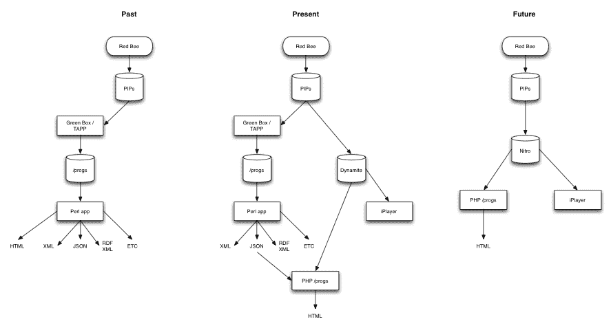
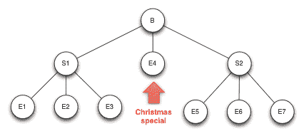
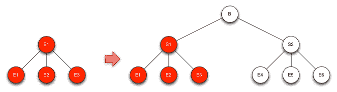
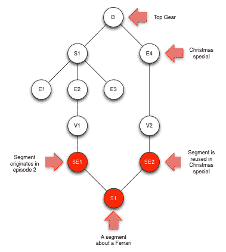
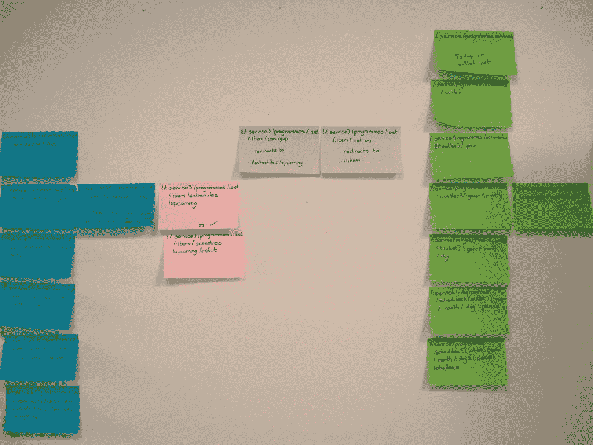

# 为 BBC 节目设计 URL 结构

> 原文：<http://smethur.st/posts/176135860?utm_source=wanqu.co&utm_campaign=Wanqu+Daily&utm_medium=website>

这是我过去 7 年来一直想写的一篇文章。在这种情况下，它可能更像是一篇悼词，而不是一个出生公告，但由于这个主题仍然偶尔抬起头来，我认为它终于值得一打。

感谢[大卫·马兰德](http://rland.me.uk/)、[理查德·乔利](https://twitter.com/rjolly)、[伊夫·雷蒙](http://raimond.me.uk/)和[漆拉·沃森](https://twitter.com/zillahwatson)的白痴检查/坚持到最后。

## 一些背景

故事开始于一个由研究人员([汤姆·科茨](https://twitter.com/tomcoates)和[马特·韦伯](http://berglondon.com/studio/matt-webb/)和开发人员([马特·比德尔夫](https://twitter.com/mattb)和[保罗·哈蒙德](https://twitter.com/ph))组成的小团队，他们在 BBC 广播和音乐互动公司工作。BBC 的其他人也参与其中；金·普劳莱特和加文·贝尔同时跃入脑海。但是如果你的名字不在这里，而你认为它应该在这里，请责怪我的无知，而不是任何故意的怠慢。

大约在 2006 年的某个时候，这个团队开始研究在博客和社交软件的世界里，程序页面应该如何工作。在此之前，在线项目支持是零星的，大预算项目有专门的“网站”,低姿态项目通常什么也没有。PIPs(节目信息页)项目旨在解决这一问题，为所有节目提供一个基线网页，可根据时间、预算和用户需求进行增强。

致力于 pip 的团队热衷于确保 pip 生成的页面与 web 的纬线和接缝一起工作；所有重要的东西都有页面，可以链接和指向。特别是汤姆·科茨(Tom Coates)对网络如何演变为使用链接来消除歧义和增加意义进行了大量思考。2006 年，他出版了开创性的《指向事物的时代》。如果你还没有读过，你应该读一读。

以可链接性为出发点，第一项工作是确定什么是重要的东西。在英国广播公司的节目中是一个有弹性的词。它可以用来表示《伦敦东区人》的所有集或这一集，甚至是今晚播出的这一集。前期手工制作的节目支持是不一致的:大多数会有总体节目页面(“节目主页”)，一些会有剧集指南，一些会有剧集页面，一些会有系列页面，一些会有角色页面。也没有真正定义什么是重要的事情或者它们是如何联系的。这是一个简单的概括，但在任何广播链中，重要的事情往往是要传输的资产(媒体)和要放入的广播时段。PIPs 的观点是用户对资产版本和广播时段都不感兴趣；人们谈论的事情是更柏拉图式的“插曲”。因此，伦敦东区的那集可能有英国手语版本或音频描述版本，或者可能被编辑持续时间，并且所有这些版本可能被广播多次，但是对于想要寻找、发现和共享它们的用户来说，它们都是相同的东西。或者他们都有相同的“编辑意图”。

所以 PIPs 的核心目标是情节。每一集都是一个更大的节目组的一部分，而每个节目组(尽管它可能会在许多网络上播出)*都属于*一个网络。这导致了原始的 PIPs URL 结构:

/:所属网络/:节目组/画中画/:剧集/

或者:

[/电台 3/自由思考 2006/pip/132yy/](http://www.bbc.co.uk/radio3/freethinking2006/pip/132yy/)

*132yy* 部分被称为 PIP 键，并且唯一地标识单集。汤姆在他关于[为广播电台网站](http://plasticbag.org/archives/2004/06/developing_a_url_structure_for_broadcast_radio_sites)开发 URL 结构的帖子中解释了这种模式背后的原因。这篇文章中的所有内容仍然是真实的，因为没有必要全部重新输入，所以需要在其他内容有意义之前阅读。

所以 PIPs 的目的是为每一集提供一个持久的(或尽可能持久的)URL。这样做的有趣之处不在于你如何构建 URL，而在于你不得不遗漏什么:没有播出日期或时间，因为可能有很多(或者可能没有)，没有类型(同样的原因)等等。

## 那么 PIPs 版本 1 和 2 发生了什么变化呢？

PIPs 版本 1 是为 Radio 3 设计的自动化节目页面。PIPs 第二版采用了同样的模式，并试图在全国广播网的其他地方推广。两个版本都是一个系统，由三部分组成:数据存储、管理和发布。两者都比任何 BBC 动态发布基础设施早了好几年，并且依赖于离线“编译”页面和页面的一部分来 FTP 到实时服务器上(像 [Jekyll](http://jekyllrb.com/) 这样的架构平台最近又回来了)。但是节目数据模型可能会变得非常复杂，并且广播通常会在最后一刻发生许多变化(一场足球比赛超时，时间表被篡改以适应)。弄清楚发生了什么变化以及这些变化会影响哪些页面和页面的哪些部分变得越来越复杂。有时数据会发生变化，结果会在几秒钟内公布；有时一个改变会进入系统，几天后才出现在网站上。没有人真正知道系统的内部是如何工作的。

于是 PIPs 第三版诞生了，缩写从节目信息页变成了节目信息平台。pip 将不再负责提供数据管理和编辑工具，也不再负责发布页面。它只是一个数据存储，其他服务将从中获取数据并发布。

所有这些都发生在 iPlayer 孕育的时候。大约在那个时候，汤姆·卢斯莫尔提出了 BBC 2.0 和自动化广播电视节目支持。前者显然变成了 [iPlayer](http://www.bbc.co.uk/iplayer) ，后者变成了[/programs](http://www.bbc.co.uk/programmes)。我想当我们第一次开发/programs 时，我们都认为会有一个“iPlayer inside”类型的模型；如果一集可以播放，它就会出现在剧集页面上，如果没有，就不会出现。当然[金的线框](https://www.flickr.com/photos/mildlydiverting/4826239343/)暗示了这一点，我想我们都认为这是我们努力的方向。鉴于 BBC 有如此多的品牌，给点播节目增加一个品牌只会增加混乱。这显示了我们对品牌的了解有多少。回到故事...

因为 BBC 过去没有(现在仍然没有)单一的节目信息库，所以填充 pip 所需的数据是从 BBC 外部返回的。节目团队和调度人员会将信息发送给 [Red Bee](http://www.redbeemedia.com/) ，后者会将其组织在一个名为 SID 的系统中(首字母缩写扩展在时间的长河中消失了，但可能是 DSAT 的调度接口)，然后将其作为 XML 发送回 PIPs。传入的数据只是反映了计划事件；没有滚动的节目 id 和事件 id。pip 有一套启发式方法来识别剧集，主要基于文本重复标签，如“[Rpt Fri 下午 4 点]”或“[Rpt of Mon 下午 4 点]”。这些被解析并用于推断情节结构。重复文本的格式并不完全一致，因此有一个编辑界面来确认标识和分配品牌。剧集被强制整合到一个品牌/系列/剧集结构中，用虚拟品牌和系列来标记未知的 R3 和未知的 R4。

SID 提要的数据模型非常单薄，无法准确描述程序结构。PIPs v1/2 拥有基于 [SMEF](http://www.bbc.co.uk/guidelines/smef/ "Standard Media Exchange Framework") 的非常丰富的数据模型。用 SID 填充 pip 就像试图用画笔描绘一座大教堂。只是没有足够的数据来知道如何填补所有的空白。PIPs 数据库中的空表比填充的表多。许多被填充的数据被填充了虚拟数据以填补模型中的空白。

因此，给定一个新节目中新一集的细节，没有办法知道该集是一次性的、独立的一集(像电影一样)还是许多集的第一集。由于这个原因，PIPs v1/2 中的所有剧集都被分配给节目组，无论这些组是否存在或是否会存在。对于原始的 PIPs 网址，这是一个奖金。该分组总是被保证存在，并且该分组属于一个拥有网络。但是随着 iPlayer 的开发，人们意识到 SID 提要不够丰富，不足以驱动所设想的开发。因此，PIPs 3 通过一个[即时电视点播](https://en.wikipedia.org/wiki/TV-Anytime) XML feed，从 SID 获取数据馈送到 Red Bee 的 Teleview。

Teleview 模型更具描述性，没有引入幻影分组对象。因此，一部一次性电影将被塑造成一个孤立的剧集，没有更高层次的系列分组或“品牌”。这意味着 PIPs v1/2 风格的 URL:

/:网络/:群组/画中画/:剧集/

至少在某些情节中不再有效。考虑到[节目结构会随着时间的推移而改变](#unstable-tleos)并且试播集可能会委托制作，也可能不会委托制作连续剧，如果我们想要最大化持续性并最小化重定向的管理，在 URL 中建立分组层次结构不是一个选项。

### PIP 键怎么了？

那么 PIP 键和旧的 PIPs v1/2 URL 发生了什么变化呢？他们基本上一直在出版。我不确定旧的 PIPs 系统中还有多少页面在运行，我也不确定你会如何发现，但仍有相当多的页面在运行:[这是 2008 年《发现音乐》](http://www.bbc.co.uk/radio3/discoveringmusic/pip/dxbnb/)中的一集电子音乐。

计划将 PIPs v1/2 数据迁移到 PIPs 3，制作新的/programs 页面并重定向旧的静态页面。但不幸的是，这从未发生。

## PIPs v3、iPlayer 和/程序

因此，从 2007 年初开始，我们在 [PIPs v3](http://www.bbc.co.uk/blogs/legacy/bbcinternet/2009/02/what_is_pips.html) 中有了一个新的闪亮的节目数据存储，但是没有办法写入那个存储，也没有办法从中发布。广播和音乐承担了两项工作来填补这些空白。项目信息工具提供了一个管理界面来读取和写入 pip，并且变成了那些人们仍然带着伤疤的项目之一。【2007 年 10 月，我们上线了/programs 的第一版，它以 PIPs 的形式发布了每一集、系列、品牌、时间表、流派、格式等的页面。

同年 12 月，iPlayer 的第一个流媒体版本发布。由于各种各样的原因,“iPlayer inside”(/programs)模型从未出现过，取而代之的是 iPlayer 本身成为了一个目的地。但是 iPlayer 和/programs 都是基于 pip 的，并且都在它们的 URL 中使用 PID:

http://www.bbc.co.uk/iplayer/episode/跑上山的故事

http://www.bbc.co.uk/programmes/**b 04 dzswb**

因此，虽然我们达到了每页一件事，但我们从未真正做到每件事一页。尽管值得指出的是，iPlayer 剧集(有时称为项目)页面仅在剧集可用时(或即将可用时)才存在。一旦赶上可用性窗口关闭，iPlayer 页面重定向到/programs 页面。尽管由于情节可能会重复并且因此可用性窗口可能会重新打开，但是该重定向是 [302](https://en.wikipedia.org/wiki/HTTP_302) (临时的)而不是 [301](https://en.wikipedia.org/wiki/HTTP_301) (永久的)。

### 从 PIPs 到 public

在我们开始/programs 工作之前，我们有两个问题要解决:如何以合适的形式发布 PIPs 数据，以及如何动态地发布它。

2006 年末，BBC 没有动态出版基础设施。PIPs v1/2 已经证明了离线处理来生成平面页面并不是一个好主意。那时 BBC 的技术基础设施非常局限于静态文件和一个略微分叉的 Perl 版本。所以 Paul Clifford 花了几个周末做了一个 [Perl MVC 框架，它模仿了 Ruby on Rails](http://www.bbc.co.uk/blogs/legacy/radiolabs/2007/11/perl_on_rails.shtml) 的一些设计模式。这很好，即使谈论它确实产生了一个令人难忘的标题为[为什么 BBC 在互联网上失败](http://mattjon.es/blog/2007/12/perl-on-rails-why-the-bbc-fails-at-the-internet)的博客帖子。

第二个问题更难解决。PIPs 数据是高度规范化的(或者至少是高度抽象化的)。这是一个关系数据库，但父子关系是通过一个名为 pip_pip 的表来管理的，该表通过某种关系将一个带有 PID 的事物与另一个带有 PID 的事物相关联，而不是通过表之间的外键。理论上允许多个父节点，这个特性从未被使用过，最终被弃用，尽管模型仍然存在。PIPs 是为数据存储而优化的，但不是为发布而优化的，所以我们必须对它进行改造，以允许我们需要的查询来构建我们想要的页面。

所以邓肯·罗伯逊建造的第一个东西被称为绿盒子——因为它最初是用绿色钢笔在白板上画出来的。稍后它被称为涓流应用程序(因为它将数据从 PIPs 涓滴到/programs 数据库),不久之后它被简称为 TAPP。绿框对数据进行了非规范化处理，以使我们需要运行的查询更容易、更快。它现在仍然存在，通过管道将数据从 pip 传输到原始/程序数据库。该应用程序目前只发布数据视图。新的/programs PHP 前端使用来自旧的/programs 应用程序的 JSON，以及来自 Dynamite(为 iPlayer 构建的应用程序)的一些数据。对数据视图的请求被传递给旧的/programs 应用程序。在不久的某个时候,/ programs 和 iPlayer 都将运行新的 Nitro 后端，绿盒和旧的/programs 应用程序将被关闭，数据视图将不再工作。

[T2】](/assets/2014/09/dataflow.png)

### 什么是 PID？

PID 首字母缩略词有两种扩展方式。通常人们将其扩展为“节目标识符”，这在大多数情况下是最有意义的。偶尔，它会扩展为“PIPs 标识符”,这在大多数对话中用处不大，但可能更准确，因为 PIPs 中的任何对象(流派、格式、贡献者、角色)都可以有一个 PID，而不仅仅是“节目”对象。无论[试运行包](http://www.bbc.co.uk/commissioning/radio/production-and-delivery/programme-information-guide/glossary.shtml#PID)怎么说，它肯定不代表包标识号，包标识号[是非常不同的东西](https://en.wikipedia.org/wiki/MPEG_transport_stream#Packet_Identifier_.28PID.29)。

在 PIPs 数据库术语中，PID 类似于任何对象的非域本机代理键。每个表中的每一行或多或少都有一个 PID，这些表可能描述节目对象(品牌、系列、剧集、剪辑、版本、片段)；更高级别的节目分组(季节、特许经营、系列)；节目可用性对象(广播、点播)；或者非程序对象(字符、贡献者、类型、格式等)。通常 PID 被描述为 PIPs 对象的不透明标识符；虽然术语[混淆已经被提出](http://www.jenitennison.com/blog/node/114)，但是因为它们不能代替任何更“自然”的标识符，我将坚持使用不透明。

所以 PID 的设计不是为了让人们阅读或者有意义。它们是一个小写字母数字字符串，由 8 个(或者可能/偶尔更多)字符组成，元音被排除在外，以防止无意中的咒骂(尽管偶尔会有咒骂出现；[本案](http://www.bbc.co.uk/programmes/b0110ck3)，一个嫌疑人，[故意](https://en.wikipedia.org/wiki/Colemanballs)。

PID 中唯一“有意义”的字符是第一个表示 PID 权威的字符(负责创建它的人)。对于以 b 开头的 PID，生成权限是 Red Bee，对于以 p 开头的 PID，它是 PIPs，对于 w，它是旧世界服务调度系统。合作伙伴数据还有其他主要角色/权威，但这些是你将看到的主要角色/权威。对于 Red Bee 生成的 PID，Red Bee Teleview 系统中使用的 PID 和 [CRID](https://en.wikipedia.org/wiki/Content_reference_identifier "Content Reference Identifier") 之间存在双向转换。CRIDs 是非 HTTP URI 的一种形式，被定义为即时电视规范的一部分，是使系列录制在您的 Freeview 机顶盒上工作的标识符。虽然在这种情况下，crid 是 Teleview 内部的，并且**与 [DVB](https://en.wikipedia.org/wiki/Digital_Video_Broadcasting "Digital Video Broadcasting") 使用的 crid 不**相同，所以你不能用 Freeview 逆向工程 PID 来做任何有用的黑客行为。

因为世界服务计划信息不通过 Red Bee 传送，所以他们将计划数据自行提供到 pip 中，这导致他们早期的 PID 看起来与大多数略有不同，是 11 个字符，而不是 8:

[http://www.bbc.co.uk/programmes/**WCR 5 dr 3d nl 3**T3】](http://www.bbc.co.uk/programmes/wcr5dr3dnl3)

我不确定什么时候发生的转换，但是这些天世界服务 PID 是作为具有 PIPs 权限的 p PIDs 生成的，有 8 个字符长。

## 数据模型和 URL

希望这至少部分解释了为什么 PIPs v1/2 和/programs 和 iPlayer 之间的 URL 结构发生了变化(如果没有，希望本文的其余部分会发生变化)。但是为了解释为什么我们最终得到了 URLs 程序，不幸的是你需要理解一些 PIPs 数据模型。因此...

### 剧集和版本(以及片段)

PIPs 数据模型的核心是剧集。如上所述，这不是广播或媒体资产，而是媒体资产的更柏拉图式的分组。我听过很多这样的描述，从具有相同“编辑意图”的资产/广播到讲述相同“故事”的资产/广播。例如，今天的节目在 FM 上是 3 小时的广播，但在 LW 上是 2.5 小时的广播(最后 30 分钟为昨天的议会让路)，但它们显然是同一集。或者一集《伤亡事故》可能有一个 <abbr title="British Sign Language">BSL</abbr> 版本和一个非 BSL 版本，但它们显然是同一集。或者《梅林传奇》的一集可能会被重新剪辑以适合在 CBBC 播出，但很明显这是同一集/讲述了同一个故事。至少在理论上(尽管在实践中我不知道),一场舞会音乐会可以在 Radio 3 和 BBC Four 上同时播出，两个媒体资产(一个有活动图像，一个没有)组合成一集也是如此。(尽管在现实中，Red Bee 并没有签约识别同播，这就是为什么[有 BBC 一个每日一场比赛 2 号外](http://www.bbc.co.uk/programmes/b03bsn8j)和[有每日五场直播比赛 2 号外](http://www.bbc.co.uk/programmes/b03bdp16)。)

这种资产分组是以带有剧集和版本的 pip 来处理的。一集可以有一个或多个版本(但总是至少有一个),其中一个被标记为“标准”版本。一个版本总是只属于一集(实际上版本也可以属于剪辑，但我们暂且忽略这一点)。版本可能是模型中最接近媒体资产的映射，尽管在线交付 A/V 的复杂性意味着 iPlayer 中的版本可以有许多不同的媒体文件。版本可以有类型。除了标准(默认)版本之外，可能还有持续时间更长的版本(荒岛唱片的“重播”时间更长)，持续时间更短的版本(今日节目的 LW 版本)，对于电视，还有带 BSL 或音频描述的版本。因此版本处理变更的两个方面:编辑版本(recuts)和可访问性版本。

附在版本上的可能是“发布事件”:广播和“点播”。一个版本可能有零个、一个或多个广播。其中的每一个可能在不同的无线电网络或电视频道上(例如 BBC 一台和 BBC 三台上的伦敦东区)。网络和渠道在 pip 中被建模为“服务”,因为没有一个通用的“自然”词，所以 SMEF 选择了服务。并且一个版本可以具有零个、一个或多个点播，这些点播确定一个版本对于给定的时间段、地域、平台等是否可用于 iPlayer 流传输或下载。按需被映射到可用性类型(如 iPlayer 国际桌面流或 iPlayer 英国下载),可用性类型又被建模为服务。重要的是(对于 URL 来说)一集可能没有任何版本的广播。这不是最常见的情况，但它变得越来越常见，而且当 BBC 台停止广播并转向网络时，可能会变得更常见。

对于开始使用 PIPs 数据的人来说，剧集和版本可能是最棘手的部分。尽管 iPlayer 和/programs(很大程度上)是以剧集为中心的，但最初的 PIPs v3 数据模型的大部分描述都围绕版本展开。因为一集可能会被重新剪辑，而且时间长度也会改变，所以这一集的很多东西都有可能在不同版本之间发生变化。因此，片段/播放顺序/播放的音乐和贡献者可能会改变，这就是为什么他们在版本级别建模。或者剧集可能会被重新剪辑以适合年轻观众，因为“儿童”是一个[类型](http://www.bbc.co.uk/programmes/genres)类型是在版本而不是剧集级别设置的。对于[格式](http://www.bbc.co.uk/programmes/formats)也是如此。这意味着当天的比赛整体上没有被分配到体育足球类型，但每个系列的每一集的每个版本都是如此。在[绿盒子](#pips-to-public)中，我们从版本、剧集到系列和品牌传播流派和格式，只是为了让建立有用的聚合成为可能。但这只是一种权宜之计。这些天来，PIPs 模型已经发生了变化，像流派、格式和贡献者这样的东西被分配到顶层，并以“覆盖继承”的方式向下级联。因此，寻找其类型的一集将查看它是否有任何直接分配的类型，如果没有，将查看其父类型并继续向上。

但是片段仍然是在版本级别设置的，所以如果你在看一集的页面，例如，看到一个曲目列表，这个列表就是在版本上设置的片段列表。因此，一集页面实际上是该集(及其关联)的数据和来自**规范**版本的数据的混合体。如果您试图使用[/程序数据视图](#data-views)，例如:

[http://www.bbc.co.uk/programmes/b04g708d.xml](http://www.bbc.co.uk/programmes/b04g708d.xml)

想知道为什么剧集页面显示了贡献者和曲目列表，但它们没有显示在数据中，您需要查找标记为 canonical 的版本:

 ````

		<versions>

			<version canonical="1">

				<pid>b04g708b</pid>

				<duration>1800</duration>

				<types>

					<type>Original version</type>

				</types>

			</version>

			<version canonical="0">

				<pid>p025j01q</pid>

				<duration>1800</duration>

				<types>

					<type>Dubbed Audio Described</type>

				</types>

			</version>

		</versions>

```

构建到该版本的链接:

[http://www.bbc.co.uk/programmes/**b04g 708 b**。xml](http://www.bbc.co.uk/programmes/b04g708b.xml)

您可以在哪里找到贡献者和细分市场(跟踪列表)的详细信息:

 ````

		<contributors>...</contributors>

		<segment_events>...</segment_events>

```

或者...你可以只需要[请求剧集的网址，然后添加/分段](#ids-anchors)，这看起来简单多了，但解释起来却没那么有用...

最后剪辑。剪辑是后来加入 PIPs 模型的，描述它们很困难。重要的是，它们并不一定是从完整长度的剧集中剪辑出来的片段。虽然他们可能是。它们也可能是一集的预告片，一个系列的预告片，一个系列的概要，一个系列的最佳亮点包，一集的附加镜头或片断或其他完全不同的东西。也许最好把它们看作元程序；关于节目的“节目”。在某种程度上。

从数据模型的角度来看，剪辑与剧集非常相似。它们具有所有相同的属性，并且至少有一个版本，有时有多个版本。唯一真正的区别是，一个剪辑可以直接属于一集或一个系列或一个品牌，不像剧集只能属于一个系列或一个品牌。而不是另一集。很明显。

这就把我们带到了...

### 品牌和系列

所以几个小插曲是孤立存在的。电影是剧集独立的明显例子(虽然我猜测像《教父》、《星球大战》或《独自在家》这样的特许经营可以组合在一起)。偶尔(在广播 4 台相当常见)会有单集纪录片或戏剧，它们没有被组合成一个更大的系列。冒着重复的风险，PIPs v3(不同于 v1/2)允许剧集成为没有父品牌或系列的孤儿。

更常见的是，剧集不是孤立的，而是按品牌或系列进行分组(这些品牌或系列又可以按品牌或系列进行分组)。在这一点上，一切变得有点复杂。一集可能是孤儿。或者它可能属于一个系列。或者它可能属于某个品牌。一个系列可能属于另一个系列。或者可能属于某个品牌。或者可能是孤儿。而一个品牌永远是孤儿。可能的组合如下所示:

[T2】](/assets/2014/09/hierarchy.png)

(可能值得指出的是，这里的 series 是这个词在英国的用法(可能已经过时了)，也是美国人所说的季节。自从 PIPs v3 和/节目被设计出来后，感觉更多的英国人(BBC 内部和外部)用 season 来表示 PIPs 对连续剧的意义。虽然一个赛季在 PIPs 方面是完全不同的事情。)

用例应该相当明显。我描述过的孤儿情节。系列>剧集结构通常用于短期系列。(连续剧>连续剧>剧集结构理论上是可以的，但实际上没见过。)品牌>剧集结构用于未分成系列的长期播放节目(如《今日节目》或《伦敦东区人》或《弓箭手》)。《品牌>系列>剧集》是将长期播放的节目分成系列的经典案例(如《神秘博士》)。品牌>系列>系列>剧集仅偶尔用于分成故事情节的系列节目，其中一个故事情节发生在两集以上(唤醒死亡边缘案例)。

这也是一种混合的内容模式，因此，举例来说，一个品牌可以同时拥有儿童系列和剧集。所以你可能会把《神秘博士》作为一个品牌，里面有第一季，然后是作为孤儿的圣诞特辑，然后是第二季等等。：

[T2】](/assets/2014/09/mixed.png)

那么，如果系列可以成为任何族谱中的第一项，那么系列和品牌有什么区别呢？老实说，我不确定，也从来没有确定过。系列/品牌的区别是 SMEF 的遗留物，似乎没有人记得为什么要发明它。有人说品牌是一个具有营销价值的系列，但我不知道为什么它不仅仅是一个装饰系列，而是一个独立的类别。刚接触 pip 的人倾向于假设树顶端的对象总是品牌，并谈论品牌和系列页面，但事实上没有/程序代码注意到品牌/系列的区别；唯一重要的是你在家谱上看得多远。

为了克服品牌和系列的语言困难，没有人知道它们之间的区别，而且这种区别并不重要，我们发明了一个新的术语来描述它们树的顶端的所有对象:顶级编辑对象(TLEOs)(对此我真的很抱歉):

[T2】](/assets/2014/09/tleo.png)

(顶级编辑容器(TLECs)有时也用于指品牌和系列(即非孤立剧集)的 TLEOs 子集)。

关于/programs URL 最常见的问题之一是这样的:

> 我很有兴趣听听你为什么拒绝“品牌/父母/系列/剧集”的形式。
> 
> 有什么比 www.bbc.co.uk/programmes/heroes/s01/e20 更简单？

对此的回答是:不是所有剧集都属于剧集，不是所有剧集都属于品牌，也不是所有剧集都属于品牌。另一个答案是...

#### 不稳定 TLEOs

在 URL 中建立层次结构总是让人感觉是一件很好的事情。这使得它们可读、可破解、可被人类猜测。至少对于查看和操作 URL 的人来说是这样。但是，当层级随着时间的推移而改变时，建立层级是痛苦的。而且 PIPs 层次结构也不稳定。当新的系列制作完成时，孤儿获得了双亲。所以可能会有一集试播集被制作并播出。如果它像石头一样下沉，它可能会成为孤儿。但是如果试播成功了，接下来会有一个系列，试播集和系列会被包装成一个品牌(或者试播集被做成新系列的第一集)。

短系列的推荐也是如此。当《夏洛克》第一季制作时，它是作为一个三集的系列而创作的。当第二个系列出现时，一个新的品牌诞生了，第一个系列与新系列放在一起，共有 3 集:

[T2】](/assets/2014/09/sherlock.png)

不稳定的 TLEO 问题引发了一些问题。以夏洛克为例，因为系列 1 在网络上出现的时间比夏洛克品牌长得多，而且因为它在大部分时间里代表了夏洛克的第一个系列**和**已知的夏洛克节目世界的全部，它获得了许多主要标题为“夏洛克”(而不是系列 1)的入站链接。在品牌出现之前，这很好，因为从所有这些链接中获得的页面排名将该页面推至夏洛克搜索的顶部。但当第二个系列出现，品牌出现时，搜索引擎仍然将系列 1 视为带有大多数“夏洛克”标题入站链接的 URL，因此系列 1 仍然在搜索列表中排名第一，而推广系列 2 的品牌页面却不见了。随着时间的推移，随着网络的重新平衡和更多的链接指向品牌 URL，这个问题会自行解决，但仍然很难解释为什么第二系列需要一段时间来建立。

第二个问题更多的是关于用户订阅。如果用户订阅了 RSS 或日历源的 URL 来获取节目的更新，那么在第二个系列和品牌出现之前，他们实际上是订阅了第一个系列的附属资源。因此，当第二季播出时，他们收到的 RSS 或 ICS feeds 不会包含任何关于新剧集的信息。

第三个问题不太明显。许多外部系统(BBC 内部和外部)存储 TLEO PID 以参考节目。因此，用户可能喜欢一个节目组，而最喜欢的是系列 1 PID(因为这个品牌还不存在，而且可能永远也不会存在)。再次系列 2 来了，他们没有得到更新。这些问题中的大部分是可以解决的，但是如果你正在处理程序数据，它们总是值得记住。

除了层次结构中有意的变化之外，当 pip 数据被整理时，对象也可以移动。当我们刚开始制作/节目时，一个节目的一集被添加到另一个节目的品牌/系列中是相当常见的。比如在《神秘博士》中间有一集《蓝色彼得》。或者只是不添加到任何品牌或系列中，作为孤立对象留下。如果/当 PIPs 内务处理发生时，无意中孤立的剧集将被移回到适当的品牌或系列中，从而导致层级转移。如果你看看今天的比赛列表，你仍然可以看到一些意外的孤立事件；列出的一些项目是衍生节目(每日比赛 2，每日比赛直播，每日比赛 50)，但大多数是意外孤立的剧集。

所以有时候等级制度不存在，有时候会随着时间而改变。将它们构建成你期望能持续几年甚至几十年的 URL 是一个非常糟糕的主意。

### “主品牌”

如果你认为品牌令人困惑...主品牌是作为 iPlayer 的一种变通方法引入的。假设一个节目可以有许多集，并且每一集可以在多个频道/网络上播放(例如，《伦敦东区》在 BBC 一台播出并且在 BBC 三台重播)，则在 PIPs 数据模型中没有办法将一个节目与“拥有的”频道或网络相关联。这意味着 iPlayer 无法关联正确的频道/网络品牌，无法将统计数据分配到正确的位置，也无法显示适当的频道或网络“ident”(在 iPlayer 剧集开始时播放的视频片段)。引入主品牌是为了将一个节目对象分配给一个且仅一个频道或网络。因此，虽然一集《伦敦东区人》可能会在 BBC 1 台和 BBC 3 台播出，但伦敦东区人品牌拥有 BBC 1 台的主品牌，以表明该频道拥有“编辑所有权”。

在 iPlayer 的最初版本中，masterbrands 也用于通过渠道和网络生成 A-Z 列表。因此，BBC One 的节目列表中以“E”开头的节目将以伦敦东区为特色，而 BBC Three 的节目列表则不会(网络中的 A-Z 不再出现在 iPlayer 中)。/节目只使用 masterbrand 进行造型和统计，因此伦敦东区同时出现在 BBC One 和 BBC Three 聚合中。虽然我被告知这是一个生成成本高昂的视图，因此不会很快出现这种情况，而且有点遗憾的是，/programs 将转而由 masterbrand 确定服务和服务类型级别聚合的范围。所以 BBC 三 A-Z 不再有伦敦东区的人了。

乍一看，主品牌似乎很适合包含在 URL 中。它们为用户所熟悉(主要是电视频道和广播网)，并且它们是单层次的(一个节目可以有且只能有一个)。但是在表面之下，主品牌更加复杂，因为程序层次结构中的不同对象可以有不同的主品牌。因此，品牌(TLEO)可能(目前)有主品牌 BBC One，而系列一有主品牌 BBC Three，系列二有主品牌 BBC One。[齐](http://www.bbc.co.uk/programmes/b006ml0g)就是一例；它从 BBC 二台开始，转到 BBC 一台，然后又回到 BBC 二台。由于电视节目随着时间推移转换频道相当常见(或者至少比广播节目更常见)，在不同层级拥有多个主品牌的节目组是一种边缘情况，但并不罕见。

使用主品牌作为 URL 的一部分的另一个问题是，渠道和网络会受到偶尔的营销变化的影响。所以 5live 变成了 5 Live，而/5live 变成了/5 Live。

### 返回 URL

当我们开始为/programs 设计 URL 时，我们有三个目标:

1.  它们必须是持久的(或者在没有大量人为干预的情况下是可重定向的)
2.  它们应该是人类可读/有意义的
3.  它们应该是可以被黑客攻击的，这样用户就可以删除 URL 末尾的一些部分或者替换掉结构中的一些部分，并且对他们得到的结果有足够的信心

由于/programs 是 Tom Loosemore 的 BBC 2.0 项目的一部分，该项目有一套[原则](http://www.tomski.com/archive/new_archive/000063.html "Tom Loosemore's fifteen web principles for BBC 1.0")，原则 8 是<q>确保你的所有内容可以永远链接到</q>，其中最重要的是坚持。

在实践中，对持久性的需求和对可读性和可攻击性的需求从来没有很好地结合在一起。为了使 URL 具有持久性(或至少在尽最大努力的情况下具有合理的持久性)，程序域模型(以及各种数据和工作流以及法律协议)的约束意味着:

1.  该 URL 不能包含播放日期或时间，因为许多剧集都有多次播放。或者没有。
2.  该 URL 不能包含广播频道或网络，因为许多剧集在多个频道和网络上有多个广播。或者没有。
3.  URL 不能包含类型，因为许多剧集有多种类型。或者没有。
4.  该 URL 不能包含计划层次结构，因为计划层次结构可能会发生变化
5.  URL 不能包含主品牌渠道或网络，因为它们也可能会发生变化

排除了不可能，剩下的 URL 不能是属性的组合键，而是必须通过标签或键分别寻址每个节目对象(品牌、系列、剧集、剪辑)。为程序生成人类可读/有意义的标签几乎是不可能的。没有人知道英国广播公司将会播放多少电影或戏剧或《傲慢与偏见》读本，所有这些都在档案中，所有这些都在未来。沿着/prideandpredice 1 和/prideandpredice 2 这条路走下去，感觉会带来困惑，而不是减少困惑。并且仍然不能解决多种类型的变形层次问题。

从节目名称生成的人类可读/有意义的标签还有一个问题。大多数节目数据在播出前 7-10 天进入 pip，此时节目标题基本稳定。但是一些优先项目被更早地添加到 pip 中。一般来说，播出前的间隔越大，制作中标题改变的机会就越大。

所以我们最后有两个要求。URL 中的一些内容确保请求被定向到/programs 应用程序，还有一些内容唯一地标识一个程序对象。第一点是通过在我们负责生成的每个页面的 URL 中总是包含/programs 来解决的(这就是为什么我们总是将/programs 描述为更多的名称空间而不是“产品”)。唯一的另一个竞争者是/shows，尽管把所有节目都描述成节目感觉很舒服，但把一些节目(Today Programme，Newsnight，Panorama)描述成节目感觉不太对。第二部分通过使用 PID 作为每个程序对象的 URL 键来解决。于是/programs/:PID 就成了。

偶尔有人建议，使用/:object-type/:pid、so /brands/:pid、/series/:pid、/episodes/:pid 等会更“RESTful”。这种对 REST 的理解总是来自于使用“RESTful APIs ”,而这些 API 实际上并不是 RESTful 的。因为品牌和系列的区别对我们来说没有任何意义，所以对用户来说也没有什么意义。另外，我以前的老师尼克·费里耶给我们提出了一个额外的要求:永远不要回一个洞。所以每次用户从 URL 路径的末尾删除一个位时，不要返回 404，更不要返回 403。黑回/剧集会得到什么？所有剧集的列表？

我们确实就 URL 应该使用单数还是复数进行了简短的讨论。So /programme/:pid 或/programs/:PID。考虑到使 URL 可被黑客攻击的愿望(至少在可能的情况下/对于聚合),我们决定使用复数 so /things/:thing 将是一个事物页面，而/things 将是一个事物列表，或者至少是一些到事物列表的路由。实际上不会有太大的不同，但是保持一致是有好处的。

可能值得注意的是，如果您请求[一个数据视图](#data-views)，对版本 URL 的请求只返回版本信息。对 HTML 的请求只会将你重定向到剧集的 URL。

### 营销 URL 和重定向

URL 可能以网络管道的形式诞生，但它们早已脱离了浏览器。如今，你更有可能在海报上、公共汽车边上、收音机里或电视上看到网址。和/programs/:PID 在这方面做得不是特别好。BBC 标准和指南有一个 [URL 要求](http://www.bbc.co.uk/guidelines/futuremedia/desed/urls.shtml)文档，上面写着:

> 3.2.1.只有一个顶级目录应促进与英国广播公司公共服务网站。因此，在印刷品或广播中推广时，主机名后面只能有一个斜杠。
> 
> 3.4.1.所有 BBC 公共服务网站和服务必须使用以下语法进行推广:bbc.co.uk/sitename
> 
> 3.4.2.URL 应该读作:“bbc dot co dot uk slash sitename”。不能将“斜杠”元素大声读为“正斜杠”。
> 
> 3.5.1.在电视上，URL 必须总是以 bbc.co.uk/sitename.的形式显示在屏幕上
> 
> 3.6.1.不得提升 URL 的子目录。
> 
> 3.6.2.例如，今天第四台的节目网站必须使用 bbc.co.uk/today 而不是 bbc.co.uk/radio4/today.的 URL 进行宣传

它还说:

> 3.3.1.顶级目录可用于将用户重定向到子目录。

所以营销 URL 的问题通过重定向得到了解决。对 http://bbc.co.uk/archers 的请求将首先被 301 重定向到 http://www.bbc.co.uk/archers(所有丢失 www 的请求都被重定向)，然后被 301 重定向到 http://www.bbc.co.uk/archers/(带有一个结尾斜杠——旧的静态服务基础结构的遗产),然后被 301 重定向到 http://www.bbc.co.uk/programmes/b006qpgr.

### 尾随斜线

在/programs 之前，bbc.co.uk 一直是一个静态网站，所有内容都是通过网络服务器上的平面文件提供的(而不是通过应用服务器动态提供的)。页面是使用服务器端的[构建的，包括来自的](https://en.wikipedia.org/wiki/Server_Side_Includes)。shtml 文件包括。ssi 或者。sssi 文件。在标准的 UNIX 风格中，目录的 URL 后面会有一个斜杠，而文件的 URL 没有。大多数内部链接指向 web 服务器上的一个目录/文件夹，所以包含了一个像/radio4/这样的斜杠。给定一个文件夹请求，web 服务器将在里面查找 index.shtml 文件，处理任何 includes 并提供服务。

使用/programs 时，所有页面都是动态组装的，因此 web 服务器上没有文件或文件夹。我们决定去掉所有尾随的斜线，因为当某个东西不是文件夹时表示它是文件夹似乎没有用。

因为我们无法阻止人们在链接中添加尾随斜线，也无法避免在 URL 之间分割链接(以及 [Google juice](http://googlewebmastercentral.blogspot.co.uk/2010/04/to-slash-or-not-to-slash.html) ),所以当/programs 看到对带有尾随斜线的 URL 的请求时，它 301 会重定向到没有尾随斜线的相同 URL。

### 关键词填充

/programs URL 设计中一个相当常见的问题是缺乏可读性/含义如何影响搜索引擎。标准的 SEO 论点倾向于强调 URL 中关键词的重要性，并且长期以来一直认为 URL 关键词是影响搜索结果突出性的一个因素。然后，又有这么多的因素传言影响搜索结果，很难挑出除了哪些因素是真实的，他们有多少重要。标准的搜索引擎优化论点往往是过时 6 年的第二次猜测谷歌更好的大脑。自从 2010 年谷歌的“[咖啡因](http://googleblog.blogspot.co.uk/2010/06/our-new-search-index-caffeine.html)”发布以来，URL 中的关键词对排名的影响微乎其微。

我们知道的一件事是链接对网页排名的重要性，如果网址移动，链接就会断开，网页排名就会消失。因此，鉴于我们无法同时管理持久性和可读性，唯一的选择是用类似于 iPlayer 方法的额外关键字填充 URL:

[http://www . BBC . co . uk/iplayer/episode/b 04 gr 4 l 7/eastenders-02092014](http://www.bbc.co.uk/iplayer/episode/b04gr4l7/eastenders-02092014)

其中:

[http://www.bbc.co.uk/iplayer/episode/b04gr4l7](http://www.bbc.co.uk/iplayer/episode/b04gr4l7)

识别情节并:

/伦敦东区-02092014

被附加在搜索引擎的感知利益上。我们确实考虑过这样做至少 5 分钟，但是我们觉得这是两个世界最糟糕的事情。关键词填充的 URL 向用户暗示它们是可以被黑客攻击的，但事实并非如此。因此，在谷歌等人看来，我们和/programs 并没有受到损害。

### 附属资源、跨部门、IDs 和锚链接

许多关于/节目(尤其是品牌、系列、剧集和剪辑)的页面都是由各种相关对象的数据构建而成的。因此，一个剧集页面可能会显示核心剧集数据(标题、提要)、来自其祖先的数据(品牌和剧集标题)以及来自其后代的数据(规范版本数据及以下)。更具体地说，它可能会显示一个片段列表(实际上是一个取自其规范版本的列表)和一个演职人员列表(同上)。在可能的情况下，我们试图确保所有的附属资源(后代事物的列表)都可以在它们自己的 URL 上寻址，即使我们不打算在桌面页面上链接到它们(尽管参见关于[移动视图](#mobile)的部分)。 [David Marland](http://rland.me.uk/) 写了一篇关于[响应式设计如何从 URL](http://www.smashingmagazine.com/2014/05/02/responsive-design-begins-with-the-url/) 开始的精彩文章。更具体地说，如何使附属资源可寻址，使得交换和改变什么作为核心页面变得容易，以及什么根据屏幕大小等被 AJAX 交叉包含。

HTML IDs 和锚链接在 URL 设计中容易被忽略。当设计/programs URL 时，我们试图将 id 添加到所有包含的附属资源中，即使我们不打算链接到它们。我们试图使这些 id 中使用的语言与 PIPs 域模型和附属资源的 URL 中使用的语言保持一致。所以在《伦敦东区》的一集里:

[http://www.bbc.co.uk/programmes/b04gr4l7](http://www.bbc.co.uk/programmes/b04gr4l7)

添加#段:

[http://www.bbc.co.uk/programmes/b04gr4l7**#片段**T3】](http://www.bbc.co.uk/programmes/b04gr4l7#segments)

会将您链接到片段列表(在这种情况下是播放的音乐曲目列表)。把散列换成斜线:

[http://www.bbc.co.uk/programmes/b04gr4l7**/段**T3】](http://www.bbc.co.uk/programmes/b04gr4l7/segments)

会将您重定向到嵌套在规范版本 URI 下的段列表资源(同样因为段属于版本而不是剧集):

[http://www.bbc.co.uk/programmes/**b 04 gr 4 l 3**/段](http://www.bbc.co.uk/programmes/b04gr4l3/segments)

如果您想处理曲目列表数据，但只有剧集 PID 可处理，这尤其有用(并节省了额外的请求)。

就 URL 可攻击性而言，你**应该**总是能够用斜线替换散列，反之亦然。

### PIPs 等级的一些标题问题

前面几段我提到过，节目制作人和编程器不倾向于从品牌、系列和剧集的角度考虑问题。对他们来说，一个节目被委托制作，并在一个网络/频道的时段播出。通常节目是作为一个整体委托制作的(即使是像《伦敦东区》这样的正在进行的节目也是作为一个系列委托制作的)，但是这个整体并不总是反映出节目是如何提供给公众的(无论是通过广播还是后来的 DVD)。有时，面向公众的节目名称反映的是广播时段，而不是“内容”。因此，一部戏剧被委托并作为 Radio 4 的下午戏剧时段的一部分播出，并在 PIPs 中被放入下午戏剧品牌。在/programs 和 radio iPlayer 中，显示的标题将由品牌和剧集的标题组合而成。但一段时间后，该剧可能会在下午戏剧环境之外的晚上重播。在这一点上，你要么制作一个新的剧集，要么忍受这个有点误导的标题。

改编的电视重播也有类似的问题，从[开始的剧集](http://www.bbc.co.uk/programmes/b006mkw3)与[的剧集基本相同](http://www.bbc.co.uk/programmes/b00877q4)但必须复制品牌、剧集和剧集以满足标题要求。

已经有一些关于在广播节目上制作特定的优先标题的对话，但现在我们有品牌、系列和剧集，标题是从那个层次产生的。

### 分段和分段事件

回到数据模型和所有其他的事情...剧集通常有连续的顺序。在新闻节目中，这些可能是单独的新闻故事，在音乐节目中是播放的曲目，在足球节目中是报道的比赛。在 PIPs 中，运行顺序被建模为一个剧集版本的一组片段。因为一个版本可以有许多段，并且一个段可以在许多版本中使用，所以段通过段事件连接到版本。段对象描述了段的编辑内容及其持续时间。段事件通过位置(这是第三个段)或偏移开始时间(段在版本中开始多少秒)来描述段在版本中出现的位置。这允许在同一集的不同版本之间或不同集的不同版本之间重复使用片段。因此，经典版 Top Gear 剧集的一个片段可能是对法拉利的回顾，该片段可能会在经典版 Top Gear 圣诞特辑中重复使用，也可能会在经典版剪辑中重复使用:

[T2】](/assets/2014/09/segments.png)

尽管实际上只有音乐曲目在剧集版本间重复使用这个片段。

如果您查看某个版本的数据视图，其数据段如下:

[http://www.bbc.co.uk/programmes/b04gr4l3.xml](http://www.bbc.co.uk/programmes/b04gr4l3.xml)

您会发现分段和分段事件都有 PID:

 ````

		<segment_events>

			<segment_event>

				<title/>

				<pid>p025pdv2</pid>

				...

				<version_offset/>

				<position>1</position>

				<segment type="music">

					<pid>p025pdv0</pid>

					<duration/>

					...

				</segment>

			<segment_event>	

		<segment_events>

```

鉴于片段可能属于许多版本，我们不能将它们嵌套在版本 URL 下，需要给它们一个自己的 URL。所以我们遵循了/programs/:PID 的标准模式。像[http://www.bbc.co.uk/programmes/p025pdv0](http://www.bbc.co.uk/programmes/p025pdv0)。不过，细分市场的活动有所不同。一个段事件属于且仅属于一个段和一个版本，因此理论上我们可以将它们嵌套为:

http://www.bbc.co.uk/programmes/:version.pid/:segment_event.pid

或者:

http://www.bbc.co.uk/programmes/:segment.pid/:segment_event.pid

假设分段事件不能作为 HTML 页面使用，而只能作为数据视图使用(至少在编写本文时)，并且 URL 只能作为 API 使用，API 的消费者应该构建 URL 而不是黑客攻击，使 URL 依赖于分段事件 PID 和另一个对象的组合键会增加不必要的查找复杂性。所以我们再次做了最简单的事情，选择/programs/:PID。

### 系列、季节和特许经营

最后一组节目类型对象是系列、季节和特许经营。集合提供了一种对任何类型的 PIPs 对象(品牌、系列、剧集、剪辑、片段等)进行分组的通用方法，尽管它们通常用于将剧集和剪辑分组到编辑上一致的包中。它们基本上是一种生成具有相似主题的随机列表的方式(我甚至没有说“策展”)。这本从各种档案节目中收集的约翰·贝特杰曼剧集集将是一个经典的例子。

季节性和特许经营是专门的收藏类型。季节用于对“出版物”进行分组:广播和点播。虽然，实际上，几乎总是广播。它们对应于传统的(英国)广播季的定义，即来自多个节目组的剧集作为一个主题季进行推广。因此，可能会有克林特·伊斯特伍德电影的多次播放，但**这一次播放，也只有这一次播放**是狂野西部季的一部分。目前正在播放的第一次世界大战第三季[就是一个明显的例子。](http://www.bbc.co.uk/programmes/p01nb93y)

特许经营旨在将“相关的”tleo(尽管参见[不稳定的 tleo](#unstable-tleos))分组，通常是通过原创节目和衍生节目之间共享的一些叙事主题。所以你可能想称神秘博士和火炬木为特许经营。或者神秘博士和莎拉·简。或者当天所有的各种比赛。或伤亡和霍尔比市。或者秋表春表。到目前为止，在 pip 和/节目中只有 3 个特许经营权:[每日和周日政治](http://www.bbc.co.uk/programmes/p00ly0k7)、[英国黑人](http://www.bbc.co.uk/programmes/p010gmql)和[德西下载](http://www.bbc.co.uk/programmes/p010gnbf)。

当涉及到设计网址，收集，季节和专营权来与 PIPs 模型的其余部分相同的问题。它们是顶级对象(它们不属于任何东西)，没有什么可以阻止人们今年发布一个 John Betjeman 集合，明年发布一个不同的 John Betjeman 集合。所以，标题对 URL 的生成没有太大的帮助。为了保持简单和一致，我们决定坚持相同的模式，在/programs/:PID 上发布季节、系列和特许经营。

## 聚合 URL

回到汤姆·卢斯莫尔为 BBC 撰写的 15 条网络原则，原则 10 说:

> 最大化获取内容的途径:尽可能多地开发关于人、地点、话题、渠道、网络和时间的内容聚合。优化你的网站在谷歌排名靠前。

我们照做了。或者至少试图这么做。/方案中有(或曾经有)五种主要的汇总类型:

1.  时间表视图(以通常的[网络/频道方式](http://www.bbc.co.uk/radio4/programmes/schedules/fm)，但也按[流派](http://www.bbc.co.uk/programmes/genres/comedy/schedules)、[格式](http://www.bbc.co.uk/programmes/formats/documentaries/schedules)和标签来安排)
2.  A-Z 视图
3.  流派(节目的大致主题)
4.  格式(节目的风格)
5.  标签(基于 [DBpedia](http://dbpedia.org/About) 标签对一个节目的主题进行更细致的描述)——很遗憾现在被移除了

在设计 URL 时，聚合不会出现程序对象的任何问题。首先，它们的数量要少得多，而且随着时间的推移，它们的结构也更加稳定。因此，尽管我们为品牌、系列和剧集等牺牲了可读性和可黑客性，但我们能够制作持久(或足够持久/容易重定向)、可读、有意义和可黑客的聚合 URL。

### 时间表

在播放节目之前，英国广播公司通过一项名为 WhatsOn 的服务生成在线广播和电视节目表。这与方案页面完全隔离，除非方案团队手工添加了一个到其手工制作的方案主页的链接。在添加这些链接的地方，你无法直接看到正在播出的剧集的细节，而只能看到关于该节目的总体页面。除了品牌、系列和剧集的节目页面外，/programs 还设计了直接链接到相关剧集的列表，以取代 WhatsOn powered 时间表。虽然不再链接到 TLEO 网页也引起了一些争论。

广播网络和电视频道时间表嵌套在网络或频道(或 PIPs 语言的服务)的顶级目录下，位于:

http://www.bbc.co.uk/:service/programmes/schedules

/programs 部分只是确保 BBC web 服务器知道将请求发送到/programs 应用程序。有一些关于网络/服务(为了打字，让我们坚持服务)是否应该存在于服务的顶级目录中，或者按照旧的 iPlayer 风格，服务是否应该存在于/programs 下的争论，例如:

http://www.bbc.co.uk/programmes/radio1/schedules

当时 BBC 热衷于减少顶级目录的数量(原因我一直不太明白)，但我们非常确定服务目录不会被删除。在大约五分钟的时间里，我发起了一场运动，要求将所有的广播聚合放在/radio 之下，将所有的电视聚合放在/tv 之下，但是当我提到 slash radio slash four 时，人们皱起了眉头。所以首先是 service，然后是/programs 作为名称空间，然后是 schedules。

通常，如果您导航到:

http://www.bbc.co.uk/:service/programmes/schedules

你会得到今天的广播列表。但是一些服务根据传输方法和/或位置具有不同的时间表。所以第四台有长波时间表和调频时间表。BBC 一台和二台有一大堆不同的地区时间表(也有不同的地区)。在 PIPs(和 SMEF)语言中，这些变化被称为出口。因此，当您请求/schedules URL 来获取一个包含网点的服务时，您会得到一个网点列表，而不是一天的时间表，时间表页面位于:

http://www.bbc.co.uk/:service/programmes/schedules/:outlet

在日期之间导航会将 URL 扩展为包括年、月和日:

[http://www . BBC . co . uk/radio 4/programs/schedules/FM/2014/09/04](http://www.bbc.co.uk/radio4/programmes/schedules/fm/2014/09/04)

删除日期会返回日历月视图:

[http://www.bbc.co.uk/radio4/programmes/schedules/fm/2014/09](http://www.bbc.co.uk/radio4/programmes/schedules/fm/2014/09)

删除月份会返回日历年视图:

[http://www.bbc.co.uk/radio4/programmes/schedules/fm/2014](http://www.bbc.co.uk/radio4/programmes/schedules/fm/2014)

我们还制作了周视图时间表(我认为主要是因为这是 Radio 3 一直拥有的，也是他们仍然希望拥有的),网址如下:

http://www.bbc.co.uk/:service/programmes/schedules/:outlet/:year/w:week-number

其中周数是 ISO 周数(尽管有些人要求我们使用“BBC 周数”,因为 BBC 有自己的周数系统...).因此，您可以在以下位置找到广播 3 的一周时间表:

[http://www.bbc.co.uk/radio3/programmes/schedules/2014/w12](http://www.bbc.co.uk/radio3/programmes/schedules/2014/w12)

如果你需要这样的东西。

有一些关于日程表应该代表哪一天的争论。利益相关者似乎想要一个日程表日来代表一个广播日(大约早上 6 点到 6 点)，但是我们认为创建一个类似于“9 月 4 日星期四 3:30 播出”的日程表链接和一个标签为“9 月 3 日星期三”的日程表链接会很奇怪。所以我们妥协了，把时间从午夜安排到第二天早上 6 点。

同样值得注意的是，对于今天的时间表，您可以链接到当前的广播。因此，将#on-now 添加到今天的时间表 URL，页面将滚动到当前广播:

[http://www.bbc.co.uk/radio4/programmes/schedules/fm**# on-now**](http://www.bbc.co.uk/radio4/programmes/schedules/fm#on-now)

虽然不太符合使散列 URL 和斜线 URL 一致的模式，但是您也可以将/now 添加到一个时间表视图中，如下所示:

[http://www.bbc.co.uk/radio4/programmes/schedules/**现在**T3】](http://www.bbc.co.uk/radio4/programmes/schedules/now)

其 302 重定向到当前广播的剧集页面。目前，这仅适用于“默认”时间表(如收音机 4 的调频)，如果您指定了特定的频道，则不起作用。但有计划要改进这一点，使其与商店相结合，并使命名与锚定链接相一致。即使没有改进，这也是快速了解正在播放的节目细节的便捷方式。

最后(这是逐渐进入[数据视图](#data-views)的领地)在 2008 年 7 月 [Duncan Robertson](http://whomwah.com/) 将[日历数据视图添加到日程](http://www.bbc.co.uk/blogs/legacy/radiolabs/2008/07/some_ical_views_onto_programme.shtml)中。补充。ics 到任何预定的 URL，在你选择的日历应用程序中订阅该 URL，你将能够看到未来 7 天的内容，而不必访问该网站。

#### 计划助手 URL

服务时间表有几个其他隐藏的 URL，偶尔证明是有用的:

[http://www . BBC . co . uk/radio 4/programs/schedules/FM/yesterday](http://www.bbc.co.uk/radio4/programmes/schedules/fm/yesterday)将显示昨天的日程

[http://www.bbc.co.uk/radio4/programmes/schedules/fm/today](http://www.bbc.co.uk/radio4/programmes/schedules/fm/today)将显示今天的日程

[http://www . BBC . co . uk/radio 4/programs/schedules/FM/tomorrow](http://www.bbc.co.uk/radio4/programmes/schedules/fm/tomorrow)将显示明天的日程

[http://www . BBC . co . uk/radio 4/programs/schedules/FM/last _ week](http://www.bbc.co.uk/radio4/programmes/schedules/fm/last_week)将显示上周的日程

[http://www . BBC . co . uk/radio 4/programs/schedules/FM/this _ week](http://www.bbc.co.uk/radio4/programmes/schedules/fm/this_week)将显示本周日程

[http://www . BBC . co . uk/radio 4/programs/schedules/FM/next _ week](http://www.bbc.co.uk/radio4/programmes/schedules/fm/next_week)将显示下周的日程

使用下划线而不是连字符的决定是我的，而且是错误的。并且帮助器 URL 可能应该重定向，但是...

### A-Z

A-Z 视图相当简单。他们住在:

[http://www.bbc.co.uk/programmes/a-z](http://www.bbc.co.uk/programmes/a-z)

并列出 TLEOs(包括意外孤儿集)。唯一有趣的一点是他们被交叉列出，所以弓箭手会同时出现在 T 和 a 下。至少现在是这样。虽然我被告知新的平台/程序不支持这个，所以可能不会太久。如果在你读这篇文章之前，那个动作已经发生了，而你又找不到弓箭手，你可能想看看 t。

#### 节目查找 URL

另一个稍微没有记录的功能是快速节目查找 URL。尽管我们无法让 TLEO 的网址变得可读和有意义，但我们仍然想找到一种方法来破解网址，按标题查找节目。所以我们补充道:

http://www.bbc.co.uk/programmes**/:节目名称**

事情是这样的:

1.  您可以破解 URL 以包含节目标题(或节目标题的一部分),如下所示:

    [http://www.bbc.co.uk/programmes/**一些-正文**T3】](http://www.bbc.co.uk/programmes/some-text)

2.  /programs 应用程序首先检查最后一个斜杠后的位是否与 PID 模式匹配。如果它与 PID 模式匹配，则/programs 应用程序会查找具有该 PID 的 TLEO。如果它找到一个，它服务于 TLEO 页面。如果没有找到，它将返回 404。
3.  如果它与 PID 模式不匹配，应用程序会检查有多少 TLEOs 将您输入的字符串作为标题的子字符串。

    1.  如果没有与该模式匹配的 TLEO 标题，应用程序将返回 404:

        [http://www.bbc.co.uk/programmes/**这是我读过的最无聊的东西**T3】](http://www.bbc.co.uk/programmes/this-is-the-most-boring-thing-ive-ever-read)

    2.  如果只有一个 TLEO 标题匹配该模式，应用程序返回 302 重定向到该 TLEO PID:

        [http://www.bbc.co.uk/programmes/**shared planet**T3>T4】http://www.bbc.co.uk/programmes/**b 02 xf 2 qg**T7】](http://www.bbc.co.uk/programmes/sharedplanet)

    3.  如果许多 TLEO 标题匹配该模式，应用程序返回 302 重定向到这些 tleo 的列表:

        [http://www.bbc.co.uk/programmes/**众位**](http://www.bbc.co.uk/programmes/thearchers)>[http://www.bbc.co.uk/programmes/a-z/by/**众位**/众位](http://www.bbc.co.uk/programmes/a-z/by/thearchers/all)

(302 用于重定向，因为你永远不知道类似的标题节目/衍生产品何时会出现。)

清单 URL 的/by/ bit 有点令人困惑。记忆表明这是一个聪明的名字间距来隔离列表中的标题查找，但大量的卷曲表明情况似乎并非如此。我认为可能是因为我们第一次将节目查找或列表逻辑添加到/programs/a-z/..并希望将其与只返回列表的 URL 分开:/programs/a-z/by/../programs/some-text 做 TLEO 或标题匹配或标题列表逻辑现在看来是多余的。

PIPs 有(或至少曾经有)三种不同的节目分类方案:

1.  流派描述了节目的大致主题。它们最初只在版本上由 Red Bee 填充，但是通过[绿盒](#pips-to-public)传播到 TLEOs。现在它们可以在任何程序对象上设置并继承下来，除非它们被覆盖。
2.  格式描述了节目制作的方式:例如电影和/或纪录片。同样，它们最初是由 Red Bee 在版本上填充的，但现在可以在任何对象上使用，并通过 override 继承。
3.  BBC 工作人员给剧集和片段分配了标签。它们基于 DBpedia 的 URL，因此理论上一个节目可以用任何概念“标记”,维基百科的 URL 允许对节目的主题进行更精细的描述:谁、哪里、何时和什么。

标签总是很难卖给制作人员；从来没有足够多的标签导航被公开，如果没有导航被公开，就很难说服人们添加它们。考虑到 iPlayer 在任一时间可用剧集的数量，它们可能也太细粒度了，对用户没有用处。通常在任何时候都只有一个带有给定标签的可用剧集，所以它们对横向导航没有真正的帮助。不管怎样，标签已经被移除了，尽管数据仍然存在。也许随着剧集数量的增加，他们还会回来。

关于标签的最后一点。虽然可以假设 TLEO 下的所有剧集都将共享相同的类型和格式，但不可能假设标签相同。因此，虽然流派和格式聚合链接到 TLEO 主页，但标签聚合过去常常链接到 TLEO 下的剧集聚合，如:

http://www.bbc.co.uk/programmes/:tleo/episodes/topics/:tag

/程序将流派、格式和标签视为“类别”的类型，处理它们的代码是相同的。唯一的主要区别是流派可以有三个层次的子流派，而格式和标签是平面的:

[http://www.bbc.co.uk/programmes/formats/films](http://www.bbc.co.uk/programmes/formats/films)

[http://www . BBC . co . uk/programs/流派/音乐/爵士布鲁斯/布鲁斯](http://www.bbc.co.uk/programmes/genres/music/jazzandblues/blues)

格式和类型的 URL 键在 pip 中不存在，所以在绿框中创建。我想是我决定把它们连接起来的(爵士乐和蓝调)，但回想起来，它们可能应该用连字符分开(爵士乐和蓝调)。

标签 URL 键取自 DBpedia，后者又取自 Wikipedia。这对 URL 持久性提出了真正的挑战，因为维基百科的 URL 随着维基百科页面标题的改变而改变，这导致了 DBpedia 的改变，也导致了我们的标签的改变。如果我们现在开始，我们可能会使用 Wikidata IDs，而不是 DBpedia URL 键。

无论如何，列出的主要类型、格式和标签 URL 可通过[可用性](#availability-filters)和[服务/服务类型](#service-filters)进行过滤，但也有日程视图，如:

[http://www . BBC . co . uk/programs/genders/sport/football/world cup/schedules](http://www.bbc.co.uk/programmes/genres/sport/football/worldcup/schedules)

像服务时间表一样，单击另一天会将 URL 扩展为包括月和日，如下所示:

[http://www . BBC . co . uk/programs/genders/sport/football/world cup/schedules/2014/07/13](http://www.bbc.co.uk/programmes/genres/sport/football/worldcup/schedules/2014/07/13)

不幸的是，虽然这个网址相当可读/有意义，但它不太容易被破解。与服务时间表不同，如果您删除日期或日期和月份，您将获得 404 视图，而不是日历视图。就什么被算作“完成的定义”达成一致总是很棘手的。当列表上有其他更明显的工作时，说服项目经理在打勾之前，让他相信用户只有在黑掉只有少数极客会使用的网址或连载才能看到的一些观点是很难的。

像服务时间表一样，类型和格式时间表也可以作为。ics 因此，如果你想在苹果或谷歌日历上看到 BBC 的电影日历，你可以订阅:

[http://www.bbc.co.uk/programmes/formats/films/schedules.ics](http://www.bbc.co.uk/programmes/formats/films/schedules.ics)

与服务时间表不同，没有周视图，但有一个所有即将播出的节目的分页列表(不按天划分)，位于:

[http://www . BBC . co . uk/programs/formats/films/schedules/coming](http://www.bbc.co.uk/programmes/formats/films/schedules/upcoming)

目前没有链接到，但也可以作为 ICS 使用。

我们确实有一半的计划允许不同类型和格式的 URL 交叉混合，这样你就可以通过如下组合进行查询:

http://www.bbc.co.uk/programmes/genres/sport/football/formats/performancesandevents

BBC 直播的所有足球比赛，或:

http://www.bbc.co.uk/programmes/genres/sport/football/formats/phoneins

BBC 所有足球热线。但这从未发生过。

### 可用性过滤器

A-Z、流派、格式和(当时的)标签集合都可以通过节目可用性来确定范围:

1.  添加/player 仅返回具有(或者是)可用于流式播放的剧集的 TLEOs
2.  添加/当前返回具有(或正在)可用于流传输的剧集的 TLEOs】和/或已经/将在 7 / 7 天窗口内播出
3.  添加/all 将返回所有 TLEOs

添加了 Current，因此网络/频道列表将显示当前正在推广的节目，但这些节目可能(还)没有可供流式播放的剧集。

对于类型和格式(但不是 A-Z ),还有一个/player/剧集 URL，如:

[http://www . BBC . co . uk/programs/流派/sport/player/剧集](http://www.bbc.co.uk/programmes/genres/sport/player/episodes)

该列表列出了当前可用的所有剧集(未分组到 TLEOs 中)。这只是为了服务 RSS / Atom，而不是为了链接到 HTML 页面。我们构建 HTML 视图只是为了测试查询，以防用户删除。来自 URL 的 rss。不幸的是，我们从来没有抽出时间来添加 RSS 序列化。这个页面链接到了一个可以根据最新一集播出时间排序的 TLEO 列表。

### 服务类型和服务过滤器

A-Z、格式、流派和(当它们存在时)标签都可以通过服务类型(电视或广播)或服务(电视频道或广播网络)来过滤。这些网址被设计成适合现有的顶级目录，这样你就可以在 BBC 上看到所有的足球节目:

[http://www . BBC . co . uk/programs/流派/运动/足球/球员](http://www.bbc.co.uk/programmes/genres/sport/football/player)

或者广播中有可用片段的所有足球节目:

[http://www.bbc.co.uk/**电台**/节目/流派/体育/足球/球员](http://www.bbc.co.uk/radio/programmes/genres/sport/football/player)

或在 5 Live 上有可用集的所有足球节目:

http://www.bbc.co.uk/**5 生活**/节目/流派/体育/足球/球员

这可能是/programs 中可读性最强、最容易破解、最长的 URL:

[http://www . BBC . co . uk/bb cone/programs/genders/sport/football/world cup/schedules/2014/07/13](http://www.bbc.co.uk/bbcone/programmes/genres/sport/football/worldcup/schedules/2014/07/13)

与早期的 iPlayer 服务列表不同，/programs 服务类型和服务集合基于广播历史而不是主品牌。因此，像《伦敦东区人》和《医生》这样的节目仍然出现在 BBC 的三个列表中，尽管它们的主品牌是 BBC 一台:

[http://www . BBC . co . uk/BBC three/programs/流派/戏剧/肥皂剧/播放器](http://www.bbc.co.uk/bbcthree/programmes/genres/drama/soaps/player)

### 容器聚合

大多数/节目聚合链接到 TLEO 页面(品牌、系列和孤儿剧集)。一旦你找到了一个品牌或系列，你仍然需要能够找到里面的单个剧集。so/programs 还在品牌和系列中发布剧集汇总。这些是:

1.  目前可在线观看的剧集列表:

    [http://www.bbc.co.uk/programmes/b006q2x0**/剧集/玩家**T3】](http://www.bbc.co.uk/programmes/b006q2x0/episodes/player)

2.  即将播放的节目列表(包括重播):

    [http://www.bbc.co.uk/programmes/b006q2x0**/转播/即将到来的**T3】](http://www.bbc.co.uk/programmes/b006q2x0/broadcasts/upcoming)

3.  即将播放的节目列表(不包括重播):

    [http://www.bbc.co.uk/programmes/b006q2x0**/播出/即将播出/出道**T3】](http://www.bbc.co.uk/programmes/b006q2x0/broadcasts/upcoming/debut)

    此视图当前未链接到。

4.  按月份列出所有广播:

    [http://www.bbc.co.uk/programmes/b006q2x0**/广播/2014/09**T3】](http://www.bbc.co.uk/programmes/b006q2x0/broadcasts/2014/09)

    一年中的广播可以回溯到几个月。

5.  直系子女名单(连续剧和剧集):

    [http://www.bbc.co.uk/programmes/b006q2x0**/剧集/导**T3】](http://www.bbc.co.uk/programmes/b006q2x0/episodes/guide)

自从我们第一次上线以来，URL 已经发生了一些变化，可能不像/剧集列出的年份和月份以及/广播重定向到当前年份和月份那样容易被黑客攻击。

过去也有按标签聚集剧集的情况，但当标签消失时，它们也消失了。

#### 洋葱问题

所以我们最终有了很多聚合，并且可能花了比“内容”页面(品牌、系列、剧集等)更多的时间来思考它们。好处是显而易见的；更多的方法是为用户和搜索机器人提供程序。但是有一件事我们一直没有解决，那就是从程序页面到聚合页面的旅程。给定一个虚构的例子，在我们的时代，一集标记为巴比伦，它应该链接到其他在我们的时代，集也标记为巴比伦，广播 4 的节目标记为巴比伦，广播各地的节目标记为巴比伦，所有节目标记为巴比伦或 BBC 关于巴比伦的一切。双方都有争论；你链接的洋葱越高，你暴露的东西就越多，但是你丢失的上下文就越多。以及围绕失去目标受众上下文的明确争论。保持本地链接的最佳理由是儿童节目，你可能不希望在这种情况之外链接。虽然自从儿童电视最终选择退出节目页面(来自/节目 [CBBC 时间表页面](http://www.bbc.co.uk/cbbc/programmes/schedules)的链接被重定向，这很令人难过)以来，这已经不再是一个问题。我认为我们的直觉是把用户带到尽可能高的位置，并展示尽可能多的内容。其他选择感觉有点像组织结构中的信息架构。但是 BBC 组织结构的某些部分对用户来说是有意义的。有些部分绝对不是。所以没有绝对正确的答案。

## 普遍性和“一张网”

设计/程序时的首要原则是[普遍性](http://www.w3.org/Press/IPO-announce)。我们起草的“[宣言](http://smethur.st/posts/64839140)包括:

> /programs 认为:
> 
> 1.  在一个网中
> 2.  对于人们来说
> 3.  机器的可访问性

目的是确保用户获得他们想要的信息，无论他们的可访问性需求是什么，是设备还是代理。出于这个原因，我们花了很多时间来确保我们支持的 URL 是可访问的，可以跨屏幕尺寸工作，并且可以以用户想要的任何方式输出数据。

### 移动视图

/programs 诞生于“功能手机”时代。第一代 iPhone 比我们早推出几个月，但网络浏览智能手机并不普遍，在响应式设计成为主流之前又过了 3 年。但是有一种感觉，有一天智能手机将无处不在，特别是 T2 的克里斯·焰炟告诉 BBC 的每个人要为手机设计。和/程序应该在任何地方都有效...

在没有响应式设计的情况下，我们为/programs 添加了一组单独的模板，将所有标准视图序列化为 [XHTML 移动配置文件](https://en.wikipedia.org/wiki/XHTML_Mobile_Profile)。我们的计划是添加一些设备检测功能，以便在“桌面”视图和“移动”视图之间路由请求，但由于我们几个月前还没有这项技术，所以第一批移动友好/节目页面是在带有. mp 后缀的单独 URL 上提供的。其中一些观点仍然存在，比如:

[http://www.bbc.co.uk/programmes/b006q2x0/episodes/guide**。MP**T3】](http://www.bbc.co.uk/programmes/b006q2x0/episodes/guide.mp)

/programs 目前正在迁移到响应式设计，所以我猜所有这些。mp URLs 将很快 301 到标准 URL。

### 数据视图

接下来的所有内容以及之前提到的 XML、JSON 或 ICS 都附带了一个警告，即在输入时为真。当你读到这封信的时候(如果有人能坚持到现在)，它可能不再是真的了。如果您像这样卷曲/programs 数据视图:

卷发 http://www.bbc.co.uk/programmes/genres.xml

你得到的部分回应是:

> x-Aps-Deprecation-注意:Aps 很快就会被弃用。它将首先停止 24/7 全天候支持，然后完全停止响应。Nitro 是 BBC 新的节目数据 API，可以提供 APS 以前提供的所有信息。点击此处阅读更多内容:http://developer.bbc.co.uk/nitro

所以数据视图现在存在，但可能不会存在太久。

为了与普遍获取信息的原则保持一致，节目被设计成是宁静的。不像 RESTful API 和其他地方的独立网站那样 RESTful。但是 RESTful 在一些资源和一些表示中，其中一个表示恰好是 HTML。但也可以是 JSON 或 YAML 或 XML 或 RDF-XML 或 ICS 或 RSS 或 XSPF。而你拿回哪个表象，取决于你[选择接受什么](http://www.w3.org/Protocols/rfc2616/rfc2616-sec14.html)。

或者至少在/programs 仍然支持[内容协商](https://en.wikipedia.org/wiki/Content_negotiation)时是这样。如今，您必须通过向 URL 添加扩展名来请求特定的表示(HTML 除外，它显然是默认的)。所以补充一下。json 带回了 JSON，。xml 返回普通的 XML。rdf 让你得到 RDF-XML。添加到时间表视图的 ics 将获得 ICS 文件，将/segments.xspf 添加到带有曲目列表的剧集页面将带回 xspf 播放列表。显然，不是所有的 URL 都支持所有的表示，有些 URL 比其他的更专业。早在早期的设计和开发阶段，我们曾经有一整面墙的便利贴概述了 URL 结构和每个资源返回的表示。如果你正在设计大型且相当复杂的网站，这仍然是一个有用的技术，可以让你对你所构建的东西有一个总体的感觉。

[T2】](/assets/2014/09/postits.jpg)

有趣的是(我认为),我们似乎已经不再将网络视为一个通用的信息空间，并在向最终用户交付内容(网站)和程序员的数据空间(API)之间划出了清晰的分界线。对我来说，它更像是一个连续体，而不是严格的分离。你有:

1.  为最终用户在浏览器中查看而设计的 HTML
2.  数据交换格式是为最终用户在浏览器之外使用而设计的(RSS、ICS、XSPF ),对程序员来说也很方便
3.  标准的 API 式序列化，如 JSON 和 XML，直到各种风格的 RDF
4.  和 RDFa(HTML 中的 RDF ),您又回到了起点

试图划清界限，并按照用户代理和预期用途的类别划分连续体，对我来说似乎是被误导了，但也许我正遭受 Web 2.0 的宿醉，这些天人们更喜欢网站作为封闭的系统。

### 链接数据视图

在 2008 年初的某个时候，Yves Raimond 加入了我们几个星期，并开始将 PIPs 数据模型翻译成 T2 程序本体。几个月后，他全职加入了我们，开始为/programs 添加 RDF 视图，就像我们已经添加了 XML、JSON 和 YAML 一样。我想可能是因为我们谈了很多关于 RDF 和语义网的内容，所以/programs 在某些方面被看作是一个链接数据网站。但它不再是一个链接数据网站，也不再是一个桌面网站、平板电脑网站、移动网站或 JSON 网站。RDF 只是它发布的又一个系列化版本，也是使其通用化的又一种方式。

在这一点上，关于 URL 的讨论变得有点复杂，你可能最终会谈到 URIs(或者如果你觉得特别讨厌 IRIs)。语义网的一个核心想法是，你需要不同的 URIs 来发布关于文档的数据和文档所代表的真实世界。所以你可能想说一个人写了一个弓箭手的插曲页，但是另一个人写了这个插曲。围绕这个术语有相当多的争论，但人们倾向于将现实世界的东西(实际的剧集)称为非信息资源，而将关于该东西的文档(剧集“页面”的各种连载)称为信息资源。有人说非信息资源有 URI，信息资源有 URL。有些人用 URI 做任何事情。

区分非信息资源和信息资源有两种常见的方法:

1.  给非信息资源一个完全不同的 URI 路径，像 http://www.bbc.co.uk/**things**/:PID，当该资源被请求时，返回一个 303(见其他)给 http://www.bbc.co.uk/**节目的信息资源** /:pid

    这就是 [httpRange-14](http://www.w3.org/2001/tag/group/track/issues/14) 辩论。它从 2002 年就开始了，几乎保证会让你头疼。

2.  像 http://www.bbc.co.uk/programmes/:pid 一样给非信息资源一个散列 URI。因为当您请求散列 URI 时，散列不会被发送到服务器，所以服务器会看到无散列 URI 并返回信息资源的详细信息

为了简单起见，并且因为我们现有的 URIs 是相当细粒度的(一个 URI 一个东西，一个 URI 一个东西)，我们选择了散列模式。在大约一个小时的时间里，我们以 http://www.bbc.co.uk/programmes/:pid**# brand**或 http://www.bbc.co.uk/programmes/:pid**# series**这样的对象的类别作为散列，但认为对于外部消费者(他们可能不一定知道对象的类别)来说，只使用 http://www.bbc.co.uk/programmes/:pid**# program**会更容易

所以我们最后得到了:

1.  http://www.bbc.co.uk/programmes/:pid**#计划**是非信息资源的 URI
2.  http://www.bbc.co.uk/programmes/:pid 是通用信息资源的 URI
3.  http://www.bbc.co.uk/programmes/:pid**。:表示**是信息资源表示的 URI

与相当常见的 DBpedia URI 模式不同，这不会将信息资源/非信息资源分割(我不能发送给你，但(303)这里有一些信息)与内容协商部分(您更喜欢哪种信息序列化)混为一谈。因此，出现在浏览器栏中并被复制、粘贴和用于创建新链接的是通用信息资源 URI，而不是表示 URI。

无论如何，在不久的将来，RDF XML 视图(像 JSON、XML、YAML、ICS 和 XSPF)将(很可能)消失。但是/programs 不会完全停止成为一个链接数据网站。特别是因为它将继续服务于 RDFa(作为节目本体/[Schema.org](http://schema.org/))。其中 JSON 或 JSON-LD 等只是一种变换。但更普遍的是，作为/programs 和 pip 设计基础的原则(因为它的程序信息**页**天)与作为链接数据基础的原则是相同的:一个 URL (I？)每件事，每个 URL 一件事，语义链接。RDF 只是一个实现细节，我们如何制作网站的设计原则仍然是正确的。[。](http://www.bbc.co.uk/blogs/legacy/radiolabs/2009/01/how_we_make_websites.shtml)

### 一般的东西

有几个关于 URL 的一般要点不适合任何其他地方，但相当明显。为了完整性:URL 不包括任何技术选择(没有。php 或/servlet/etc ),因为技术总是在变化。它们不包括品牌名称(服务级别聚合除外)，因为品牌名称会发生变化。它们不包括后端系统的任何细节(就像你在 URL 栏中看到的带有/cms/的报纸网站)。他们只使用参数来改变资源的显示，如:

[http://www.bbc.co.uk/programmes/a-z/by/a/all**？**page = 2](http://www.bbc.co.uk/programmes/a-z/by/a/all?page=2)

并且从不指定所请求的资源。

### 结论

所以这就是我所能想到的为什么/程序网址/ URIs /无论什么最终看起来像他们做的那样。让对象 URL 变得扁平、不透明和持久，让聚合 URL 变得可读、有意义和可黑客攻击的一般规则似乎非常有效。这并不完美，但节目委托制作和播出的方式也并不“完美”。随着 URL 消失在管道中，我可能不再像以前那样喜欢可读/可破解的 URL 了。无论如何，如果有任何明显的遗漏或松散的结束，请留下评论。```