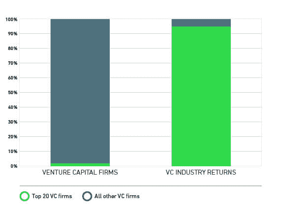
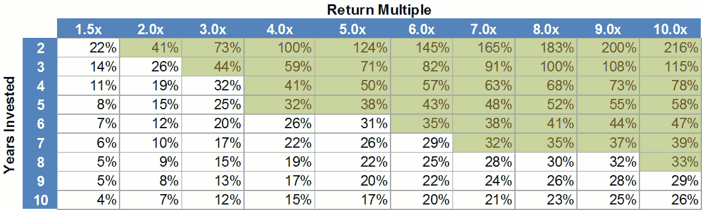
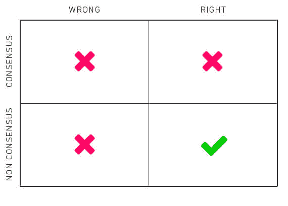

# 揭开风险资本经济学的神秘面纱，第一部分

> 原文：<https://blog.wealthfront.com/venture-capital-economics/?utm_source=wanqu.co&utm_campaign=Wanqu+Daily&utm_medium=website>

前几天，我的联合创始人[丹·卡罗尔](https://www.wealthfront.com/management)问了我一些关于风险投资回报的问题，因为他对最近宣布的一些交易的估值感到震惊。在我回答了这个问题后，丹和几个在我听力范围内的同事鼓励我分享我对这个问题的看法，因为人们对这个问题了解得很少。

关于风险投资家支持的公司的财务表现，人们已经写了很多，但是关于风险资本行业本身的经济学却写得很少。在这篇文章中，我们揭开了谁投资风投，他们期望什么回报，以及最好的风投如何持续成功地超越这些期望的和服。

## 谁资助风投？

风险资本行业的主要资金提供者是大型资金池的管理者。这些实体包括养老基金、大学捐赠基金、慈善基金会，在较小程度上还包括保险公司、富裕家庭和企业。风险资本基金以有限合伙制的形式筹集，通常有 10 年的法定期限。风险投资通常不会在合伙关系的第三年之后投资新公司，以确保他们最近的投资有机会在合伙关系合法结束之前清算。这意味着，如果他们不想停止对新公司的投资，就必须每三年建立新的合作关系。暂停投资新公司通常会被企业家群体解读为不再做生意，这使得一个人很难在以后重新开始交易流程。因此，有一个巨大的动机不让这种情况发生。

## 机构为什么要资助风投？

正如我们在[投资方法白皮书](https://research.wealthfront.com/whitepapers/investment-methodology/)和许多关于多元化的博客文章中解释的那样，几乎每个成熟的大型资产池管理公司都使用现代投资组合理论(Wealthfront 使用的相同方法)来确定其基础资产配置。由于养老金、捐赠基金和慈善基金会的规模，它们可以接触到比大多数个人更广泛的资产类别，包括对冲基金、私募股权(风险投资是其中的一部分)以及能源和房地产领域的私人投资。大多数大型资产池经理希望风险资本占 5-10 %,因为它过去的回报和与其他资产类别的反相关性。不幸的是，他们很少能达到他们想要的配置，因为没有足够多的风险投资公司能产生与风险相称的回报。这是因为排名前 20 位的公司(总共约 1000 家风险投资公司)创造了该行业约 95%的回报。

[T2】](https://www.wealthfront.com/blog/wp-content/uploads/2014/06/VC_Firms2_whiteback.jpg)

这 20 家公司不会随着时间的推移而发生很大变化，而且被超额认购，新的有限合伙人很难接触到它们。顶级捐赠基金被风险资本家视为最理想的有限合伙人，因为它们对该资产类别最忠诚。不过，如果一开始没有这些捐赠基金，它们也很难进入基金。偶尔，像 Benchmark 和 Andreessen Horowitz 这样的新公司出现并闯入顶级公司，但它们是例外而不是规律。

## 风险投资的预期回报是什么？

正如我们也解释过的，风险越大，回报越大。在机构投资的所有资产类别中，风险资本的风险最大，因此它必须有最高的预期回报。我曾听到机构以两种方式表达他们对风险资本回报的要求，以补偿他们承担的额外风险(即风险溢价):

*   标准普尔 500 回报率加 500 个基点(5%)或
*   标准普尔 500 回报乘以 1.5

这些预期是在标准普尔 500 预期年回报率为 12%时产生的。如今，市场期权中的预期会让你相信投资大众期望标准普尔 500 的年回报率在 6-7%之间。我不确定这对于当前适当的回报预期意味着什么，但它仍然可能至少在 15%左右。

## 风投是如何产生这些回报的？

根据哈佛商学院的威廉·萨尔曼的研究，典型的风险投资基金 80%的回报来自其 20%的投资。如果这 20%的投资要覆盖大部分破产或低价出售的投资，就需要有一些非常大的胜利。要想有机会赢得这些大奖，唯一的方法就是为每一笔潜在投资设置一个非常高的门槛。传统上，行业的经验法则是寻找有机会在五年内回报 10 倍的交易。那算出来的内部收益率是 58%。请参见下表，了解回报如何受时间和倍数的影响。

*IRR 分析:投资年限与回报倍数*

[T2】](https://www.wealthfront.com/blog/wp-content/uploads/2014/06/ReturnRates_2014_06_19.jpg)

如果一只基金的 20%投资于 5 年后回报率为 10 倍的交易，而其他一切都没有价值，那么这只基金的年回报率约为 15%。很少有公司能够产生这样的回报。

## 买家当心

过去 10 年，风险投资总体上一直是一个糟糕的投资领域。根据 Cambridge Associates 的数据，过去 10 年，风险资本的年均回报率仅为 8.1%，而标准普尔 500 的年均回报率为 5.7%。这显然不能补偿有限合伙人承担风险资本带来的风险。然而，最高的四分之一(25%)产生了 22.9%的年回报率。排名前 20 的公司甚至做得更好。

## 你需要成为非主流

在风险投资中获得高额回报的唯一方法就是承担风险。这让我想起了我的投资偶像橡树资本的霍华德·马克斯推广的一个框架。他表示，投资业务可以用一个二乘二矩阵来描述。在一个维度上，你可以是对的，也可以是错的。另一方面，你可以是一致的，也可以是非一致的。显然，如果你错了，你就不赚钱，但大多数人没有意识到，如果你是正确的，并且达成共识，你就不赚钱，因为机会太明显了，所有的回报都被套利走了。创造卓越回报的唯一方法是正确和非共识。这很难做到，因为当你投资的时候，你只知道你是非一致的。你不知道你是不是对的。

[T2】](https://www.wealthfront.com/blog/wp-content/uploads/2014/06/MarksMatrixCorrect.jpg)

愿意明智地采取这种信念的飞跃，是持续产生高回报的风险公司与其他人的主要区别之一。不幸的是，人性不喜欢冒险；所以大多数风险投资公司想要的是无风险的高回报，这是不存在的。因此，当其他人从大多数人最初认为疯狂的事情中赚大钱时，他们经常袖手旁观。我在风险投资行业的绝大多数同事都认为，Benchmark 支持易贝是疯了。“Beenie 宝贝……真的吗？这怎么能算是生意呢？”谷歌也是如此。“谁需要另一个搜索引擎。最后六次都失败了。”技术市场的领导者通常比该领域所有其他参与者的价值总和还要高，因此，如果你想获得超额回报，不值得支持领导者以外的任何人。

## 大海捞针？

根据我在 20 世纪 90 年代末做的一些研究，每年在全国范围内只有大约 15 家，正负 3 家，在独立企业生活的某个时刻达到至少 1 亿美元收入的科技公司。这些公司的收入往往会超过 1 亿美元，通常会产生超过 40 倍的回报倍数。当他们开始的时候，几乎每一个人听起来都很愚蠢。他们今天没有。每年只投资这些公司中的一家，基金的年回报率就会超过 100%。

说到巨大的回报，如今互联网的广度使得产生以前从未想象过的回报成为可能。像Airbnb，Dropbox **，**易贝，谷歌，脸书，推特和优步这样的公司回报超过风投投资的 1000 倍。这带来了惊人的基金回报。

## 永远不要加入让你成为会员的俱乐部

能接触到最好公司的投资者喜欢风险投资。那些不喜欢它的人讨厌它，但出于一些愚蠢的原因，他们继续留出一个分配，因为他们认为这样看起来更多样化。

谈到风险投资，我会遵循格劳乔·马克斯的古老格言“永远不要加入会让你成为会员的俱乐部”当心那些为你提供风险投资[基金的基金](http://www.investopedia.com/terms/f/fundsoffunds.asp)的私人财富管理公司。作为一家顶级风险投资基金的前合伙人，我可以向你保证，前 20 名中没有一家公司会允许一家经纪公司的基金投资于*他们的*基金。

* * *

**披露**

S&P 500(“指数”)是 S & P 道琼斯指数有限责任公司和/或其附属公司的产品，并已获得 Wealthfront 的使用许可。版权所有 2015 年，S & P 道琼斯指数有限责任公司，麦格劳-希尔公司和/或其附属公司的子公司。版权所有。未经 S&P Dow Jones indexes LLC 的书面许可，禁止全部或部分重新分发、复制和/或影印索引数据服务附件。欲了解更多关于标准普尔道琼斯指数有限责任公司指数的信息，请访问 www.spdji.com。S & P 是标准普尔金融服务有限责任公司的注册商标，道琼斯是道琼斯商标控股有限责任公司的注册商标。S&P Dow Jones indexes LLC、Dow Jones Trademark Holdings LLC、其关联公司或其第三方许可方均不对任何指数准确代表其声称代表的资产类别或市场部门的能力做出任何明示或暗示的陈述或保证，S&P Dow Jones indexes LLC、Dow Jones Trademark Holdings LLC、其关联公司或其第三方许可方均不对任何指数或其中包含的数据的任何错误、遗漏或中断承担任何责任。