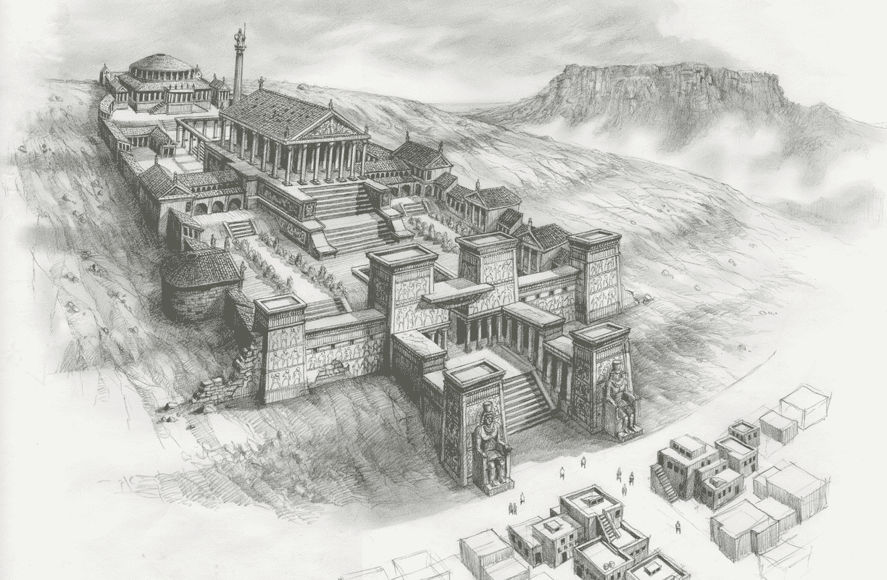

# Quora 把世界的知识留给了自己

> 原文：<https://konklone.com/post/quora-keeps-the-worlds-knowledge-for-itself?utm_source=wanqu.co&utm_campaign=Wanqu+Daily&utm_medium=website>


[](http://www.cgsociety.org/index.php/CGSFeatures/CGSFeatureSpecial/stockholm_library_interior)

The [Stockholm Public Library's](http://www.cgsociety.org/index.php/CGSFeatures/CGSFeatureSpecial/stockholm_library_interior) proposed Wall of Knowledge.


最近在 Quora 上答错了一个问题: **[“成为 18F 战队的一员是什么感觉？”](https://www.quora.com/What-is-it-like-to-be-a-member-of-the-18F-team)T3】**

我有一个 Quora 账号，但是我几乎从来没有用过。我注意到这个问题是因为用户不知何故找到了我并“要求”我回答，这导致 Quora 给我发了邮件。这是一个很好的问题，Quora 擅长回答这种问题，我认为它产生的[答案](https://www.quora.com/What-is-it-like-to-be-a-member-of-the-18F-team)将准确反映早期 [18F](https://18f.gsa.gov) 团队对他们的工作和工作的感受。

可悲的是，Quora 的政策是将该快照锁定在他们自己的私有存储中，并从历史记录中删除。

[互联网档案馆](https://archive.org)是世界上[最不可思议的组织](https://en.wikipedia.org/wiki/Internet_Archive)之一，坐落在[一座雄伟的寺庙](http://www.sfgate.com/news/article/Brewster-Kahle-s-Internet-Archive-3946898.php)，狂热地致力于 ***自 ***1996*** 起将整个互联网*** 存档。

在档案馆的[时光倒流机](https://archive.org/web/)，你可以搜索并重温互联网历史中令人难以置信的丰富内容。这是世界上最有价值和被广泛引用的收藏之一，现在很难想象没有它的互联网。

但如果你访问 Quora 的 [`/robots.txt`](https://www.quora.com/robots.txt) (互联网向网络爬虫发送措辞强硬的信件的标准)，你会看到他们挑出互联网档案进行排除。互联网档案尊重 robots.txt 标准，所以 Quora 没有回溯机器内容。

Quora 认识到这一点非常重要，足以让[在他们的`robots.txt`中得到一个解释](https://www.quora.com/robots.txt)。

```
 # People share a lot of sensitive material on Quora - controversial political
 # views, workplace gossip and compensation, and negative opinions held of
 # companies. Over many years, as they change jobs or change their views, it is
 # important that they can delete or anonymize their previously-written answers.
 # 
 # We opt out of the wayback machine because inclusion would allow people to
 # discover the identity of authors who had written sensitive answers publicly and
 # later had made them anonymous, and because it would prevent authors from being
 # able to remove their content from the internet if they change their mind about
 # publishing it. As far as we can tell, there is no way for sites to selectively
 # programmatically remove content from the archive and so this is the only way
 # for us to protect writers. If they open up an API where we can remove content
 # from the archive when authors remove it from Quora, but leave the rest of the
 # content archived, we would be happy to opt back in. See the page here:
 # 
 # https://archive.org/about/exclude.php
 # 
 # Meanwhile, if you are looking for an older version of any content on Quora, we
 # have full edit history tracked and accessible in product (with the exception of
 # content that has been removed by the author). You can generally access this by
 # clicking on timestamps, or by appending "/log" to the URL of any content page.
 # 
 # For any questions or feedback about this please email robotstxt@quora.com.

 User-agent: ia_archiver
 Disallow: /

```

(*更新*:这篇文章发表后，Quora 添加了上面的第一段。我已经[更新了上面的摘录](https://github.com/konklone/writing/commit/c18b2118193b725376a7648112701e5eb283cb9f)以匹配他们当前的机器人

因此，Quora 封锁互联网档案的理由是，Quora 不能在任何用户想要重写历史的时候自动返回。

请记住，你已经可以通过[将单个页面添加到你的 robots.txt](https://archive.org/about/faqs.php#2) 中来从互联网档案中移除单个页面(整体)。Quora 要求能够从已经存档的页面中删除特定的*内容*。

你能想象如果档案馆实现了这样的功能吗？这将使档案馆的历史记录完全不可信，并摧毁其可信度。你可以打赌，许多人、公司和政府都会喜欢有选择地删除或修改他们工作的历史记录的能力。

但是历史不是这样，互联网也绝对不是这样。Quora 不是一个私人通信网络。当用户为 Quora 做贡献时，他们就参与了 Quora 的使命:成为[“分享和增长世界知识”](https://www.quora.com/about)。就像出版一本书，制作一个电视节目，或任何其他形式的人类广播:一旦它在那里，你可以塑造它的使用，但你不能从公共记录中撤回它。

[](http://io9.com/the-great-library-at-alexandria-was-destroyed-by-budget-1442659066)

The [Library of Alexandria](http://io9.com/the-great-library-at-alexandria-was-destroyed-by-budget-1442659066).


Quora 对互联网档案馆的要求——事实上，因为档案馆没有来自互联网的公开竞争——是不合理的、短视的和自私的。Quora 只是以公众为代价，成为“他们的”内容的鲨鱼。

我通常会试着对人们的动机慷慨一些，但在这里我愿意做最坏的打算。Quora 的理由实在是太站不住脚了，它的商业动机在结果中太纠结了，以至于他们上面的评论不能代表整个故事。

Quora 是一项建立在风险投资基础上的免费服务，它需要在未来几年内将其用户货币化，你难道不知道，他们真的希望你去 quora.com，他们真的希望你能在 T2 开一个账户。

事实上，直到最近，Quora 还会阻止访问者查看超过第一个答案的内容，除非他们登录。我敢打赌，大多数阅读这篇文章的人以前都遇到过这样的弹出窗口。

他们已经关闭了弹出窗口，但是所有的内容仍然完全在 Quora 的控制之下。如果 Quora 明年倒闭，完全不清楚他们收集的人类产出会发生什么。这不是理论上的:单方面大规模破坏用户生成的内容[发生](http://www.archiveteam.org/index.php?title=Geocities) [所有](http://www.archiveteam.org/index.php?title=Friendster) [该](http://www.archiveteam.org/index.php?title=Google_Video) [的时间](http://www.archiveteam.org/index.php?title=Yahoo!_Video)。

Quora 的问答系统是极其成功的堆栈溢出模式的概括，这是一个面向程序员的问答网站，很快成为世界上免费的谷歌大学和任何技术工作者的教学助手。

毫不夸张地说，堆栈溢出已经完全改变了当今软件开发人员完成工作的方式和速度。如果你要绘制我访问 Stack Overflow 的天数，它看起来会非常类似于我的 GitHub 个人资料上的[图。Stack Overflow 已经扩展到了](https://github.com/konklone) [Stack Exchange network](http://stackexchange.com) ，在很多方面是 Quora 的直接竞争对手。

像 Quora 一样，Stack Overflow 是私人运营的，像 Quora 一样，Stack Overflow 依靠一个活跃用户社区来产生活动、知识和[收入](https://meta.stackexchange.com/questions/79435/what-is-stack-overflows-business-model)。

*与* Quora 不同，Stack Overflow 可以被[存档到它存在的第一天](https://web.archive.org/web/20141013225838/http://stackoverflow.com/)——大概是因为创始人明白互联网是如何工作的，也明白这对增长世界知识的实际意义。

在 Quora 明白这一点之前，我会把我的知识贡献给这个世界，而不是 Quora。

[](http://www.siliconvalleywatcher.com/mt/archives/2014/06/culturewatch_internet.php)

The Internet Archive's ceramic archivists. [Photo by Tom Foremski of Silicon Valley Watcher](http://www.siliconvalleywatcher.com/mt/archives/2014/06/culturewatch_internet.php).


