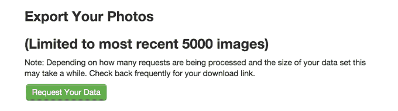

# Twitpic 找不到收购者，最终将于 10 月 25 日关闭 TechCrunch

> 原文：<http://techcrunch.com/2014/10/16/twitpic-couldnt-find-an-acquirer-will-shut-down-after-all-on-oct-25th?utm_source=wanqu.co&utm_campaign=Wanqu+Daily&utm_medium=website>

# Twitpic 找不到收购者，最终将于 10 月 25 日关闭

关于 Twitpic 幸存的报道被大大夸大了。[尽管声称](https://twitter.com/TwitPic/status/512705809696837632)在 Twitter 的商标投诉后，它已经找到了一个收购者来拯救它，照片共享服务今天[宣布这并没有发生，游戏在 10 月 25 日](http://blog.twitpic.com/2014/09/twitpic-is-shutting-down/)结束。用户现在可以在 25 号之前[导出他们的照片](http://twitpic.com/account/settings)，到那时他们就会消失在空白中。

Twitpic 创始人诺亚·埃弗雷特在其博客上写道:

> 怀着沉重的心情，我再次宣布 Twitpic 将于 10 月 25 日关闭。我们接触了一些潜在的收购者，用尽了所有可能的选择。我们几乎可以肯定，我们已经为 Twitpic 找到了一个新家(这就是我们之前的推文)，但令人满意的条款无法满足。通常情况下，我们不会过早地宣布类似的事情，但我们希望尽快让我们的用户知道 Twitpic 还活着。”

Twitpic 的导出工具将让用户挽回他们的记忆，或者至少是他们最后上传的 5000 张照片。翻看你最早的 Twitpics 可能会让你怀旧/羞愧。我的第一张照片是 MC Hammer 在一次技术会议上。所以对我来说都是。

该工具正在运行落后，大概是由于需求，所以你必须点击进入队列，然后回到你的设置页面获得你的导出下载链接。

Twitpic 最初[在 9 月 4 日宣布将关闭](https://beta.techcrunch.com/2014/09/04/twitpic-to-shut-down-on-september-25th-following-legal-demands-from-twitter/)。但两周后，它在推特上说有人在买它，它将继续运营

这是它传达死亡的奇怪方式。

今天的声明是一个重大的倒退，肯定会让那些曾经满怀希望但后来又破灭的忠实用户感到失望。Twitpic 最初是在 Twitter 上分享照片的唯一方式之一，允许用户上传照片并获得他们可以发布的 URL。它在永久链接的照片页面上贴满了广告，但在 2011 年年中，Twitter 透露将推出自己的照片托管服务，这使得 Twitpic 基本上没有必要。

Twitpic 和它的竞争对手很快被 Twitter 的原生选项超越。Yfrog 转向成为一个社交网络，但是 Twitpic 坚持自己的原始产品，签署了自己的死亡证明。

几个月前，当 Twitter 威胁要对侵犯其商标的行为采取法律行动时，这种局面就开始了。Everett 解释说:“Twitter 联系了我们的法律部门，要求我们放弃商标申请，否则将面临失去访问他们 API 的风险。与其和一个财力雄厚的对手打一场昂贵的法律战，埃弗雷特决定认输。多亏了一个收购者，它看起来会重获新生，但这并没有发生。现在钟声已经响起，战斗已经结束，距离备受打击的 Twitpic 蹒跚走出拳击台只有 9 天了。