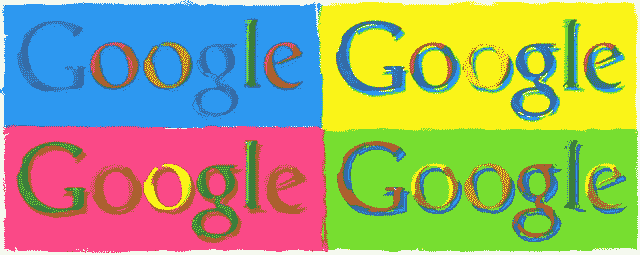
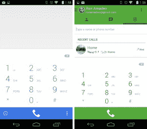
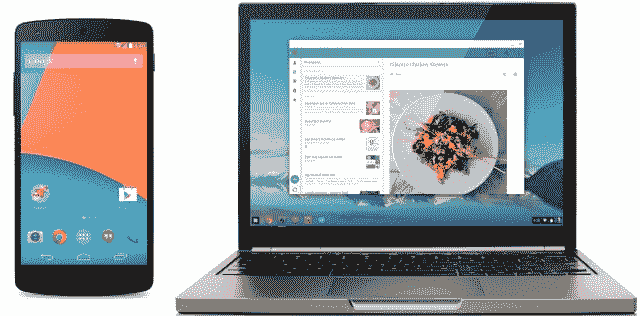

# 谷歌的产品策略:两样都做

> 原文：<https://arstechnica.com/business/2014/10/googles-product-strategy-make-two-of-everything/?utm_source=wanqu.co&utm_campaign=Wanqu+Daily&utm_medium=website>

你听说过“不要把所有的鸡蛋放在一个篮子里”这句话吗？这是一种赞美多样化优点的说法——永远要有一个“b 计划”。从谷歌混乱且经常令人困惑的产品线来看，这是该公司铭记在心的事情。谷歌喜欢拥有多个竞争产品，争夺相同的用户群。这样，如果一个产品不成功，希望另一个会成功。

最极端的例子是谷歌的即时通讯解决方案。一度有四种不同的方式在 Android 上发送短信:Google Talk、Google+ Messenger、Messaging (Android 的短信应用)和 Google Voice。Google Hangouts 出现了，[最终将一切](http://arstechnica.com/gadgets/2014/09/google-hangouts-gets-a-huge-update-including-google-voice-integration/)合并成一个单一的即时通讯平台。

幸运的是，谷歌现在有一个单一的，统一的即时通讯程序，所有进一步的即时通讯努力都将倾注于此，对吗？不对。来自 *[印度](http://economictimes.indiatimes.com/tech/internet/google-planning-to-launch-own-mobile-messaging-app-similar-to-whatsapp/articleshow/44141070.cms)* 经济时报的报道称，谷歌正在开发第五个即时通讯程序。据报道，这款手机不需要谷歌账户，将针对 Whatsapp。在 KitKat 中，谷歌删除了股票短信应用程序，并为短信服务使用了 Hangouts，但在 Lollipop 中，它又添加了一个短信客户端，因此很快我们可能会恢复到三个短信客户端。统一的 Hangouts 更新还为 Android 添加了一个*第二*拨号器应用程序，所以现在有了 KitKat 中引入的主要谷歌拨号器和一个新的 Hangouts 拨号器，可以拨打 VOIP 电话。用户从需要 IM unity，拥有它，然后混乱地叫嚣着要 dialer unity。

[Enlarge](https://cdn.arstechnica.net/wp-content/uploads/2014/09/2014-09-12-17.58.56.jpg) /

谷歌拨号器和 Hangouts 拨号器。

但这是谷歌的典型运作方式。该公司的行动表明，它并不真的相信专注于一个问题的单一解决方案，不管这对用户来说会使事情变得多么容易。它必须与各种领域的外部竞争对手打交道，谷歌似乎看不出为什么竞争不能来自内部——谷歌产品与其他谷歌产品竞争。

几乎就像每个产品类别都只是谷歌的一个大的 A/B 实验。随着谷歌的搜索引擎不断从网络上收集数据进行学习和改进，谷歌公司的工作方式也大同小异。它为一个问题提供了多种解决方案，并期望最好的方案胜过其他方案。

我们将再次使用即时消息作为例子:Google 有四个发短信的客户端，它们都采用不同的方法来解决问题。Google Talk 是传统的即时通讯客户端，与 AIM 类似。Google+ Messenger 是一个即时通讯客户端，是社交网络的一部分，是谷歌版的脸书信使。消息(Android 的股票短信)应用程序是一个基本的手机短信应用程序。谷歌语音翻转了它的短信系统，允许用户拥有一个电话号码，查看语音邮件，从互联网上阅读和发送文本。

四种不同的方法解决同一个问题是混乱的，但它确保了无论哪种方法最终胜出，谷歌在该领域都将有一个竞争对手。当用户只想请朋友出去喝一杯时，他们很难确定应该使用哪一个，但谷歌似乎并不担心这一点。只要用户选择其产品中的一个，它就很高兴。

尽管消息传递是最明显的，但该公司并不只是在短信应用上这么做。对于谷歌关心的几乎每一个产品类别，它都有多个相互竞争的项目。

## Android 对 Chrome 操作系统——最终两个赢家？太好了！

大多数人看到这个都会说:“谷歌为什么要做两个完全不同的操作系统？”就像即时通讯一样，Chrome/Android hydra 使得无论风向如何，谷歌都为操作系统做好了准备。计算的未来是基于应用的智能手机风格的操作系统，还是一切都是网络应用的依赖互联网的云 OS？通过采取这两种方法，谷歌可以覆盖其基地，并根据需要调整资源。

在这个例子中，两个操作系统都做得很好。Chromebooks 对 Windows 来说是一个足够大的威胁，他们已经赢得了被微软的 FUD 大炮瞄准的荣誉，Android 已经徘徊在 T2 80%的全球智能手机市场份额上。

制作两个操作系统是很多重复的工作，但是最近它们开始混淆在一起。Android 的 Google Now 已经成功过渡到 Chrome。Chrome OS 的[通知面板](http://arstechnica.com/gadgets/2014/03/google-now-on-chrome-finally-comes-to-windows-and-mac-os/)看起来就像是从 Android 上撕下来的。Android 的主要浏览器是 Chrome。Chrome 操作系统[现在可以运行安卓应用](http://arstechnica.com/gadgets/2014/09/chrome-os-can-now-run-android-apps-no-porting-required/)。Android L 最近的新应用程序允许 Chrome 的浏览器标签像单独的应用程序一样显示，使 Web 应用程序成为一等公民。

Chrome 通常会出现在台式机和笔记本电脑上，Android 通常会出现在智能手机或平板电脑上，但硬件也开始变得模糊起来。我们已经看到了笔记本电脑上的安卓系统和大量的平板电脑/笔记本电脑混合设备，以及对 T2 Chrome OS 平板电脑的持续开发。

谷歌也在使用 Chrome 和 Android 进行 A/B 测试，看看原始设备制造商能在多大程度上修改其代码。Android 是免费修改的，而 Chrome OS 的原始设备制造商不允许修改底层代码或界面。谷歌已经亲眼目睹了这是如何影响更新的。Android 更新[到处都是](http://arstechnica.com/gadgets/2014/08/the-state-of-android-updates-whos-fast-whos-slow-and-why/),有几个月的延迟，经常根本没有更新，而 Chrome OS 未经修改的代码允许谷歌运行一个中央更新系统，第一天就更新所有内容。

根据 A/B 测试的数据，谷歌认为 Chrome 操作系统的更新情况更好，因此它将对 Android Wear、汽车和电视应用相同的策略。有了这些，[皮肤不被允许](not%20allow%20OEM%20skins%20on)，谷歌将运行一个[集中更新系统](https://twitter.com/Android/status/499604576899584000)。