# 利用动力驱动策略的 SaaS 指南

> 原文：<http://blog.aircall.io/the-saas-guide-to-leveraging-the-powered-by-tactic/?utm_source=wanqu.co&utm_campaign=Wanqu+Daily&utm_medium=website>

像许多年轻的 SaaS 创业公司一样，我们正在想办法让我们的潜在客户看到我们。**在我们的行业中，最广泛使用的策略之一是通过线路供电**。

正如您可能已经猜到的那样，Powered by 策略在于**利用您现有的用户群，在您产品的一部分上显示您的徽标或链接，这些对您客户的访客或合作伙伴来说是公开/可见的**。

当我们为 Aircall 考虑这个问题时，我们对其他 SaaS 玩家所做的事情进行了一些基准测试，并认为分享我们收集的例子会很有趣。

到目前为止，我们发现战术驱动的 P **主要用于 5 种不同的情况**:

在本文的其余部分，我们将用真实的例子和见解来介绍它们。

本指南旨在成为你的灵感来源:**看看其他 SaaS 玩家在做什么，在什么样的背景下，看看你能否为自己的产品想出一些创意。当然，它必须是用户友好的，不应该伤害你的品牌或你的产品体验(你不需要太积极地使用 Powered by)。**

我们也很清楚这个指南并不详尽，所以如果你发现了一些我们错过的很棒的例子，请不要犹豫，在评论中添加它们。谢谢！

## 在公司的公共页面上

对于产品小部件，这是在客户的公共页面上添加 Powered by 链接的最明显位置:**。**

如果你的 SaaS 能让用户创建和维护他们绝对需要但不想花费时间和内部资源的页面，这种方法会特别有效(职业页面、印刷室、知识库……)**。**

以下是一些例子:

**[可使用的](https://www.workable.com/)** 是一个申请人跟踪系统，使公司能够建立他们的“职业页面”:

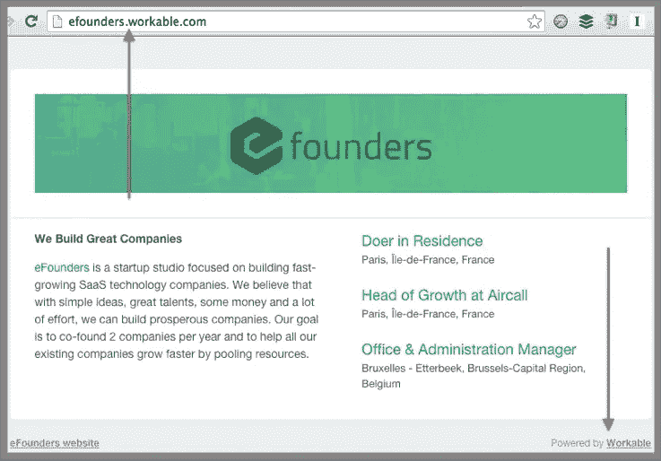

**[presking](http://www.pressking.com/)**是一个公关工具，可以让企业建立自己的印刷室:

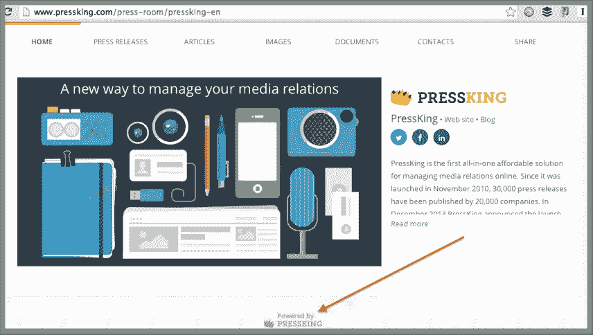

**[Wistia](http://wistia.com/)** 是一个 SaaS 网上研讨会，它提供了一个“公共页面”,集中了一家公司的所有网上研讨会。

[状态页面](http://statuspage.io)允许企业为自己的应用或网站创建状态页面:

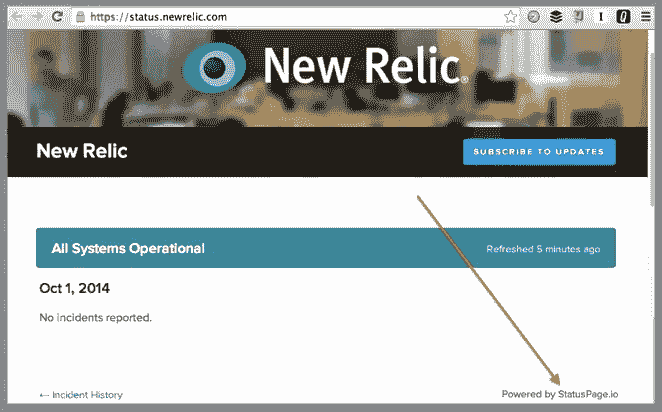

本着同样的精神，很少有公司想自己重建一个知识库，这为支持初创公司提供这一功能并以他们的名字命名它提供了一个绝佳的机会，就像 [Zendesk](https://www.zendesk.com) 或 [Helpscout](https://www.helpscout.net) 。

“公共页面”的另一个很好的用例是营销。大多数**“登陆页面”软件**都在它们的登陆页面上打上了自己的标志和链接。至少对于免费或更便宜的计划用户来说是这样。

参见 Launchrock、 [Instapage](https://www.instapage.com/) 、 [Unbounce](http://unbounce.com/) 等产品

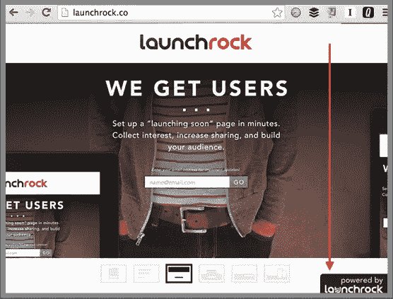

毫无价值的是:

*   您的品牌必须保持相对“微妙”(页脚的黑白链接/小标志)
*   该 url 还可以暗示所使用的服务:eFounders 工作页面位于:efounders.workable.com
*   大多数时候，这种品牌会随着更昂贵的计划而消失

Widgets 也是链接和徽标的绝佳位置。这里的区别(与公共页面相比)是**小工具通常是产品体验的一部分**而**必须为客户及其用户提供巨大的价值**。

它提供的价值越多，病毒传播就越好。这就是为什么许多高附加值的小工具不能删除 Powered by 链接的原因，即使是 pro 计划。

当想到成功的品牌产品时，脑海中会立即浮现 Olark 。我们中有多少人发现 Olark 仅仅是因为我们对这个聊天系统的效率和简单性印象深刻。

 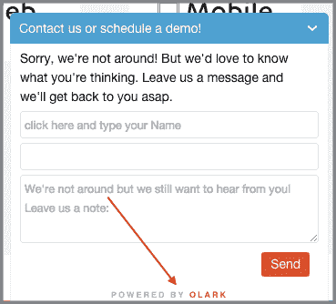
T4】

另一个很好的例子是客户反馈/调查小工具 [Qualaroo](https://qualaroo.com/) 。我知道很多人发现这个小工具非常有用，因此想尝试一下。

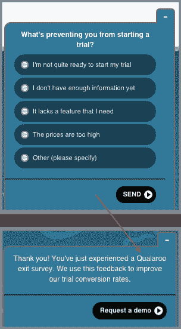

对我们许多人来说，客户支持是一个非常重要的话题。**对高质量客户支持/沟通工具的需求如此之高**以至于每当我们看到一个很酷的支持工具时，我们通常会为了尝试而尝试它。[对讲机](http://intercom.io)和 [GrooveHQ](http://www.groovehq.com/) 是我最近想到的。

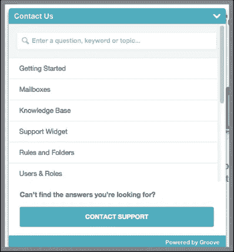

社交媒体是小工具的另一片沃土。在这种情况下，目标人群(营销人员)是病毒传播的核心。

到现在为止，你可能已经在博客上看到了一个[协同日程](http://coschedule.com/)点击发推特小工具和一个[弹出窗口，要求你注册时事通讯。对于这两种服务来说,“Powered by”部件是其病毒式传播的关键。](http://bounceexchange.com/)

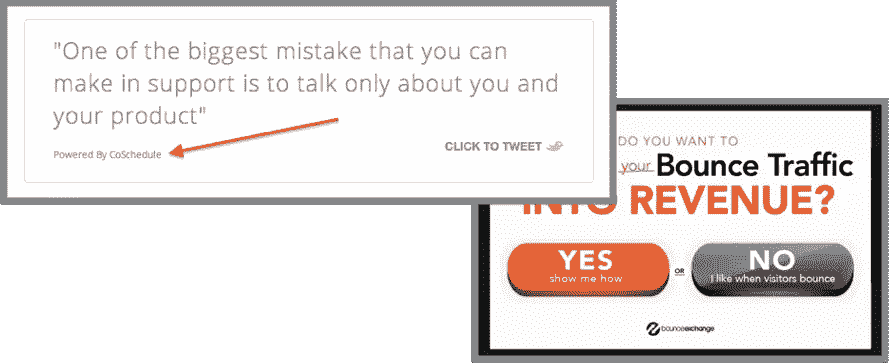

我们还有一个非常酷的语音小工具，允许我们的用户[在他们的网站](http://aircall.io)上添加点击呼叫功能:

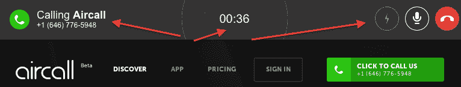T2】

(此功能仍处于测试阶段，但请随时通过 contact@aircall.io 与我们联系，我们会将您添加到队列中！)

## 劫持用户的通信

**另一个经典之作:利用你的用户的交流来传播爱，也叫做[“Hotmail”策略](http://en.wikipedia.org/wiki/Viral_marketing)。**

Mailchimp 是 Hotmail 的电子邮件营销版本，我敢打赌，你收件箱里的许多时事通讯底部都有 Mailchimp 的标志。

我们在 [Front](http://frontapp.com) 的朋友甚至将此作为他们定价计划的一个特色。协作电子邮件客户端在免费账户发送的每封邮件中都包含一个“用 Frontapp 发送”链接，付费用户可以删除这个签名。

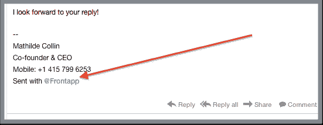

如果你认为这种策略只用于“电子邮件”媒体，那你就错了。一些创业公司在获得知名度方面很有创意。

这就是视频会议解决方案 uberconference 的案例。每次有人加入一个房间，他都会听到: "这个电话是由 Uberconference 提供的，您是第一个加入的人，等等……"Hotmail 邮件的语音版本。

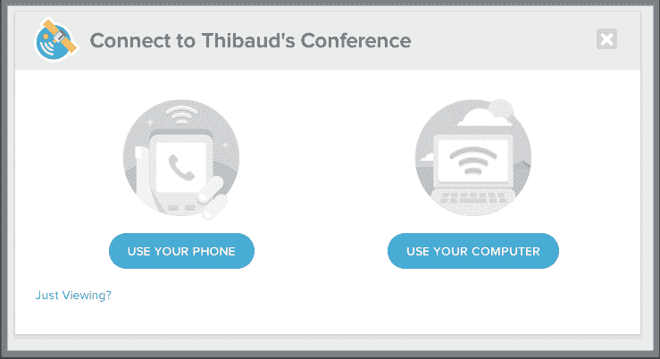

说到劫持沟通，不要忘记现实生活中的机会！

[Wisembly](http://wisembly.com/en/) 是一款 SaaS 解决方案，可让会议参与者通过手机更轻松地提问和参与。**现实生活中的事件是他们成功的一大驱动力，因为他们在大型会议期间接触到了许多潜在客户**。

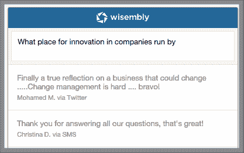

另一个很好的例子是日历应用 [Sunrise](http://sunrise.am) 。一些人已经告诉我，他们在 **之后尝试了应用**，我通过它给他们发送了会议邀请**。**

Prezi 和 [EventBrite](https://www.eventbrite.com/) 也属于“线下活动的在线工具”这一类别，并利用了 Powered by 杠杆。**例如，Eventbrite 标志可以在印制的门票和徽章上找到**。

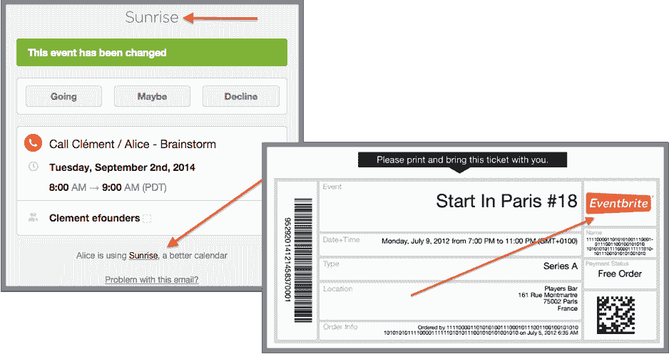

## 在共享文档上

您的 SaaS 让您的客户能够创建和共享文档？你很有可能以这样或那样的方式利用它们来接触更多的人。

大多数电子签名 SaaS 设法添加他们的标志在某处。直接在客户文件上做这件事太过仓促。不，可能**更聪明的做法是把它加在确认收据**上(因为它必须被发送有一个证明)。下面是 [HelloSign](https://www.hellosign.com/) 的例子:

许多电子文档工具使用的技巧是将文档接收者重定向到他们产品的一个更简单的版本(具有可视化等有限的特性)。这就是像 [quoteroller](http://www.quoteroller.com/) 、 [Pandadoc](https://www.pandadoc.com/) 或 [Tilkee](http://tilkee.com) 这样的应用正在做的事情。

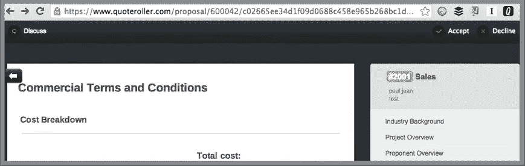

设计师的电子文档等同于实体模型和原型。你猜怎么着，这些工具也使用相同的策略:当你创建一个模型/原型时，你要发送给的人很有可能会以某种方式看到一个标志。下面是优秀的 [Marvelapp](https://marvelapp.com/) 的例子:

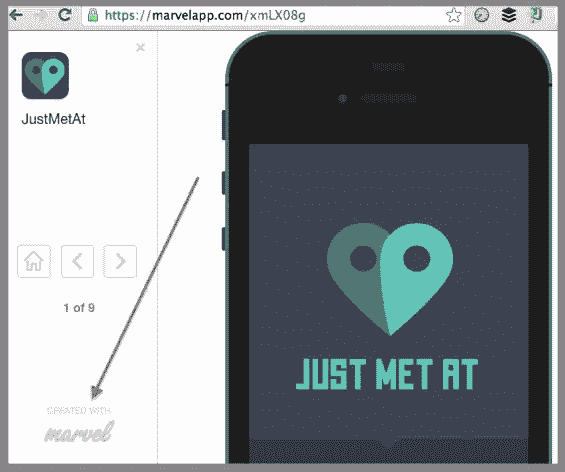

## 透明趋势

最后一个有趣的案例与最近的趋势有关:**创业透明度**。越来越多的初创公司决定分享曾经非常隐私的数据(如收入、注册人数等)，他们通过公开版本的仪表板来做到这一点。

两个明显的例子是 Baremetrics 和 Trello。

缓冲区[公共收入](https://buffer.baremetrics.io/)仪表板:

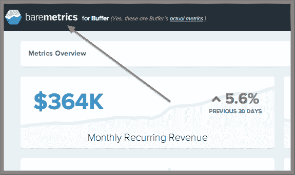

越来越多的公司为产品路线图或客户反馈创建[公开展示板](https://trello.com/b/nC8QJJoZ/trello-development)。

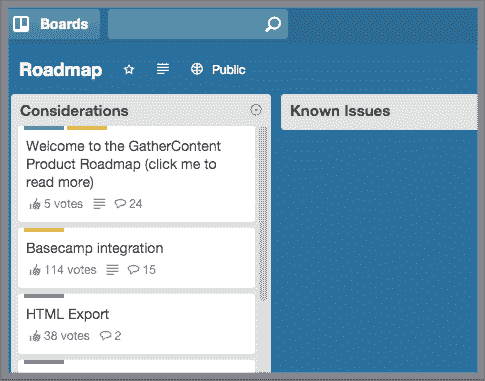

**预计越来越多的报道 SaaS 将提供他们的仪表板版本。**

从“透明”的角度来看，如果有一天客户支持 SaaS 像 Zendesk，Helpscout 等提供他们的客户分析仪表板的公开版本，我不会感到惊讶。

例如，使用 Zendesk 的公司可以将这个仪表盘分享给他们的客户，作为透明/客户关怀的标志**(“这就是我们对待你的方式！”收到的票的数量，回答之前的平均时间等。)**。