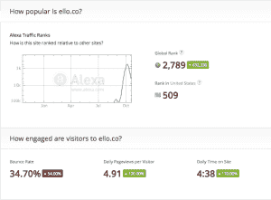
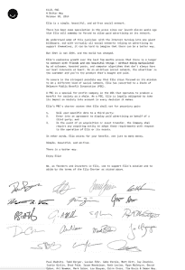

# Ello 筹集了 550 万美元，以公益公司的名义合法注册，这意味着永远不会有广告 TechCrunch

> 原文：<http://techcrunch.com/2014/10/23/ello-raises-5-5-million-legally-files-as-public-benefit-corp-meaning-no-ads-ever/?utm_source=wanqu.co&utm_campaign=Wanqu+Daily&utm_medium=website>

# Ello 筹集了 550 万美元，作为公共福利公司合法备案，这意味着永远没有广告

[Ello.co](https://ello.co/beta-public-profiles)，上个月[炸掉](https://beta.techcrunch.com/2014/09/25/ello-ello-new-no-ads-social-network-ello-is-blowing-up-right-now/) [的无广告社交媒体网络](https://beta.techcrunch.com/2014/09/29/no-people-are-not-leaving-facebook-in-droves-for-ello/)，已经获得了 550 万美元的风险投资，尽管它在地上插上了一面法律旗帜，表示该公司永远不会通过出售广告或用户数据赚钱，也没有收购者可以这样做。

该公司在特拉华州注册为公益公司，Ello 表示，根据美国法律，投资者不可能要求 Ello 展示广告，出售数据，或将公司出售给任何违反这些条件的买家。

Ello 首席执行官 Paul Budnitz 表示，这是对互联网已经成为“巨型广告牌”的回应。Ello 的承诺还延伸到真实或匿名身份的使用，同时要求这个新“社区”的成员遵守常识性的行为规则。

不幸的是，正如我们自己的 Sarah Buhr 之前所写的，该公司可能是其早期成功的受害者:

> 当然，它还处于测试阶段，因此人们不应该期望这个网站是完美的，但是有了这么多的增长和无穷无尽的邀请，这个网站可以很开放地说它处于测试阶段。事实上，它发展得如此之快是一个悲剧。功能列表实际上看起来很酷。然而，它的大部分都没有构建好或者不能很好地工作。
> 
> 搜索功能应该是 Ello 的最高优先级，尤其是在这种增长情况下。Ello 的用户界面非常简单，这使得这个功能很难找到。搜索选项不起作用，网站只是给你提供一堆可以关注的人，没有任何关于你为什么应该关注他们的背景。你找不到你的朋友，即使有他们的名字。

看看粗略的 Alexa 流量数字(我知道这不是最好的衡量标准，但至少这是一个指标)表明，流量已经从 Ello 炒作的峰值下降。

然而，令人难以置信的新注册率(据报道，在 9 月份的高峰时期，每小时约有 40，000 个邀请请求)已经成功吸引了 Foundry Group、Techstars Bullet Time Ventures 和 FreshTracks Capital。

鉴于其对无广告商业模式的承诺，该公司表示，根据一份新闻稿，它将通过一家“受苹果应用商店启发”的在线商店以低价出售个性化功能和其他服务来创造收入。

Ello 投资者 Seth Levine 在他的博客文章中承认，对于一群风险投资者承诺支持一家明确表示不会出售用户数据或在其网站上发布广告的公司的诚意，有很多怀疑。

以下是他的回应:

> 我们要么建立一个不依赖第三方广告或出售用户数据的企业，要么就不建立企业。我们的信念是，有一些产品和功能是 Ello 可以开发的，用户会愿意为此付费。虽然价格可能较低，但作为拥有数百万用户的更大生态系统的一部分，将为支持业务和我们投资的公司提供一种经济模式。

投资者都签署了一份[使命声明](https://ello.co/downloads/ello-pbc.pdf)，如下所示。

