# 21 家大型科技公司是如何得名的

> 原文：<http://thenextweb.com/insider/2014/10/24/how-21-big-tech-comapnies-got-their-names/?utm_source=wanqu.co&utm_campaign=Wanqu+Daily&utm_medium=website>

## 科技公司名称

“名字里有什么”这个表达——或者更诗意一点的“一朵叫其他名字的玫瑰”——意味着，从本质上来说，名字并不重要。这表明，是人或物的属性决定了它到底是什么，以及世人如何看待它。

然而，在品牌和大企业的世界里，情况未必如此。公司名称需要包含一些个人但值得信赖的东西。或者至少必须提供一些优于其他选择的相对优势。耐克(原名蓝带体育)为什么叫耐克？因为它是以神话中象征胜利的希腊女神命名的。那听起来比蓝带运动好多了，不是吗？

带着这个想法，我们看了一些最大的科技品牌以及它们名字背后的含义。

### 三星电子

这是一个非常直接的问题。三星这个词在韩语中的意思是“T0”三颗星星“T1”，它被用来代表“大、多、强”的优点(就像夜空中的星星，或者是这样的故事)。

三星的首批产品包括鱼干、蔬菜、面条和水果，尽管它显然继续向广泛的不同行业发展。今天，它以智能手机和其他消费电子产品而闻名，但多年来，三星已经进入了航空航天、保险和金融行业等。直到 1987 年，三星的创始人李秉哲去世，新的首席执行官(秉哲的儿子李健熙)才着眼于成为前五大电子制造商。

[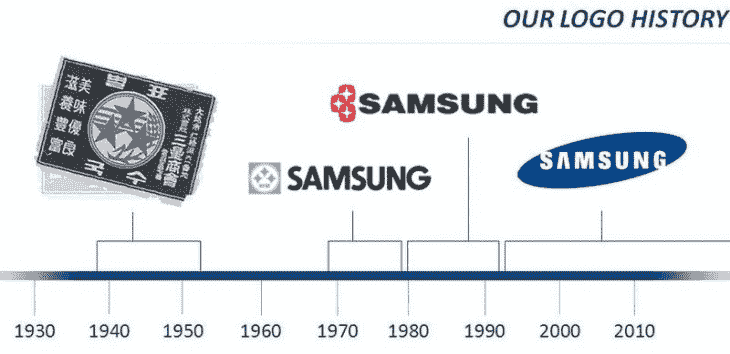

<noscript></noscript>](https://thenextweb.com/wp-content/blogs.dir/1/files/2014/10/SamsungLogoHistory.jpg) 

Samsung logos through the ages. *Credit: [Samsung Village](http://www.samsungvillage.com/blog/2011/03/04/did-you-know-three-stars-on-noodles/)*

1938 年至 1993 年间，每个三星标志实际上都以不同的形式展示了这三颗星。自 1993 年以来，三星一直使用其目前的标志，sans-stars。

* * *

### 诺基亚（总部设在芬兰）

尽管诺基亚最近的命运是退出智能手机市场，但众所周知，它并非始于电子行业。

事实上，在 1865 年，它的第一家工厂是位于芬兰 Tammerkoski Rapids 的木浆厂。1868 年，为了寻求更好的水流，该公司在离诺基亚镇几英里远的 Nokianvirta 河岸开设了另一家工厂，这也是 1871 年诺基亚这个名字的灵感来源。显然，在 19 世纪晚期，人们并没有急于打造品牌。

[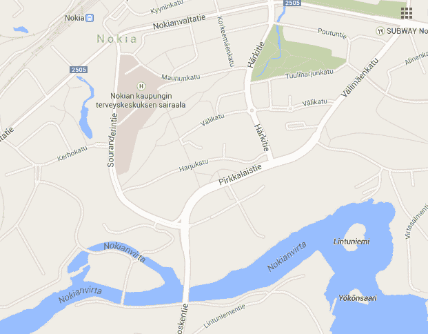

<noscript></noscript>](https://thenextweb.com/wp-content/blogs.dir/1/files/2014/10/Nokia_map.png) 

1967 年，它采用了诺基亚公司的正式名称，由五个不同的业务组成:橡胶、电缆、林业、电子和发电。如今，在出售给微软之后，剩下三家公司:诺基亚网络、here 和诺基亚科技。

* * *

### 苹果

作为世界上最大的公司之一，苹果显然吸引了相当多的注意力，但它并不总是这样。

在下面的视频中，年轻得多的史蒂夫·乔布斯(Steve Jobs)解释了公司刚起步时，为了官方目的不得不提交“一份虚构的企业名称声明”。建议包括像矩阵电子公司这样的公司，但苹果电脑公司最终被选定，附带条件是，如果在申请截止日期前没有其他人有更好的建议，它将成为公司的名称。

那么，为什么是苹果呢？用乔布斯自己的话来说:“部分是因为我非常喜欢苹果，部分是因为苹果在电话簿上领先于雅达利，而且我曾经在雅达利工作过”。2007 年，它从名字中去掉了“电脑”，变成了苹果。

https://www.youtube.com/watch?v=qzzOwRx3D1E

显然，这个计划非常奏效——苹果现在是一个全球巨头，而雅达利很久以前就退出了硬件游戏。作为一个额外的收获，雅达利这个名字来自一个日语动词，意思是击中目标，这对于一家游戏公司来说非常合适。

* * *

### 水平规ˌ水准仪(Level Gauge)

像这里的许多其他公司一样，LG 电子并不是以它现在的名字起家的。相反，1958 年，金星公司在朝鲜战争后成立，其使命是制造电子设备。

[

<noscript></noscript>](https://thenextweb.com/wp-content/blogs.dir/1/files/2014/10/Goldstar_logo21.png) 

金星的姐妹公司是 Lak-Hui(发音为“幸运”)，因此“幸运金星”诞生了。这显然与我们今天所知道的 LG 名称有关，它被用作“生活很美好”的口号。1995 年，金星正式采用了 LG 品牌和标志。

现在，该公司表示，它只是代表 LG，而不是生活的好或幸运金星。

* * *

### 常简称为 HTC 或宏达电

大多数人会告诉你，HTC 代表高科技电脑，它曾经是这样的，但这个名字背后还有另一个原因。

1997 年，当周鸿祎(现在的董事长)和王雪红(现在的女董事长)创建该公司时，两人决定用自己名字的首字母组成一个名字 HTC 就这样诞生了。

[

<noscript></noscript>](https://thenextweb.com/wp-content/blogs.dir/1/files/2014/10/cherwang.png) 

[Cher Wang](https://www.htc.com/uk/about/leadership/), co-founder (and the ‘C’) of HTC

虽然不可否认的是，*公司*本可以单独以赵承熙的名字命名，并得出同样的结果，但有趣的是，一位高管在与我们交谈时确实曾将王称为“HTC 中的 C”。

**下一页:** Spotify、索尼等等

### Spotify

Spotify 是一个有趣的例子。Spotify 这个词最初起源于瑞典，实际上在瑞典语中似乎没有任何意义(尽管谷歌翻译仍然将其归因于瑞典)。

相反，该公司的创始人丹尼尔·埃克(Daniel Ek)和马丁·洛伦佐(Martin Lorentzon)有一天正坐在一起试图想出一个名字，突然有一个建议被错听成了“Spotify ”,然后这个建议就被卡住了。当两人意识到这个词没有谷歌搜索结果，而且这些域名可以注册时，他们抢购了这些域名，剩下的就是历史了。

[

<noscript></noscript>](https://thenextweb.com/wp-content/blogs.dir/1/files/2014/10/1024px-Spotify_HQ.jpg) 

Spotify’s old headquarters in Humlegårdsgatan, Stockholm. *Credit: [Erik Stattin / Flickr](https://www.flickr.com/photos/35034349721@N01/1373581402/)*

随着公司的成长和受欢迎程度的提高，人们开始寻找一种“后结构”来更好地描述 Spotify 的名字。“我们有点不好意思承认这个名字是怎么来的，所以我们的后续结构是说 Spotify 源于 SPOT and IDENTIFY，” [Ek 写道](https://www.quora.com/How-did-Spotify-get-its-name)。

* * *

### 索尼

索尼的词根是另一种有趣的拉丁语和英语俚语的混合。更具体地说，它是“Sonus”和“Sonny”的结合，Sonus 的意思是声音，Sonny 的意思是富裕的年轻人。

然而，这不是原来的名字。它成立于 1946 年，名为东京电信工程公司，简称 Totsuko。尽管在这一点上它的任务仅仅是研究。

[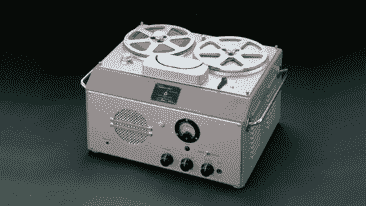

<noscript></noscript>](https://thenextweb.com/wp-content/blogs.dir/1/files/2014/10/Sony_type_G.jpg) 

The ‘Type G’. *Credit: Sony*

1947 年，它推出了第一款产品“强力扩音器”，1950 年，它发布了第一款磁带录音机“G 型”。据推测，在此之前至少有六次失败的尝试。(这很滑稽，G 实际上是“政府”的昵称——这是记录仪在法庭和其他官方场合使用的结果。)

更名发生在 20 世纪 50 年代，当时该公司希望将其野心推向全球，TTK 商标属于另一家公司。通过将 Sonus 和 Sonny 合并成 Sony，该公司有了一个合适的名称，而没有现有的商标。

虽然在 1955 年决定在产品上使用索尼标志，但直到 1958 年才成为索尼公司。

* * *

### 任天堂(日本电子游戏公司及其开发的电脑游戏名称)

任天堂比这里的许多其他公司稍微有点棘手，所以做好准备——你可能永远不会知道*真正的*含义。

尽管如此，它被广泛引用和接受，任天堂来自日语的字面翻译，意思是“把运气留给命运”。

然而， [*任天堂(1889-1980)的历史——从扑克牌到游戏&手表*](https://www.goodreads.com/book/show/12393199-the-history-of-nintendo-1889-1980---from-playing-cards-to-game-watch) 作者弗洛伦特·戈尔格斯(Florent Gorges)，表明这种解读可能是不正确的。相反，它表明这可能与该公司在 19 世纪晚期——准确地说是 1889 年作为[“HANA fuda”扑克牌](https://en.wikipedia.org/wiki/Hanafuda)制造商的根源有关。Hanafuda 字面翻译为“花牌”。

这和任天堂有什么关系？

根据这本书，该公司正在寻求推出一种新的更便宜的卡片系列，并选定了“天狗”这个名字。天狗是日本民间传说中的一个神话，经常被描绘成一个大鼻子。忍耐一下。

“鼻子”( *hana* )一词音译成英语时，与“花”( *hana* )一词相同。

[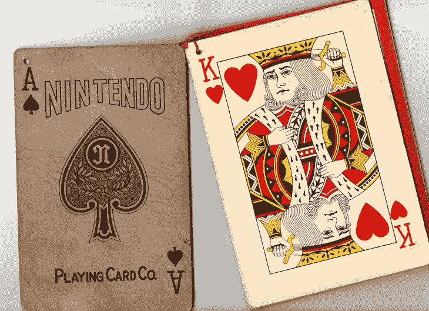

<noscript></noscript>](https://thenextweb.com/wp-content/blogs.dir/1/files/2014/10/Nintendo_cards.jpg) 

Nintendo playing cards. *Credit: Jitensha / [Yahoo Japan blog](https://blogs.yahoo.co.jp/kswff553/16311890.html)*

因此，任天堂的历史表明，任天堂可能意味着“自由的花神之殿”，因为大阪和京都的游客会摩擦鼻子，以表示对赌博的渴望。

在对这个问题的有趣总结中， [Kotaku 说](https://kotaku.com/5649625/nintendo-might-not-mean-what-you-think)即使是公司创始人的曾孙山内浩史也不知道这个名字背后的真相，但是“把一个人的命运交给命运”是一个“似乎合理的解释”。

1933 年，它正式成立为山内任天堂公司，后来在 1951 年成为任天堂扑克牌公司，最终在 1963 年决定成立任天堂有限公司——同年，它开始制作游戏和扑克牌。

* * *

### 亚马孙

亚马逊几乎被称为卡达布拉，就像魔术师感叹词中的“卡达布拉”一样。贝佐斯希望他的图书零售网站快捷方便，就像变魔术一样。

事实上，在 1994 年，这正是杰夫·贝索斯公司成立时的名字，但该网站在 1995 年以亚马逊的名字上线，取自亚马逊河，因为它是最大的河流。显然，贝佐斯从一开始就雄心勃勃。

安·拜尔斯的《杰夫·贝索斯:Amazon.com 的创始人》一书中提到，改名的原因源于一种非常合理的担心，人们可能会把 cadabra.com 误认为 cadaver.com。

[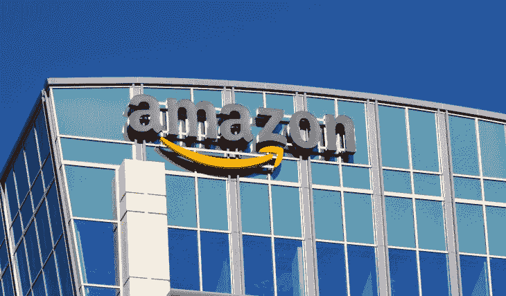

<noscript></noscript>](https://thenextweb.com/wp-content/blogs.dir/1/files/2014/10/Amazon_HQ.jpg) 

Amazon’s Santa Clara office. *Credit: [Ken Wolter](http://www.shutterstock.com/gallery-931246p1.html?cr=00&pl=edit-00) / [Shutterstock.com](http://www.shutterstock.com/editorial?cr=00&pl=edit-00)*

有趣的是，[商业周刊的布拉德·斯通的](http://www.businessweek.com/authors/411-brad-stone)[*【The Everything Store:杰夫·贝索斯和亚马逊时代*](https://www.amazon.co.uk/The-Everything-Store-Bezos-Amazon/dp/0552167835) 暗示 Relentless.com 也是另一个被搁置的建议，但这似乎有点可疑。

”贝佐斯和他的妻子越来越喜欢另一种可能性:Relentless.com。朋友建议，听起来有点邪门。但一定有什么东西吸引了贝佐斯:他在 1994 年 9 月注册了这个网址，并一直保留着，书上写着*[。](http://books.google.co.uk/books?id=3HIgAgAAQBAJ&pg=PA31&lpg=PA31&dq=Bezos+and+his+wife+grew+fond+of+another+possibility:+Relentless.com.+Friends+suggested+that+it+sounded+a+bit+sinister.+But+something+about+it+must+have+captivated+Bezos:+he+registered+the+URL+in+September+of+1994,+and+he+kept+it&source=bl&ots=kA-xOjOjBO&sig=mutAg8tW-XIZLUS9eZgxfmeXGMM&hl=en&sa=X&ei=cNdHVID4GMHQ7Ab93YDwCQ&ved=0CDQQ6AEwAw#v=onepage&q=Bezos%20and%20his%20wife%20grew%20fond%20of%20another%20possibility%3A%20Relentless.com.%20Friends%20suggested%20that%20it%20sounded%20a%20bit%20sinister.%20But%20something%20about%20it%20must%20have%20captivated%20Bezos%3A%20he%20registered%20the%20URL%20in%20September%20of%201994%2C%20and%20he%20kept%20it&f=false)*

 *一个快速的 whois 查询显示该网站今天仍然与亚马逊相关联，并且仍然重定向到亚马逊的主页。

* * *

### 谷歌

这一个似乎很广为人知:[谷歌的名字](https://web.archive.org/web/19990221202430/www.google.com/company.html)来自一个故意拼错的单词 Googol，这个单词代表 10^100，或者 1 后面跟着 100 个 0。为什么会这样？仅仅是因为创始人谢尔盖·布林和拉里·佩奇想要传达他们打算提供的大量数据。

该公司于 1997 年 9 月注册了谷歌域名，并于一年后的 1998 年 9 月注册成立。

[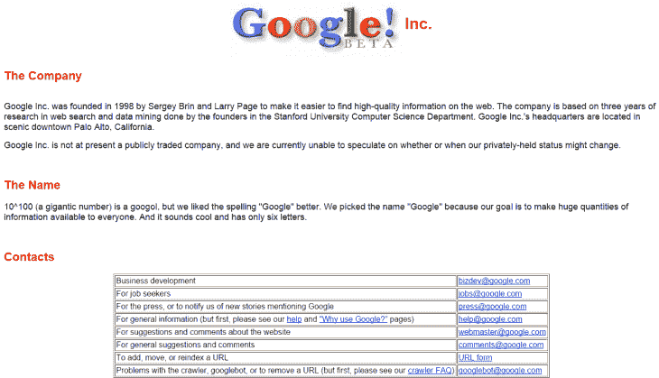

<noscript></noscript>](https://thenextweb.com/wp-content/blogs.dir/1/files/2014/10/GoogleBeta.png) 

不太为人所知的是，这个搜索引擎的昵称最初是“back rub”。你能想象如果它取代谷歌成为日常用语吗？“让我给你擦擦背吧，”“我擦擦背了。”

不。我也不能。

2004 年，在 1940 年出版的《数学的 [*和 I*](https://www.amazon.co.uk/Mathematics-Imagination-Dover-Books/dp/0486417034) *[想象力](https://www.amazon.co.uk/Mathematics-Imagination-Dover-Books/dp/0486417034)*[一书中推广了 Googol 一词的数学家爱德华·卡斯纳的遗产考虑起诉谷歌](http://articles.baltimoresun.com/2004-05-16/entertainment/0405150243_1_google-googol-internet-search-engine)的名称。没有提起诉讼。*T11】*

**下一页:**微软、脸书等等…

### 微软

如今，微软可能是一个根深蒂固的公司品牌，但在 1975 年，该公司在比尔·盖茨和保罗·艾伦眼中只是一道微光。

该公司于 1975 年 4 月正式成立，名称来自“微处理器”和“软件”的组合——这很合适，因为他们正在为微型仪器仪表和遥测系统公司(MITS)的 Altair 8800 开发软件。

[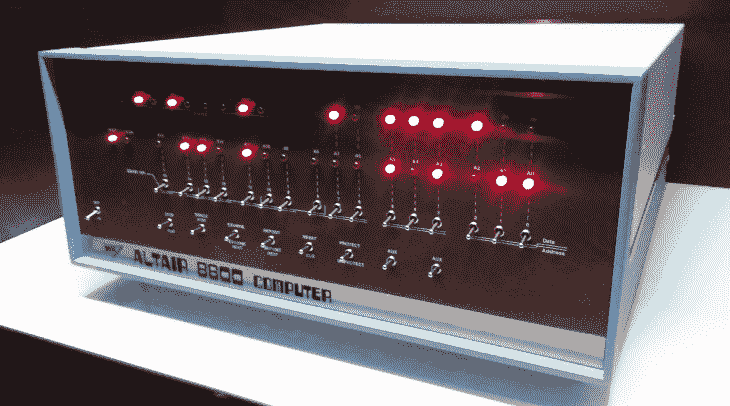

<noscript></noscript>](https://thenextweb.com/wp-content/blogs.dir/1/files/2014/10/Altair8800.jpg) 

The Altair 8800 computer Gates and Allen were creating software for. *Credit: Ben Woods*

1977 年，该公司在日本开设了第一个名为 ASCII 微软的国际办事处。该公司后来在华盛顿成立，成为微软公司。

有趣的事实:在微软之前，艾伦和盖茨一起创办了一家名为 [Traf-O-Data](https://en.wikipedia.org/wiki/Traf-O-Data) 的公司，该公司研究原始交通数据，为工程师们制作报告。虽然这不是一个巨大的成功，但这对他们后来的冒险是有启发性的，后来似乎变得更好了。

* * *

### 脸谱网

很难想象许多人*不*知道脸书的名字是怎么来的，考虑到该公司受到的审查程度——当然，[还有那部电影](https://thenextweb.com/news/sean-parker-the-social-network-is-a-complete-work-of-fiction)。尽管如此，考虑到它已经成为一个社会巨人，忽略它是一种疏忽。

[

<noscript></noscript>](https://thenextweb.com/wp-content/blogs.dir/1/files/2014/10/Eisenberg.jpg) 

Eisenberg, or ‘not Zuckerberg’, star of The Social Network. *Credit: [s_bukley](http://www.shutterstock.com/gallery-842284p1.html?cr=00&pl=edit-00) / [Shutterstock.com](http://www.shutterstock.com/editorial?cr=00&pl=edit-00)*

简而言之，它只是美国一些大学给新生的学生名录的名字，这样他们就可以对周围的人有所了解。是的，在 2004 年推出后的大约一年时间里，它一直在 thefacebook.com，直到该公司在 2005 年注册了 Facebook.com。

* * *

### 浏览器名

1994 年，当网景公司的一个团队围坐在一起，为一种新的浏览器想名字，以对抗 NCSA 的马赛克浏览器时，他们寻找的是一种能够击败竞争对手的东西。他们所期待的是哥斯拉。

[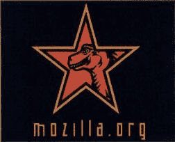

<noscript></noscript>](https://thenextweb.com/wp-content/blogs.dir/1/files/2014/10/MozillaORG.png) 

The original Mozilla logo created for a poster. *Credit: [Marc Andreessen and Jim Clark: The founders of Netscape](http://books.google.co.uk/books?id=zyIvOn7sKCsC&lpg=PA55&vq=mosaic%20and%20godzilla&pg=PA55#v=onepage&q&f=false)*

将 Mosaic 与电影《怪物》结合起来，你会看到 Mozilla 现在的名字。戴夫·泰特斯在 1994 年设计了上面这个最初的 Mozilla 吉祥物。

* * *

### 维基百科(一个基于 wiki 技术的多语言的百科全书协作计划ˌ也是一部用不同语言写成的网络百科全书ˌ 其目标及宗旨是为全人类提供自由的百科全书)ˌ开放性的百科全书

维基百科的命名比一些人想象的要复杂一些，因为它的前身是 Nupedia，一个免费的在线百科全书，是吉米·多纳尔·威尔士广告公司 Bomis 的副产品。

然而，由于内容制作极其缓慢(第一年只有 12 篇文章)，该团队寻求灵感来加速这一过程。该团队决定使用沃德·坎宁安的维基百科(第一批用户可编辑的网站之一)，通过允许人们自己编辑和贡献内容来激起人们对 Nupedia 的兴趣。

[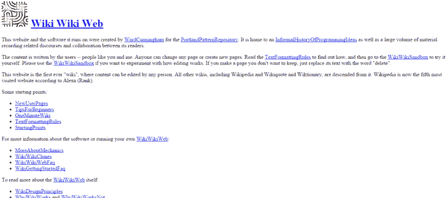

<noscript></noscript>](https://thenextweb.com/wp-content/blogs.dir/1/files/2014/10/WikiWikiWeb.png) 

The [WikiWikiWeb](http://c2.com/cgi/wiki/?WikiWikiWeb) is still alive today.

威尔士于 2001 年 1 月 10 日成立。但这并不能完全解释这个名字。Wiki 一词因坎宁安的 WikiWikiWeb 而进入网络用语，但他是在檀香山机场着陆并被告知乘坐 Wiki Wiki 班车后才使用这个名字的。Wiki 是一个夏威夷语单词，意为“快”或“快”。

* * *

### 华硕

这是另一个简单的例子。华硕，通常被称为华硕，由四名前宏基员工于 1989 年创立，他们的名字来源于希腊神话中的飞马飞马。

为什么？这是一个公平的问题。

[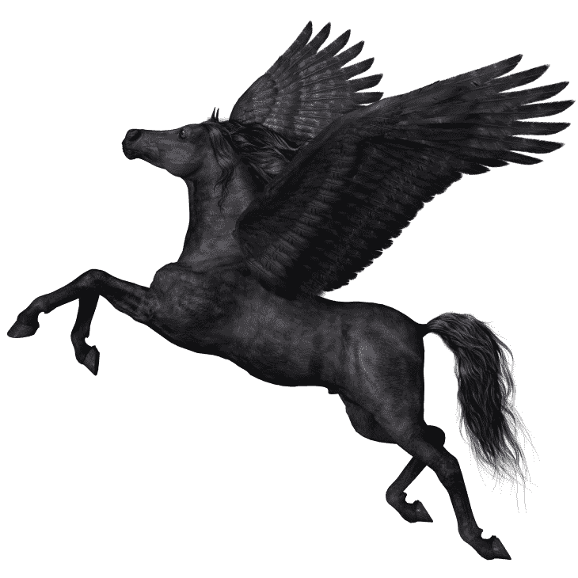

<noscript></noscript>](https://thenextweb.com/wp-content/blogs.dir/1/files/2014/10/Pegasus.jpg) 

Pegasus: the inspiration behind Asus’ range of solid consumer electronics. *Credit: [Shutterstock](http://www.shutterstock.com/pic-168281555/stock-photo-black-pegasus-profile-a-magical-black-pegasus-spreads-its-wings-and-flies-up-into-the-sky.html)*

根据该公司自己的解释，它“体现了这种神奇生物的力量、纯洁和冒险精神，并随着它创造的每一种新产品而飙升至新的高度。”

嗯。

**下一页:**联想、Hulu 等等…

### 联想（电脑的品牌名）

1984 年，当联想的创始人坐在一起想出一个名字时，他们离开了会议，一致同意它应该被称为“中国科学院计算机技术研究所新技术开发公司”。

[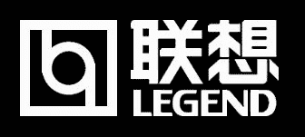

<noscript></noscript>](https://thenextweb.com/wp-content/blogs.dir/1/files/2014/10/LenovoLegend.png) 

Lenovo’s logo from 1984 until 2004. *Credit: [Logo Timeline Wiki / Wikia](http://logo-timeline.wikia.com/wiki/Lenovo)*

最终，该集团选定了联想(Legend)(英文)，这是该公司近 20 年来的叫法，直到 2003 年，它将自己的品牌电脑生产线剥离出来，成为一家名为联想(Lenovo)的独立企业。

这个词本身是 Le 和 Novo 的组合词，在拉丁语中是新的意思。

* * *

### 葫芦

虽然 Hulu 在英语中没有定义——或者至少没有——但它在汉语中有双重含义，[这两种含义都吸引了前 CEO 杰森·基拉尔。](http://blog.hulu.com/2008/05/13/meaning-of-hulu/)

第一个意思很好地用在了一句古老的中国谚语中,“葫芦是珍贵物品的持有者”,字面意思是[葫芦](https://en.wikipedia.org/wiki/Gourd)——一种可以干燥、挖空并与另一种植物结合在一起形成容器的植物。

[

<noscript></noscript>](https://thenextweb.com/wp-content/blogs.dir/1/files/2014/10/shutterstock_158512259.jpg) 

A spoon made out of a gourd. It’s not hard to imagine crafting something similar, or joining two of these together, to make a container. *Credit:  [Shutterstock](http://www.shutterstock.com/pic-158512259/stock-photo-gourd-spoon.html)*

Kilar 说，第二个意思是“互动录制”，“我们认为这两个定义都是合适的书挡，与 Hulu 的使命高度相关”。

作为奖金掘金，在马来语中也有上游的意思。

* * *

### 网络电话

成立于 2003 年的 Skype 是另一家因缺乏它真正想要使用的名字而得名的公司。

[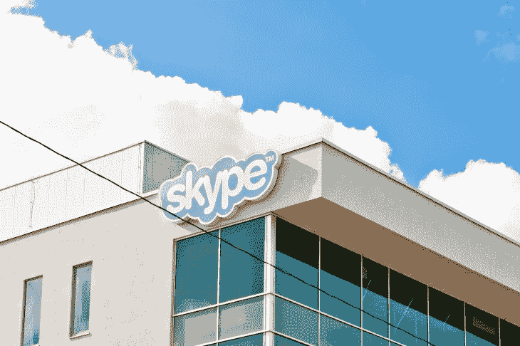

<noscript></noscript>](https://thenextweb.com/wp-content/blogs.dir/1/files/2014/10/shutterstock_164876141.jpg) 

Skype headquarters in Tallinn, Estonia. *Credit: [Evgenia Bolyukh](http://www.shutterstock.com/gallery-465457p1.html?cr=00&pl=edit-00) / [Shutterstock.com](http://www.shutterstock.com/editorial?cr=00&pl=edit-00)*

你看，Skype 是 sky 和 P2P 的简单组合，最初简称为 Skyper，后来在使用时又简称为 Skype。至少，[根据前 Skype 员工](https://web.archive.org/web/20070217033745/http://forum.skype.com/lofiversion/index.php/t5179.html)的说法。

* * *

### 推特

这是另一个广为人知的例子。Twitter 最初被称为 twttr，受 Flickr 的启发，尽管早期 alpha 用户 [@crystal](https://twitter.com/crystal) 显然也建议使用“FriendStalker”，据和 Ev Williams 也在 Odeo 工作的同事 Dom Sagolla 说，他是[。](http://www.140characters.com/2009/01/30/how-twitter-was-born/)

但是首先为什么是 twttr 呢？

[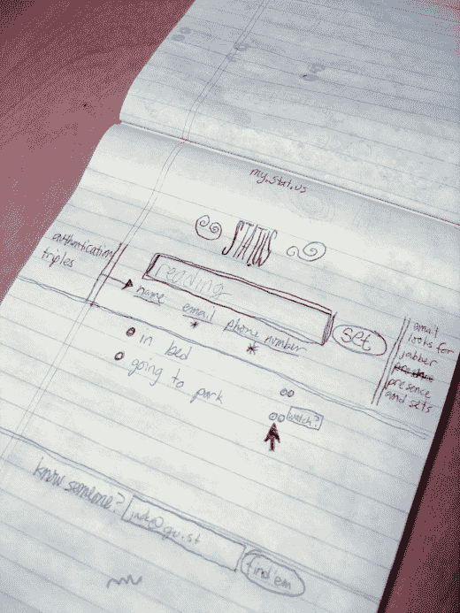

<noscript></noscript>](https://thenextweb.com/wp-content/blogs.dir/1/files/2014/10/182613360_6d76db726a_o.jpg) 

An original sketch for the layout of twttr, although this rendering calls it Stat.us. *Credit: [Jack Dorsey/Flickr](https://www.flickr.com/photos/jackdorsey/182613360/)*

“我们进行了一系列的命名风暴，我们想出了‘twitch’这个词，因为手机在移动时会震动。但“twitch”并不是一个好的产品名称，因为它没有带来正确的意象。所以我们在字典中寻找与它相关的词，我们发现了“twitter”这个词，它太完美了。它的定义是“一小段无关紧要的信息”和“鸟儿的啁啾声”。多尔西在 2009 年告诉《洛杉矶时报》。

* * *

### 雅虎！

雅虎于 1994 年由杨致远和大卫·费罗创立，名为“杰里和大卫的万维网指南”,最终在 1995 年 1 月雅虎域名被购买，公司成立。

[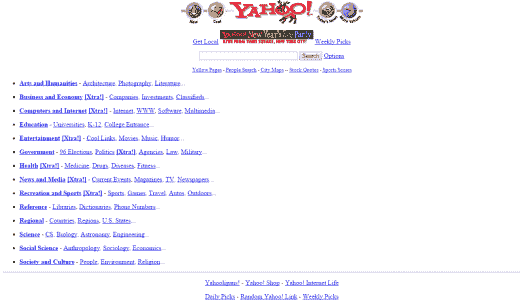

<noscript></noscript>](https://thenextweb.com/wp-content/blogs.dir/1/files/2014/10/Yahoo_1996.png) 

Yahoo’s website in 1996 via [WayBackMachine](https://web.archive.org/web/19961227005023/http://www2.yahoo.com/)

但是，它并不是基于“雅虎”这个词的实际含义(一个粗鲁、吵闹或暴力的人)。是一个缩写[又是一个等级森严、多管闲事的先知](https://archive.today/puqz)，尽管创始人显然也喜欢雅虎的一般定义。上面截图中的一类是 [Yahooligans！](https://web.archive.org/web/19991112084013/http://www2.yahooligans.com/)(儿童网络指南)，也是。

* * *

### 塞加

好吧，不可否认，SEGA 不再是曾经的科技品牌，但它仍然是很多人怀念的品牌。

[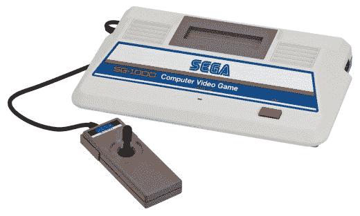

<noscript></noscript>](https://thenextweb.com/wp-content/blogs.dir/1/files/2014/10/SEGA-SG1000.jpg) 

The SEGA SG 1000 was first released in Japan in July, 1983. *Credit: [Evan Amos / Wikimedia](https://upload.wikimedia.org/wikipedia/commons/7/7b/Sega-SG-1000-Console-Set.jpg)*

虽然世嘉被认为是日本游戏软件和硬件巨头，但它的根源始于 1940 年的夏威夷服务游戏。1951 年，该公司搬到日本东京，制造投币游戏和自动点唱机。1965 年与竞争对手罗森企业合并后，合并后的公司被称为 SEGA 企业。

1986 年，世嘉企业在日本上市，美国世嘉公司作为全资子公司成立，其职责是为美国买家改编世嘉的日本视频游戏产品。SEGA 说，直到今天，许多人仍然认为是“索尼克”。

这里有一个指导[如何正确命名你的企业](https://thenextweb.com/news/before-naming-your-startup-read-this)。

现在你知道了，一些科技界大腕的背景故事。我们错过你最喜欢的了吗？请在下面的评论中或者在我们的[脸书页面](https://www.facebook.com/thenextweb)上告诉我们。*