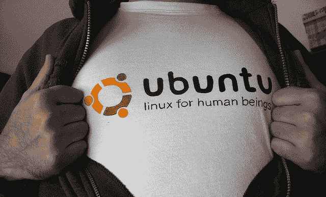
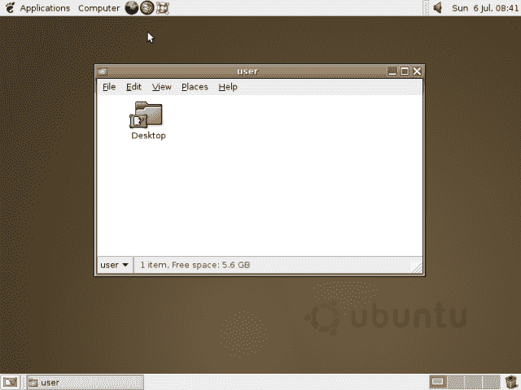
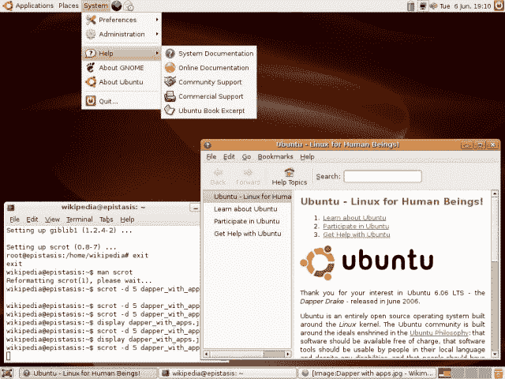

# Ubuntu 的十年:Linux 心爱的新人如何成为它的批评之王

> 原文：<https://arstechnica.com/information-technology/2014/10/ten-years-of-ubuntu-how-linuxs-beloved-newcomer-became-its-criticized-king/?utm_source=wanqu.co&utm_campaign=Wanqu+Daily&utm_medium=website>

可能不是超人，但 Ubuntu 为 Linux 创造了奇迹。

2004 年 10 月，一个新的 Linux 发行版以一个奇怪的名字出现了——Ubuntu。即使在那时，也有成百上千个不同的 Linux 发行版可用。一款新的 Ubuntu 并没有什么特别不同寻常的地方，而且在安静的预览版发布后的一段时间里，Ubuntu 基本上没有引起注意。这是另一个 Debian 衍生工具。

如今，Ubuntu 背后的公司 Canonical 估计全球有 2500 万 Ubuntu 用户。这使得 Ubuntu 成为世界第三大最受欢迎的个人电脑操作系统。据 Canonical 估计，Ubuntu 大约占据了 Linux 市场 90%的份额。Ubuntu 准备推出手机版，这很可能会让这些数字再次飙升。

这个月是 Ubuntu 十周年。正如你很快会看到的，这些年来的桌面发行版，Linux 观察者几乎从一开始就感觉到了 Ubuntu 的特别之处。然而，虽然一个真正以用户为中心的 Linux 操作系统很快被接受，但 Ubuntu 的十年历程是过去十年主要 Linux 事件的缩影——包括从隐私问题和 Windows 怨恨到服务器扩张和融合希望的一切。

## 疣猪:什么是 Ubuntu？

[Enlarge](http://upload.wikimedia.org/wikipedia/commons/d/d0/Ubuntu-desktop-2-410-20080706.png) /

Ubuntu 4.10 的默认桌面，疣猪。

维基百科（开放式百科全书）

从一开始，Ubuntu 就采取了一种不同于 Linux 的方式，这种方式也许可以用它当时的口号来定义:“人类的 Linux”Ubuntu 这个词本身就让人想起了同样的想法，它来自南非哲学，字面意思是“人性”。更广义地翻译，它是“对他人的人性”

这种区别不仅仅是简单的语义。这使得 Ubuntu 在 Linux 历史上独一无二。

这个名字，加上口号，让 Ubuntu 从当时的其他 Linux 发行版中脱颖而出。它的竞争对手倾向于更狭隘地关注开发者和企业用户想要什么，而不是“普通”桌面用户可能需要什么。例如，Fedora 采取了一种非常不同的方法，针对的是那些同时也是开发人员并且会对开源软件做出贡献的用户。

对“人类的 Linux”的关注从一开始就奠定了 Ubuntu 项目的基调和方向。Ubuntu 从来不追开发者。它似乎对服务器市场也不感兴趣。相反，这个发行版直接面向桌面用户(在 2004 年 10 月，桌面用户的数量要少得多)和 Linux 新手。这个想法是为了赢得 Windows 的“普通”用户。

Ubuntu 是由马克·舒托沃尔斯创立的，他在 1999 年 12 月将他的公司 Thawte 以 5 . 75 亿美元的价格卖给了 VeriSign。在太空度过短暂的假期后，他成立了 Canonical 有限公司，并开始开发 Ubuntu。舒特尔沃斯发布第一个 Ubuntu 版本的公告将这个羽翼未丰的项目定义为“一个新的 Linux 发行版，将 Debian 的非凡广度与快速简单的安装、常规版本结合在一起...(以及)精选的优秀套餐。”

这些目标——快速且易于安装、有支持的定期发布以及广泛的可用应用程序——是 Ubuntu 登上 Linux 排行榜榜首的基础。也许这三个目标中最重要的是第一个:让 Linux 易于安装，尤其是 Ubuntu 对新用户的关注。

到 2004 年，如果你有 Linux 的经验，安装 Debian 并不困难。然而，对于习惯了 Windows XP 或 Mac OS X 提供的安装过程的人来说，这至少是令人生畏的。另一方面，Ubuntu 和 Windows 或 OS X 一样容易安装。你插入光盘，它就启动了，你双击安装程序。当著名的苹果支持者 Mark Pilgrim 转向 Linux 时，他选择了 Ubuntu。朝圣者[开玩笑说](https://web.archive.org/web/20060707010812/http://diveintomark.org/archives/2006/06/27/diveintomark-show)是“不能安装 Debian”的非洲单词

它对新用户的强调也意味着 Ubuntu 重视有经验的 Linux 用户不重视的工具，即图形安装程序、精心设计的主题和字体渲染等设计细节。Ubuntu 的设计者们绞尽脑汁想出了抗锯齿的细节，这些细节以前(看起来)在 Linux 桌面世界里从未被考虑过。Ubuntu 在当时的 Ars“开源之年”中获得了“最佳新人”的荣誉。作家 Andrew Forgue 甚至说，“通过尝试创建一个带有微调桌面的单一发行版，Project Utopia，和一个多元文化的方法，Ubuntu 已经接近成为我们许多人的 Linux 圣杯。”

Ubuntu 还以某种在 2004 年的自由软件世界中非常罕见的东西——幽默——脱颖而出。虽然舒特尔沃斯对 Ubuntu 的目标非常认真，但不要忘记 Ubuntu 第一版的昵称是“疣猪”这是一个有趣的参考粗糙的边缘，任何全新的版本可能会有。厚脸皮的、愚蠢的、经常尴尬的命名约定一直延续到今天(最新发布的版本被昵称为乌托邦独角兽)。

这种幽默也延伸到了 Ubuntu 著名的第一号 bug。Ubuntu 的第一个 bug 是“

[Microsoft has a majority market share](https://bugs.launchpad.net/ubuntu/+bug/1)

。“半开玩笑地提到 Windows 的统治地位是对更广泛的 Linux 社区的认可，这个社区后来被团结在一起，至少反对的和支持的一样多。如今，这已经不是 Linux 真正关心的问题了。当 bug 最终在 2013 年被关闭时，舒特尔沃斯写道，“我们最好专注于自己的优势，而不是我们对别人产品的影响。"

从很多方面来说，bug 的终结标志着 Ubuntu 从另一个 Linux 发行版过渡到另一个版本，一个 Linux 世界从未真正见过的版本。现在，它甚至不再在其主网站的任何地方使用“Linux”这个词。

## 衣冠楚楚的德雷克:上升到顶端

[Enlarge](http://upload.wikimedia.org/wikipedia/commons/0/0f/Dapper_with_apps.jpg) /

Ubuntu 6.06 的默认桌面，Dapper Drake，唯一错过 4 月发布日期的版本。

维基百科（开放式百科全书）

Ubuntu 坚持其每六个月发布一次的计划，从 2004 年开始不断推出更加完善的版本。十年来，它只错过了一次发布截止日期*——*[2006 年的 6.06 Dapper Drake](http://arstechnica.com/civis/viewtopic.php?f=16&t=286162)。

到 2008 年，Ubuntu 确立了自己作为“转换者”的首选发行版的地位，这些人正从 Windows 或 OS X 甚至其他缺乏 Ubuntu 易用性的发行版中脱离出来。Ubuntu 给桌面 Linux 的神秘世界带来了友好的一面。它提供了一个简单的安装过程，易于更新的承诺，以及一个伟大的应用程序选择，所有这些都可以在 Ubuntu 软件中心点击一个按钮。简而言之，Ubuntu 实现了它的目标。

即使是那些不喜欢 Ubuntu 在 Linux 桌面上的表现的人，这些年来也从中受益，因为它的许多定义性特征，尤其是安装过程和对设计良好的桌面体验的关注。这些特性成为了其他项目的重点，Ubuntu 努力的结果也波及到了更广泛的 Linux 世界。

然后 GNOME 3 出现了岔路口。GNOME 自 Ubuntu 发布以来一直是它的默认桌面，它决定重新设计它的桌面界面。新的 GNOME Shell 界面不是 Ubuntu 想要的。相反，该公司决定编写自己的外壳和桌面界面。

最终用户实际上在一段时间内不会看到 Ubuntu 决定的结果，但是该项目离开 GNOME 的决定引发了一系列批评，这些批评一直持续到 Ubuntu 的 Unity 桌面在 11.04 中发布。