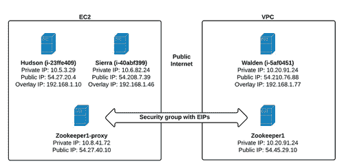

# 从 AWS 迁移到 AWS - Instagram 工程

> 原文：<http://instagram-engineering.tumblr.com/post/100758229719/migrating-from-aws-to-aws?utm_source=wanqu.co&utm_campaign=Wanqu+Daily&utm_medium=website>

在[早期的博客文章](http://instagram-engineering.tumblr.com/post/89992572022/migrating-aws-fb)中，我们给出了从 AWS 到 FB 数据中心迁移的高级描述。接下来是对我们如何在 3 周时间内无停机地将数千个运行中的 [AWS EC2](https://href.li/?http://aws.amazon.com/ec2/) 实例迁移到亚马逊的[虚拟私有云(VPC)](https://href.li/?http://aws.amazon.com/vpc/) 的深入分析。这是一项极其细致的工作，需要开发定制的虚拟网络软件才能实现。据我们所知，这是迄今为止最快、规模最大的从 EC2 到 VPC 的迁移。

**调查直接连接**

[Direct Connect](https://href.li/?http://aws.amazon.com/directconnect/) 是 AWS 提供的一种产品，允许客户在亚马逊的数据中心和第三方之间建立对等链接。使用它，我们发现我们可以通过多条冗余 10Gbps 链路连接到脸书的基础设施。正是在这项研究中，我们发现了主要的阻碍因素:

我们无法控制 EC2 中的 IP 地址。

虽然这以前不是问题，但如果我们要与脸书建立联系，这是不可能的，因为他们的内部知识产权空间与 EC2 的交叉。经过深思熟虑，我们开始明白我们只有一个选择:先移民到 VPC。

VPC 于 2009 年年中推出，作为现有 EC2 产品的姊妹产品，尽管它很快被认为是 EC2 2.0，因为它弥补了许多普遍接受的 EC2 的不足。从表面上看，迁移在概念上似乎并不困难，因为 VPC 只是同一硬件之上的另一个软件抽象，然而它要复杂得多，有几个主要问题:

*   您不能迁移正在运行的实例。
*   AWS 不提供迁移计划。
*   EC2 和 VPC 不共享安全组。

当我们试图想出一个解决办法时，这最后一点一直萦绕在我们的脑海里。如何才能让 EC2 和 VPC 彼此对话，就好像安全组可以协商一样？这似乎是不可克服的:我们在 EC2 中有数千个运行实例，我们不能有任何停机时间。我们一直在寻找一种解决方案，它允许我们按照自己的节奏进行迁移，根据需要移动部分和完整层，并且双方之间有安全的通信。

因此，我们创建了 [Neti](https://href.li/?https://github.com/Instagram/neti) ，一个基于 iptables 的动态防火墙操作守护程序，用 Python 编写，由 [Zookeeper](https://href.li/?http://zookeeper.apache.org/) 提供支持。

**Neti 的设计与实现**

Neti 是苏美尔人冥界守门人的名字。这个名字似乎很合适，因为我们需要一个无所不知的看门人来控制 EC2 和 VPC 之间的访问。在设计过程中，我们有几个要求:

*   安全:Neti 必须阻止未授权的流量进入我们双方的实例。
*   **抽象** : Neti 必须允许两端的实例无缝通信，而无需知道应用层上每个实例的位置。
*   自动化:我们有太多的实例来管理访问列表，所以 Neti 必须完全了解任一网络中的任何实例变化。它还必须可以使用配置管理软件进行部署和升级。
*   **性能**:所有这些都必须在不显著增加延迟的情况下发生。

由于 EC2 和 VPC 之间缺少集成选项，唯一的通信路径是通过实例的公共接口。使用 EC2 安全组，每个组都需要知道它与之通信的每个实例的公共 IP。如果我们有几十个(甚至几百个)实例，这可能是可以管理的。然而，由于每一方都有成千上万个实例，试图控制安全组访问列表将会非常困难。此外，随着规则数量的增加，EC2 中的安全组往往会对网络性能产生负面影响。

因此，我们期待 iptables 提供我们需要的安全性。Iptables 是 Linux 包过滤的标准，可以比 EC2 安全组更好地扩展。每个实例都有自己的 iptables 防火墙，Neti 根据需要操纵 iptables 规则。一旦实例被 iptables 锁定，EC2 和 VPC 安全组就会被打开，允许来自任何[公共 AWS IP 范围](https://href.li/?https://forums.aws.amazon.com/ann.jspa?annID=1701)的所有流量。

此外，iptables 有助于提供一种机制来实现我们想要的抽象层。Neti 为每个实例分配一个“覆盖”IP 地址，用于应用层的通信。这个 IP 被配置为 DNAT 记录，指向实例的 IP。这样，无论实例位于 EC2 还是 VPC，应用程序都会看到相同的 IP。

所有这些都由 Zookeeper 来协调，它保存了关于每个正在运行的实例的所有注册信息。

**架构**

该系统有三个组件:Neti 守护进程、Zookeeper 集群和一组 Zookeeper 代理。

Neti 守护进程:Neti 软件必须在每个实例上运行。

Zookeeper 集群:您必须在 VPC 内运行 Zookeeper 集群，并配置有自己的安全组。

*Zookeeper 代理:*因为我们需要 EC2 和 VPC 中的实例与 Zookeeper 通信，所以必须有 EC2 实例以与 VPC 集群相同的方式设置，放置在它们自己的安全组中，并设置为代理所有对 VPC 集群的请求。这个安全组以及 VPC 集群的安全组必须允许所有 Zookeeper 在它们的公共实例上进行通信。为了便于实例替换，给它们附加弹性 IP 是一个好的做法。这些是唯一不运行 Neti 的实例，因为 Neti 依赖这些集群来运行。

**Neti 实例生命周期**

假设我们有三个实例:哈德逊、塞拉和瓦尔登。Hudson 和 Sierra 住在 EC2，而 Walden 已经被迁移到 VPC。

当 Neti 守护进程在 Hudson 上启动时，它开始注册:

1.  Neti 联系 Zookeeper1-proxy，并使用它的实例 ID 查询它是否曾经注册过。如果找到，它将获得与以前相同的覆盖 IP。如果没有，它随机选择一个可用的覆盖 IP 并将其锁定到这个实例 ID。
2.  Neti 向 Zookeeper 发送 IP 信息和网络位置来完成注册。
3.  Neti 从 Zookeeper 下载当前正在运行的实例列表，包括它们所有的公共、私有和覆盖 IP，以及它们所在的网络。
4.  解析列表，并为每个条目生成 iptables 过滤器和 DNAT 规则。
5.  Neti 在 Zookeeper 实例列表上设置一个监视器。

同时，只要第 2 步完成，所有剩余的已注册实例都会用新的实例数据集触发它们的 Zookeeper 观察器，并且它们的 iptables 配置会自动更新。

一旦这个舞蹈完成，所有的实例都可以完全访问彼此，并成功地阻止任何未经授权的流量。如果另一个实例开始运行，这个过程将重新开始；如果任何一个实例死亡，Zookeeper 会通知所有的 Neti 守护进程，规则会在几秒钟内更新到整个舰队。

**叠加 IPs 和你**

覆盖 IP 使所有实例不知道目标实例的位置。例如，假设 Walden 和 Sierra 都是前端实例，Hudson 是数据库服务器。由于延迟和安全性，您不希望 Walden 通过公共 IP 与 Hudson 通信。然而，你需要 Sierra 通过公共 IP 访问 Hudson，因为 Hudson 仍然在 EC2 中。有了 overlay IPs，您不必为每一端构建两个不同的数据库配置，在将服务器迁移到 VPC 时不断更新和发送更改。您只需使用覆盖 IP，Neti 负责选择最佳路径。

**性能问题，或者说我是如何学会停止恢复 ip 列表并爱上 ipset 的**

在 v1 设计中，我们纯粹使用 iptables 来管理所有 NAT 和过滤规则，利用内置的 iptables-save 和 iptables-restore 工具。然而，当我们在 iptables 中测试大量规则时，我们开始遇到性能问题。出现这个问题是因为每个请求都必须在 iptables 过滤器上进行 O(n)查找，以确定它是否可以继续。在我们的一个 Memcached 实例上测试 8000 条规则导致网络吞吐量下降了一个数量级。

显然，如果是这样的话，我们就无法继续下去了，所以我们在别处寻找。在找到一篇关于 iptables 性能的文章后，我们转而使用 [ipset](https://href.li/?http://ipset.netfilter.org/) 来实现。它有几个主要的好处:

1.  它将 ip 列表存储在内存的哈希表中，提供 O(1)成员检查
2.  可以使用简单的命令行工具动态更新 IP 集。
3.  这让我们对系统更加放心，因为我们不必在每次主机改变时都重新加载整个 iptables 过滤器。

有了 ipset，我们测试了 8000 多条规则，网络吞吐量没有任何下降。

## 迁移

对于这样的迁移，我们知道准备是关键。在任何时候，在“鸿沟”的两边都会有系统的部分，每一层都有不同的时间表、策略和需求。如果没有停机时间，层的快速停止/启动叉车就无法工作，因此整个迁移必须是一个巧妙的游戏，端到端的流程需要规划、分析、监控和执行。

**库存**

首先，我们必须清点所有的东西。*一切*。我们花了大量时间对车队中的每个系统进行编目(还记得电子表格吗？)，以及他们各自的迁移策略和可能遇到的潜在问题。这项工作有三方面的好处:

*   在计划好每一步后，我们确信每个系统都可以被移植。
*   我们构建了基础架构的高级视图，并了解了故障转移场景中的弱点。
*   我们发现许多系统要么是不必要的，要么适合整合。

这次迁移(以及接下来的一次迁移)使我们能够将我们的基础设施提炼为一组核心的关键系统，极大地简化了迁移和管理。

标记所有的东西！

由于我们必须迁移大量实例，我们依赖 EC2 的[实例标记特性](https://href.li/?http://docs.aws.amazon.com/AWSEC2/latest/UserGuide/Using_Tags.htmlhttp://docs.aws.amazon.com/AWSEC2/latest/UserGuide/Using_Tags.html)。我们的大多数实例报告和查找工具已经建立在标记之上，跟踪实例名称、角色和一些 chef 属性，所以添加一些新的元数据很简单。我们使用标签来跟踪安装的 Neti 版本、覆盖 IP 和各种 Neti 状态信息。

标签在监控过程中也变得有用。我们可以运行专门的报告来查看有多少实例已经被迁移，有多少运行旧版本的 Neti，以及是否有任何实例根本没有运行 Neti。我们也在[意义上的](https://href.li/?http://sensuapp.org/)检查中构建了一些脚本，这样我们就可以对任何问题发出警报。拥有一个不断观察进度和状态的脚本库对于顺利迁移至关重要。

随着 Neti 分布在我们的基础设施中，我们开始将所有公共流量接入转移到 AWS 安全组。此时，Neti 控制了对这些系统的所有访问，我们可以开始移动服务器层了。多亏了 Neti，整个基础设施看起来像是在一个大型的平面网络上运行，简化了迁移策略。

大多数层都是通过在 VPC 建立相同的层并减少流量来迁移的。例如:

*   Django :我们的前端层是无状态的，所以这是一个在 VPC 启动新主机并关闭旧主机的简单问题。
*   **PostgreSQL** :使用 9.2 版本中内置的流复制，我们能够在 VPC 中建立主/从副本集，并使用应用程序级控制来切割它们。使用这种方法，一旦层上线并开始复制，我们两个人就可以在不到 2 小时的时间内将整个数据库设备群切换到 VPC。
*   **Cassandra**:VPC 主机作为与 Cassandra 配置相关的另一个数据中心的成员联机，因此复制和迁移非常简单。
*   **Redis** :新的主/从副本集被同步到当前的生产从副本集(以避免主副本集上的 BGSAVE ),并且配置被切换。

**打嗝**

总之，我们遇到的问题比预期的要少，尤其是考虑到这种复杂的迁移策略。一个问题是 conntrack。我已经能听到呻吟声了。在这种情况下，Conntrack 是不可避免的，因此不需要在每个连接上解析 iptables。事情是这样的:实例没有启用 conntrack，所以当 Neti 启动时，它构建并加载 iptables 规则，这又启用了 conntrack。在一个流量很大的实例上，例如一个 Memcached 实例，需要几秒钟的时间才能超过默认的最大 conntrack 条目数(65536)。然后，新的连接被拒绝，使实例变得毫无用处。

缓解这个问题相当简单。在安装和启动 Neti 之前，我们强迫 chef 运行 modprobe conntrack 并将 nf_conntrack_max 设置为一个更高的限制。

## 结论

将所有东西迁移到 VPC 只花了不到 3 周的时间。最后，我们建立了一大套技能和指导方针，可以帮助我们的下一次迁移顺利进行。主要收获是:

*   记录所有的事情。一个记录良好的基础设施可以确保您在迁移过程中不会忘记任何依赖关系，并且为每一层精心设计的迁移计划可以最大限度地减少您将遇到的障碍。在迁移过程中，您将在一个异构环境中运行，并且您不希望在考虑接下来的步骤时被困在那里。
*   **工具可以决定一个项目的成败**。在 Neti 上投入时间并扩展我们的工具来跟踪 Neti 的部署和审计迁移状态是迁移成功的关键。你的工装值得爱。
*   **不要惧怕低级**。使用 Iptables 实现了这种迁移。这意味着花费大量的开发时间，比平常更接近内核，但这一壮举是不可能的。

我们有开源的 Neti 和它的同伴 T2 的 Neti 食谱。我们希望许多人能够从我们在这个问题上的工作中受益，并希望这将缓解他们向 VPC 的移民。

Instagram 基础设施工程师 Nick short way

