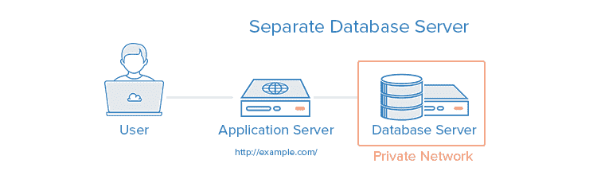
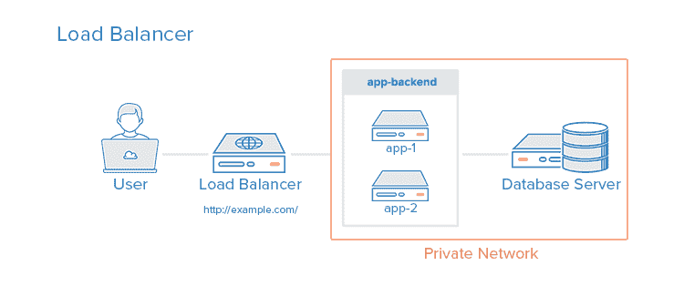
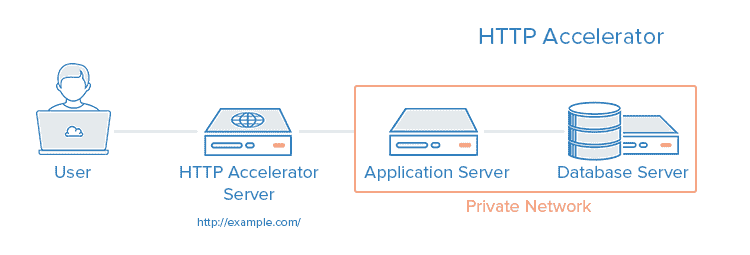
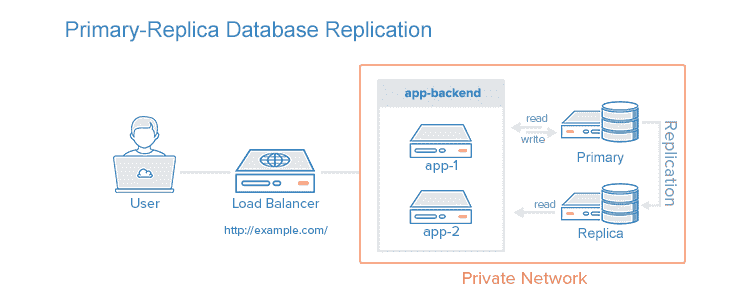
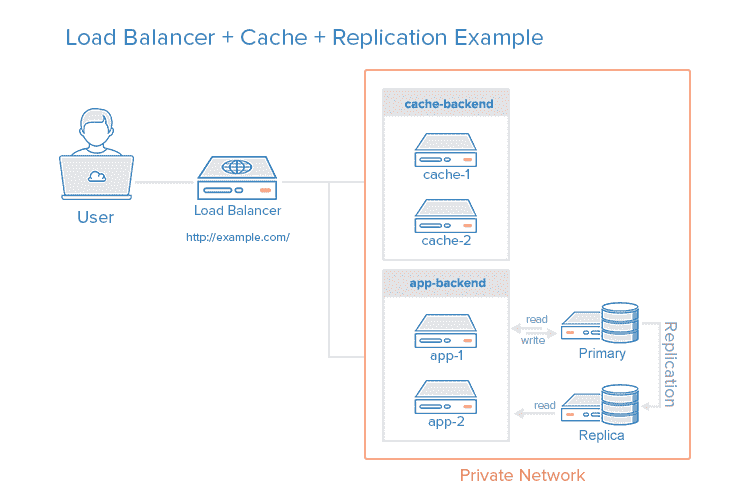

# 网络应用的 5 种常见服务器设置|数字海洋

> 原文：<https://www.digitalocean.com/community/tutorials/5-common-server-setups-for-your-web-application?utm_source=wanqu.co&utm_campaign=Wanqu+Daily&utm_medium=website>

### 介绍

在决定为您的环境使用哪种服务器体系结构时，有许多因素需要考虑，例如性能、可伸缩性、可用性、可靠性、成本和易管理性。

这里列出了常用的服务器设置，并对每种设置进行了简短描述，包括优缺点。请记住，这里涵盖的所有概念都可以以各种方式组合使用，并且每个环境都有不同的要求，因此没有单一的正确配置。

## 1.一台服务器上的所有内容

整个环境驻留在一台服务器上。对于典型的 web 应用程序，这将包括 web 服务器、应用服务器和数据库服务器。这种设置的一个常见变体是 LAMP 堆栈，它在一台服务器上代表 Linux、Apache、MySQL 和 PHP。

**用例**:适合快速设置应用程序，因为这是可能的最简单设置，但是它在可伸缩性和组件隔离方面提供的很少。

**优点**:

**缺点**:

*   应用程序和数据库争用相同的服务器资源(CPU、内存、I/O 等。)除了可能的低性能之外，还会使确定低性能的来源(应用程序或数据库)变得困难
*   不容易水平扩展

**相关教程**:

## 2.独立的数据库服务器

数据库管理系统(DBMS)可以与环境的其余部分分离，以消除应用程序和数据库之间的资源争用，并通过将数据库从 DMZ(即公共互联网)中移除来提高安全性。

**用例**:有利于快速设置应用程序，但防止应用程序和数据库争夺相同的系统资源。

**优点**:

*   应用程序和数据库层不会争用相同的服务器资源(CPU、内存、I/O 等。)
*   您可以通过向任何需要增加容量的服务器添加更多资源来分别垂直扩展每一层
*   根据您的设置，它可以通过将您的数据库从 DMZ 中移除来提高安全性

**缺点**:

*   比单台服务器的设置稍微复杂一些
*   如果两台服务器之间的网络连接是高延迟的(即服务器在地理上彼此远离)，或者带宽对于传输的数据量来说太低，则可能会出现性能问题

**相关教程**:

## 3.负载平衡器(反向代理)

可以将负载平衡器添加到服务器环境中，通过在多台服务器之间分配工作负载来提高性能和可靠性。如果负载平衡的服务器之一出现故障，其他服务器将处理传入流量，直到出现故障的服务器恢复正常。通过使用第 7 层(应用层)反向代理，它还可以用于通过同一个域和端口为多个应用提供服务。

能够实现反向代理负载平衡的软件示例:HAProxy、Nginx 和 Varnish。

**用例**:适用于需要通过添加更多服务器进行扩展的环境，也称为水平扩展。

**优点**:

*   支持水平扩展，即可以通过添加更多服务器来扩展环境容量
*   可以通过将客户端连接限制在合理的数量和频率来抵御 DDOS 攻击

**缺点**:

*   如果负载平衡器没有足够的资源，或者配置不当，它可能会成为性能瓶颈
*   会引入需要额外考虑的复杂性，例如在哪里执行 SSL 终止以及如何处理需要粘性会话的应用程序
*   负载平衡器是一个单点故障；如果它宕机，你的整个服务也会宕机。一个*高可用性* (HA)设置是一个没有单点故障的基础设施。要了解如何实现 HA 设置，您可以阅读[如何使用保留 IP](https://www.digitalocean.com/community/tutorials/how-to-use-floating-ips-on-digitalocean#how-to-implement-an-ha-setup)的这一节。

**相关教程**:

## 4.HTTP 加速器(缓存反向代理)

HTTP 加速器或缓存 HTTP 反向代理可用于减少通过各种技术向用户提供内容所需的时间。HTTP 加速器采用的主要技术是在内存中缓存来自 web 或应用程序服务器的响应，以便将来对相同内容的请求可以得到快速响应，减少与 web 或应用程序服务器的不必要交互。

能够进行 HTTP 加速的软件示例:Varnish、Squid、Nginx。

**用例**:在有大量内容的动态 web 应用程序或者有许多经常访问的文件的环境中很有用。

**优点**:

*   通过缓存和压缩降低 web 服务器的 CPU 负载，从而提高用户容量，从而提高网站性能
*   可用作反向代理负载平衡器
*   一些缓存软件可以抵御 DDOS 攻击

**缺点**:

*   需要调整以获得最佳性能
*   如果缓存命中率很低，可能会降低性能

**相关教程**:

## 5.主副本数据库复制

提高读取次数多于写入次数的数据库系统(如 CMS)性能的一种方法是使用主副本数据库复制。复制需要一个主节点和一个或多个副本节点。在这种设置中，所有更新都发送到主节点，读取可以分布在所有节点上。

**用例**:有利于提高应用程序数据库层的读取性能。

下面是一个主复制副本复制设置的示例，带有一个复制副本节点:

**优点**:

*   通过在副本之间分散读取来提高数据库读取性能
*   可以通过将主服务器专门用于更新来提高写入性能(它不会花费时间来处理读取请求)

**缺点**:

*   访问数据库的应用程序必须有一种机制来确定应该向哪些数据库节点发送更新和读取请求
*   副本的更新是异步的，因此其内容有可能会过期
*   如果主服务器出现故障，在问题得到解决之前，无法对数据库执行任何更新
*   没有内置的故障转移功能，以防主节点出现故障

**相关教程**:

## 示例:结合概念

除了应用服务器之外，还可以对缓存服务器进行负载平衡，并在单个环境中使用数据库复制。组合这些技术的目的是在不引入太多问题或复杂性的情况下获得各自的优势。下面是一个服务器环境的示例图:

让我们假设负载平衡器被配置为识别静态请求(如图像、css、javascript 等)。)并将这些请求直接发送到缓存服务器，并将其他请求发送到应用服务器。

以下是用户发送动态内容请求时会发生的情况:

1.  用户向 _[http://example.com/_](http://example.com/_)(负载均衡器)请求动态内容
2.  负载平衡器向应用后端发送请求
3.  app-backend 从数据库中读取数据，并将请求的内容返回给负载平衡器
4.  负载平衡器将请求的数据返回给用户

如果用户请求静态内容:

1.  负载平衡器检查缓存后端以查看请求的内容是否被缓存(缓存命中)或未缓存(缓存未命中)
2.  *如果缓存命中*:将请求的内容返回到负载均衡器，并跳转到步骤 7。*如果缓存缺失*:缓存服务器通过负载均衡器将请求转发给 app-backend
3.  负载平衡器将请求转发到应用后端
4.  app-backend 从数据库中读取数据，然后将请求的内容返回给负载平衡器
5.  负载平衡器将响应转发到缓存后端
6.  缓存-后端*缓存内容*，然后将其返回给负载均衡器
7.  负载平衡器将请求的数据返回给用户

这种环境仍然有两个单点故障(负载平衡器和主数据库服务器)，但是它提供了上述各节中描述的所有其他可靠性和性能优势。

## 结论

既然您已经熟悉了一些基本的服务器设置，那么您应该对自己的应用程序使用什么样的设置有一个很好的想法。如果您正在致力于改进您自己的环境，请记住迭代过程是避免过快引入太多复杂性的最佳方法。

请在下面的评论中告诉我们你推荐的或者想了解更多的设置！