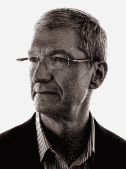
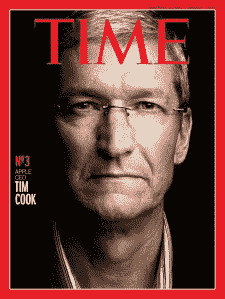

# 亚军:技术专家蒂姆·库克| TIME.com

> 原文：<http://poy.time.com/2012/12/19/runner-up-tim-cook-the-technologist/?utm_source=wanqu.co&utm_campaign=Wanqu+Daily&utm_medium=website>

<small class="entry-thumb-credit">Marco Grob for TIME</small>

蒂姆·库克是苹果公司的第一任首席执行官，也是第一位不沾鲜血掌权的人，这一点显然非同寻常。在苹果历史的大部分时间里，它都有一个继任问题:它没有内部机制将权力从一个 CEO 转移到另一个 CEO，而不会陷入内战。“每一次，”库克说，“首席执行官的任命方式都是有人被解雇，新的人上任。”

这显然困扰着史蒂夫·乔布斯，因为在他去世前不久，他和库克谈到了这件事。“史蒂夫希望首席执行官的过渡是专业的，”库克说。“当他决定成为主席时，这是他最想做的事。我有充分的理由相信，我想他也认为，这将是一个漫长的过程。”正如我们现在所知，事实并非如此。

(**互动时间线** : [蒂姆·库克和苹果的崛起](http://poy.time.com/2012/12/19/interactive-timeline-tim-cook-and-the-rise-of-apple/))

只要他在亲自挑选继任者，你就会认为乔布斯会按照自己的形象来选择，但他和库克——乔布斯在苹果的首席运营官——在很多方面截然相反。乔布斯声音洪亮、鲁莽、不可预测、无拘无束，而且经常不刮胡子。库克不是。他看起来不像苹果公司的首席执行官，他更像一个苹果产品:安静、整洁、精心策划、精心制作，同时又出奇地热情和诱人。他看起来不像乔布斯，他看起来像乔布斯会做的东西。库克那顶完美无瑕的白发帽可能是由乔尼·艾夫(Jony Ive)设计、在中国用拉丝铝制造的。

而且像苹果产品一样，库克运行流畅快速。当乔布斯于 2011 年 10 月 5 日因胰腺癌去世时，有人质疑库克是否能领导苹果。包括我在内的一些人怀疑，如果没有乔布斯，苹果公司是否还能生存下去。从那以后，作为历史上最伟大的创新者之一的继任者，库克显然并不畏惧自己的工作。库克的记录并非完美无瑕，但他以娴熟的方式主持了公司各主要产品线的彻底、系统升级，以及公司财务状况的增长，这只能用历史性来形容。

<small class="entry-thumb-credit">马可·格罗布为《时代》杂志拍摄的封面照片</small>

乔布斯去世的那一天，苹果的估值是 3510 亿美元；截至发稿时，其市值为 4880 亿美元，超过了谷歌和微软。这是*和*的意思，加上:苹果公司现在的价值远远超过这些公司的总和。仅苹果的现金储备就超过了 1200 亿美元。2011 年，苹果超过埃克森美孚成为世界上最有价值的公司，这是一则新闻。现在埃克森美孚在远处几乎看不到苹果的尾灯，跨过 830 亿美元的领先优势。

库克已经用自己的方式做到了。乔布斯是出了名的过分:他从房间的另一头冲向你，闪着闪电一样的眉毛，他吓唬你，直到你要么同意他，要么假装同意，只是为了让他看在上帝的份上停下来。库克不是这么操作的。他是一个诱惑者，一个南方慢吞吞的人，说话缓慢而温和。有人看到他眨眼。他不是冲着你来的；他等着你去找他。你迟早会这么做，不是因为你必须这么做，而是因为，该死的，你想这么做。

库克本人不愿意过于依赖对比。“我认为有一些明显的不同，”他说。(他对这种轻描淡写的说法暗自发笑。)“我们的行为方式非常不同。从负时间零点开始——在他告诉我他决定放弃 CEO 头衔之前很久——我就决定做我自己。这是唯一一个我可以好好相处的人。”

(**列举** : [苹果历史上的 10 个关键时刻](http://www.time.com/time/specials/packages/article/0,28804,1873486_1873491_1873530,00.html))

这就是乔布斯想要的。他不想让库克成为乔布斯的冒牌货。他想让库克成为库克。“他说，‘从今天开始，永远不要问我会做什么。做正确的事。我举了几个例子:“假设 A——你真的想让我打电话吗？”是的。是啊！他谈到了迪士尼，以及他所看到的(华特·迪士尼去世后)迪士尼发生的事情，他不希望这种事情发生在苹果身上。"

库克和乔布斯确实有一些共同之处。他是个工作狂，而且不是那种正在康复的工作狂。他每天早上 3:45 醒来(“是的，每天早上”)，发一个小时的电子邮件，在那些比他早三个时区的懒惰的东方杯垫上偷步，然后去健身房，然后去星巴克(为了更多的电子邮件)，然后工作。“关键是，当你热爱自己的工作时，你不会真的把它当成工作。这是你的工作。这是我找到自己的幸运之处。”

(**特别报道** : [中国的苹果崇拜](http://www.time.com/time/magazine/article/0,9171,2117765,00.html))