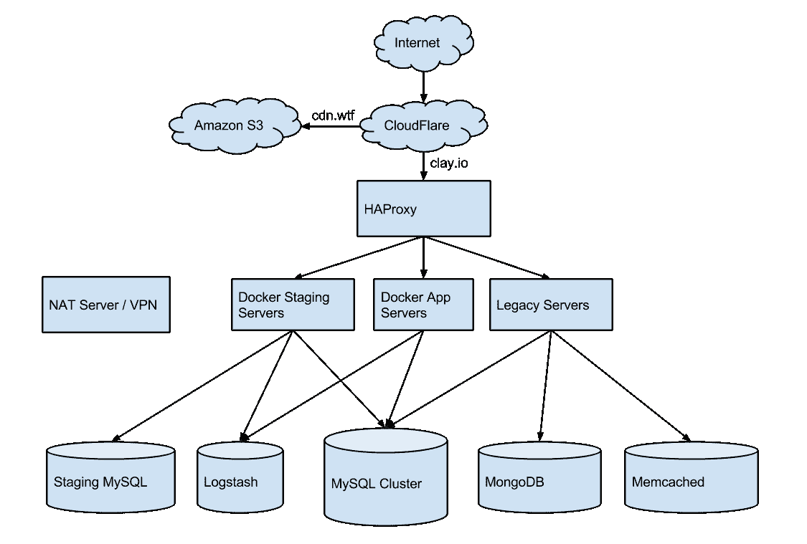
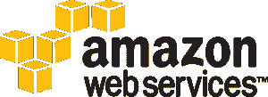
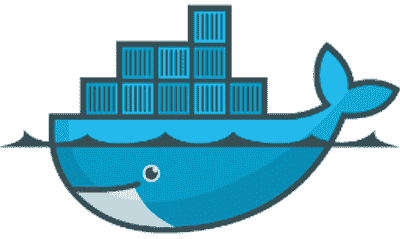
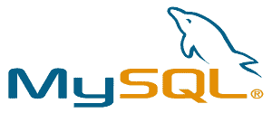
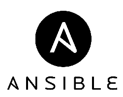

# 10x:克莱的建筑

> 原文：<http://zolmeister.com/2014/10/10x-architecture-at-clay-io.html?utm_source=wanqu.co&utm_campaign=Wanqu+Daily&utm_medium=website>

这是我的新系列`10x`的第一篇文章，在这里我分享我的经验以及我们如何在 [Clay.io](http://clay.io/) 与一个小团队一起大规模发展。

更新:

## 云

#### 云耀斑

[T2】](https://www.cloudflare.com/)

[CloudFlare](https://www.cloudflare.com/) 处理我们所有的 DNS，并充当具有一些附加 DDOS 保护功能的分布式缓存代理。它还处理 SSL。

#### 亚马逊 EC2 + VPC + NAT 服务器

[T2】](https://aws.amazon.com/)

我们几乎所有的服务器都运行在 Amazon EC2 上，大多数都是中型或大型实例。我们还使用亚马逊 VPC 在一个私有网络中托管我们的一些服务器，从外部世界无法访问。为了进入这个私有网络，我们有一个 NAT 服务器，它也作为我们的 VPN 端点，当我们使用我们的内部网络时使用。([向导](https://docs.aws.amazon.com/AmazonVPC/latest/UserGuide/VPC_Scenario2.html)， [OpenVPN](https://openvpn.net/index.php/open-source/documentation/howto.html) )

#### 亚马逊 S3

我们使用亚马逊 S3 作为我们的 CDN 后端，托管我们所有的静态内容。出于安全和性能原因，我们为此使用一个单独的域:`cdn.wtf`(无 cookie 域)。

#### HAProxy

HAProxy 是一个非常高效的反向代理，我们用它将流量路由到不同的服务。由于 Clay.io 的性质及其平台支持问题(和遗留代码支持)，这项工作并不简单，我将在后面的文章中详细介绍。

我们目前在一个 m3.medium 实例上有一个 HAProxy 服务器，但会随着流量的增加而升级。此外，如果有必要，我们可能会在前面添加亚马逊 ELB 进行横向扩展。

#### 应用服务器- Docker

[T2】](https://www.docker.com/)

Docker 是管理 Linux 容器的工具，它类似于虚拟机，只是开销更少(并且没有一些隔离和安全保证)。Docker 的关键在于，无论主机看起来如何，容器内部的代码都应该运行相同。

我们目前通过 Docker 在一个`app server`上运行大部分计算服务。该服务器可以很容易地复制以满足弹性需求，并且服务可以很容易地转移。最终，我们希望用 Kubernetes 这样的工具来管理这些应用服务器。(见文章底部)

#### 暂存应用服务器- Docker

我们的 staging environment 服务器与我们的 application server 完全相同，运行的 docker 二进制文件与我们在生产环境中运行的完全相同。这种环境对于防止我们的生产系统出现不必要的破损和停机至关重要。

## 数据

#### 关系型数据库

[T2】](https://www.mysql.com/)

MySQL 是一个强化生产的关系型 SQL 数据库。目前，我们的大部分数据都存储在一个主从 MySQL 集群中。我们有一个主服务器和两个从服务器，为我们的用户提供大部分查询服务。最终，我们可能不得不移动表或共享单一主服务器，但希望暂时不会。

#### Logstash

[T2】](http://logstash.net/)

Logstash 是一个日志聚合工具，集成了 Kibana 进行分析。它基本上处理我们所有的应用程序日志，并在出错时给我们一个检查错误的地方。它使我们不必进入机器来检查日志。

#### MongoDB

[T2】](https://www.mongodb.org/)

MongoDB 是一个 NoSQL 文档存储数据库。我们目前将 mongodb 用于我们的一些开发者端点，以及我们的 A/B 测试框架[高射炮](https://github.com/claydotio/flak-cannon)。

#### Memcached

Memcached 是一个键值存储，主要用于缓存。在许多方面，它类似于 Redis。我们目前在遗留的 webapp 中使用 Memcached 来缓存 MySQL 查询结果。最终，我们希望用 Redis 取代它。

## DevOps

#### Ansible

[T2】](https://www.ansible.com/home)

Ansible 已经成为我们管理服务器的首选工具。对于大多数开发人员来说，它足够简单，可以快速学习并轻松使用，并且对于自动化许多通常由运营团队管理的流程来说，它是至关重要的。

## 其他服务

#### 开源代码库

[GitHub](https://github.com/) -伟大的源代码管理，说的够多了。

#### 正常运行时间机器人

[Uptime Robot](https://uptimerobot.com/) 是一个**免费的**监控服务，我们用它来监控我们的健康检查和端点。如果出了什么问题，它会在 5 分钟内给我们发邮件和短信。

#### Drone.io

[Drone.io](https://drone.io/) 是一项持续集成服务，我们使用它来持续运行我们各种项目的测试套件。它类似于 TravisCI，最近发布了一个开源的自托管版本。

#### 坞站注册表

我们目前使用官方的 [Docker 注册表](https://registry.hub.docker.com/)来管理我们的 Docker 容器。它与 GitHub 类似，除了 Docker 容器。

#### 新遗迹

New Relic 是一个服务器和应用程序监控服务，我们主要用它来监控我们的服务器，让我们知道机器什么时候用完了磁盘或内存

#### 谷歌分析

[Google Analytics](https://www.google.com/analytics/) 是我们主要的网站分析跟踪工具。为了跟踪我们网站的特定功能，我们使用自定义事件功能。

#### 谷歌应用程序

[Google Apps](https://www.google.com/enterprise/apps/business/) 为我们的域名 clay.io 提供电子邮件，并为我们的组织提供共享的 Google Drive 设置。

#### 最后一遍

[Last Pass](https://lastpass.com/) 是一项密码管理服务，允许我们在团队中轻松共享上述所有其他服务的公司凭证。

## 未来

虽然我们目前对今天的设置感到满意，但我们希望在未来几个月内对其进行改进。这个最初的基础设施版本缺少一些不必要的功能，不值得花时间去做，但是随着我们的扩展，我们最终需要回到这些功能上来。

Kubernetes 希望成为一个了不起的项目和工具，用于大规模管理 Docker 容器。我们将密切关注它的发展，并希望随着项目的成熟将它投入生产。

[Amazon Glacier](https://aws.amazon.com/glacier/) 是我们一直在寻找的另一种数据库备份技术，并希望在不久的将来实现。

[RethinkDB](https://rethinkdb.com/) ，虽然相当不成熟，但也是一个相当有趣的项目。我们肯定会关注它的进展，最终可能会将我们的一些数据从 MySQL 转移到它上面。

