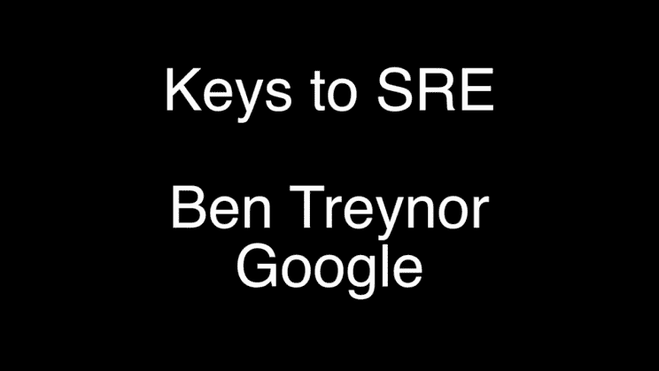

# SRE 的钥匙| USENIX

> 原文：<https://www.usenix.org/conference/srecon14/technical-sessions/presentation/keys-sre?utm_source=wanqu.co&utm_campaign=Wanqu+Daily&utm_medium=website>

## 开放接入媒体

USENIX 致力于开放我们活动中展示的研究成果。一旦活动开始，每个人都可以免费获得论文和会议记录。活动结束后发布的任何视频、音频和/或幻灯片也是免费的，对所有人开放。支持 USENIX 和我们开放存取的承诺。

BibTeX

@conference {209104，
作者= {Ben Treynor}，
标题= {Keys to {SRE}}，
年份= {2014}，
地址= {加州圣克拉拉}，
出版商= {USENIX 协会}，
月=五月，
}

## 演示视频

#### 演示视频

<video id="usenix-media-video-1" data-setup="{}" poster="https://www.usenix.org/sites/default/files/styles/video-thumbnail/public/conference/video/treynor.jpeg?itok=qrl71dlL" class="video-js vjs-default-skin vjs-big-play-centered" preload="auto" controls=""><source src="" type="video/mp4; codecs=&quot;avc1.42E01E, mp4a.40.2&quot;"> <source src="https://2459d6dc103cb5933875-c0245c5c937c5dedcca3f1764ecc9b2f.ssl.cf2.rackcdn.com/srecon14/treynor.webm" type="video/webm; codecs=&quot;vp8.0, vorbis&quot;"> <object type="application/x-shockwave-flash" data="http://releases.flowplayer.org/swf/flowplayer-3.2.1.swf"> <param name="movie" value="http://releases.flowplayer.org/swf/flowplayer-3.2.1.swf"> <param name="allowFullScreen" value="true"> <param name="wmode" value="transparent"> <param name="flashVars" value="config={'playlist':['https%3A%2F%2Fwww.usenix.org%2Fsites%2Fdefault%2Ffiles%2Fstyles%2Fvideo-thumbnail%2Fpublic%2Fconference%2Fvideo%2Ftreynor.jpeg%3Fitok%3Dqrl71dlL',{'url':'','autoPlay':false}]}">  </object></video> 

#### 演示音频