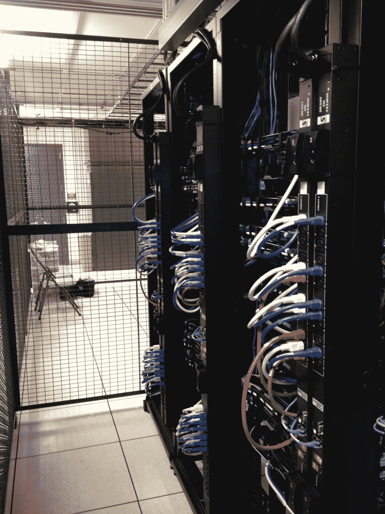
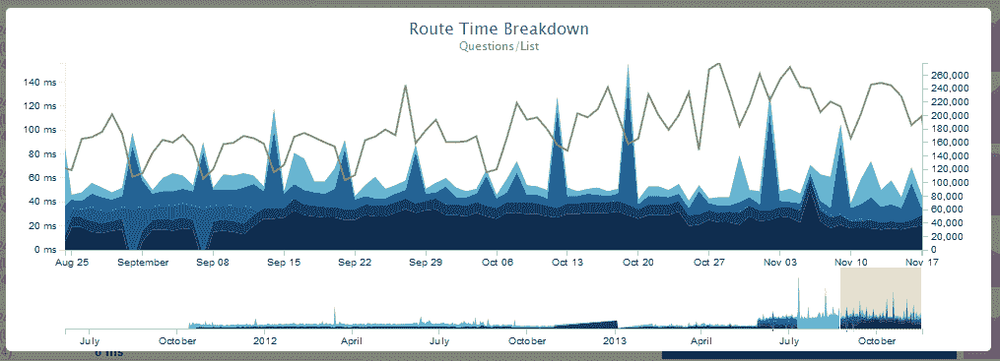
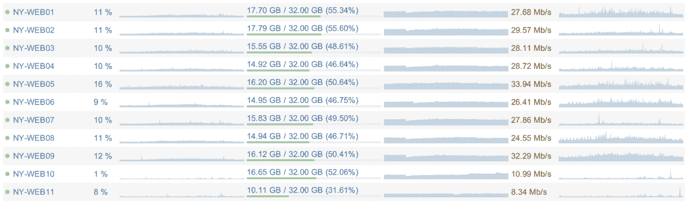

# 尼克克拉弗-什么需要运行堆栈溢出

> 原文：<https://nickcraver.com/blog/2013/11/22/what-it-takes-to-run-stack-overflow/?utm_source=wanqu.co&utm_campaign=Wanqu+Daily&utm_medium=website>

我喜欢认为栈溢出是以规模运行*，而不是以规模*运行*。我的意思是我们运行得非常高效，但我仍然不认为我们是“大”的，现在还不是。让我们抛出一些数字，这样你就可以了解我们目前的规模。这里是几天前**24 小时窗口**的一些快速数据——准确地说是 2013 年 11 月 12 日。这些数字来自一个典型的工作日，并且只包括我们活跃的数据中心，也就是我们托管的数据中心。我们的 CDN 的点击率/带宽之类的东西不包括在内，它们不会影响我们的网络。*

*   148，084，883 个 HTTP 请求发送到我们的负载平衡器
*   其中 36，095，312 次是页面加载
*   发送了 833，992，982，627 字节(776 GB)的 HTTP 流量
*   总共收到 286，574，644，032 字节(267 GB)
*   总共发送了 1，125，992，557，312 字节(1，048 GB)
*   334，572，103 个 SQL 查询(仅来自 HTTP 请求)
*   412 865 051 次重复命中
*   3，603，418 个标签引擎请求
*   运行 SQL 查询花费了 558，224，585 毫秒(155 小时)
*   redis 点击量为 99，346，916 毫秒(27 小时)
*   标记引擎请求花费了 132，384，059 毫秒(36 小时)
*   在 spent 的处理时间为 2，728，177，045 毫秒(757 小时)

(我应该写一篇关于我们如何快速获得这些数字，以及仅仅有这些数字就值得付出努力的帖子)

请记住，这些是针对整个堆栈交换网络的，但仍不包括所有内容。除了这两个总数之外，这些数字仅来自我们记录的用于查看性能的 HTTP 请求。还有，哇，一天要花很多时间，你是怎么做到的？我们喜欢称之为魔术，其他人称之为“多服务器与多核处理器”-但我们将坚持魔术。以下是在该数据中心运行堆栈交换网络的内容:

看起来是这样的:

[<picture><source type="image/webp" srcset="/blog/content/INAP-DataCenter-Rear.webp"><source type="image/jpg" srcset="/blog/content/INAP-DataCenter-Rear.jpg"></picture>T6】](/blog/content/INAP-DataCenter-Rear.jpg)

我们不*只*运行站点，最近机架中的其余服务器是虚拟机和其他基础设施，用于不直接服务于站点的辅助工作，如部署、域控制器、监控、sysadmin 的 ops 数据库等。在上面的列表中，2 台 SQL 服务器直到最近*才被备份——它们现在用于只读加载，所以我们可以继续扩展，而不用考虑更长时间(这主要包括[栈交换 API](https://api.stackexchange.com) )。其中两个 web 服务器用于开发和 meta，运行很少的流量。*

### 核心硬件

当您移除冗余时，以下是堆栈交换*需要*运行的内容(同时保持我们当前的性能水平):

*   2 个 SQL 服务器(一个是这样，其他的都在另一个上…它们可以在一台机器上运行，但仍有扩展空间)
*   2 个网络服务器(*可能是* 3 个，但我只相信 2 个)
*   1 个重定向服务器
*   1 台标签引擎服务器
*   1 台 elasticsearch 服务器
*   1 个负载平衡器
*   1 网络
*   1 ASA
*   1 台路由器

(我们真的应该有一天通过关闭设备来测试这一点，看看转折点是什么)

现在有一些虚拟机在后台处理其他任务、域控制器等。，但这些都是非常轻量级的，我们将重点放在堆栈溢出本身以及全速渲染所有页面所需要的东西上。如果您想要一个完整的苹果对苹果，为所有这些落后者提供一台 VMware 服务器。因此，这并不是大量的机器，但这些机器的规格通常无法在云中获得，价格也不合理。以下是一些快速“纵向扩展”服务器的注意事项:

*   SQL servers 拥有 384 GB 内存和 1.8TB 固态硬盘存储
*   Redis 服务器有 96 GB 的内存
*   弹性搜索服务器 196 GB 内存
*   标签引擎服务器拥有我们能买到的最快的原始处理器
*   网络核心在每个端口上有 10 Gb 的带宽
**   Web 服务器没有那么特别，有 32 GB 和 2x 四核以及 300 GB 的 SSD 存储。*   没有 2 个 10Gb 的服务器(例如 SQL)有 4 个 1 Gb 的网络带宽*

 *20 Gb 是不是大材小用？没错，在 20 Gb 的管道中，活动的 SQL 服务器平均占用 100-200 Mb。然而，像备份、重建等等。由于内存和 SSD 存储的数量，它可以完全饱和，因此它确实有其用途。

### 储存；储备

我们目前有大约 2 TB 的 SQL 数据(第一个集群上的 18 个 SSD 有 1.06 TB / 1.63 TB，第二个集群上的 4 个 SSD 有 889 GB / 1.45 TB)，所以这就是我们在云上需要的数据(嗯，又是这个词)。记住那都是 SSD。我们任何数据库的平均写入时间为 **0 毫秒**，这甚至不是我们可以测量的单位，因为存储处理得很好。数据库在内存中，前面有两级缓存，堆栈溢出实际上有 40:60 的读写比。是的，你没看错，我们 60%的数据库磁盘访问是写操作([你也应该知道你的读/写工作负载](http://sqlblog.com/blogs/louis_davidson/archive/2009/06/20/read-write-ratio-versus-read-write-ratio.aspx))。每台网络服务器都有存储空间——RAID 1 中有两个 320GB 的固态硬盘。弹性盒每块需要 300 GB，在固态硬盘上的性能要好得多(我们非常频繁地写入/重新索引)。

值得注意的是，我们确实有一个 SAN，一个 [Equal Logic PS6110X](http://www.dell.com/us/business/p/equallogic-ps6110xv/pd) ，它是 24x900GB 10K SAS 驱动器，位于到我们核心网络的 2x 10Gb 链路(活动/备用)上。它专门用于虚拟机服务器，作为高可用性的共享存储，但并不真正支持托管我们的网站。换句话说，如果 SAN 死机，站点在一段时间内甚至不会注意到(只有虚拟机域控制器是一个因素)。

### 把它们放在一起

现在，所有这些都有什么用呢？我们想要性能。我们*需要*表现。[性能是特色](https://blog.codinghorror.com/performance-is-a-feature/ "Performance is a Feature by Jeff Atwood")，对我们来说非常重要的特色。我们所有网站上加载的主页面是问题页面，在内部被亲切地称为问题/展示(其路线名称)。11 月 12 日，该页面的平均渲染时间为 **28 毫秒**。虽然我们努力保持 50 毫秒，但我们真的试图从你的页面加载体验中剔除每一个可能的毫秒。当涉及到性能时，我们所有的开发人员都是不折不扣的坏脾气，所以这也有助于保持低时间。以下是其他热门页面，平均渲染时间与上述 24 小时相同:

*   提问/展示:28 毫秒(2970 万次点击)
*   用户简介:39 毫秒(170 万次点击)
*   问题列表:78 毫秒(110 万次点击)
*   首页:65 毫秒(100 万次点击)*(这对我们来说太慢了——凯文·蒙特罗斯将很快修复这个性能:[这是主要原因](https://kevinmontrose.com/2013/05/22/your-future-on-stack-overflow/) )*

通过记录对网络的每一个请求的时间，我们可以清楚地看到页面加载的内容。你需要像这样的某种度量标准，否则**你的决策是基于什么？**有了这些现成的指标，我们可以创建这样一个易于访问、易于阅读的视图:

[<picture><source type="image/webp" srcset="/blog/content/Route-Time-QuestionsList.webp"><source type="image/png" srcset="/blog/content/Route-Time-QuestionsList.png"></picture>T6】](/blog/content/Route-Time-QuestionsList.png)

在那之后，点击率急剧下降，但是如果你对某个页面感兴趣，我也很乐意公布这些数字。我在这里关注渲染时间，因为这是我们的服务器产生一个网页所需要的时间，传输速度是一个完全不同的(虽然不可否认，非常相关)主题，我将在未来讨论。

### 成长空间

值得注意的是，这些服务器的利用率非常低。这些网络服务器平均拥有 5-15%的 T2 CPU，15.5 GB 的内存和 20-40 Mb/s 的网络流量。SQL 服务器平均使用大约 5-10%的 CPU(T4)，365 GB 的内存，100-200 Mb/s 的网络流量。这为我们提供了一些重要的东西:在我们升级之前的一般增长空间，当事情变得疯狂(错误的查询、错误的代码、攻击，无论是什么)时保持在线的空间，以及在需要时恢复供电的能力。这是刚刚从 Opserver 获得的我们的 web 层的[视图:](https://github.com/opserver/Opserver)

[<picture><source type="image/webp" srcset="/blog/content/Opserver-Screens-1024x305.webp"><source type="image/png" srcset="/blog/content/Opserver-Screens-1024x305.png"></picture>T6】](/blog/content/Opserver-Screens-1024x305.png)

利用率如此之低的主要原因是高效的代码。这不是本文的主题，但是高效的代码对于进一步扩展您的硬件至关重要。你正在做的任何不需要做的事情都比*不做*花费更多，如果它是你的代码的一个子集，那么它将继续有效。这种成本表现为:功耗、硬件成本(因为你需要更多/更大的服务器)、开发人员理解更复杂的东西(公平地说，这是双向的，高效并不一定简单)以及可能更慢的页面渲染——这意味着更少的用户停留在另一个页面加载上……或者不太可能回来。**低效代码的成本可能比你想象的要高。**

现在我们知道了堆栈溢出在当前硬件上的表现，下一次我们可以看到为什么我们不在云中运行。* 