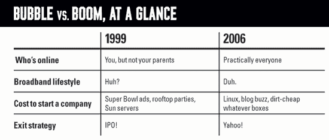

# 新繁荣|连线

> 原文：<https://archive.wired.com/wired/archive/14.02/boom.html?utm_source=wanqu.co&utm_campaign=Wanqu+Daily&utm_medium=website>

今天，宽带成为主流，网上购物司空见惯，每个人都有一两个无线设备，苹果最新的音乐播放器连续第五年成为必备的节日礼物。互联网和数字媒体显然不是时尚。在过去的十年里，我们开始过上了 90 年代中期商业计划中想象的生活。结果，一些愚蠢的泡沫时代的想法开始变得有意义了——也许是很有意义。

网上免费电话？这就是 Skype，易贝刚刚以近 40 亿美元收购了它。在线虚拟社区？现在，大型多人在线游戏已经成为一种全球现象。免费音乐网站？在流量上与谷歌匹敌的 MySpace。(繁荣的终极回声:Dog.com 的所有者刚刚为 Fish.com 支付了 100 万美元，希望开创一个新的 Pets.com。只要它不运送 50 磅的食物。)

这次繁荣与上次如此不同的第二个原因是，互联网时代的沉没成本使得创业的经济学更加有利。在过去糟糕的日子里，许多公司因为建设光纤网络而破产。对投资者不利，对其他人有利:我们现在享受着超级堆的带宽。存储、屏幕和许多其他技术也是如此，它们受益于 90 年代挥霍无度的投资和研究。

与此同时，开源软件已经成熟，计算机硬件的成本将很快低于运行它所需的电力。结果是:比台式电脑便宜的工业级服务器(对不起，Sun)。或者，如果你愿意，你可以以更便宜的价格购买硬件和软件作为托管服务(同样有便宜的带宽)。

结果是，你现在可以用五年前的很小一部分钱创办一家公司。泡沫时代的搜索引擎 Excite 的联合创始人乔·克劳斯(Joe Kraus)估计，他的新公司 JotSpot 将获得第一笔收入，总投资约为 10 万美元，不到 Excite 十年前的 50%。今天，公司开始小而精，并保持这种方式——不再浪费公关噱头和屋顶派对的首轮资金。因此，他们很快就达到了盈亏平衡。

在这种新环境下，初创公司可以有机增长。这意味着需要更少的风险资本，这是这次繁荣不同的第三个原因。更少的风险资本导致更少的风险资本家在高估值时急于提前退出。这反过来减少了上市的压力，也意味着更少未经充分考虑的公司仅凭炒作进行 IPO。

因此，你有了健康繁荣的秘诀，而不是脆弱的泡沫:更容易接受的市场，更低的成本，来自投资者的压力更小。今天，典型的退出策略是把你的创业公司卖给雅虎！为了几百万美元，而不是为了喧闹的首次公开募股和在美国消费者新闻与商业频道露面。101 号高速公路上挤满了开普锐斯的工程师，而不是开宝马的商务开发人员。大多数纽约出租车司机很高兴不知道山谷里有什么热，就像他们应该知道的那样。

*克里斯·安德森*(canderson@wiredmag.com)*是* Wired*的主编。* 
*信贷杰拉德·韦尔塔*

