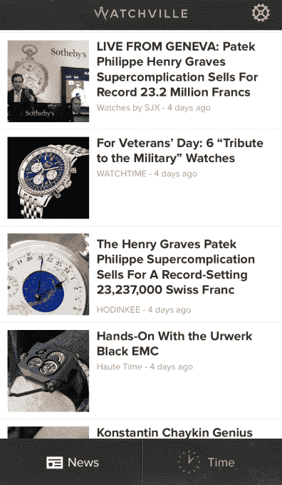
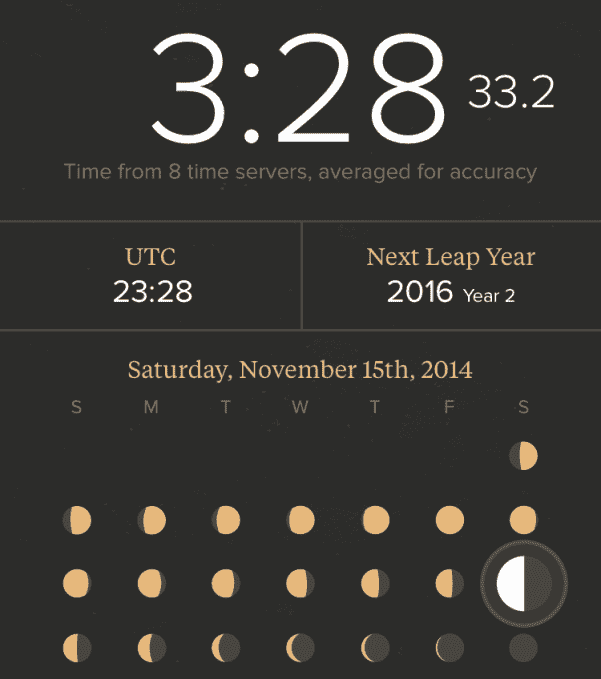

# 凯文·罗斯从新应用 Watchville TechCrunch 开始谋划一个奢侈品电子商务帝国

> 原文：<http://techcrunch.com/2014/11/15/watchville/?utm_source=wanqu.co&utm_campaign=Wanqu+Daily&utm_medium=website>

“我一生都不喜欢手表，”Digg 联合创始人凯文·罗斯告诉我。对于一个刚刚推出了 [Watchville](http://www.watchville.co/) 的人来说，这是一个奇怪的承认，这是一个[应用](https://itunes.apple.com/us/app/watchville-watch-news-time/id932598030?ls=1&mt=8)，它聚合了来自顶级手表博客的新闻，并提供了一个原子钟工具来帮助你设置你的时钟和月相。

但罗斯解释说:“我父亲去世了，留给我一块非常漂亮的手表。这几乎是他能买得起的，所以他花了很多时间和精力在这上面，一块劳力士。”这激发了他对腕表的更多了解。然而，当这位经验丰富的技术专家寻找一种方式来跟上他的新爱好时，“我意识到，在奢侈品领域，当你寻找应用程序时，什么都没有。”

凯文·罗斯

因此，罗斯将他的实验性移动应用程序开发店向北推进，打造一些会让手表发烧友们喜欢的奢华产品。这与[诺斯的第一款应用 Tiiny](https://beta.techcrunch.com/2014/09/12/tiiny/) 相去甚远，后者是一款更加传统的硅谷发明，可以让你分享微型照片和视频。

“对我们来说，Tiiny 非常有趣，足以开发出下几个版本”, Rose 叹了口气，然后默认它的推出有点早。"如果从 1 到 10 分，我会给它打 7 分。"根据 North game 计划，这很好，该计划旨在每隔几个月推出新的应用程序，给他们时间沉下去或游起来，然后放弃失败，专注于具有巨大潜力的应用程序。

与典型的创业公司相比，Watchville 的市场听起来可能平淡无奇，但这就是为什么会有这样的机会。其他应用程序开发者从来没有给它一天的时间。

在过去的一年里，Rose 去各地观看活动，会见博客作者，并与顶级品牌建立关系。在他们的指导下，他建造了今日发布的 Watchville。如果你对 [Audemars](http://rap.genius.com/319386/Kanye-west-niggas-in-paris/Ball-so-hard-got-a-broken-clock-rolleys-that-dont-tick-tock-audemars-thats-losing-time) 和 [Hublots](http://rap.genius.com/287400/Kanye-west-otis/Truth-new-watch-alert-hublots-or-the-big-face-rollie-i-got-two-of-those-arm-out-the-window-through-the-city) 的唯一体验来自 Jay-Z 的歌词，Rose 的应用程序会教你。

[iOS 版 Watchville】用像 Perpetuelle 和 Haute Time 这样厚颜无耻的名字从顶级观察博客中获取新闻故事。这包括动手评论、买家指南和让计时者兴奋的专题文章，无论他们是通过应用的阅读器模式消费还是通过 Watchville 的内部浏览器查看原始文章。](https://itunes.apple.com/us/app/watchville-watch-news-time/id932598030?ls=1&mt=8)

收藏者可以使用应用程序的原子钟将他们的手表同步到准确的时间。小钟声音倒数每分钟的最后五秒，这样他们就可以听到什么时候打卡。如果他们的计时器显示月相，他们也可以设置。

如果这一切听起来非常深奥，这就是问题的关键。有一个小的，顽固的，但非常有利可图的社区，Watchville 想吸引。

如果它可以建立一个忠实的观众，有很多方法来赚钱。Watchville 不打算展示广告或创建自己的内容，但“当涉及到商业或市场时，有一堆事情摆在桌面上”，罗斯告诉我，尽量不要马上打所有的牌。当被问到时，他解释说，像易贝这样的传统市场没有为奢侈品做好充分的准备。他暗示，他们需要更好的声誉体系。

Watchville 可能只是个开始。罗斯说，如果这个模板可行，North 可以为“手袋收藏家、老式飞人乔丹、漫画书”催生奢侈应用。我们的长期战略是将这些捆绑在一个品牌或几个应用程序下”，这位兼职谷歌风投合伙人预测。

“这是一个没有人真正涉足的市场。人们追求的是更像 Tiiny 的东西，”Rose 笑着说。最近消费应用的趋势是面向大众受众，希望从数千万或数亿人身上榨出一点钱。不过，虽然这是一条更分散、或许也不那么性感的路线，为少数人创造一些极客可以玩的东西，但如果每个用户都在自己的习惯上花大钱，Watchville 这样的应用可能会成为重要的业务。

这里的“1”和“0”比罗斯习惯的要少得多，但他仍然笑着说“奢侈品空间很大。”

[*Watchville 在 iOS 上免费提供*](https://itunes.apple.com/us/app/watchville-watch-news-time/id932598030?ls=1&mt=8)