# 测试最低可行产品的 15 种方法

> 原文：<http://thenextweb.com/dd/2014/11/12/15-ways-test-minimum-viable-product?utm_source=wanqu.co&utm_campaign=Wanqu+Daily&utm_medium=website>

**克里斯·班克是 UX 设计应用公司 [UXPin 的增长主管。他最近与人合著了](http://uxpin.com/)**[*UX 设计指南&工艺文档*](http://uxpin.com/guide-to-ux-design-process-and-documentation.html) *。*T13】**

 ** * *

虽然 [MVP 提供了一种方法](https://thenextweb.com/news/maximizing-minimum-viable-product-get-high-results-without-releasing-minimal-product)来测试假设作为起点，但这并不意味着它很容易构建。这个练习背后的想法不是看产品在技术上是否可行。更确切地说，是看你是否应该首先建立它，更重要的是，它是否解决了一个其他人认为值得为之付费的问题。

Grant Snap & Lean Startup Circle Brussels 的创始人弗拉基米尔·布拉戈耶维奇(Vladimir Blagojevic)写道[打造一款人们愿意使用和支付](http://scalemybusiness.com/5-reasons-why-solving-the-right-problem-can-make-you-rich/)的产品的重要性。然而，为了达到那个阶段，你需要确保你的产品通过某些测试。

时间和金钱是宝贵的资源，浪费在制造不符合标准的产品上是不可能的。MVP 测试不仅仅是为了回答关于产品的技术问题，也是为了测试关于市场生存能力的基本商业假设。

例如，一家公司想看看无人驾驶飞机对于收集作物健康数据是否有价值。该项目可能被认为在技术上是可行的，但是 MVP 可能最终失败，因为它没有通过验证市场和公司能力来测试业务的可行性。(我们在[最小可行产品指南](http://uxpin.com/guide-to-minimum-viable-products.html)中详细讨论了如何找到合适的东西来测试。)

你的 MVP 的复杂性取决于你正在构建的产品的类型，不同类型的 MVP 可以从模糊的 adwords 测试到早期的原型。一旦你确定了你需要用 MVP 测试的假设，这里有一些测试技术，你可以用来从实际用户那里获得可靠的数据并加以利用:

### 1.客户访谈

《创业公司所有者手册》和《客户发展方法论》的作者之一史蒂夫·布兰克说:“在创业公司里，没有事实，只有观点。”。

在他的书《顿悟的四个步骤》中，他谈到了客户问题陈述，这是客户验证过程的一个重要部分，可以帮助你用实际的客户来测试你的假设。

[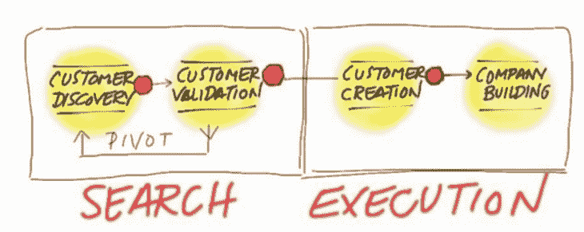

<noscript></noscript>](https://thenextweb.com/wp-content/blogs.dir/1/files/2014/11/search-execute.png) 

来源:[史蒂夫空白](http://www.steveblank.com/)

本质上，这是一次与客户的无稿访谈，旨在获得有关您的产品试图解决的问题的信息。这些访谈是试探性的，而不是推销你的产品，不管是功能性的还是其他的。

这个过程可以继续下去，列出你认为你的产品可以解决的问题，然后询问客户对这些问题的看法，以及他们如何对每个问题进行排序。

这些访谈可能是可操作信息的金矿，因为即使你假设的问题对客户来说并不重要，你仍然有有价值的数据可以帮助你调整你的产品。

### 2.登录页面

[“登陆页面”](https://thenextweb.com/news/landing-pages-dummies-guide)是访问者和潜在客户被引导到你的产品的第一页。

这是一个营销机会，你可以解释你的产品的特点，并让他们注册，但同时，出于同样的原因，这也是一个伟大的 MVP，让你根据现实世界的市场预期测试你的产品。

****[

<noscript></noscript>](https://thenextweb.com/wp-content/blogs.dir/1/files/2014/11/Buffer-MVP-2.png)**** 

登录页面经常被误用为美化的电子邮件捕获页面，但是它们可以更广泛地用于测试产品。Joel Gascoigne 充实了的第一个登录页面，用来衡量对各种功能和价格计划的需求，而不仅仅是建立一个邮件列表。

这就像在功能页面和注册表单之间添加一个额外的页面一样简单；插页显示了一个价格表，访问者可以选择吸引他们的方案。

这些额外的点击不仅显示了访问者对产品的兴趣，还为团队提供了真实世界的数据，说明什么样的定价适合市场。

Tradecraft 的讲师、Luxr 的联合创始人凯特·鲁特(Kate Rutter)是[利用登陆页面“先卖，后建”](http://www.slideshare.net/intelleto/mvp-what-it-is-and-why-we-all-should-care)的忠实粉丝。为了最有效，登录页面需要能够在正确的上下文中向客户提供正确的信息。

请记住，我们的目标是验证学习，因此使用 Google Analytics、KISSmetrics 或 CrazyEgg 等工具收集访客分析是其中最重要的部分。你还需要一个有效的价值主张和行动号召。

为了更进一步的学习，你还可以在页面内容上运行 [A/B 测试](https://thenextweb.com/news/ab-test-email-creative)来帮助确定哪种推销最适合转化。

### 3.A/B 测试

A/B 测试用于测试您的产品或营销的任何变化的有效性。可以使用各种分析工具来测试访问者对你所做的设计决策的反应，从而在改进产品时消除猜测。

A/B 测试允许你测试两个版本的页面或营销文案，并让访问者互动来决定哪一个表现最好。

[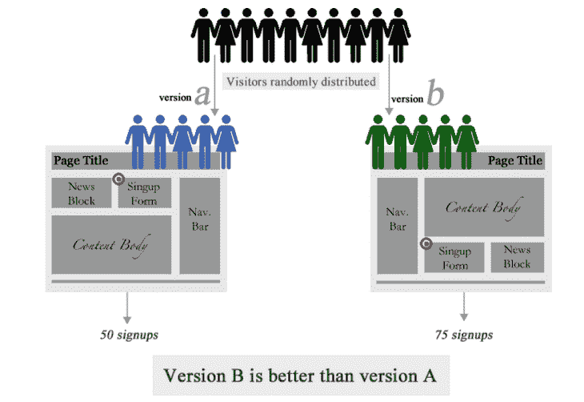

<noscript></noscript>](https://thenextweb.com/wp-content/blogs.dir/1/files/2014/11/ab-test.png) 

来源:[砸弹匣](http://www.smashingmagazine.com/2010/06/24/the-ultimate-guide-to-a-b-testing/)

一部分访问者看到的是版本 A，而其他人看到的是版本 b。最后，使用 Optimizely、Unbounce 或 Google Analytics 等分析工具收集的数据，你可以根据一系列指标来衡量每个版本的表现，如跳出率、转化率或使用率。

### 4.广告活动

也许与直觉相反，广告活动是进行市场验证调查的好方法。谷歌和脸书是允许你深入挖掘你试图接触的特定目标客户的人口统计数据的平台，这让你可以运行一个低保真度测试，看看你的产品的哪些功能或方面最吸引他们。

********

****[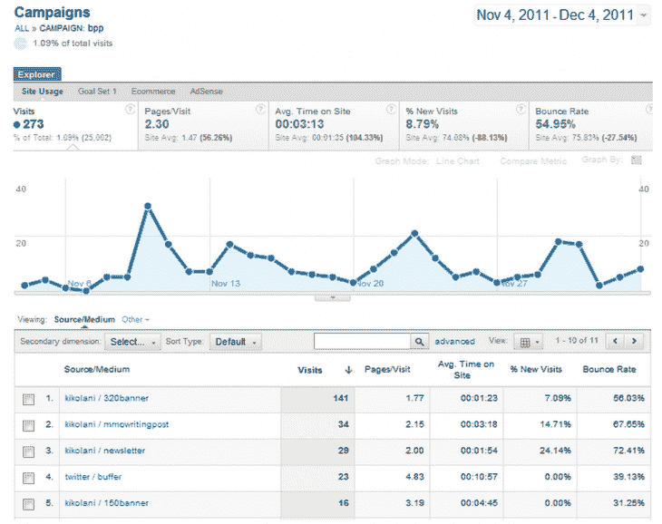

<noscript></noscript>](https://thenextweb.com/wp-content/blogs.dir/1/files/2014/11/Screen-Shot-2014-11-12-at-3.14.40-PM.png)**** 

来源: [KISSmetrics](https://blog.kissmetrics.com/how-to-use-utm-parameters/)

通过这些服务开展营销活动会给你带来点击率和转化率等统计数据，这些数据对于确定你的产品是什么以及如何运作是非常有价值的信息。这些可以与 A/B 测试相结合。

搜索营销领域的竞争非常激烈，所以重要的是要记住，为你的 MVP 进行 AdWords 活动不会让你获得很多曝光率。但是对于测试你的假设和学习来说，它是无价的。

### 5.筹款

Kickstarter 和 Indiegogo 等众筹网站也为 MVP 测试提供了一个很好的平台。这些网站本质上是 MVP 的集合，通过人们对活动的贡献来判断市场反应。

这将有效学习的好处与产品开发的资金筹集结合起来，甚至让你接触到一群高度感兴趣并积极参与的早期采用者，他们与你产品的成功有利害关系，这对建立口碑和沿途的持续反馈非常重要。

[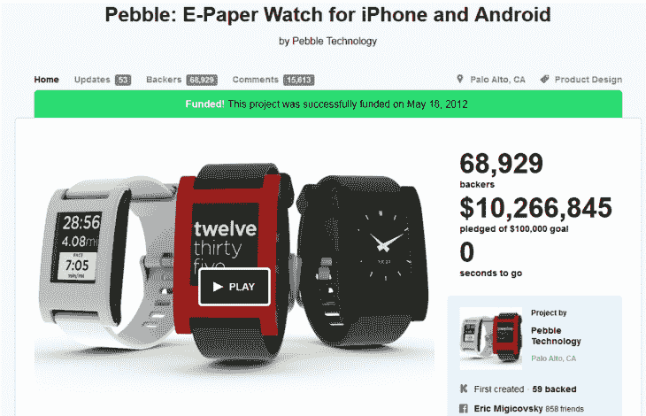

<noscript></noscript>](https://thenextweb.com/wp-content/blogs.dir/1/files/2014/11/pebble-kickstarter.png) 

你不需要看很远就能听到始于 Kickstarter 活动的成功故事。Pebble 电子纸智能手表和 T2 的 Ouya 游戏机更受欢迎，它们已经筹集了数百万美元，甚至在开发开始之前就已经引起了轰动。

当然，活动的一些标志性特征包括引人注目的叙述、有效的讲解视频和对支持项目的人有用的奖励或激励。

### 6.解说视频

如果一张图片胜过千言万语，那么一个展示你的产品用户体验的视频就值一百万。初创公司使用解释者视频来验证市场并销售他们的 MVP 的最著名的例子是 Dropbox。

它以一个 3 分钟的视频开始，展示了 Dropbox 的预期功能，这导致注册人数在一夜之间从 5000 人增加到 75000 人——所有这些都是在没有真正产品的情况下实现的。当然，这也有助于视频面向精通技术的早期用户，欣赏复活节彩蛋和视频本身的幽默引用。

[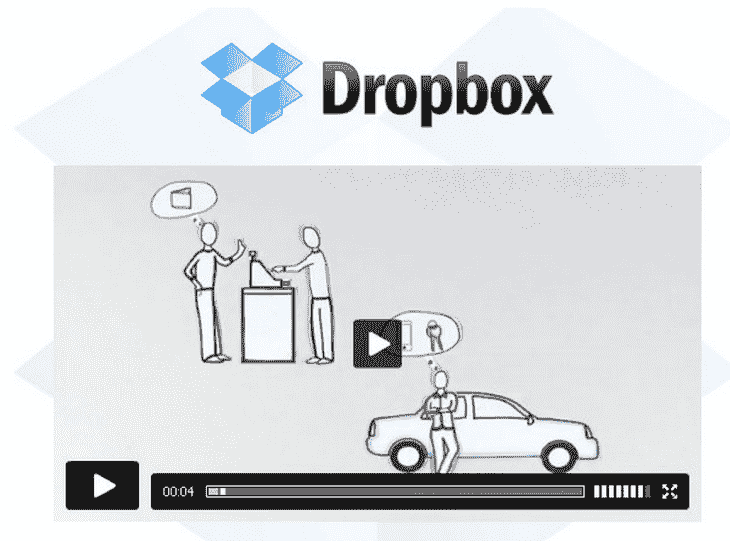

<noscript></noscript>](https://thenextweb.com/wp-content/blogs.dir/1/files/2014/11/dropbox-video.png) 

Dropbox 的 explainer 视频是对市场的一次出色验证，在此之前，创始人们不得不投资基础设施和开发，以使其高科技产品在现实世界中达到实用水平。接触目标客户已经够困难了，尤其是当你设计解决一个许多用户可能都没有意识到的问题的时候。

对于 Dropbox 来说，也许说它提供了一个“无缝文件同步应用”不会有同样的影响。相反，讲解者视频向潜在客户介绍产品是什么，并清楚地展示*产品如何*帮助他们，最终导致*为什么*他们会愿意向你付费。

### 7.零碎 MVP

作为绿野仙踪和门房技术的结合，零碎的 MVP 意味着使用现有的工具和服务来组装产品的功能演示，以提供体验，而不是自己构建任何东西。

Groupon 在早期阶段是 WordPress、Apple Mail 和 AppleScript 的结合，当从网站收到订单时，可以手动生成 pdf。

********

****[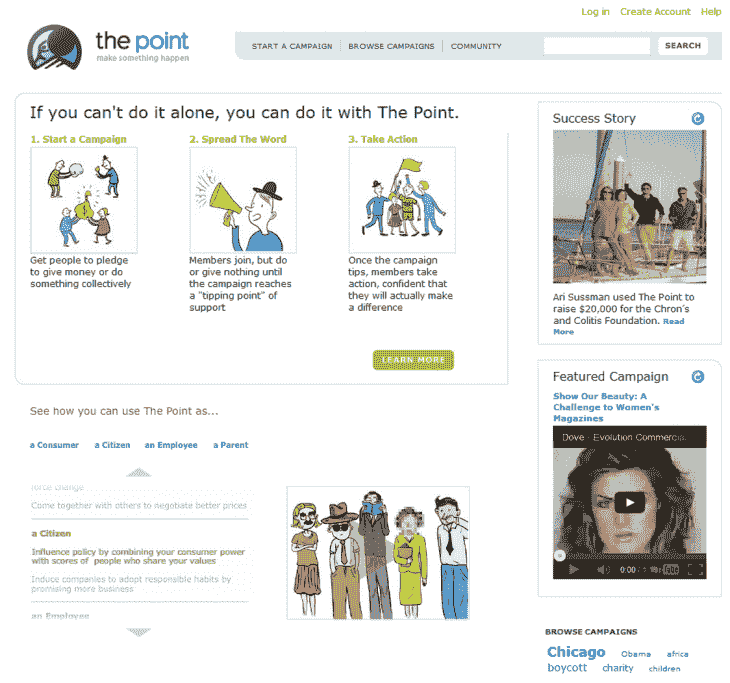

<noscript></noscript>](https://thenextweb.com/wp-content/blogs.dir/1/files/2014/11/the-point.png)**** 

来源:[Archive.org](https://archive.org/web/)

不需要投入时间和金钱来构建自己的基础设施，该产品可以使用其他现有平台和服务作为基础来构建，有效地使用各种来源的零碎信息来制作您的产品版本。

### 8.SaaS 与 PaaS

不要投资于可扩展的服务器技术，而是依靠云平台，如亚马逊网络服务、Heroku 和 MongoDB、脸书连接、Chargify、Mixpanel、Mailchimp、谷歌表单和 LiveChat 等服务，甚至是 WordPress 和 Drupal 等平台，都是你的 MVP 测试拼图中的重要部分。

这些服务和平台在开发过程中为您提供帮助，加快您的 MVP 上市时间。以 Groupon 为例，它最初是一个定制的 WordPress 网站，创始人在那里发布交易信息，并手动向订阅者发送 pdf 电子邮件，以验证他们的市场潜力。

********

****[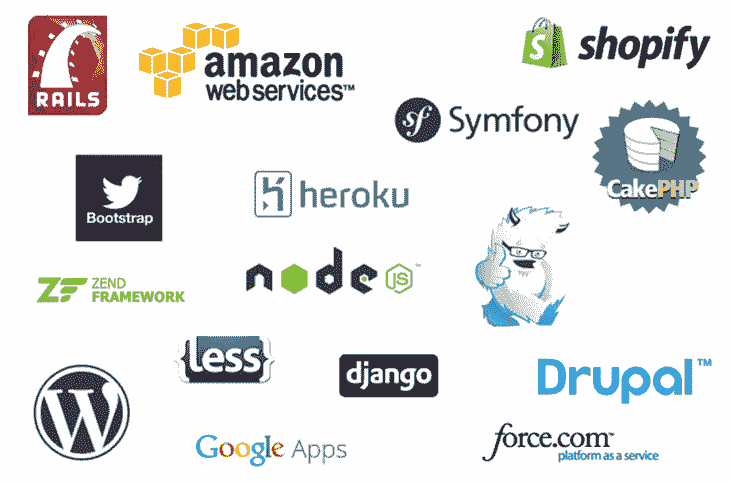

<noscript></noscript>](https://thenextweb.com/wp-content/blogs.dir/1/files/2014/11/logos.png)**** 

**T11】**

设计和开发框架被证明是节省时间和金钱的有效捷径。有很多可供选择的，其中一些最流行的是 Twitter Bootstrap、ZURB Foundation、Ruby on Rails、Django、bootstrap.js 甚至是 Node.js 这样的框架。

使用框架或库可以显著加快开发时间。它们提供了大量的文档，并使启动和运行您的 MVP 变得极其容易。

开发人员面临的许多问题，如跨浏览器兼容性、移动友好设计或代码优化，已经得到解决，让您可以专注于构建您的 MVP，而不是旨在支持它的设计或开发。

### 9.博客

博客是用最少的努力在正确的目标市场验证想法的好方法。博客平台 Ghost 和 App.net 从他们创始人的博客开始构思，在那里他们继续充实自己的想法，并从一群追随者和支持者那里获得支持。

**

*[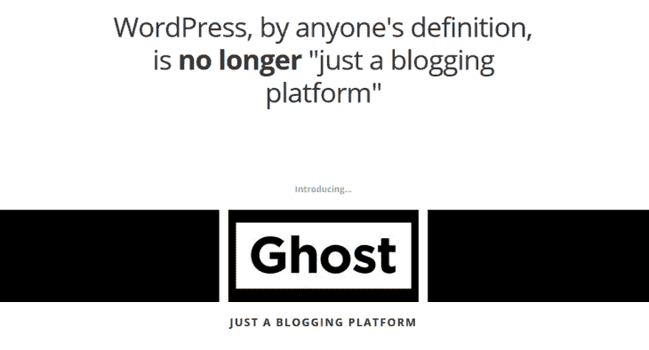

<noscript></noscript>](https://thenextweb.com/wp-content/blogs.dir/1/files/2014/11/project-ghost.png)* 

图片:[项目幽灵](http://john.onolan.org/project-ghost/)

来自博客的双向交流提供了一个理想的平台，在 MVP 开发过程中建立势头并收集客户反馈。

此外，博客也可以作为你产品的早期原型。《精益创业》(Lean Startup)的作者埃里克·里斯(Eric Ries)也以博客的形式开始了他的书，在签署任何出版协议之前建立读者群和需求。同样，《五十度灰》也是如此！

### 10.手动优先(又名“绿野仙踪”)MVP

市场验证初始阶段的另一个选择是手动交付产品或服务，而不是构建视频或编码框架。《绿野仙踪》的 MVP 来自于给人留下完整功能印象的想法，本质上是假装，直到你做到为止。

客户认为他们正在体验实际的产品，但实际上幕后的工作是手工完成的。

********

****[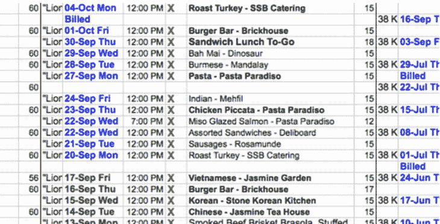

<noscript></noscript>](https://thenextweb.com/wp-content/blogs.dir/1/files/2014/11/Screen-Shot-2014-11-12-at-3.18.09-PM.png)**** 

Arram sabe ti 的手册——第一 MVP，一份电子表格。来源: [TechCrunch](http://techcrunch.com/2013/04/06/how-i-started-zerocater/)

ZeroCater 的创始人 Arram Sabeti 从一个巨大的电子表格开始，他用它来跟踪他可以联系的公司和餐饮供应商。Zappos 以同样的方式起步，其创始人 Nick Swinmurn 将当地鞋店的鞋子照片放在网站上，以评估在线商店的需求。

当有人在网上订购鞋子时，他会回到店里购买。这让 Zappos 有机会回答他们的产品是否会被市场接受的问题，而不是首先投资基础设施和库存。

这种方法也允许你在设计产品的关键阶段与顾客有更多的互动。直接观察真实的客户总是比假设的客户调查更有用，这是发现它是否解决了真实世界的客户问题的最快方法

快速学习，尽管是小规模的，提供了测试你对产品或市场的许多假设的机会。通过手动操作，您有机会在扩展之前尝试不同的东西，看看客户的反应。当然，对于客户来说，产品起作用，幕后工作并不重要。

毫无疑问，这些 MVP 需要付出巨大的努力，但最终还是值得的，因为它们关注的是问题而不是解决方案。例如，Zappos 最终成长为最成功的在线企业之一，并于 2009 年被亚马逊以 12 亿美元收购。

### 11.礼宾 MVP

礼宾测试类似于绿野仙踪 MVP，除了不是伪造一个工作产品，而是你提前做手工工作，产品或服务作为高度定制的服务交付给选定的客户。

[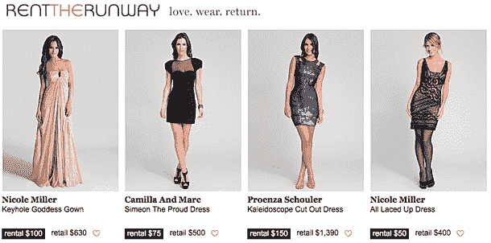

<noscript></noscript>](https://thenextweb.com/wp-content/blogs.dir/1/files/2014/11/rentTheRunway.jpg) 

《出租 t 台》测试了其在线服装租赁业务模式，向女大学生提供面对面服务，任何人都可以在租赁前试穿服装。这验证了其最冒险的假设，即女性会租用礼服，并作为一个伟大的礼宾 MVP，将业务放在客户面前，并获得他们的反馈。

时间是宝贵的，尤其是在这个阶段，手动运行该流程还可以揭示客户体验的其他方面，这些方面可以在以后证明是有价值的。这些 MVP 测试可以首先回答一个更重要的问题，而不是投入资源来构建一个真正的产品:你是否在构建一个客户会使用并为之付费的东西？

### 12.数字原型

实体模型、线框和原型可以用来以模拟实际使用的方式展示产品的功能。这些原型 MVP 可以从低保真度草图到屏幕截图预览，再到演示用户体验的更复杂的“虚拟”应用程序。

[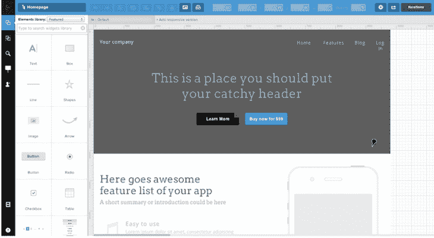

<noscript></noscript>](https://thenextweb.com/wp-content/blogs.dir/1/files/2014/11/uxpin.png) 

镜像: [UXPin](http://uxpin.com/)

你可以使用协作的线框图和原型制作工具，比如 [UXPin](http://uxpin.com/) ，让你表达你想要构建的东西，并与团队透明地分享这些想法。

### 13.纸质原型

类似于数字原型，除了这些是实体的，或者由剪贴画组成，或者甚至在纸上画草图来展示你的产品及其用户体验。

使用纸质原型进行 MVP 测试的优势在于，团队中的任何人都可以使用它们，从产品经理、图形设计师、投资者到最终用户。并且几乎不需要解释，因为它给你的是产品的真实表现。

[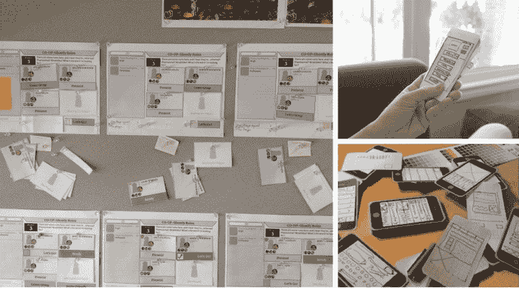

<noscript></noscript>](https://thenextweb.com/wp-content/blogs.dir/1/files/2014/11/paper-prototype.png) 

形象: [Caryn Vainio](https://medium.com/design-ux/2d767a5309d4) ， [Winnie Chang](http://www.winniecreative.com/?page_id=677) ， [Adrian Kosmaczewski](http://akosma.com/2009/10/27/roundup-of-iphone-app-sketchbooks/)

用于物理产品开发，如电话或椅子等。这项技术是无价的。数字和纸质原型在[线框化指南](http://uxpin.com/guide-to-wireframing.html)中有更详细的介绍。

### 14.单一特征 MVP

通常情况下，最好是专注于最小可行产品的单个特性，以节省开发时间和精力，并防止用户因产品的主要功能而分心。

[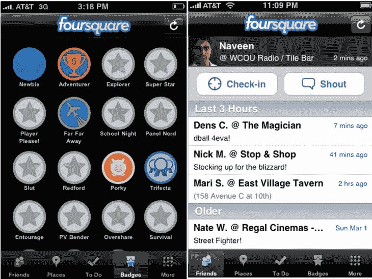

<noscript></noscript>](https://thenextweb.com/wp-content/blogs.dir/1/files/2014/11/early-foursquare.png) 

例如，Foursquare 最初的想法很简单，让用户用自己的位置登录社交网络，其应用程序的第一个版本反映了这种简单性。Buffer 刚开始只有 Twitter 支持，每个用户只有一个账户。

这些限制有助于您缩小初始客户的范围，并专注于更重要的问题，如测试产品和市场可行性，而不是担心增加对其他移动平台的支持。

### 15.预购页面

与筹款 MVP 类似，预购页面 MVP 测试让你向潜在客户展示你的产品，目的是在你开发之前吸引他们足够多的钱来购买。

********

****[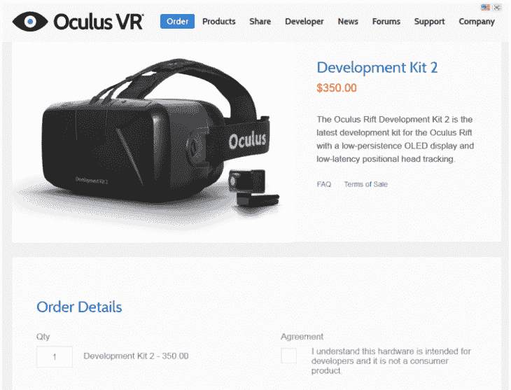

<noscript></noscript>](https://thenextweb.com/wp-content/blogs.dir/1/files/2014/11/Screen-Shot-2014-11-12-at-3.20.52-PM.png)**** 

**T11】**

虚拟现实游戏套件 Oculus Rift 在开始生产之前，为其开发套件推出了一个预购页面。Kickstarter 上的很多项目都是从预购开始的。这可以让你知道对你要制造的产品有多少需求，给你一个指示，告诉你是应该继续还是放弃这个项目。

提供预购的问题当然是，客户可能会担心你可能不会交付你承诺的产品。

没有人喜欢 vaporware，在这样的早期阶段支持一个项目的用户要求回报他们对你的信任，当然，还有他们的钱。

### 走出大门

在某些方面，构建 MVP 实际上会产生额外的工作，因为这个迭代和验证学习的过程需要大量的时间和精力投入。这就是为什么在构建 MVP 时不要被不必要的细节和开销所困扰是很重要的。

最终，目标是弄清楚你付出的努力是否值得，你不想花时间在用户不觉得有用或不想花钱的东西上。

认识到当测试你的假设时，你可能想要考虑使用多种 MVP 测试技术也是很重要的。最适合你的商业模式和市场的无疑会有所不同。

但是在这里，重要的一课是走出去，去建造它。想想你的产品所做的最大假设，然后构建一个最小可行的产品，在市场上测试这个假设。

**阅读下一篇:** [最大化你的最小可行产品:如何在不发布“最小”产品的情况下获得高结果](https://thenextweb.com/news/maximizing-minimum-viable-product-get-high-results-without-releasing-minimal-product)*