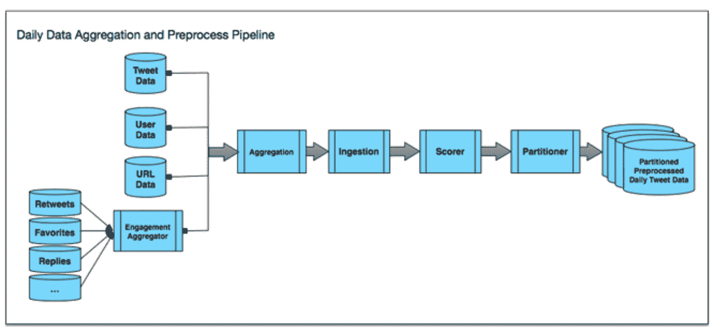
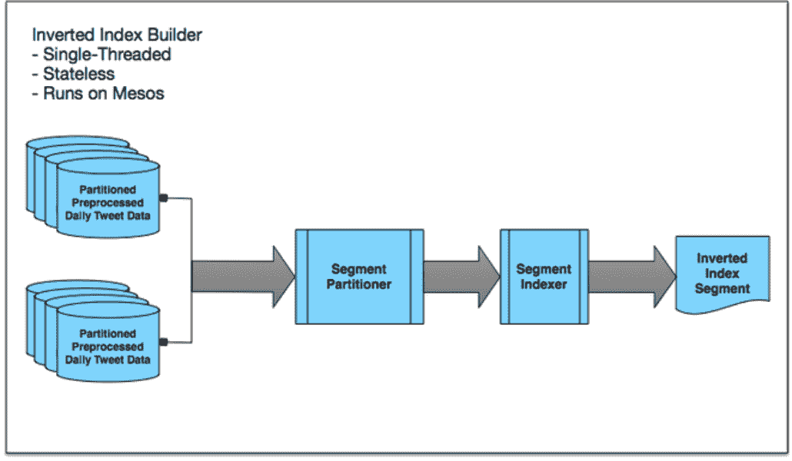
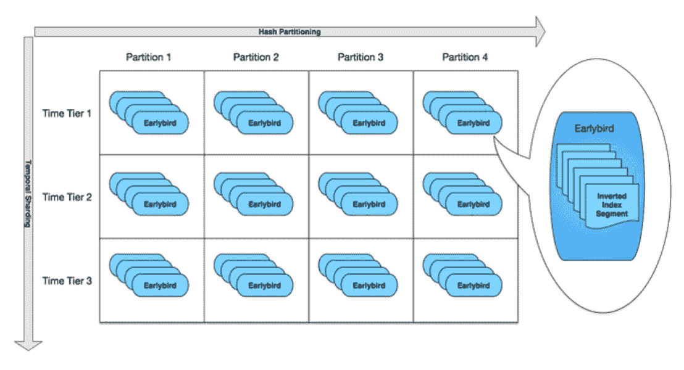
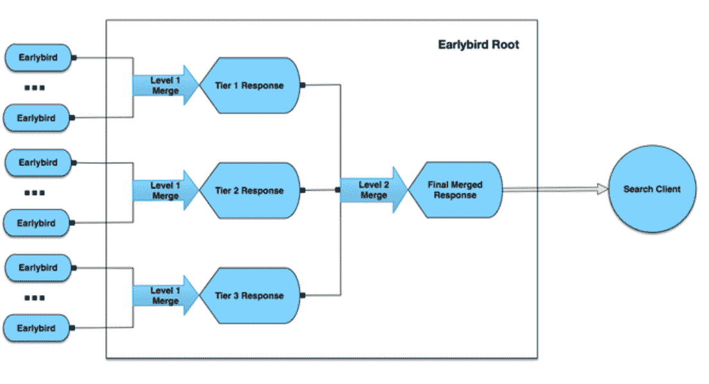

# 建立一个完整的推特索引

> 原文：<https://blog.twitter.com/2014/building-a-complete-tweet-index?utm_source=wanqu.co&utm_campaign=Wanqu+Daily&utm_medium=website>

今天，我们很高兴地宣布，自 2006 年以来，Twitter 现在索引每一个公共推文。

自从八年前第一条简单的推文发布以来，数千亿条推文记录了人类的日常经历和重大历史事件。我们的搜索引擎擅长实时呈现突发新闻和事件，我们的搜索索引基础设施反映了这种对新近性的强烈强调。但我们的长期目标是让人们搜索每一条发布过的推文。

这种新的基础设施支持许多用例，为整个电视和体育赛季、会议( [#TEDGlobal](https://twitter.com/search?f=realtime&q=%23tedglobal%20until%3A2013-06-15) )、行业讨论( [#MobilePayments](https://twitter.com/search?f=realtime&q=%23mobilepayments%20until%3A2014-11-10) )、地点、企业和跨主题的长期标签对话提供全面的结果，例如[#日本地震](https://twitter.com/search?f=realtime&q=%23japanearthquake%20until%3A2011-03-11_14%3A15%3A00_PST)、[# 2012 年选举](https://twitter.com/search?f=realtime&q=%23Election2012%20until%3A2012-11-07)、[# Scotland decisions](https://twitter.com/search?f=realtime&q=%23scotlanddecides%20until%3A2014-09-17)、[#香港](https://twitter.com/search?f=realtime&q=%23HongKong%20until%3A2014-09-28_15%3A49%3A07_PST)、 [#Ferguson](https://twitter.com/search?f=realtime&q=%23ferguson%20until%3A2014-08-19_05%3A15%3A10_PST) 等等。这一变化将在接下来的几天里向用户推出。

在这篇文章中，我们描述了我们如何构建一个搜索服务，有效地索引大约 5000 亿个文档，并以低于 100 毫秒的平均延迟提供查询服务。

我们设计中最重要的因素是:

*   模块化:Twitter 已经有了一个 T2 实时索引(一个反向索引，包含大约一周的最新推文)。我们尽可能在两个索引之间共享源代码和测试，这在更短的时间内创建了一个更干净的系统。
*   **可扩展性**:完整索引比我们的实时索引大 100 多倍，并且每周增长几十亿条推文。我们的固定大小的实时索引集群扩展起来并不容易；增加容量需要重新分区和巨大的运营开销。我们需要一个可以适当扩展的系统。
*   **成本效益**:我们的实时索引完全存储在 RAM 中，以实现低延迟和快速更新。然而，对完整索引使用相同的 RAM 技术会非常昂贵。
*   简单的界面:在这种规模下，分区是不可避免的。但是我们想要一个简单的接口，隐藏底层分区，这样内部客户端就可以把集群当作一个端点。
*   一、**n 增量发展:**“索引每条推文”的目标没有在一个季度内实现。完整的索引建立在以前的基础项目之上。2012 年，我们建立了一个包含大约 20 亿条热门推文的[小型历史索引](https://blog.twitter.com/2013/now-showing-older-tweets-in-search-results)，开发了一个离线数据聚合和预处理管道。2013 年，我们将该指数扩大了一个数量级，评估并调整了 SSD 性能。2014 年，我们使用多层架构构建了完整索引，重点关注可扩展性和可操作性。

**概述**
该系统由四个主要部分组成:批量数据聚合和预处理流水线；倒排索引生成器；早期鸟类的碎片；和早期鸟类的根。请继续阅读，了解每个组件的高级概述。

**批量数据聚合和预处理**
我们实时索引的摄取管道一次处理一条单独的推文。相比之下，完整索引使用批处理管道，其中每一批都是一天的 Tweets。我们希望我们的离线批处理作业与我们的实时摄取管道共享尽可能多的代码，同时仍然保持高效。

为了做到这一点，我们将相关的实时摄取代码打包到 Pig 用户定义的函数中，以便我们可以在 Pig 作业中重用它(很快，转向 burning)，并创建了 Hadoop 作业的管道，以在 Hadoop 上聚合数据和预处理推文。管道如下图所示:

 日常数据聚合和预处理管道由以下组件组成:

*   参与度聚合器:统计一天中每条推文的参与度。这些参与计数将在以后作为每条推文评分的输入。
*   聚合:根据 Tweet ID 将多个数据源连接在一起。
*   摄取:执行不同类型的预处理—语言识别、标记化、文本特征提取、URL 解析等等。
*   计分器:根据摄取过程中提取的特征计算分数。对于较小的历史指数，这个分数决定了哪些推文被选入该指数。
*   分割器:通过我们的哈希算法将数据分割成更小的块。最终输出存储在 HDFS 中。

这条管道是为单日推文设计的。我们设置管道每天运行，以增量方式处理数据。这种设置有两个主要好处。它允许我们用新数据增量更新索引，而不必过于频繁地完全重建。因为每天的处理都是完全独立的，所以流水线在 Hadoop 上可以大规模并行化。这使我们能够定期高效地重建完整索引(例如，添加新的索引字段或更改标记化)

**倒排索引构建**
每日数据聚合和预处理工作为每条推文输出一条记录。该输出已经标记化，但还没有反转。所以我们的下一步是建立单线程、无状态的倒排索引构建器，运行在 [Mesos](https://blog.twitter.com/2013/mesos-graduates-from-apache-incubation) 上。

倒排索引生成器由以下组件组成:

*   **Segment partitioner:** 将来自同一个分区的多批预处理过的每日 Tweet 数据分组为束。我们称这些包为“段”
*   **分段索引器:**对分段中的每条 Tweet 进行倒排，建立倒排索引，并将倒排索引存储到 HDFS 中。

这些倒排索引构建器的美妙之处在于它们非常简单。它们是单线程和无状态的，这些小型构建器可以在 Mesos 上大规模并行化(在某些情况下，我们已经推出了超过 1000 个并行构建器)。这些倒排索引构建器可以通过在 ZooKeeper 上放置锁来相互协调，这可以确保两个构建器不会构建同一个段。使用这种方法，我们仅用了大约两天时间就为近 5000 亿条推文重建了倒排索引(有趣的事实:我们的瓶颈实际上是 Hadoop namenode)。

**早期鸟类碎片**
倒排索引构建器产生了数百个倒排索引段。这些片段随后被分配给名为 [Earlybirds](https://engineering.twitter.com/research/publication/earlybird-real-time-search-at-twitter) 的机器。由于每台 Earlybird 机器只能提供完整 Tweet 语料库的一小部分，我们不得不引入分片。

过去，我们使用哈希函数将数据段分发到不同的主机。这与我们的实时索引配合得很好，它的大小随着时间的推移保持不变。然而，我们的全索引集群需要持续增长。

使用简单的散列分区，就地扩展集群涉及大量的操作工作——随着散列分区数量的增加，数据需要被打乱。取而代之的是，我们创建了一个二维分片方案，将索引段分配给服务早期的 bird。借助这种二维分片，我们可以在不修改集群中现有主机的情况下扩展集群:

*   时间分片:Tweet 语料库首先被分成多个时间层。
*   散列分区:在每个时间层中，数据根据散列函数被划分到分区中。
*   Earlybird:在每个哈希分区中，数据被进一步划分为称为段的块。根据每台 Earlybird 机器可以容纳多少个段，将这些段分组在一起。
*   副本:每台 Earlybird 机器都被复制以增加服务容量和弹性。

分割如下图所示:

这种设置使集群扩展变得简单:

*   为了随着时间的推移增加数据容量，我们将添加时间层。现有的时间层将保持不变。这允许我们就地扩展集群。
*   为了随着时间的推移增加服务容量(QPS ),我们可以添加更多副本。

这种设置允许我们避免添加散列分区，如果我们想在不使集群离线的情况下执行数据洗牌，这是很重要的。

每个集群中更多的 Earlybird 机器意味着更多的操作开销。我们通过以下方式缩减了集群规模:

*   将更多的段打包到每个 Earlybird 上(减少哈希分区计数)。
*   增加每个早期鸟可以提供的 QPS 数量(减少副本)。

为了给每只早期的鸟装上更多的片段，我们需要找到不同的存储介质。RAM 太贵了。更糟糕的是，我们将大量 RAM 插入每台机器的能力会受到每台机器 DIMM 插槽数量的物理限制。固态硬盘比 RAM 便宜得多(美元/太字节)。与普通磁盘相比，固态硬盘还提供了更高的读/写性能。

然而，固态硬盘仍然比内存慢几个数量级。从 RAM 切换到 SSD，我们早期的 bird QPS 容量遭受了重大打击。为了增加服务容量，我们进行了多项优化，例如调整内核参数以优化 SSD 性能，将多个 DocValues 字段打包在一起以减少 SSD 随机访问，直接在进程中加载频繁访问的字段等等。这篇博文中没有详细介绍这些优化。

**Earlybird roots**
这种二维分片解决了集群的缩放和扩展问题。然而，我们不希望 API 客户机必须从散列分区和时间层分散收集数据，以便服务于单个查询。为了保持客户端 API 简单，我们引入了根来抽象出完整索引中分层和分区的内部细节。

如下图所示，根执行两级分散-收集，合并搜索结果和术语统计直方图。这就产生了一个简单的 API，对于我们的客户来说，他们似乎是到达了一个端点。此外，这种两级合并设置允许我们执行额外的优化，例如避免将请求转发到与搜索查询不相关的时间层。

**展望未来**
目前，完整索引的完整结果将出现在 Twitter 网络客户端和 Twitter For iOS&Twitter For Android 应用的搜索结果的“全部”标签中。随着时间的推移，你会看到更多来自该索引的推文出现在搜索结果的“顶部”标签中，以及该索引支持的新产品体验中。[试试](https://twitter.com/search-advanced):你可以搜索 2006 年 12 月 30 日到 2007 年 1 月 2 日之间关于[新年](https://twitter.com/search?f=realtime&q=New%20Years%20until%3A2007-01-03%20since%3A2006-12-30&src=typd)的第一条推文。

完整索引是一项重大的基础设施投资，也是 Twitter 搜索和发现体验持续改进的一部分。未来还有更多令人兴奋的工作，比如智能缓存的优化。如果你对这个项目感兴趣，我们可以利用你的帮助——[加入群体](https://about.twitter.com/careers)！

**鸣谢**
本文描述的全索引项目由[庄毅](https://twitter.com/yz)和[保罗·伯斯坦](https://twitter.com/pasha407)领导。然而，它建立在多年相关工作的基础上。非常感谢团队成员使这个项目成为可能。

**投稿人**:[【Forrest Bennett】](https://twitter.com/ForrestHBennett)、[【Steve bezek】](https://twitter.com/SteveBezek)、[【Paul burstein】](https://twitter.com/pasha407)、[【Michael Busch】](https://twitter.com/michibusch)、[Chris duda](https://twitter.com/cdudte)、 [【Sam luckenbill】、](https://twitter.com/sam)【gilad mishne】、[【yatharth saraf】、](https://twitter.com/ysaraf)[【jayarama shenoy】](https://twitter.com/eecraft)、[【Thomas snider】](https://twitter.com/tjps636)、[【haixin tie】](https://twitter.com/tiehx)