# 2022 年 12 个最佳链接缩写

> 原文：<http://blog.hootsuite.com/what-are-url-shorteners/?utm_source=wanqu.co&utm_campaign=Wanqu+Daily&utm_medium=website>

有了**URL shorters**，任何又长又笨拙的网站地址都可以通过点击一个按钮简化为几个字符。

任何有网络浏览器的人都可以使用链接缩短器:社交媒体经理、普通的脸书妈妈、小企业主、抖音所有身高的青少年——还有你！

以下是你需要知道的关于如何使用网址缩写的一切，以及为什么它们应该是你的社交媒体工具包的重要组成部分。

**奖励:** **获得免费社交媒体策略模板** 快速轻松地规划自己的策略。还可以用它来跟踪结果，并把计划呈现给你的老板、队友和客户。

## 什么是网址缩写？

URL shortener 是一个工具，它创建一个短的、唯一的 URL ,该 URL 将重定向到您选择的特定网站。

基本上:他们使一个网址更短更简单。你的新的、更短的 URL 通常包括更短的站点的地址，加上随机字母的组合。

例如，如果我在[**Hootsuite ow . ly link shorter**](https://www.hootsuite.com/pages/owly)中键入类似***animal planet . com/TV-shows/puppy-bowl/full-episodes/puppy-bowl-XVI***的 URL，就会生成***【ow.ly/uK2f50AJDI6***。这将链接减少了 48 个字母。

在某些情况下，您甚至可以使用自定义短语自定义这个迷你 URL。

## 使用网址缩写的 4 个理由

如果你要分享一个链接，有很多理由使用网址缩写。

### 1.长链接可能看起来可疑

如果你链接到一个深埋在你网站中的特定页面，或者使用 [UTM 参数](https://blog.hootsuite.com/how-to-use-utm-parameters/)来跟踪你的访问者，你可能会发现自己在纠结一个冗长的 URL。

<picture decoding="async" class="alignnone wp-image-250609 size-full"><source type="image/webp" srcset="https://blog.hootsuite.com/wp-content/uploads/2020/08/Screen-Shot-2020-08-20-at-6.55.13-PM.png.webp 498w, https://blog.hootsuite.com/wp-content/uploads/2020/08/Screen-Shot-2020-08-20-at-6.55.13-PM-310x534.png.webp 310w" sizes="(max-width: 498px) 100vw, 498px"> </picture> 
*来源:* [*推特*](http://twitter.com)

一个超大的网址在你使用它的任何地方看起来都很笨拙——在社交帖子中，通过文本分享，粘贴到电子邮件中。

但更糟糕的是，长网址看起来也超级可疑。有这么多的字母、反斜杠、数字和问号，当我们点击那个链接时，任何事情都可能发生！任何事！

使用尽可能短的网址，让东西看起来整洁、友好。

### 2.一个自定义的网址缩写让你的链接品牌化

如果品牌意识是你的社交媒体战略的一部分，那么定制的网址缩略器是另一个帮助传播信息的工具。

允许你定制你的短链接的网址缩写提供了一个命名你的品牌的机会。例如，Hootsuite 的 link shortener 可以让你只需点击几下就能创建一个虚荣心的短链接。

特别是如果你使用免费的虚拟主机服务，或者有一个不太令人兴奋的 ISP，自定义网址缩写是一种在你分享链接时保持你的品牌在前面和中心的方法。

<iframe title="How to Use Vanity URLs in Hootsuite" src="https://www.youtube.com/embed/EcdOZCJrE8w?enablejsapi=1&amp;038;origin=https%3A%2F%2Fblog.hootsuite.com" frameborder="0" allow="accelerometer; autoplay; clipboard-write; encrypted-media; gyroscope; picture-in-picture" allowfullscreen="">视频</iframe>

### 3.链接缩写允许您跟踪性能

大多数链接缩短网站将提供跟踪指标。这是关于谁在何时何地点击了你的链接的信息——这些信息将帮助你[计算活动的投资回报率](https://blog.hootsuite.com/measure-social-media-roi-business/)。

要轻松跟踪源流量，使用不同的 [UTM 参数](https://blog.hootsuite.com/how-to-use-utm-parameters/)创建短链接。将这与其他分析工具结合起来——比如[谷歌分析](https://blog.hootsuite.com/how-to-set-up-google-analytics/)——你就为自己的营销成功做好了准备。

<picture decoding="async" loading="lazy" class="alignnone wp-image-250617 size-large"><source type="image/webp" srcset="https://blog.hootsuite.com/wp-content/uploads/2020/08/Screen-Shot-2020-08-20-at-6.55.23-PM-620x357.png.webp 620w, https://blog.hootsuite.com/wp-content/uploads/2020/08/Screen-Shot-2020-08-20-at-6.55.23-PM-310x178.png.webp 310w, https://blog.hootsuite.com/wp-content/uploads/2020/08/Screen-Shot-2020-08-20-at-6.55.23-PM-768x442.png.webp 768w, https://blog.hootsuite.com/wp-content/uploads/2020/08/Screen-Shot-2020-08-20-at-6.55.23-PM.png.webp 1070w" sizes="(max-width: 620px) 100vw, 620px">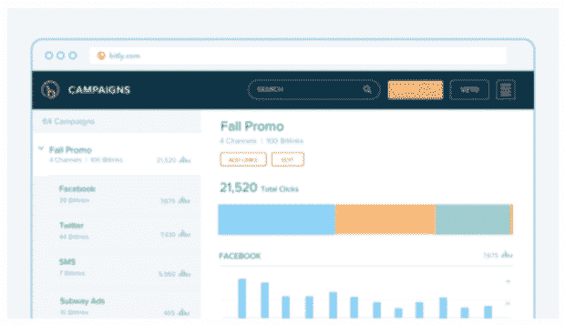T3】</picture>

*来源:* [*Bitl.ly*](https://bitly.com/)

### 4.短网址可以让你在社交媒体上获得最大限度的字符限制

Twitter 有 280 个字符的严格限制，所以保持帖子简洁是关键。缩短的网址让你有更多的空间来发表关于政治的尖锐评论，或者为你关于热狗的致命笑话提供完美的标点符号。

<picture decoding="async" loading="lazy" class="alignnone wp-image-250625 size-full"><source type="image/webp" srcset="https://blog.hootsuite.com/wp-content/uploads/2020/08/Screen-Shot-2020-08-20-at-6.55.35-PM.png.webp 582w, https://blog.hootsuite.com/wp-content/uploads/2020/08/Screen-Shot-2020-08-20-at-6.55.35-PM-310x540.png.webp 310w" sizes="(max-width: 582px) 100vw, 582px"> 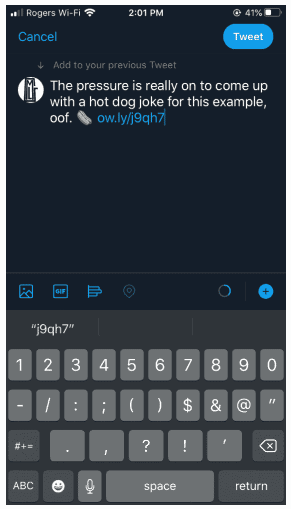</picture> 
*来源:* [*推特*](http://twitter.com) *截图*

即使是在脸书或 Instagram 上的帖子，字符数以千计，保持简短和甜蜜仍然是可读性和参与性的最佳选择。短 URL 有助于避免 TL；博士综合症。

较短链接的另一个好处是:它们对即时消息或电子邮件也很有用，因为较长的链接可能很难阅读，或者被换行符打断。

## 网址缩写程序是如何工作的？

网址缩写器的工作原理是创建一个指向你的长网址的重定向。

在您的互联网浏览器中输入一个 URL，会向 web 服务器发送一个 HTTP 请求来打开一个特定的网站。长 URL 和短 URL 只是互联网浏览器获得相同目的地的不同起点。

有几个不同类型的重定向 HTTP 响应代码，但寻找那些使用 301 永久重定向:其他品种可能会损害您的 SEO 排名。

## 12 种网址缩写供尝试(除了谷歌链接缩写)

谷歌网址缩短器早在 2019 年春天就被关闭了，但从好的方面来看，有几十种替代选择。

不利的一面是……有许多可供选择的方案。你怎么知道选择哪一个？

我们的建议是:寻找允许你定制你的链接的更短的服务，或者有内置的详细分析。一个已经存在一段时间的网址缩短网站也可能更可靠和更有信誉，可能会避免服务关闭或中断。

### 网址缩写#1: [Ow.ly](https://www.hootsuite.com/pages/owly)

Owly 是 Hootsuite 平台的一个集成权利，包含在每个[计划类型中。](https://hootsuite.com/plans)这包括免费版本——所以**如果你正在寻找一个免费的网址缩写，这是给你的！**

这样做的好处是，你可以在其他社交分析的旁边看到你的 shortlink 指标，这样你就可以全面地查看你的品牌的表现。

<picture decoding="async" loading="lazy" class="alignnone wp-image-250641 size-large"><source type="image/webp" srcset="https://blog.hootsuite.com/wp-content/uploads/2020/08/Screen-Shot-2020-08-20-at-6.56.14-PM-620x263.png.webp 620w, https://blog.hootsuite.com/wp-content/uploads/2020/08/Screen-Shot-2020-08-20-at-6.56.14-PM-310x132.png.webp 310w, https://blog.hootsuite.com/wp-content/uploads/2020/08/Screen-Shot-2020-08-20-at-6.56.14-PM-768x326.png.webp 768w, https://blog.hootsuite.com/wp-content/uploads/2020/08/Screen-Shot-2020-08-20-at-6.56.14-PM.png.webp 1282w" sizes="(max-width: 620px) 100vw, 620px"> 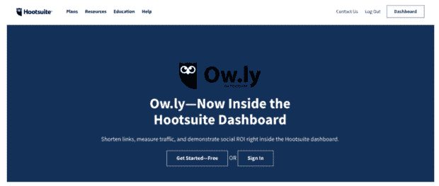</picture> 
*来源:* [*Ow.ly*](http://ow.ly)

### 网址缩写# 2:[T.co](http://twitter.com/)

Twitter 有一个内置的免费网址缩短器，可以自动将任何长网址缩短到 23 个字符，给你留下足够的空间来表达自己。

你分享的任何链接——甚至是已经缩短的链接！—将被转换成一个 t.co 网址，以便 Twitter 可以记录指标，筛选出任何垃圾网站或危险网站。

### 网址缩写#3: [一点点](https://bitly.com/)

如果你使用 Bitly，有大量的数据需要考虑。在这里，您可以通过强大的 Bitly 仪表板查看每个链接的性能，包括人口统计数据、推荐来源和点击率等指标。

免费账户为一个人提供分析和定制，但基本和企业订阅也可用，提供品牌链接、二维码、更丰富的数据和多用户。

<picture decoding="async" loading="lazy" class="alignnone size-full wp-image-250649"><source type="image/webp" srcset="https://blog.hootsuite.com/wp-content/uploads/2020/08/Screen-Shot-2020-08-21-at-11.10.11-AM.png.webp 1260w, https://blog.hootsuite.com/wp-content/uploads/2020/08/Screen-Shot-2020-08-21-at-11.10.11-AM-310x181.png.webp 310w, https://blog.hootsuite.com/wp-content/uploads/2020/08/Screen-Shot-2020-08-21-at-11.10.11-AM-620x362.png.webp 620w, https://blog.hootsuite.com/wp-content/uploads/2020/08/Screen-Shot-2020-08-21-at-11.10.11-AM-768x449.png.webp 768w" sizes="(max-width: 1260px) 100vw, 1260px"> 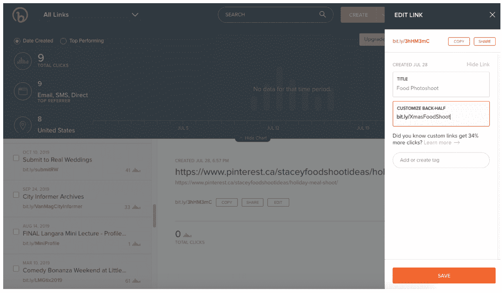</picture> 
*来源:* [*Bit.ly*](http://bit.ly)

### 网址缩写#4: [微小的网址](https://tinyurl.com/)

网站本身不会赢得任何设计奖项，但谁在乎呢？它做你需要的一切:创建一个微小的新网址。无需登录即可定制，当你急着分享最新一集的 *MasterChef Junior* 播客时，这是一个有效的选择。

这里有一个很酷的功能:你可以将 TinyURL 添加到你的浏览器工具栏中，这样你就可以为你当前所在的任何网站创建快捷链接。

<picture decoding="async" loading="lazy" class="alignnone wp-image-250657 size-full"><source type="image/webp" srcset="https://blog.hootsuite.com/wp-content/uploads/2020/08/Screen-Shot-2020-08-21-at-11.10.58-AM.png.webp 830w, https://blog.hootsuite.com/wp-content/uploads/2020/08/Screen-Shot-2020-08-21-at-11.10.58-AM-310x283.png.webp 310w, https://blog.hootsuite.com/wp-content/uploads/2020/08/Screen-Shot-2020-08-21-at-11.10.58-AM-620x566.png.webp 620w, https://blog.hootsuite.com/wp-content/uploads/2020/08/Screen-Shot-2020-08-21-at-11.10.58-AM-768x701.png.webp 768w" sizes="(max-width: 830px) 100vw, 830px">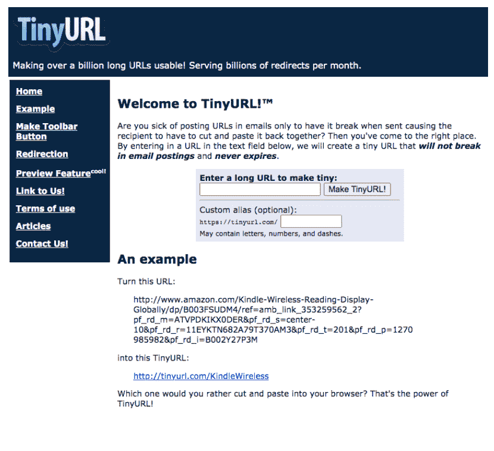T3】</picture>

*来源:* [*Tiny.url*](http://tiny.url)

使用 Rebrandly，您可以创建一个带有自定义域名的品牌快捷链接，甚至可以使用免费帐户。

***【SujindersCookiePalace.com】***可能是一个很棒的主 URL，但是当它涉及到社交分享时，字符数就会增加。一个简短的、品牌化的链接分享网址，比如 ***su.jinders*** ，仍然会保留你的企业名称，而不会占用宝贵的空间。

此外，Rebrandly 在其各种软件包中提供了跟踪、优化和扩展工具(付费选项每月 29 美元起)。

<picture decoding="async" loading="lazy" class="alignnone wp-image-250665 size-full"><source type="image/webp" srcset="https://blog.hootsuite.com/wp-content/uploads/2020/08/Screen-Shot-2020-08-21-at-11.11.09-AM.png.webp 1270w, https://blog.hootsuite.com/wp-content/uploads/2020/08/Screen-Shot-2020-08-21-at-11.11.09-AM-310x144.png.webp 310w, https://blog.hootsuite.com/wp-content/uploads/2020/08/Screen-Shot-2020-08-21-at-11.11.09-AM-620x288.png.webp 620w, https://blog.hootsuite.com/wp-content/uploads/2020/08/Screen-Shot-2020-08-21-at-11.11.09-AM-768x357.png.webp 768w" sizes="(max-width: 1270px) 100vw, 1270px"> 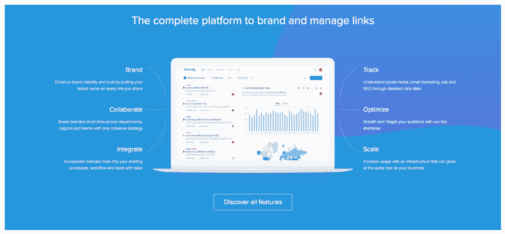</picture> 
*来源:* [*更名*](http://rebrandly.com)

在超链接的帮助下，当链接被点击时获得实时通知，或者将设置更改为每小时、每天或每周摘要。

Hyperlink 还提供每次点击的详细信息:找出每个访问者的设备、位置和推荐信息，以及一个实时跟踪仪表板。

对于那些需要随时分享链接的人来说，这款应用(iOS 和 Android 版)是 Chrome 扩展的一个很好的补充。(你忙！我们懂了。)

自定义域名可通过付费计划获得，起价为每月 39 美元。

<picture decoding="async" loading="lazy" class="alignnone wp-image-250673 size-full"><source type="image/webp" srcset="https://blog.hootsuite.com/wp-content/uploads/2020/08/Screen-Shot-2020-08-21-at-11.11.20-AM.png.webp 1262w, https://blog.hootsuite.com/wp-content/uploads/2020/08/Screen-Shot-2020-08-21-at-11.11.20-AM-310x126.png.webp 310w, https://blog.hootsuite.com/wp-content/uploads/2020/08/Screen-Shot-2020-08-21-at-11.11.20-AM-620x252.png.webp 620w, https://blog.hootsuite.com/wp-content/uploads/2020/08/Screen-Shot-2020-08-21-at-11.11.20-AM-768x312.png.webp 768w" sizes="(max-width: 1262px) 100vw, 1262px"> 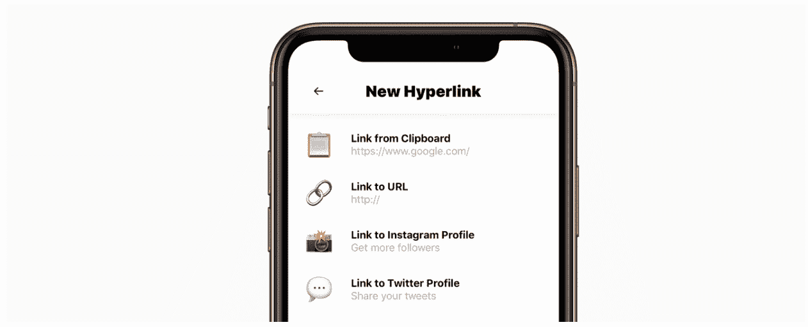</picture> 
*来源:* [*超链接*](http://usehyperlink.com)

### 网址缩写#7: [微小。抄送](https://tiny.cc/)

使用 Tiny 快速缩短、跟踪和管理您的 URL。CC 的简单界面。

定制的 URL slugs 是可用的，如果你注册了一个帐户，你可以跟踪短链接的统计数据。

<picture decoding="async" loading="lazy" class="alignnone wp-image-250681 size-full"><source type="image/webp" srcset="https://blog.hootsuite.com/wp-content/uploads/2020/08/Screen-Shot-2020-08-21-at-11.11.29-AM.png.webp 1268w, https://blog.hootsuite.com/wp-content/uploads/2020/08/Screen-Shot-2020-08-21-at-11.11.29-AM-310x227.png.webp 310w, https://blog.hootsuite.com/wp-content/uploads/2020/08/Screen-Shot-2020-08-21-at-11.11.29-AM-620x454.png.webp 620w, https://blog.hootsuite.com/wp-content/uploads/2020/08/Screen-Shot-2020-08-21-at-11.11.29-AM-768x562.png.webp 768w" sizes="(max-width: 1268px) 100vw, 1268px"> 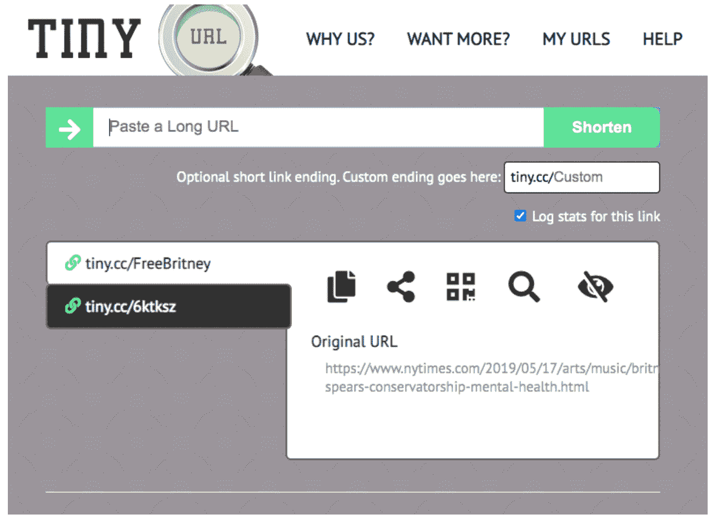</picture> 
*来源:* [*Tiny.cc*](http://tiny.cc)

### 网址缩写#8: [位。做](http://bit.do/)

有点。Do 是另一个简单而甜蜜的选项，它拥有你所需要的一切:定制能力、流量统计，甚至是自动二维码生成器。

这里也有品牌域名，但是价格比这个列表上的其他域名要贵一点，每月 85 美元，所以如果你想要品牌域名，你最好选择其他服务。

<picture decoding="async" loading="lazy" class="alignnone wp-image-250689 size-full"><source type="image/webp" srcset="https://blog.hootsuite.com/wp-content/uploads/2020/08/Screen-Shot-2020-08-21-at-11.11.44-AM.png.webp 822w, https://blog.hootsuite.com/wp-content/uploads/2020/08/Screen-Shot-2020-08-21-at-11.11.44-AM-310x266.png.webp 310w, https://blog.hootsuite.com/wp-content/uploads/2020/08/Screen-Shot-2020-08-21-at-11.11.44-AM-620x533.png.webp 620w, https://blog.hootsuite.com/wp-content/uploads/2020/08/Screen-Shot-2020-08-21-at-11.11.44-AM-768x660.png.webp 768w" sizes="(max-width: 822px) 100vw, 822px"> 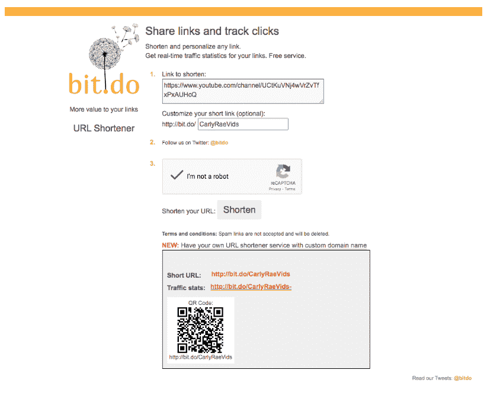</picture> 
*来源:* [*Bit.do*](http://bit.do)

ClickMeter 漂亮的可视化仪表板让您可以方便地充分利用您的链接。

一目了然，您可以监控断开的链接和延迟，找到产生最佳转化率的访问者，跟踪视图和点击，等等。

套餐起价为每月 29 美元，它因其强大的产品和便捷的链接缩短功能而受到代理商和出版商的青睐。

<picture decoding="async" loading="lazy" class="alignnone wp-image-250697 size-full"><source type="image/webp" srcset="https://blog.hootsuite.com/wp-content/uploads/2020/08/Screen-Shot-2020-08-21-at-11.11.54-AM.png.webp 1202w, https://blog.hootsuite.com/wp-content/uploads/2020/08/Screen-Shot-2020-08-21-at-11.11.54-AM-310x220.png.webp 310w, https://blog.hootsuite.com/wp-content/uploads/2020/08/Screen-Shot-2020-08-21-at-11.11.54-AM-620x439.png.webp 620w, https://blog.hootsuite.com/wp-content/uploads/2020/08/Screen-Shot-2020-08-21-at-11.11.54-AM-768x544.png.webp 768w" sizes="(max-width: 1202px) 100vw, 1202px"> </picture> 
*来源:* [*点击表*](http://clickmeter.com)

### 网址缩写#10: [Shorte。ST](https://shorte.st/)

数据对你的洞察力是有价值的，对吗？嗯，第三方公司通常也对这些信息感兴趣，这就是为什么出现了一个家庭手工业，即那些实际上付钱给你来缩短你与他们的联系的企业。

肖特。ST 是众多网站中报酬较高的网址缩写商之一，其支付率因受众的地理位置而异。(比如 Shorte。ST 为美国交通支付 14.04 美元 CPM。)

除了冰冷的现金，肖特。ST 提供了一个全面统计数据的仪表板以供查看。

<picture decoding="async" loading="lazy" class="alignnone wp-image-250705 size-full"><source type="image/webp" srcset="https://blog.hootsuite.com/wp-content/uploads/2020/08/Screen-Shot-2020-08-21-at-11.12.03-AM.png.webp 1276w, https://blog.hootsuite.com/wp-content/uploads/2020/08/Screen-Shot-2020-08-21-at-11.12.03-AM-310x224.png.webp 310w, https://blog.hootsuite.com/wp-content/uploads/2020/08/Screen-Shot-2020-08-21-at-11.12.03-AM-620x447.png.webp 620w, https://blog.hootsuite.com/wp-content/uploads/2020/08/Screen-Shot-2020-08-21-at-11.12.03-AM-768x554.png.webp 768w" sizes="(max-width: 1276px) 100vw, 1276px"> 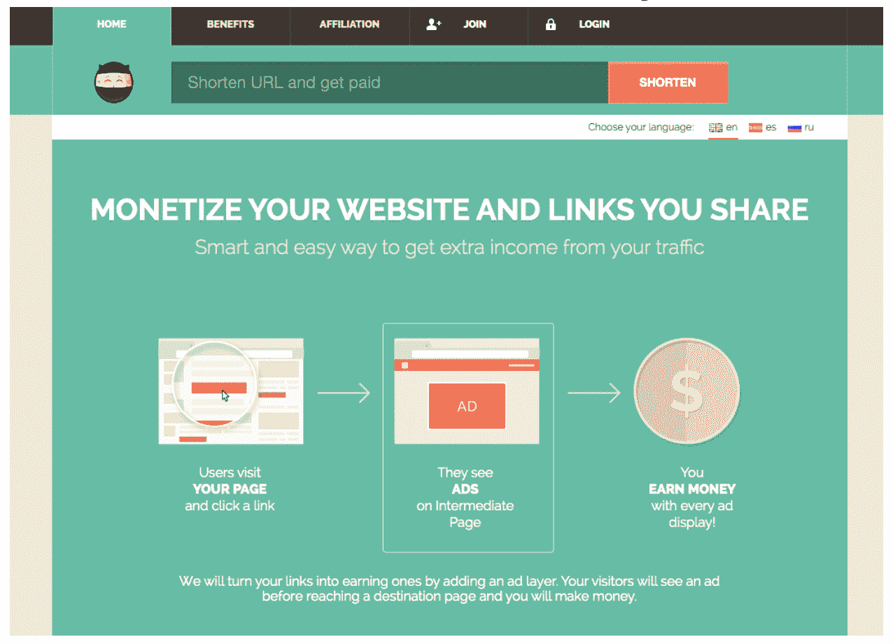</picture> 
*来源:* [*简称。St*](http://shorte.st)

### 网址缩写#11: [剪切。Ly](https://cutt.ly/)

使用 Cut 不需要账号。Ly，甚至定制网址，但一个账户将让你获得实时分析，包括点击率和社交媒体推荐。

停。Ly 也有一个免费的自定义网址缩写按钮，你可以添加到你的浏览器工具栏，所以只需点击一下就可以缩短你的链接。

<picture decoding="async" loading="lazy" class="alignnone wp-image-250713 size-full"><source type="image/webp" srcset="https://blog.hootsuite.com/wp-content/uploads/2020/08/Screen-Shot-2020-08-21-at-11.12.14-AM.png.webp 1262w, https://blog.hootsuite.com/wp-content/uploads/2020/08/Screen-Shot-2020-08-21-at-11.12.14-AM-310x189.png.webp 310w, https://blog.hootsuite.com/wp-content/uploads/2020/08/Screen-Shot-2020-08-21-at-11.12.14-AM-620x377.png.webp 620w, https://blog.hootsuite.com/wp-content/uploads/2020/08/Screen-Shot-2020-08-21-at-11.12.14-AM-768x467.png.webp 768w" sizes="(max-width: 1262px) 100vw, 1262px"> 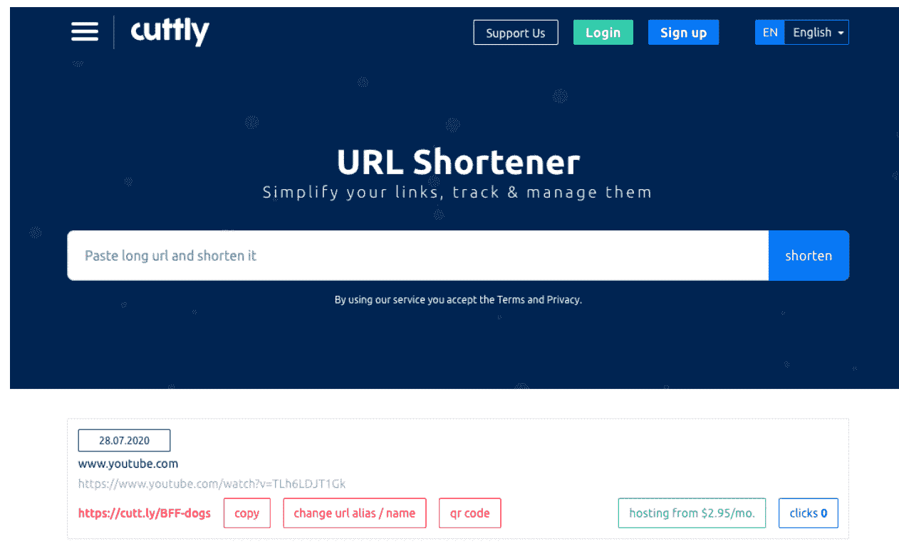</picture> 
*来源:*

 *### 网址缩写#12: [Clkim](https://clkim.com/)

Clkim 系统的智能重定向是非常智能的。基于上下文触发，URL 可以根据移动操作系统或地理位置重定向用户，以便他们以最适合他们的方式访问您的网站。

还可以选择进行目的地 A/B 测试，以了解哪个登录页面转换得更好。此外，Clkim 还根据点击过你的候选名单的人的自定义列表，提供重新定位功能。

<picture decoding="async" loading="lazy" class="alignnone wp-image-250721 size-full"><source type="image/webp" srcset="https://blog.hootsuite.com/wp-content/uploads/2020/08/Screen-Shot-2020-08-21-at-11.12.23-AM.png.webp 1274w, https://blog.hootsuite.com/wp-content/uploads/2020/08/Screen-Shot-2020-08-21-at-11.12.23-AM-310x205.png.webp 310w, https://blog.hootsuite.com/wp-content/uploads/2020/08/Screen-Shot-2020-08-21-at-11.12.23-AM-620x411.png.webp 620w, https://blog.hootsuite.com/wp-content/uploads/2020/08/Screen-Shot-2020-08-21-at-11.12.23-AM-768x509.png.webp 768w" sizes="(max-width: 1274px) 100vw, 1274px"> </picture> 
*来源:* [*Clkim*](https://clkim.com/)

底线是:无论你需要什么样的速度和细节，总有一种 URL 缩短服务可以满足你冗长的链接。尝试一些，尝试所有的方法——只要确保保持简短和甜蜜。

使用 Hootsuite 为您的网站带来更多流量并节省时间。从单个仪表板，您可以管理您所有的社交媒体档案，只需点击一下就可以缩短链接，衡量成功与否，等等。免费试用。

[开始使用](https://hootsuite.com/plans)

使用 **Hootsuite** 、**一体化社交媒体工具包做得更好。**保持领先，不断发展，并击败竞争对手。*