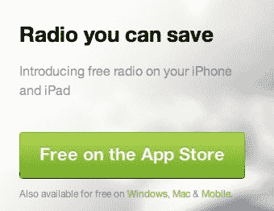

# 为自由 AVC 辩护

> 原文：<http://avc.com/2012/07/in-defense-of-free/?utm_source=wanqu.co&utm_campaign=Wanqu+Daily&utm_medium=website>

我在 AVC 写了这么多关于免费的东西，它应该叫做 AVFree。事实上，我甚至给[写过一篇标题完全相同的文章](http://www.avc.com/a_vc/2005/07/in_defense_of_f.html)(差不多正好是七年前，我们投资 twitter、zynga 和 tumblr 的那个夏天)。

在过去的几年里，我很少接触这个话题，但是考虑到这个话题已经在科技博客圈里不胫而走，我想我应该再谈一次。

首先，让我说这与 Twitter 无关。应该鼓励人们与 Twitter 竞争。竞争对每个人都有好处，正如我们大约一周前在这里谈到的。

这篇文章是对这样一种观点的回应，即服务应该付费，以确保它们适当地关注消费者/用户，而不是营销商/广告商/赞助商。

先说广告。我不相信它是邪恶的。事实上，我认为这是一种支持那些希望被最广泛采用并希望免费的服务的极好方式。想想超级碗，世界杯，奥运会，奥斯卡，总统辩论，重要事件的新闻报道。这些东西有广告支持，任何有电视和天线的人都可以免费观看。这些东西能被最广泛的受众获得，这对社会是有好处的。

付费电视业务正在蓬勃发展。电视基本免费的事实并不意味着所有的电视都必须免费。免费电视没有使付费电视商品化。他们和谐共处。但是在付费电视出现之前，我们就有免费电视了。免费是创造付费层的基础。这就是免费增值(AVC 创造的一个术语)的意义所在。

现在让我们来看看有免费和付费层的服务。Spotify 是一个很好的选择。Spotify 的核心商业模式是订阅音乐服务。所有你可以每月以固定价格吃音乐。然而，这就是你第一次在 Spotify.com 登陆时他们向你展示的东西。

[T2】](https://avc.com/wp-content/uploads/2012/07/6a00d83451b2c969e20177435ee36b970d.jpg)

他们为什么给你看这个？因为大多数人更喜欢免费的而不是付费的。我没有确切的数字，但我怀疑不到 10%的 Spotify 用户为音乐付费。潘多拉为什么这么成功？因为它是免费的。为什么无线广播仍然是最受欢迎的听歌方式？因为它是免费的。

现在让我们看看用户提供所有价值的服务。维基百科，Craigslist，YouTube，Flickr，Instagram，脸书，Twitter，Tumblr，WordPress 等等等等。如果用户不创造内容，这些平台就没有任何价值。用户创建服务，管理它，并使它成为现在的样子。我不认为向用户收费来创造价值是有意义的。我们已经看到人们尝试这种模式。Typepad(托管此博客的地方)对托管博客收费。他们表现如何？Phanfare 收费主机照片。他们表现如何？这个清单可以一直列下去，但我不想把重点放在失败的服务上。

当规模很重要，当网络效应很重要，当你的用户在创造内容和价值时，免费是商业模式的选择。我不认为今天有任何事情改变了这一点。如果有什么不同的话，那就是更真实。

我理解某些人对 Twitter、脸书、Tumblr 和许多其他服务商业化的失望。我理解对 API 越来越多的封锁和这些平台对其生态系统的控制的失望。我鼓励人们与他们竞争，以保持网络、移动网络和互联网的自由和开放。但我不会鼓励这些人去建立付费服务。我认为他们的目标会被这个选择破坏。